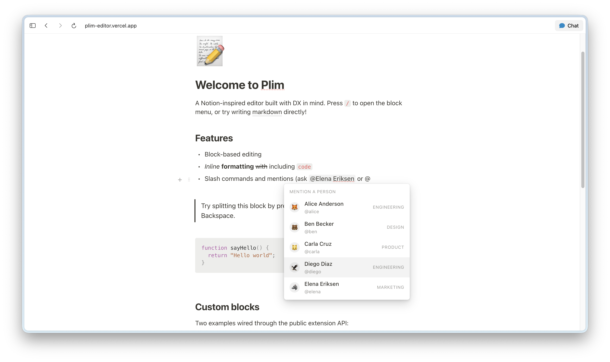

# Plim

<video src="https://github.com/user-attachments/assets/7b715ddb-85a4-44dc-ab74-243676d4f56f" width="100%" style="aspect-ratio: 1"></video>

A Notion-inspired block editor for the web, built as a TypeScript monorepo. Plim ships a framework-agnostic core, a DOM view layer, a Markdown parser/serializer, and React bindings — all small, composable, and designed to be embedded in your own product. See the [example](https://plim-editor.vercel.app/) [**Status**](https://www.sideloop.io/status/a7a6a260-184d-4e75-bd51-31df264f2bf0)




> [!IMPORTANT]
> **Status:** pre-1.0 (`0.0.x`). The public API is mostly stable but may shift before `1.0`.

## Packages

| Package | Description |
| --- | --- |
| [`@plim/core`](./packages/core) | Schema, document model, transactions, validation rules, action/extension/trigger system, history, and the built-in block & mark descriptors. Runtime-agnostic — no DOM. |
| [`@plim/markdown`](./packages/markdown) | Parse Markdown into a Plim document (`contentFromMarkdown`, `parseMarkdown`) and serialize back (`contentToMarkdown`). |
| [`@plim/editor`](./packages/editor) | The view layer. Mounts a Plim document into a `contenteditable`, owns the floating toolbar, the block-handle gutter, paste/clipboard handling, drag-and-drop, and the keyboard pipeline. Ships its own stylesheet. |
| [`@plim/react`](./packages/react) | React bindings: `<PlimEditor>`, `useEditorHandle()`, slash-command and mention extensions with first-class React components, and a bridge for defining blocks with `toComponent` (real React components persisted into the doc). |

`examples/notion-clone` is a full Vite + React app exercising all four packages — it's the litmus test the whole repo is built against.

## Install

```sh
# Vanilla (no React)
pnpm add @plim/core @plim/editor @plim/markdown

# React
pnpm add @plim/core @plim/editor @plim/markdown @plim/react react react-dom
```

Import the editor stylesheet once at your app entry:

```ts
import "@plim/editor/styles.css";
```

## Quickstart (React)

```tsx
import {
  PlimDriver,
  boldMark, italicMark, underlineMark, strikethroughMark, codeMark, linkMark,
  paragraphBlock, headingBlock, bulletedListBlock, numberedListBlock,
  todoListBlock, quoteBlock, horizontalRuleBlock,
} from '@plim/core';
import { contentFromMarkdown } from '@plim/markdown';
import {
  PlimEditor, useEditorHandle,
  SlashCommandMenu, slashCommandExtension, DEFAULT_SLASH_ITEMS,
} from '@plim/react';
import '@plim/editor/styles.css';

const plim = new PlimDriver({
  theme: 'light',
  extensions: [slashCommandExtension()],
  registeredMarks: [boldMark, italicMark, underlineMark, strikethroughMark, codeMark, linkMark],
  registeredBlocks: [
    paragraphBlock, headingBlock,
    bulletedListBlock, numberedListBlock, todoListBlock,
    quoteBlock, horizontalRuleBlock,
  ],
});

const initialContent = contentFromMarkdown(
  '# Hello, Plim',
  'Press `/` to open the slash menu, or just start typing.',
);

export function App() {
  const handle = useEditorHandle();
  return (
    <>
      <PlimEditor plim={plim} handle={handle} initialContent={initialContent} autoFocus />
      <SlashCommandMenu editor={handle} items={DEFAULT_SLASH_ITEMS} />
    </>
  );
}
```

## Quickstart (vanilla)

`@plim/editor` exports `deriveEditor`, a framework-agnostic mount that produces an `EditorHandle` directly. See `packages/editor/src/index.ts` for `DeriveEditorOptions`, `attachContainer`, and the `renderReactBlock` bridge for hosting React components inside custom blocks without depending on `@plim/react`.

```ts
import { PlimDriver, paragraphBlock, headingBlock, boldMark, italicMark } from '@plim/core';
import { deriveEditor, attachContainer } from '@plim/editor';
import { contentFromMarkdown } from '@plim/markdown';
import '@plim/editor/styles.css';

const plim = new PlimDriver({
  registeredMarks: [boldMark, italicMark],
  registeredBlocks: [paragraphBlock, headingBlock],
});

const editor = deriveEditor(plim, {
  containerAdapter: attachContainer(() => document.querySelector('#editor')),
  initialContent: contentFromMarkdown('# Hello'),
  autoFocus: true,
});

editor.mount();
```

## Custom blocks

Blocks are the structural units of a document — paragraphs, headings, lists, code, images, or anything you invent. Define one with `defineBlock` and register it on the driver. Blocks can render to plain DOM (`toDOM`) or to React (`toComponent`) — the appropriate path is chosen by the editor at runtime.

```tsx
import { defineBlock, type BlockPayload } from '@plim/core';

// DOM block — the editor inserts the editable content slot for you.
export const calloutBlock = defineBlock({
  name: 'callout',
  type: 'standalone',
  toDOM: (payload: BlockPayload) => {
    const wrap = document.createElement('div');
    wrap.className = 'plim-callout';
    wrap.dataset.tone = String(payload.attrs.tone ?? 'info');

    const icon = document.createElement('span');
    icon.className = 'plim-callout-icon';
    icon.contentEditable = 'false';
    icon.textContent = String(payload.attrs.icon ?? '💡');
    wrap.appendChild(icon);

    // payload.content[0] is the editor-owned [data-block-content] element
    wrap.appendChild((payload.content as HTMLElement[])[0]);
    return wrap;
  },
});
```

Key descriptor fields:

- `type: 'standalone' | 'inline'` — top-level block vs. inline-only.
- `nestable` — allow child blocks (lists, toggles).
- `atomic` — block has no editable content (images, dividers, embeds).
- `supportsDecoration` — whether marks (bold, italic…) apply to its text. Defaults `true` for text blocks.
- `multilineText` — Enter inserts `\n` instead of splitting (used by code blocks).
- `continueAs` — block type used for the *next* block when Enter splits this one.
- `toolbar` — one or many `ToolbarItem`s exposed in the floating toolbar.
- `toMarkdown` / `fromMarkdown` — opt into markdown round-tripping.

`defineBlock` also accepts a factory `(editor) => descriptor`, which is how you write React blocks that need to commit transactions:

```tsx
import { defineBlock } from '@plim/core';

export const counterBlock = defineBlock((editor) => ({
  name: 'counter',
  type: 'standalone',
  atomic: true,
  supportsDecoration: false,
  toComponent: (payload) => (
    <CounterCard
      title={String(payload.attrs.title ?? 'Counter')}
      count={Number(payload.attrs.count ?? 0)}
      onChange={(next) => {
        const path = findPathForBlockId(editor, payload.id);
        if (!path) return;
        const tx = editor.createTransaction();
        tx.setBlockAttrs(path, { count: next });
        tx.commit();
      }}
    />
  ),
}));
```

For editable React blocks (where some content lives in a React tree but the text is still editor-owned), import `ContentSlot` from `@plim/react` and render it where the `[data-block-content]` element should land:

```tsx
import { defineBlock, type BlockPayload } from '@plim/core';
import { ContentSlot } from '@plim/react';

export const calloutBlock = defineBlock({
  name: 'callout',
  type: 'standalone',
  toComponent: (payload: BlockPayload) => {
    const slot = (payload.content as HTMLElement[])[0];
    const tone = String(payload.attrs.tone ?? 'info');
    return (
      <div className="plim-callout" data-tone={tone}>
        <span className="plim-callout-icon" contentEditable={false}>
          {String(payload.attrs.icon ?? '💡')}
        </span>
        {/* The editor owns the text inside this slot; React owns everything else. */}
        <ContentSlot el={slot} />
      </div>
    );
  },
});
```

`ContentSlot` mounts the editor's slot element with `display: contents` so it doesn't introduce extra layout, and its ref no-ops once the slot is already attached — React's reconciliation never fights the editor's in-place text updates.

See `packages/core/src/builtins.ts` for the built-in block library and `examples/notion-clone/src/customBlocks.tsx` for richer DOM- and React-based blocks (callout + counter).

## Custom marks

Marks are inline annotations applied to runs of text — bold, italic, links, mentions, custom badges. They are wrappers; the editor inserts the text and any nested marks inside whatever element you return.

```tsx
import { defineMark } from '@plim/core';

export const highlightMark = defineMark({
  name: 'highlight',
  toDOM: () => {
    const el = document.createElement('mark');
    el.className = 'plim-highlight';
    return el;
  },
  toolbar: {
    name: 'highlight',
    label: 'Highlight',
    icon: 'H',
    shortcut: '⌘⇧H',
    group: 'mark',
    perform: ({ state, editor }) => {
      const tx = editor.createTransaction();
      tx.toggleMark('highlight', {
        from: state.selection.anchor,
        to: state.selection.head,
      });
      tx.commit();
    },
  },
});
```

Toolbar items default to `visibleWhen: and([selectionNotEmpty, blockSupportsDecoration])` and `activeWhen: markActiveInSelection(<name>)` so most marks need no extra wiring.

Built-ins (`@plim/core`): `boldMark`, `italicMark`, `underlineMark`, `strikethroughMark`, `codeMark`, `linkMark` (with popover toolbar), `highlightMark`, `mentionMark` (atomic, used by the React mention extension). For an atomic-mark example with its own action panel, see `examples/notion-clone/src/statusBadge.tsx`.

## Actions & triggers

Actions are first-class behaviour units bound to triggers. They power keyboard shortcuts, slash menus, mention pop-ups, clipboard handling, undo/redo, and anything else input-driven.

```ts
import { defineAction, triggers } from '@plim/core';

defineAction('bold', {
  trigger: triggers.keyboard.shortcut('Mod+b'),
  triggerValidationRules: ({ and }) => and(['selectionNotEmpty', 'blockSupportsDecoration']),
  perform: async (state, ctx) => {
    const tx = ctx.createTransaction();
    tx.toggleMark('bold', { from: state.selection.anchor, to: state.selection.head });
    tx.commit();
  },
});

defineAction('redo', {
  trigger: [
    triggers.keyboard.shortcut('Mod+Shift+z'),
    triggers.keyboard.shortcut('Mod+y'),
  ],
  perform: async () => { plim.getHistory().redo(); },
  priority: 10,
});
```

Available triggers:

- `triggers.keyboard.shortcut('Mod+b')` — `Mod` is `Cmd` on macOS, `Ctrl` elsewhere. Recognised modifiers: `Mod`, `Ctrl`, `Meta`/`Cmd`, `Alt`/`Option`, `Shift`.
- `triggers.keyboard.character('/')` — fires on the typed character. Unlike the other triggers, the browser is allowed to insert the character so menus (`/`, `@`, `:`) can show what the user typed.
- `triggers.keyboard.key('Escape')` — single named key.
- `triggers.clipboard.action('cut' | 'copy' | 'paste')`.

Validation rule names: `selectionNotEmpty`, `blockSupportsDecoration`, `startOfBlock`, `endOfBlock`, `precededByWhitespace`, `inTextBlock`. Builders `and`, `or`, `not`, `predicate`, `markActiveInSelection`, `blockTypeIs` let you compose them.

`cancellationTriggers` only fire while `perform` is still pending — return a long-lived promise from `perform` (e.g. `ctx.triggerAsyncEvent('showSlashCommandMenu')`) and `Escape` will cancel it. `priority` resolves ties when multiple actions match the same trigger (higher wins).

## Extensions

Extensions bundle blocks, marks, and actions behind a single registration. Use them to ship reusable features (slash menu, mentions, your custom-block library) without leaking five separate registries into your app.

```ts
import { defineAction, defineExtension, mentionMark, triggers } from '@plim/core';

export const mentionExtension = defineExtension(() => ({
  name: 'mention',
  registeredMarks: [mentionMark],
  registeredActions: [
    defineAction('mention', {
      trigger: triggers.keyboard.character('@'),
      triggerValidationRules: ({ or }) => or(['startOfBlock', 'precededByWhitespace']),
      cancellationTriggers: [triggers.keyboard.key('Escape'), triggers.keyboard.key(' ')],
      perform: async (_state, ctx) => ctx.triggerAsyncEvent('showMentionSuggestions'),
    }),
  ],
  // optional hooks
  onTransaction: (tx, ctx) => { /* observe or react to commits */ },
  transformPaste: (data, ctx) => { /* return true to claim the paste */ },
}));
```

The factory receives the live `EditorHandle`, so extensions can close over `editor.createTransaction()` for their actions. Results are cached per-factory, so passing the same extension to multiple `PlimDriver` instances is cheap.

`@plim/react` ships two extensions out of the box:

- `slashCommandExtension({ priority?, eventName? })` — pairs with `<SlashCommandMenu items={DEFAULT_SLASH_ITEMS} editor={handle} />`.
- `mentionExtension({ character?, eventName?, priority? })` — pairs with your own React menu rendered in response to the async event.

## History

Every dispatched transaction is captured in a bounded history (default 200 entries). Set `tx.meta.addToHistory = false` to opt out of capture for ephemeral operations.

```ts
const history = plim.getHistory();

history.undo();
history.redo();
history.canUndo;   // boolean
history.canRedo;   // boolean

const off = history.onChange(({ canUndo, canRedo, past, future }) => {
  // re-render undo/redo buttons
});
```

`getHistory()` on the driver returns the most-recently-mounted editor's history controller (use `editor.history` from a handle if you mount multiple editors against one driver).

## Snapshots

Snapshots are full state captures — handy for autosave/restore, "revert to here" buttons, or sending the document over the wire.

```ts
import { Snapshot } from '@plim/core';

const snap = new Snapshot(editor);          // or new Snapshot(editor.getState())
const json = snap.serialize();              // store this anywhere

// later…
const restored = Snapshot.deserialize(json);
editor.restoreSnapshot(restored);
```

`restoreSnapshot` replaces state directly — it does not push a history entry, so undo/redo will not roll across the restore. Wrap restores in your own confirmation flow if that matters.

## Ledger / sync

A `TransactionLedger` is an append-only, serializable, replayable log of committed transactions — the layer you build your own sync / CRDT engine on. Snapshots ship whole states; the ledger ships the _stream of edits_. The unit of exchange is the `LedgerRecord`: a small, JSON-safe record of one transaction's ops, stamped with an `id`, a wall-clock `timestamp`, a logical `lamport` clock, an optional `source`, and a pre-computed id-keyed conflict surface (`touches`).

```ts
import { TransactionLedger, mergeLedgers, findConflicts, resolveConflicts, rebaseRecord, applyLedgerRecord, lastWriteWins } from '@plim/ledger';

// 1. Record — subscribe a ledger to an editor, or record transactions by hand.
const ledger = new TransactionLedger({ source: 'clientA' });
const detach = ledger.attach(editor);          // records every forward transaction

// 2. Replay — onto any editor seeded with the same base (one setState, no history noise).
ledger.replay(otherEditor);                     // side-effecting
const state = ledger.apply(otherEditor.getState()); // pure fold

// 3. Serialize — ship the log over the wire and rebuild it.
const remote = TransactionLedger.deserialize(ledger.serialize());

// 4. Merge — chronological union, deduped by id.
const merged = mergeLedgers(ledger, remote);

// 5a. Resolve — pick a winner when records overlap…
const { kept, dropped } = resolveConflicts(merged.records, lastWriteWins);

// 5b. …or rebase — keep both sides by transforming positions (git-rebase for edits).
const r = rebaseRecord(remote.records[0]!, ledger.records[0]!, editor.getState().doc);
if (r.ok) editor.setState(applyLedgerRecord(editor.getState(), r.record));
```

Conflict detection is **conservative** (it would rather flag a conflict than silently clobber), works **document-free** at merge time (records carry their own id-keyed `touches`), and is **order-independent**. Rebase handles text edits and block insert/remove/split/move precisely, and returns `{ ok: false, reason }` — rather than guessing — when a concurrent change tears a range across blocks or deletes content a record depends on. Ordering is `timestamp → lamport → source → id` by default and fully overridable via `new TransactionLedger({ compare })`.

See [`examples/ledger-kitchen-sink`](./examples/ledger-kitchen-sink) for two editors syncing through every one of these primitives.

## Collaboration

A `Collaborator` turns the ledger primitives into a drop-in, real-time, multi-peer editing experience: optimistic local edits, automatic convergence, live presence/cursors, and late-join delta sync — no merge code on your side. The model is **server-authoritative optimistic OT** (the shape ProseMirror's `collab` uses): an authority owns the one canonical ordered log and broadcasts records already in canonical position, so **every peer's confirmed document is identical by construction**.

```ts
import { Collaborator, createMemoryNetwork } from '@plim/collaboration';

// In-process hub with an embedded authority (swap for your own Transport in production).
const net = createMemoryNetwork({ origin: baseDoc });

const alice = new Collaborator({ peer: { id: 'alice', name: 'Alice' }, editor, transport: net.connect() });
alice.onChange((s) => render(s));          // { head, pending, inflight }
alice.setPresence({ status: 'editing' });  // ephemeral awareness (never logged to the ledger)
alice.peers;                                // remote cursors to render

// Local edits flow automatically: each committed transaction applies instantly
// (optimistic) and reconciles when the authority confirms it.

const dave = new Collaborator({ peer: { id: 'dave' }, editor: daveEditor, transport: net.connect() });
dave.sync();                                // late join: pull the backlog, fast-forward to head
```

Local edits apply **instantly** and sit in `pending` until confirmed; the **local caret is always preserved** (shifted to track remote inserts, never replaced by a remote cursor, never disturbed when your own edit is acked). At quiescence every peer's confirmed document equals the authority's — provable, and locked in by a four-peer randomized fuzz convergence test. It is honest about its edges (multi-record offline flush is convergent but only best-effort intent-preserving; version vectors key off per-source `seq`; a custom `Transport` must keep per-connection FIFO). See the [Collaboration API](./REQUIREMENTS.md#collaboration-api) for the full contract.

For a **real** server, drop the in-process `createMemoryNetwork` and reach for `CollabHub` — the transport-agnostic server half of the protocol. Wrap any socket as a `HubClient` and it linearizes submissions and broadcasts canonical records for you:

```ts
import { CollabHub, type HubClient } from '@plim/collaboration';

const hub = new CollabHub(baseDoc);
// per connection:
const client: HubClient = { send: (m) => socket.send(JSON.stringify(m)) };
hub.add(client);
socket.on('message', (raw) => hub.receive(client, JSON.parse(raw)));
socket.on('close', () => hub.remove(client));
```

See [`examples/collab-kitchen-sink`](./examples/collab-kitchen-sink) for one shared document served over a real WebSocket by a tiny Hono + `CollabHub` backend — open it in two tabs and edit together.

## Markdown

`@plim/markdown` round-trips between Markdown and Plim documents. It understands the built-in block & mark vocabulary (paragraphs, headings, quotes, bulleted/numbered/todo lists, dividers, fenced code, images, plus `**bold**`, `*italic*`, `` `code` ``, `~strike~`, `[link](href)`, `<u>underline</u>`).

```ts
import { contentFromMarkdown, parseMarkdown, contentToMarkdown } from '@plim/markdown';

// Variadic line form — convenient for inline-defined initial content.
const doc = contentFromMarkdown(
  '# Hello, Plim',
  '',
  'A **block** editor with `code` and *style*.',
);

// Array form, with custom-block descriptors that implement `fromMarkdown`.
const parsed = parseMarkdown(rawText.split('\n'), { blocks: [calloutBlock] });

// Serialize back; pass the same descriptors so their `toMarkdown` runs.
const md = contentToMarkdown(parsed, { blocks: [calloutBlock] });
```

Custom blocks opt in by implementing `fromMarkdown` (consulted before the built-in line parser; first non-null wins) and `toMarkdown` (returns a string or array of lines).

## Examples

[`examples/notion-clone`](./examples/notion-clone) is the reference app — a Notion-style page with the slash menu, @-mentions, inline status badges, custom callout (`toDOM`) and counter (`toComponent`) blocks, syntax-highlighted code blocks, undo/redo, and the full toolbar. Run it with:

```sh
pnpm install
pnpm dev:notion         # opens http://localhost:5174
```

[`examples/ledger-kitchen-sink`](./examples/ledger-kitchen-sink) is a two-client sync playground: two editors branch from the same document, capture their edits in a `TransactionLedger`, then reconcile through every primitive — merge, conflict detection, drop-one-side resolution, OT rebase (keep both), diff, and a serialize round-trip. Run it with:

```sh
pnpm install
pnpm dev:ledger         # opens http://localhost:5175
```

[`examples/collab-kitchen-sink`](./examples/collab-kitchen-sink) is **one** collaborative document you open in **multiple browser tabs, windows, or devices** — real cross-tab collaboration, not a simulation. A tiny [Hono](https://hono.dev) + `ws` backend (≈40 lines) wraps `CollabHub` from `@plim/collaboration` and serves the document over a real WebSocket; each tab is a distinct peer with its own colour. Type in any tab and edits converge live in the others, with inline remote carets, a presence roster, and a sync inspector (canonical version, optimistic `pending`, version vector). Edit while offline and watch `pending` build up, then drain and reconverge on reconnect. `pnpm dev:collab` runs the server and the Vite app together:

```sh
pnpm install
pnpm dev:collab         # server on :8787, app on http://localhost:5176
```

## Development

```sh
pnpm install
pnpm -r build           # build all packages
pnpm -r typecheck       # typecheck all packages
pnpm test               # node tests (transactions, schema, markdown, validation, paste)
pnpm test:browser       # browser tests (view layer, toolbar, paste, drag-handle)
pnpm dev:notion         # run the reference example
```

The full implementation history is tracked in [`todo.md`](./todo.md); the API contract lives in [`REQUIREMENTS.md`](./REQUIREMENTS.md).

## Releases

Versioning and changelogs are managed with [Changesets](https://github.com/changesets/changesets), with all four `@plim/*` packages bumped in lockstep (configured via `fixed` in `.changeset/config.json`).

```sh
pnpm changeset          # describe a release
pnpm version            # apply changesets, bump versions, write CHANGELOG
pnpm release            # build + publish to npm
```

## Licensing

The published library packages are licensed under the **Dazza Public License 1.0** — see [`LICENSE`](./LICENSE).

Documentation is licensed under [Creative Commons Attribution 4.0 International](https://creativecommons.org/licenses/by/4.0/) unless stated otherwise.

Examples and starter templates are licensed under the MIT License unless stated otherwise.

Project names, logos, mascots, screenshots, and other brand assets are not licensed for reuse except as needed to truthfully refer to the project.
