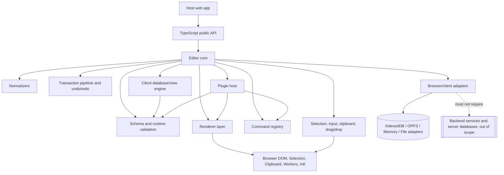

# Notion-compatible browser editor specification: scope and principles

Status: Normative scope document  
Target date: 2026-05-01  
Target platform: TypeScript in modern browser environments

## 1. Normative language and authority

The key words **MUST**, **MUST NOT**, **REQUIRED**, **SHOULD**, **SHOULD NOT**, **RECOMMENDED**, **MAY**, and **OPTIONAL** in this document are to be interpreted as RFC-style normative requirement levels.

This document defines the scope, compatibility principles, module boundaries, and conformance model for a TypeScript/browser-only implementation of a Notion-compatible editor for web applications. It is based on the public research in `research/notion-editor-architecture/*.md`, especially the documented facts that Notion models visible content as blocks, treats pages and database rows as pages/blocks, exposes rich text and typed properties through public APIs, uses a transaction-oriented editor, and treats databases/data sources/views as first-class product concepts.

A conforming implementation MUST optimize for Notion-compatible observable behavior and durable data semantics. It MUST NOT claim knowledge of private Notion internals. When public facts do not specify an internal algorithm, this specification defines the required compatible behavior and labels implementation freedom.

## 2. Scope

This specification suite covers a browser-only, client-side editor engine that can be embedded in web applications and implemented in TypeScript.

The following are in scope:

- Page editing, rendering, navigation, and page-as-block semantics.
- A typed block tree with stable block identity, ordered children, structural nesting, and normalization.
- Rich text, annotations, links, equations, mentions, dates, reminders, inline page references, and other inline objects.
- Commands, slash menus, block handles, keyboard shortcuts, input rules, drag/drop, copy/paste, undo/redo, and selections.
- Client-side database-like blocks and views, including database containers, data sources, page rows, properties, formulas, relations, rollups, linked views, filters, sorts, grouping, and view layouts.
- Comments, discussions, backlinks, references, synced blocks, templates, buttons, automation-like blocks, AI command surfaces, bookmarks, media blocks, embeds, link-preview representations, and unsupported/future block preservation.
- Client-side persistence through adapters such as in-memory stores, IndexedDB, OPFS, browser files, import/export, or host-provided browser-local storage.
- Accessibility, internationalization, browser compatibility, plugin APIs, renderer APIs, adapter APIs, conformance tests, and packaging for web apps.

The following are out of scope for this client-only specification:

- Backend services, server databases, server-side query planners, server authentication, deployment architecture, service sharding, data lakes, hosted file services, server webhooks, and production operations.
- Security claims that require a trusted server. Client-side permission and capability checks are UX and data-integrity mechanisms only; they MUST NOT be represented as sufficient to protect data from a hostile user with browser access.
- Vendor-specific Notion private APIs, proprietary internal protocols, or undisclosed implementation details.

Backend databases are out of scope. Client-side database-like blocks, data sources, property schemas, row/page records, and views are in scope and MUST be modeled as editor data structures, not as remote service dependencies.

## 3. Terminology

| Term | Normative definition |
| --- | --- |
| Editor | The interactive browser module that renders documents, accepts user input, manages selection, executes commands, emits transactions, and coordinates adapters. |
| Document | A local, serializable graph of pages, blocks, properties, views, comments, references, and supporting records needed to render and edit one or more Notion-compatible pages. |
| Page | A document-like content root with stable identity, metadata such as title/icon/cover, optional data-source property values, and an ordered child block tree. A page MUST be representable as a specialization of block identity, even if exposed through a separate public API type. |
| Block | The atomic content unit. A block has a stable ID, type, payload/properties, parent or containing reference, ordering position among siblings, timestamps/metadata where available, and zero or more child blocks when its schema permits children. |
| Child | A block contained under a page or another block in the render tree. Child order is semantically significant. Structural indentation MUST be represented as child movement, not as presentation-only CSS. |
| Rich text | A sequence of typed inline segments used for titles, paragraph text, captions, property values, comments, and other text-bearing fields. Rich text MUST preserve annotations and semantic inline objects rather than storing only rendered HTML. |
| Inline object | A non-plain-text inline entity inside rich text, including links, mentions, dates, reminders, equations, template mentions, user/page/database references, link-preview references, and future unsupported inline entities. |
| Property | A typed field definition or typed page value associated with a data source/page row. Property definitions MUST use stable IDs independent of mutable display names. |
| View | A saved or ephemeral client-side projection over a data source or linked data source, including layout type, filters, sorts, grouping, property visibility, page-open behavior, and layout-specific configuration. |
| Command | A declarative, capability-gated action invokable from slash menus, command palettes, block handles, keyboard shortcuts, toolbars, context menus, buttons, AI surfaces, or plugins. Commands MUST produce transactions or explicit read-only UI effects. |
| Transaction | An atomic, ordered set of operations representing one user or program intent. A transaction includes enough metadata to validate, normalize, undo/redo, map selections, and persist locally. |
| Selection | The editor state describing what the user is operating on. A selection MAY be text/rich-text range, block range, database cell range, row/card selection, gap/drop target, or another schema-defined selection. |
| Adapter | A pluggable boundary between the editor core and host-provided browser capabilities, including persistence, search indexes, clipboard serialization, file handles, media resolution, link preview resolution, AI proposal providers, or telemetry. |
| Plugin | A package that extends schema, rendering, commands, input rules, normalizers, adapters, or UI surfaces through the public TypeScript extension API. |
| Renderer | A deterministic module that converts normalized editor records into DOM or framework view output without requiring interactive editing state. |
| Normalizer | A deterministic function or pipeline that repairs or rejects invalid document states after transactions, imports, adapter reads, or plugin operations. |
| Schema | The TypeScript type system and runtime validation rules for records, block types, rich text, inline objects, properties, views, operations, selections, adapter contracts, and plugin contributions. |
| Capability | A local declaration of allowed operations in the current context, such as read, edit content, insert blocks, edit schema, comment, move, duplicate, upload/attach, or use AI. Capabilities gate UI and validation but are not server-enforced security. |
| Conformance | The degree to which an implementation satisfies a named conformance class in this specification suite and passes the corresponding normative tests. |

## 4. Goals

A conforming Notion-compatible browser editor MUST satisfy these goals:

1. **Product-scope compatibility.** The editor MUST model the full public Notion product surface relevant to pages, blocks, rich text, databases, views, comments, references, templates, buttons, media, embeds, and command-driven editing. It MUST NOT narrow scope to a minimal editor subset.
2. **Browser-only operation.** The editor MUST run in modern Chrome, Safari, and Firefox without Node.js runtime dependencies or required server round trips.
3. **TypeScript-first integration.** All public contracts MUST be expressible as TypeScript types and runtime-validated data shapes.
4. **Semantic data over DOM snapshots.** Documents MUST be stored as typed records and rich-text segments, not as opaque HTML.
5. **Stable identity.** Pages, blocks, data sources, views, comments, properties, and references MUST use stable IDs suitable for transactions, selections, backlinks, comments, and import/export.
6. **Transaction discipline.** User-visible mutations MUST be represented as transactions that can be validated, normalized, undone/redone, persisted locally, and replayed deterministically.
7. **Renderer/editor separation.** Read-only rendering MUST be possible without loading editing controllers, mutation UI, or persistence workers.
8. **Client-side extensibility.** Host apps MUST be able to extend behavior through plugins and adapters without forking the editor core.
9. **Loss tolerance.** Unknown/future Notion-compatible block, property, inline, and view payloads MUST be preserved where possible and rendered safely when not understood.
10. **Accessibility and internationalization.** Keyboard, screen-reader, IME, RTL, locale, and reduced-motion use cases MUST be baseline requirements, not optional enhancements.

## 5. Non-goals

A conforming implementation MUST NOT include or require the following as part of this specification:

- A server database, backend transaction API, hosted authentication service, deployment topology, or multi-tenant operations design.
- A claim of cryptographic or access-control security based solely on client-side capabilities.
- An attempt to reproduce private Notion implementation details such as internal editor toolkit, internal CRDT algorithm, private sync messages, internal database schemas, or production sharding.
- A dependency on Notion's private APIs or terms-restricted behavior.
- A single mandated UI framework. React, Web Components, Svelte, Vue, Solid, Canvas/WebGL overlays, or direct DOM renderers MAY be used if the public TypeScript contracts and browser requirements are satisfied.

## 6. Client-only module architecture

A conforming implementation SHOULD organize modules so that core data, rendering, editing, adapters, and plugins remain separately testable. The exact package names are implementation freedom, but the dependency direction MUST follow the same boundary principles.



Required architectural rules:

- The schema package MUST NOT depend on UI framework packages.
- The renderer MUST accept normalized records and produce deterministic output for the same inputs.
- The editor controller MUST mutate document state only through transactions.
- Adapters MUST be replaceable by host applications and MUST fail with typed errors rather than hidden global side effects.
- Plugins MUST declare schema, command, renderer, adapter, and capability contributions before use so the host can validate compatibility.
- Backend-like services MAY be simulated by browser-local adapters for testing, but a conforming browser editor MUST remain useful without them.

## 7. Conformance classes

Implementations MAY claim one or more conformance classes. A claim MUST name the class and specification version/date.

| Class | Name | Requirements |
| --- | --- | --- |
| C0 | Schema-compatible library | MUST implement the shared TypeScript schema, runtime validation, serialization, unknown payload preservation, and normalizer contracts. |
| C1 | Renderer-compatible library | MUST satisfy C0 and render normalized pages, blocks, rich text, database views, comments, embeds/placeholders, and unsupported records without interactive editing dependencies. |
| C2 | Interactive editor | MUST satisfy C1 and implement selections, commands, input rules, transactions, undo/redo, clipboard, drag/drop, keyboard navigation, accessibility, and adapter integration. |
| C3 | Client persistence adapter | MUST implement the adapter contracts for loading, saving, transaction journaling, import/export, and recovery using browser/client storage only. |
| C4 | Client database/view engine | MUST satisfy C0 and implement data sources, page rows, property schemas/values, filters, sorts, grouping, formulas, relations, rollups, linked views, and view render models client-side. |
| C5 | Plugin-compatible host | MUST satisfy C2 and provide stable plugin lifecycle, capability gating, command registration, schema extension, renderer extension, adapter injection, and version negotiation. |
| C6 | Notion-compatible browser editor | MUST satisfy C2, C3, C4, and C5, and MUST treat all Notion feature areas mapped in this document as in scope. It MAY degrade remote-service-dependent features into specified local, placeholder, import/export, or host-adapter states, but it MUST NOT omit their data model or compatible user-facing representation. |

A partial conformance claim MUST NOT market itself as a full Notion-compatible editor. A full Notion-compatible browser editor claim MUST use C6.

## 8. Browser support

A C6 implementation MUST support current stable Chrome, Safari, and Firefox as of 2026-05-01 on desktop-class browsers. Mobile browser support SHOULD use the same core model but MAY expose different interaction surfaces when platform limitations require it.

Required browser assumptions:

- ECMAScript modules and TypeScript-compiled JavaScript compatible with current evergreen browsers.
- DOM, Selection, Range, KeyboardEvent, PointerEvent, InputEvent, CompositionEvent, ClipboardEvent, DragEvent, ResizeObserver, IntersectionObserver, MutationObserver, URL, Blob, File, Crypto, and Intl APIs where available in the target browsers.
- IME composition support for CJK and other composed input systems.
- IndexedDB support for durable browser-local persistence adapters.
- Web Worker support for heavy normalization, indexing, import/export, database query evaluation, or WASM-backed local stores.

Optional browser capabilities MAY be used only with fallbacks:

- OPFS, WASM SQLite, SyncAccessHandle, SharedWorker, BroadcastChannel, Web Locks, File System Access API, Launch Handler, Web Share, WebCodecs, or other advanced APIs.
- If an optional API is absent, the implementation MUST either use another conforming adapter or present a typed unsupported-capability state without data loss.

Browser-specific behavior rules:

- The editor MUST NOT rely on non-standard selection behavior that works in only one browser.
- Firefox, Safari, and Chrome differences in cross-block selection, clipboard formats, composition events, and drag/drop MUST be abstracted behind tested browser adapters.
- Feature detection MUST be used instead of user-agent-only branching when practical.
- A browser bug workaround MUST be isolated and documented in the relevant adapter or platform layer.

## 9. Integration assumptions

A host web application integrating the editor is assumed to provide:

- A DOM container and lifecycle ownership for mounting/unmounting the editor.
- Initial document/page identity or an adapter from which it can be loaded.
- Theme tokens, icons, localization strings, and optional framework bindings.
- Browser-local persistence adapters or explicit in-memory operation mode.
- Optional adapters for search, file selection, media resolution, link-preview resolution, AI proposal generation, telemetry, import/export, or collaboration simulation.
- A local actor/capability context for UI gating and validation.

The editor MUST NOT assume:

- A backend route exists.
- A logged-in user or remote workspace exists.
- Remote authentication, OAuth, email delivery, push notifications, server webhooks, hosted file uploads, or server-side AI execution exists.
- A single global CSS reset, app router, state manager, or UI framework exists.

If a host provides network-backed adapters, those adapters are outside the scope of this client-only specification. The editor MAY call them through browser APIs, but conformance is judged only on the client contract, typed error behavior, data preservation, and user-facing state handling.

## 10. Packaging assumptions

A conforming TypeScript package SHOULD be distributed as ESM with side-effect-minimized modules. It MUST NOT require Node.js built-ins at runtime in the browser.

Public packages SHOULD be organized around separable entry points such as:

```text
@notion-compatible/schema
@notion-compatible/renderer
@notion-compatible/editor
@notion-compatible/database-views
@notion-compatible/adapters-indexeddb
@notion-compatible/plugins
@notion-compatible/conformance
```

The names above are illustrative, not required. Equivalent packaging is conforming if:

- Core schema and runtime validation can be imported without the editor UI.
- Renderer-only consumers can avoid editing, persistence, and worker code.
- Host apps can tree-shake unused block renderers, view renderers, adapters, and plugins.
- Public types are generated from the same source as runtime validators or are tested for equivalence.
- Package exports identify browser-safe entry points.
- CSS, fonts, icons, and optional workers are explicit assets, not hidden global requirements.

## 11. Accessibility baseline

A C6 implementation MUST meet at least WCAG 2.2 AA intent for editor-controlled UI. At minimum it MUST provide:

- Keyboard-only creation, navigation, selection, editing, moving, duplicating, deleting, commenting, and command execution for blocks and database views.
- Visible focus indicators and deterministic focus restoration after commands, undo/redo, dialogs, menus, drag/drop alternatives, and page/view changes.
- ARIA-appropriate semantics for menus, toolbars, dialogs, listboxes, trees/outlines, tabs, grids, tables, comments, toasts, and status messages.
- Screen-reader labels for block handles, command items, property cells, comments, collapsed toggles, synced block state, unsupported blocks, and media placeholders.
- Pointer alternatives for drag/drop, including keyboard move, indent/outdent, and reorder commands.
- High-contrast and forced-colors compatibility, reduced-motion handling, and no color-only status indicators.
- Safe announcements for asynchronous adapter states such as saving locally, recovering transactions, importing, exporting, indexing, or failed media resolution.

Database-like views rendered as tables, boards, calendars, timelines, galleries, charts, forms, maps, or dashboards MUST expose accessible names, roles, and keyboard operations appropriate to their layout. Where a visual layout cannot expose all semantics, an accessible alternate representation MUST be available.

## 12. Internationalization baseline

A C6 implementation MUST support internationalized editing and rendering:

- Unicode text storage MUST be lossless.
- Caret movement, selection offsets, deletion, and annotation boundaries SHOULD be based on grapheme-aware segmentation rather than UTF-16 code unit assumptions.
- IME composition MUST NOT trigger premature Markdown/input rules or corrupt rich text.
- Bidirectional and RTL text MUST render and edit correctly inside blocks, titles, properties, comments, and database cells.
- Dates, times, numbers, currencies, relative dates, calendar week starts, sorting collation, and formula display MUST be locale-aware when visible to users.
- Time-zone-sensitive objects such as reminders, date mentions, templates, formulas, and calendar/timeline views MUST carry enough data to render deterministically.
- Command labels, aliases, keyboard shortcut display, property names, colors, and validation errors MUST be localizable.

English/QWERTY keyboard shortcuts MAY be defaults, but shortcut handling MUST allow remapping and MUST NOT block text input for international keyboards.

## 13. Compatibility principles

### 13.1 Observable behavior over private internals

The editor MUST reproduce public Notion-compatible behavior where it is observable through official product docs, public API shapes, or export/import behavior. It MUST NOT require matching Notion's private internal schema, editor toolkit, sync protocol, or storage engine.

### 13.2 Blocks are the universal content primitive

All visible page content MUST be representable as blocks or inline objects within blocks. Pages, database rows, child pages, database containers, synced block instances, media blocks, simple tables, layout blocks, and unsupported future blocks MUST have stable identity and typed payloads.

### 13.3 Type and payload preservation

Changing a block type SHOULD preserve payload fields that are not understood by the new type. Normalizers MAY hide or ignore invalid fields for rendering, but they MUST NOT discard recoverable user data unless a command explicitly requests destructive conversion and the user can undo it.

### 13.4 Structural containment is semantic

Indent, outdent, drag/drop, columns, toggles, child pages, table rows, synced blocks, and database rows MUST be modeled as structural operations. Presentation-only indentation or DOM order MUST NOT be the source of truth.

### 13.5 Public API projection is not internal storage

Notion-like JSON objects for blocks, pages, properties, data sources, views, comments, and files are compatibility projections. Implementations MAY store a different normalized internal shape, but MUST be able to serialize and deserialize the normative projection without losing supported data.

### 13.6 Transactions own mutation

Commands, input rules, paste handling, drag/drop, database cell edits, formula/schema changes, button actions, AI accept/discard, imports, and plugin mutations MUST flow through the transaction pipeline or an explicitly read-only path. Direct uncontrolled mutation of editor records is non-conforming.

### 13.7 Normalization is mandatory

After every transaction, import, adapter load, and plugin mutation, the normalizer MUST either produce a valid document state or a typed validation error. Invalid structures such as cycles, children under disallowed block types, columns outside column lists, malformed rich text, duplicate property IDs, invalid relation targets, and unsupported view references MUST NOT silently persist as normal editor state.

### 13.8 Client-side persistence is local-first

The editor MUST support browser-local persistence for document records and transaction journals through adapters. A document MUST remain recoverable after reload if the selected adapter claims durability. Network sync MAY exist in host adapters but is not required for conformance and is not specified here.

### 13.9 Unsupported records are preserved safely

Unknown block types, inline object types, property types, view types, or fields MUST be preserved as opaque payloads when possible. Renderers MUST show safe unsupported placeholders and MUST NOT execute unknown embedded content as script.

### 13.10 Capability-gated UX

Commands and editing affordances MUST check local capabilities before execution. If a capability is absent, the UI SHOULD explain why the command is unavailable. Capability checks MUST be repeated during transaction validation.

### 13.11 Database-like views are editor data

Data sources, properties, row pages, filters, sorts, formulas, rollups, relations, and views MUST be implemented as client-side editor data structures. They MAY be backed by IndexedDB/OPFS/in-memory adapters, but MUST NOT require a server database to render or edit.

### 13.12 Deterministic import/export

Import/export and clipboard operations MUST use the same schema and normalizers as live editing. Internal rich data SHOULD be preserved when moving between instances of the editor, while HTML/plain text/Markdown fallbacks SHOULD interoperate with external apps.

## 14. Feature area to specification document map

The Notion-compatible browser editor specification suite is organized under `research/notion-next/`. The table reserves normative ownership of feature areas. If a mapped document is not yet present in a working branch, the feature area remains in scope and MUST NOT be treated as deferred or optional for C6 conformance.

| Notion feature area | Primary spec document in this folder | Scope notes |
| --- | --- | --- |
| Scope, principles, conformance classes, browser baseline, client-only boundary | `00-scope-and-principles.md` | This document. |
| Canonical client document model, normalized records, pages, blocks, rich text, comments, files, embeds, synced blocks, databases/data sources/views as records, model transactions, serialization, validation, import/export | `01-document-model.md` | Defines the browser-local source-of-truth data graph and model-layer invariants. |
| Rich text, annotations, inline objects, mentions, equations, dates, page links, comment anchors | `01-document-model.md` plus reserved `02-rich-text-and-inline-objects.md` | `01-document-model.md` owns the current canonical representation; a dedicated document MAY add editing/runtime detail without narrowing scope. |
| Block taxonomy, page rendering, layout block records, unsupported blocks, renderer contracts | `01-document-model.md`, `05-selection-drag-drop-layout.md`, plus reserved `03-blocks-layout-and-rendering.md` | The current model and layout specs define representation and interaction; renderer details remain in scope even if split later. |
| Input pipeline, commands, slash menu, keyboard shortcuts, Markdown rules, autocomplete, paste/drop command routing, buttons, AI command surfaces | `04-input-commands-shortcuts.md` | Defines browser event handling and command-to-transaction behavior. |
| Selection, cross-block text ranges, block selection, drag/drop, structural moves, columns, simple tables, layout measurement, keyboard alternatives | `05-selection-drag-drop-layout.md` | Defines canonical selection and structural layout behavior. |
| Client-side databases, data sources, properties, formulas, relations, rollups, views, templates, database buttons | `06-client-databases.md` | Defines browser-only database-like editor data, deterministic client queries, formulas, rollups, relations, views, and transactions; no server database required. |
| Host integration API, package boundaries, lifecycle, controlled/uncontrolled modes, adapters, persistence, plugins, media resolvers, telemetry, import/export, browser/a11y conformance tests | `07-integration-api-conformance.md` | Defines the embedding and conformance surface for TypeScript/browser implementations. |
| Comments, discussions, suggestions, backlinks, page links, references, reminders | `01-document-model.md` plus reserved `08-comments-references-and-backlinks.md` | The data model owns canonical records; a dedicated document MAY add UI/runtime detail without deferring scope. |
| Files, media, bookmarks, embeds, link previews, external content, attachments | `01-document-model.md`, `07-integration-api-conformance.md`, plus reserved `09-files-media-embeds-and-previews.md` | Model and resolver contracts are current; richer renderer/adapter states remain in scope. |
| Client persistence, transaction journals, local indexes, offline availability, recovery, multi-tab behavior | `07-integration-api-conformance.md` plus reserved `10-client-persistence-and-offline.md` | Integration spec owns current adapter contracts; local-first/offline semantics remain fully in scope. |
| Accessibility, internationalization, browser/platform behavior | `00-scope-and-principles.md`, `05-selection-drag-drop-layout.md`, `07-integration-api-conformance.md`, plus reserved `11-accessibility-i18n-and-platform.md` | Baseline requirements apply now; a dedicated document MAY add test detail. |
| Plugin, renderer, adapter APIs and host integration | `07-integration-api-conformance.md` plus reserved `12-plugin-renderer-adapter-api.md` | Integration spec owns current extension contracts. |
| Import/export, public JSON compatibility, Markdown/HTML/plain-text clipboard | `01-document-model.md`, `04-input-commands-shortcuts.md`, `07-integration-api-conformance.md`, plus reserved `13-import-export-and-compatibility.md` | Conversion behavior uses the same schema and normalizers as live editing. |
| Conformance tests, fixtures, behavior matrices, browser test harness | `07-integration-api-conformance.md` plus reserved `14-conformance-tests.md` | Defines required tests for conformance claims; additional fixtures remain in scope. |

## 15. No deferred scope

This specification suite has no deferred Notion product scope for C6 conformance. A document MAY sequence implementation work internally, but normative requirements MUST NOT say that a Notion feature area is left to a later phase, out of product scope, or intentionally unsupported merely because it is complex.

Unknown Notion internals MUST be handled as follows:

1. **Public behavior known.** If public Notion product documentation or public API documentation describes behavior or data shape, the specification MUST define compatible observable behavior.
2. **Internal algorithm unknown.** If Notion's private algorithm is unknown, the specification MUST state the required invariants and identify implementation freedom. Example: the exact rich-text CRDT is unknown; a conforming editor still MUST define deterministic rich-text merge, undo, selection mapping, and local persistence behavior for its chosen algorithm.
3. **Remote service required by Notion product.** If a Notion feature normally uses a backend service, this client-only suite MUST still specify the local data model, UI states, adapter contract, and safe degradation. Example: authenticated link previews require a service in Notion; a browser-only implementation MUST still preserve link-preview blocks and render loading, unavailable, unauthorized, static, or host-resolved states.
4. **Feature not exposed by public API.** If the product exposes a feature but the public API does not, the editor MUST model the product behavior where observable and MAY serialize it as an unsupported or extension payload for API-style export.
5. **Conflicting public surfaces.** If product docs and API docs differ, the specification MUST identify the divergence and define which behavior applies to editor UX, import/export, and public JSON projection.
6. **Browser limitation.** If a target browser cannot support a specific interaction identically, the implementation MUST provide an accessible equivalent and MUST preserve the same document semantics.
7. **Plugin escape hatch.** A plugin MAY provide a feature implementation, but core conformance MUST still define the schema, capability, transaction, renderer, and unsupported-state behavior needed to preserve documents without that plugin.

The phrase “implementation freedom” means the implementation MAY choose its internal data structure or algorithm only if it satisfies all normative invariants, observable behavior, serialization, accessibility, and conformance tests for the feature.

## 16. Client-only handling of service-shaped Notion features

Some Notion-visible features imply remote infrastructure in Notion itself. In this browser-only specification they are handled through local state and adapters:

| Feature | Client-only requirement |
| --- | --- |
| Sharing and permissions | MUST model capabilities, local permission metadata, disabled states, redacted references, and broadest-access-style display rules where data is present. MUST NOT claim security without a trusted backend. |
| Comments and mentions | MUST store and render local discussion records, anchors, mention objects, reminders, and notifications-as-data. External notification delivery is out of scope. |
| Files and uploads | MUST model attachments, file metadata, local file handles/blobs where adapters provide them, external URLs, expiring/unavailable states, and safe placeholders. Hosted upload services are out of scope. |
| Link previews and embeds | MUST preserve URL, provider, resolved metadata, auth/unavailable/error states, and safe rendering. Auth token exchange and server unfurling are out of scope unless supplied by a host adapter. |
| AI blocks and AI commands | MUST model AI as commands that create proposals, previews, diffs, or generated blocks through an adapter. Model execution is out of scope, but accept/discard/retry transaction behavior is in scope. |
| Search | MUST support client-local indexing/search over loaded or persisted records for command/search surfaces. Global server search is out of scope. |
| Offline and sync | MUST support browser-local persistence and recovery. Multiplayer sync and server conflict arbitration are out of scope, but transaction journals and merge/normalization semantics are in scope. |
| Webhooks/integrations | MUST NOT require server webhooks. Import/export and adapter events MAY expose local change signals to the host app. |

## 17. Minimum C6 compatibility checklist

A C6 implementation MUST be able to demonstrate all of the following in browser-only tests:

- Create, render, edit, reorder, indent/outdent, duplicate, delete/restore, copy/paste, import, and export page/block trees.
- Represent pages as content roots and as data-source rows with properties.
- Preserve stable IDs and update selections/comments/references through transactions.
- Render and edit rich text with annotations, links, equations, mentions, date/reminder references, and unknown inline objects.
- Execute commands from at least slash menu, keyboard shortcut, block menu, and programmatic API surfaces.
- Run Markdown/input rules without corrupting IME composition.
- Support text, block, cell/row, and gap/drop selections with accessible keyboard alternatives.
- Model all documented major Notion block families, including unsupported placeholders for feature-specific renderers not loaded.
- Model client-side data sources, property schemas, page property values, formulas, relations, rollups, and views.
- Persist documents and transaction journals through at least one browser-local durable adapter.
- Recover from reload without data loss for adapter-acknowledged durable writes.
- Provide renderer-only operation for read-only pages and exports.
- Provide plugin and adapter version negotiation and safe failure modes.
- Pass browser conformance tests in current Chrome, Safari, and Firefox.

## 18. Source basis

The scope and principles above are grounded in these public facts captured by the existing research documents:

- Notion states that visible content is modeled as blocks with IDs, properties, type, content/children, and parent pointers; type changes preserve unrelated properties; transactions are applied optimistically on the client and queued for persistence.
- Public API objects expose blocks, pages, databases, data sources, views, rich text, properties, comments, files, pagination, versioning, request limits, unsupported block types, and date-versioned compatibility boundaries.
- Product docs describe slash commands, Markdown shortcuts, block selection, drag/drop, structural nesting, columns, simple tables, synced blocks, comments, mentions, backlinks, databases, linked data sources, relations, rollups, formulas, templates, buttons, AI surfaces, search, and permissions.
- Browser/client architecture research shows local caching, IndexedDB/SQLite/OPFS considerations, worker boundaries, offline completeness, transaction queues, and browser-specific selection/storage constraints.

These facts are used as compatibility constraints, not as a license to copy private implementations.
