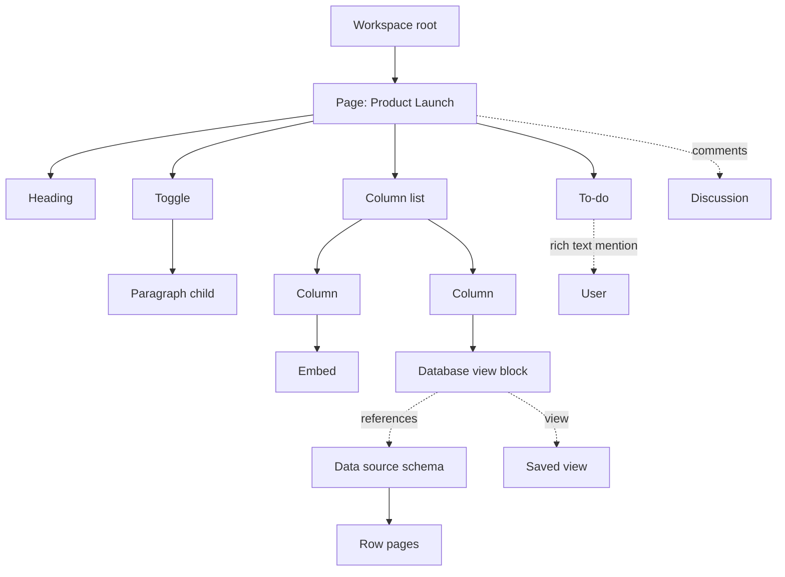
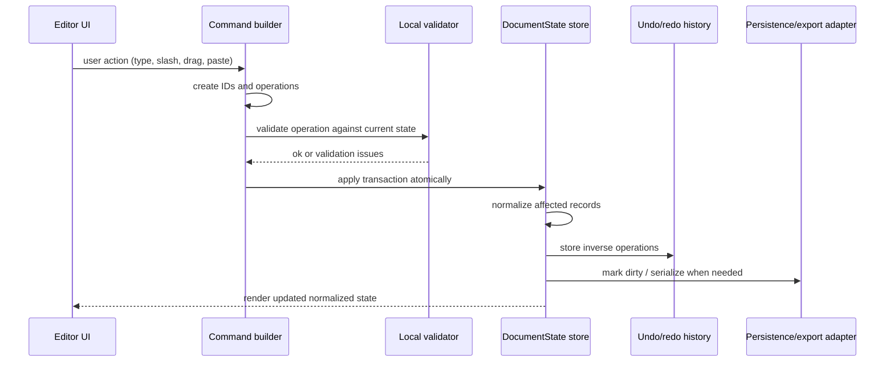

# Notion Next Document Model Specification

## Scope

This document is a normative, browser-only TypeScript specification for the canonical client document model of a Notion-compatible web editor. It defines how a TypeScript application MUST represent pages, blocks, rich text, comments, files, embeds, synced blocks, databases/data sources/views, model-layer transactions, serialization, validation, and import/export.

This specification does **not** design a backend, server database, network protocol, authentication system, or permission service. A conforming implementation MAY persist the model in memory, IndexedDB, OPFS, browser File System Access, or another browser-accessible store, but the canonical shape in this document is the source of truth for editor state while running in the browser.

## Evidence posture

The following public Notion behavior is treated as confirmed and product-shaping:

- Notion models editor content as blocks. Blocks have stable UUID-like IDs, a `type`, flexible properties, ordered child/content pointers, and an upward parent pointer used for permissions.
- Pages are blocks with page-specific metadata and page properties. Page body content is represented as block children, not as a monolithic document string.
- Blocks can be nested. Indentation changes structure by moving blocks into another block's children.
- Block type controls rendering and interpretation, but Notion has stated that type changes do not necessarily destroy stored properties/content.
- The public API exposes block, page, database, data source, view, rich text, file, comment, parent, and property objects with type-discriminated JSON shapes.
- Notion rich text contains typed text, mentions, and equations plus annotations, links, `plain_text`, and optional `href`.
- Databases contain data sources; data sources define schemas; pages are rows/items in data sources; views are saved query/presentation definitions.
- Comments can attach to pages, blocks, and inline text/block/property locations in the product; public API comments are separate discussion records.
- Synced blocks have an original and duplicate instances whose duplicates point to the original.
- Hosted file URLs are not stable content identifiers; file references and access URLs are distinct.

Where Notion internals are not public, this document makes compatible implementation decisions. Those decisions are marked **Implementation decision** and are requirements for this specification, not claims about Notion internals.

## Normative language

The key words **MUST**, **MUST NOT**, **SHOULD**, **SHOULD NOT**, and **MAY** are to be interpreted as RFC 2119-style requirements for implementations of this client model.

## Canonical model overview

A conforming browser editor MUST use a normalized record graph with these top-level stores:

1. `workspace`: one virtual workspace root for the open client document.
2. `blocks`: all renderable page/body blocks keyed by stable block ID.
3. `pages`: page metadata and page property values keyed by page/block ID.
4. `databases`, `dataSources`, and `views`: database container, schema/row collection, and presentation/query records.
5. `comments` and `discussions`: a separate annotation layer over pages, blocks, properties, and rich-text ranges.
6. `files`: stable asset metadata and attachment references.
7. `users`: local known user/bot/guest identities used by mentions, authorship, comments, and people properties.
8. `schema`: format and migration metadata.
9. `transactions`: optional local operation history/queue for undo, redo, persistence, and collaboration adapters.

The model MUST be serializable as deterministic JSON without DOM nodes, editor toolkit objects, class instances, functions, or cyclic JavaScript references.



## Workspace root assumptions

- The open document state MUST belong to exactly one `WorkspaceId`.
- The workspace root is virtual. It MUST NOT be stored as a normal block and MUST NOT appear in any block's `children` array.
- Top-level pages and full-page databases MUST use a parent reference of `{ kind: "workspace", workspaceId }`.
- Teamspaces/sidebar sections MAY be represented as non-render parent metadata, but this specification does not require teamspace records because Notion's public API can expose team-level pages as workspace-parented.
- A conforming implementation MUST NOT assume a single global root page. Multiple workspace-root pages/databases MUST be supported.

## Blocks, pages, and structure

### Block records

A `BlockRecord` is the canonical render-tree node. Every block MUST have:

- a stable `id` generated before insertion, preferably with `crypto.randomUUID()`;
- `workspaceId` matching the containing document;
- a `type` discriminator;
- a canonical `parent` reference;
- an ordered `children` array of child block IDs;
- lifecycle metadata;
- created/edited metadata; and
- a type-specific `data` payload.

**Implementation decision:** In the browser model, the canonical child order is the `children: BlockId[]` array on the parent block or page-like block. Implementations MAY maintain secondary order keys for CRDT/collaboration adapters, but normalization MUST materialize the array.

### Parent/child relations

- A block's `parent` MUST identify exactly one containing workspace, block, page, database, data source, or synced-block instance location.
- For render children, `child.parent` MUST point to the parent whose `children` array contains the child.
- A child block ID MUST appear in at most one canonical render `children` array, except synced duplicate rendering, which MUST be represented by reference rather than by physically sharing child IDs.
- The render graph MUST be acyclic.
- Moving a block MUST move its entire subtree.
- Indent/outdent MUST be represented as `moveBlock` operations that change the parent and child order, not as CSS-only presentation.
- A child ID MUST NOT appear more than once in the same `children` array.
- A block MUST NOT be its own ancestor.
- Parent references MUST be repaired or the document MUST be invalid if an inserted child is missing from `blocks`.

### Stable IDs

- IDs MUST be opaque strings. Consumers MUST NOT parse type, time, author, or hierarchy from IDs.
- New block/page/database/data-source/view/comment/file IDs SHOULD be UUID v4 strings produced by `crypto.randomUUID()`.
- Imported IDs MAY be preserved when they are globally unique within the document. Collisions MUST be remapped and all references MUST be updated atomically.
- IDs MUST remain stable across block moves, text edits, type conversions, archive/trash transitions, export/import round trips, and database view changes.

### Ordering

- Sibling order MUST be the order of the parent `children` array.
- Operations that insert or move blocks MUST specify one of `index`, `before`, `after`, or `append`; normalization MUST convert that intent to an array index.
- When both `before` and `after` are provided, validation MUST reject the operation.
- Reordering MUST be stable: blocks not mentioned by the operation MUST retain their relative order.
- Database row display order MUST NOT be inferred from page child order when a view has explicit sorts. Manual row order MAY be represented on `DataSourceEntry.order`.

### Page records

A page is both a block and a document-like container.

- Every `PageRecord.id` MUST reference an existing block whose `type` is `page`.
- Page title MUST be stored as a title property in `PageRecord.properties` and SHOULD be denormalized into `PageRecord.titlePlain` for breadcrumbs/search/sidebar display.
- A page outside a data source MUST still have a `title` property.
- A page inside a data source MUST have `parent.kind === "data_source"` or an equivalent page record parent and MUST satisfy the data source schema.
- Page body content MUST be represented by the page block's `children` array.
- Icon, cover, lock state, public URL, and page-level metadata MUST be page metadata, not rich text in the first block.

### Archive, trash, and deletion

- The canonical lifecycle state MUST distinguish normal, archived, trashed, and deleted records.
- `archived` means hidden from normal navigation but recoverable and still present in exports unless filtered.
- `trashed` means user-deleted/recoverable. A trashed parent SHOULD cause descendants to be hidden by inherited lifecycle, but descendants MUST retain their own lifecycle states.
- `deleted` means tombstoned for reference preservation. Deleted records MAY be omitted from normal exports only if no surviving record references them.
- Hard deletion MUST remove or rewrite all references, comments, relation edges, view references, and parent child arrays in one normalized operation.
- Implementations MUST NOT silently drop archived/trashed records during JSON import unless the importer is explicitly configured to prune them.

## Block types

A conforming Notion-compatible implementation MUST support at least these block types in the model, even if a particular renderer displays some as placeholders:

- Textual: `paragraph`, `heading_1`, `heading_2`, `heading_3`, `quote`, `callout`, `code`, `equation`, `divider`, `table_of_contents`, `breadcrumb`.
- Lists/tasks/toggles: `bulleted_list_item`, `numbered_list_item`, `to_do`, `toggle`, `toggle_heading_1`, `toggle_heading_2`, `toggle_heading_3`.
- Containers: `page`, `column_list`, `column`, `table`, `table_row`, `template`, `synced_block`, `child_page`, `child_database`, `database_view`.
- Media and web: `image`, `video`, `audio`, `file`, `pdf`, `bookmark`, `embed`, `link_preview`.
- Compatibility: `unsupported` for preserved future/internal block types.

Unknown block types imported from JSON MUST be preserved as `unsupported` with raw payload and children unless a migration explicitly upgrades them.

## Rich text model

Rich text MUST be stored as an ordered array of semantic spans, not as HTML.

### Span requirements

- Every rich-text array MUST normalize to a minimal sequence of spans.
- Plain text content MUST use a `text` span with Unicode string content and optional link.
- Inline equations MUST use an `equation` span with a LaTeX/KaTeX expression.
- Mentions MUST use a `mention` span with a typed target reference.
- Inline page links created by `@`, `[[`, or `+` page-link flows MUST be represented as page mentions. Implementations MAY also expose `inline_page` as a UI alias, but serialization MUST normalize it to `mention.page` unless exporting a proprietary fragment.
- Dates and reminders MUST be represented as `mention.date` with `DateMention` payload, not plain text, so reminders and timezone/date-range semantics survive rendering.
- Commented text ranges MUST NOT be represented as annotations. They MUST be represented by `DiscussionRecord.anchor` pointing to a rich-text range, while spans MAY include `commentIds` as a denormalized convenience cache.
- `plainText` MUST be derivable from span payloads and MUST match the visible text fallback used for search/export.
- `href` MUST be derivable from `text.link` or mention target where applicable and MUST NOT be the source of truth.

### Annotations

- Annotations MUST support bold, italic, strikethrough, underline, code, and Notion-like foreground/background color names.
- Code annotation MUST be exclusive with rich styling in renderers when the UI cannot show both; however, the model MAY store all annotations and let renderers choose presentation.
- Adjacent text spans with identical annotations, link, direction, and comment ID set MUST be merged during normalization.

### Unicode, bidi, and offsets

- Text content SHOULD be normalized to Unicode NFC on input and import.
- Implementations MUST NOT split surrogate pairs, combining-mark sequences, emoji ZWJ sequences, or variation-selector sequences when applying rich-text range operations. Use `Intl.Segmenter` with `granularity: "grapheme"` when available.
- Model-layer range offsets MUST declare their unit. This specification uses UTF-16 code-unit offsets for DOM compatibility plus a required `textQuote` fallback for robust re-anchoring.
- Bidi control characters MUST be preserved if authored or imported. Renderers SHOULD isolate rich text segments using browser bidi isolation (`unicode-bidi: plaintext` or equivalent) where needed.
- Direction MAY be stored per span as `auto`, `ltr`, or `rtl`; `auto` MUST be the default.

## Comments, mentions, files, embeds, synced blocks

### Comments and discussion anchors

- Comments MUST be separate records, not embedded directly in block payloads.
- A `DiscussionRecord` MUST group one or more `CommentRecord`s and MUST carry the canonical anchor.
- Anchors MUST support page-level, block-level, property-level, and rich-text range locations.
- Rich-text range anchors MUST include `blockId`, field path, UTF-16 start/end offsets, and a `textQuote` with exact/prefix/suffix context for repair after edits.
- When a range edit deletes the entire anchor text, the discussion SHOULD degrade to a block-level anchor and MUST remain visible unless explicitly resolved/deleted.
- Resolved discussions MUST remain in the model until pruned by explicit policy.

### Mentions and references

- Mentions MUST be typed references to pages, databases, data sources, views, users, dates/reminders, files, links, templates, or external URLs.
- A mention target that is unavailable or unresolved MUST remain as a reference with an `unresolved` flag and fallback `plainText`.
- Mention rendering MUST be permission/state-aware where the application has that information; however, the model MUST preserve the original target ID.

### Files

- File blocks, file page properties, comments, and rich text MAY reference `FileRecord`s.
- File records MUST separate stable metadata (`id`, name, MIME type, size, kind) from access URLs.
- Browser-only local files MAY be represented by a `blob:` URL or File System Access handle while editing, but serialized portable JSON MUST NOT depend on a `blob:` URL being valid after reload. Portable export MUST use external URLs, embedded data URLs when explicitly requested, or application-managed asset manifests.
- External files MUST use absolute HTTP(S) URLs.

### Embeds

- Embed/bookmark/link-preview blocks MUST store the canonical submitted URL and MAY store fetched metadata (title, description, icon, provider, dimensions) as cache only.
- Cached embed metadata MUST be invalidatable without changing the canonical URL.
- Unsafe protocols such as `javascript:` MUST be rejected during validation/import.

### Synced blocks

- A synced block original MUST have `data.syncedFrom === null` and own its canonical children.
- A synced block duplicate MUST have `data.syncedFrom` pointing to the original synced block ID and MUST NOT own independent render children except optional local placeholder/fallback children marked non-canonical.
- Rendering a duplicate MUST render the original's current children in the duplicate's location.
- Editing a duplicate MUST produce operations against the original unless the user explicitly unsyncs.
- Unsyncing MUST copy the rendered original subtree into new block IDs under the duplicate's parent and then remove the synced reference.
- Comments MAY anchor either to the original content or to a duplicate instance. The anchor MUST declare `scope: "source" | "instance"`.

## Databases, data sources, views, and page relationships

- A `DatabaseRecord` represents a Notion database container and MAY be displayed full-page or inline.
- A database MUST have one or more `DataSourceRecord`s.
- A data source MUST define stable property schemas by property ID. Property names are mutable labels and MUST NOT be used as canonical identifiers.
- Pages in a data source MUST be represented as normal pages with data-source entry metadata and typed page property values.
- Relation-like properties MUST store page references, not copied page titles.
- Two-way relation properties MUST update both relation values atomically at the model layer.
- Formula and rollup property values are computed/read-only values. The model MUST distinguish stored user-editable values from computed values.
- Views MUST reference a database and one data source or an explicit multi-source definition. Views MUST store layout, filters, sorts, grouping, visible properties, and per-view presentation settings independently from the data source schema.
- A `database_view` block MUST reference a view. It MUST NOT duplicate the full data source rows inside block data.

## Schema and version metadata

- Serialized documents MUST include a `schema.format` identifier and monotonically increasing `schema.version`.
- Every record SHOULD include a `version` integer for optimistic updates, undo/redo conflict detection, and model migrations.
- Migrations MUST be pure data transformations from one serialized version to the next.
- A migration MUST preserve unknown fields under `extensions` or `unsupported` payloads unless explicitly dropping them is documented.
- Implementations MUST reject documents with a newer required schema version unless a compatibility mode is provided.

## TypeScript model

The following interfaces are normative. Implementations MAY add fields under `extensions`, but MUST NOT change the meaning of required fields.

```ts
export type Brand<T, B extends string> = T & { readonly __brand: B };

export type WorkspaceId = Brand<string, "WorkspaceId">;
export type BlockId = Brand<string, "BlockId">;
export type PageId = Brand<BlockId, "PageId">;
export type DatabaseId = Brand<string, "DatabaseId">;
export type DataSourceId = Brand<string, "DataSourceId">;
export type ViewId = Brand<string, "ViewId">;
export type UserId = Brand<string, "UserId">;
export type CommentId = Brand<string, "CommentId">;
export type DiscussionId = Brand<string, "DiscussionId">;
export type FileId = Brand<string, "FileId">;
export type TransactionId = Brand<string, "TransactionId">;
export type PropertyId = Brand<string, "PropertyId">;

export type ISODateTime = string;
export type URLString = string;
export type Version = number;

export interface DocumentState {
  schema: SchemaMetadata;
  workspace: WorkspaceRecord;
  users: Record<UserId, UserRecord>;
  blocks: Record<BlockId, BlockRecord>;
  pages: Record<PageId, PageRecord>;
  databases: Record<DatabaseId, DatabaseRecord>;
  dataSources: Record<DataSourceId, DataSourceRecord>;
  views: Record<ViewId, ViewRecord>;
  discussions: Record<DiscussionId, DiscussionRecord>;
  comments: Record<CommentId, CommentRecord>;
  files: Record<FileId, FileRecord>;
  transactions?: TransactionRecord[];
  extensions?: JsonObject;
}

export interface SchemaMetadata {
  format: "notion-next-document";
  version: 1;
  createdAt: ISODateTime;
  updatedAt: ISODateTime;
  appVersion?: string;
  minReaderVersion?: 1;
  migrations?: MigrationStamp[];
}

export interface MigrationStamp {
  from: number;
  to: number;
  migratedAt: ISODateTime;
  tool?: string;
}

export interface WorkspaceRecord {
  id: WorkspaceId;
  name: string;
  rootPageIds: PageId[];
  rootDatabaseIds: DatabaseId[];
  settings?: WorkspaceSettings;
  version: Version;
}

export interface WorkspaceSettings {
  locale?: string;
  timezone?: string;
  defaultPageId?: PageId;
}

export interface UserRecord {
  id: UserId;
  type: "person" | "bot" | "guest" | "unknown";
  name?: string;
  avatarUrl?: URLString;
  email?: string;
  unresolved?: boolean;
}

export type ParentRef =
  | { kind: "workspace"; workspaceId: WorkspaceId }
  | { kind: "block"; blockId: BlockId }
  | { kind: "page"; pageId: PageId }
  | { kind: "database"; databaseId: DatabaseId }
  | { kind: "data_source"; dataSourceId: DataSourceId }
  | { kind: "synced_instance"; blockId: BlockId; instanceId: BlockId };

export type LifecycleState = "active" | "archived" | "trashed" | "deleted";

export interface AuditMetadata {
  createdAt: ISODateTime;
  createdBy?: UserId;
  lastEditedAt: ISODateTime;
  lastEditedBy?: UserId;
}

export type BlockType =
  | "paragraph"
  | "heading_1"
  | "heading_2"
  | "heading_3"
  | "bulleted_list_item"
  | "numbered_list_item"
  | "to_do"
  | "toggle"
  | "toggle_heading_1"
  | "toggle_heading_2"
  | "toggle_heading_3"
  | "quote"
  | "callout"
  | "code"
  | "equation"
  | "divider"
  | "table_of_contents"
  | "breadcrumb"
  | "page"
  | "child_page"
  | "child_database"
  | "database_view"
  | "column_list"
  | "column"
  | "table"
  | "table_row"
  | "template"
  | "synced_block"
  | "image"
  | "video"
  | "audio"
  | "file"
  | "pdf"
  | "bookmark"
  | "embed"
  | "link_preview"
  | "unsupported";

export interface BlockRecord<T extends BlockType = BlockType> extends AuditMetadata {
  id: BlockId;
  workspaceId: WorkspaceId;
  type: T;
  parent: ParentRef;
  children: BlockId[];
  lifecycle: LifecycleState;
  version: Version;
  data: BlockDataByType[T];
  preservedData?: JsonObject;
  extensions?: JsonObject;
}

export interface BlockDataByType {
  paragraph: RichTextBlockData;
  heading_1: HeadingBlockData;
  heading_2: HeadingBlockData;
  heading_3: HeadingBlockData;
  bulleted_list_item: RichTextBlockData;
  numbered_list_item: NumberedListItemData;
  to_do: TodoBlockData;
  toggle: ToggleBlockData;
  toggle_heading_1: ToggleBlockData;
  toggle_heading_2: ToggleBlockData;
  toggle_heading_3: ToggleBlockData;
  quote: RichTextBlockData;
  callout: CalloutBlockData;
  code: CodeBlockData;
  equation: EquationBlockData;
  divider: EmptyBlockData;
  table_of_contents: TableOfContentsBlockData;
  breadcrumb: EmptyBlockData;
  page: PageBlockData;
  child_page: ChildPageBlockData;
  child_database: ChildDatabaseBlockData;
  database_view: DatabaseViewBlockData;
  column_list: EmptyBlockData;
  column: ColumnBlockData;
  table: TableBlockData;
  table_row: TableRowBlockData;
  template: TemplateBlockData;
  synced_block: SyncedBlockData;
  image: FileBlockData;
  video: FileBlockData;
  audio: FileBlockData;
  file: FileBlockData;
  pdf: FileBlockData;
  bookmark: BookmarkBlockData;
  embed: EmbedBlockData;
  link_preview: LinkPreviewBlockData;
  unsupported: UnsupportedBlockData;
}

export interface EmptyBlockData { color?: NotionColor; }
export interface RichTextBlockData { richText: RichText; color?: NotionColor; }
export interface HeadingBlockData extends RichTextBlockData { isToggleable?: boolean; }
export interface NumberedListItemData extends RichTextBlockData { numbering?: "decimal" | "lower_alpha" | "lower_roman"; }
export interface TodoBlockData extends RichTextBlockData { checked: boolean; }
export interface ToggleBlockData extends RichTextBlockData { collapsed?: boolean; }
export interface CalloutBlockData extends RichTextBlockData { icon?: IconRef; }
export interface CodeBlockData { richText: RichText; language?: string; caption?: RichText; }
export interface EquationBlockData { expression: string; caption?: RichText; }
export interface TableOfContentsBlockData { color?: NotionColor; }
export interface PageBlockData { title: RichText; icon?: IconRef; cover?: FileRef; }
export interface ChildPageBlockData { pageId: PageId; titleSnapshot?: string; }
export interface ChildDatabaseBlockData { databaseId: DatabaseId; titleSnapshot?: string; }
export interface DatabaseViewBlockData { viewId: ViewId; dataSourceId: DataSourceId; databaseId: DatabaseId; }
export interface ColumnBlockData { widthRatio?: number; }
export interface TableBlockData { hasColumnHeader: boolean; hasRowHeader: boolean; columnCount: number; }
export interface TableRowBlockData { cells: RichText[]; }
export interface TemplateBlockData { richText: RichText; templateChildren: BlockId[]; }
export interface SyncedBlockData { syncedFrom: null | { blockId: BlockId }; }
export interface FileBlockData { file: FileRef; caption?: RichText; }
export interface BookmarkBlockData { url: URLString; caption?: RichText; metadata?: EmbedMetadata; }
export interface EmbedBlockData { url: URLString; caption?: RichText; metadata?: EmbedMetadata; }
export interface LinkPreviewBlockData { url: URLString; metadata?: EmbedMetadata; }
export interface UnsupportedBlockData { originalType?: string; raw: JsonObject; }

export type NotionColor =
  | "default"
  | "gray"
  | "brown"
  | "orange"
  | "yellow"
  | "green"
  | "blue"
  | "purple"
  | "pink"
  | "red"
  | "gray_background"
  | "brown_background"
  | "orange_background"
  | "yellow_background"
  | "green_background"
  | "blue_background"
  | "purple_background"
  | "pink_background"
  | "red_background";

export type IconRef =
  | { type: "emoji"; emoji: string }
  | { type: "file"; file: FileRef }
  | { type: "external"; url: URLString };

export type RichText = RichTextSpan[];

export type RichTextSpan = TextSpan | MentionSpan | EquationSpan;

export interface RichTextBase {
  annotations?: TextAnnotations;
  plainText?: string;
  href?: URLString | null;
  direction?: "auto" | "ltr" | "rtl";
  commentIds?: DiscussionId[];
  extensions?: JsonObject;
}

export interface TextSpan extends RichTextBase {
  type: "text";
  text: { content: string; link?: LinkRef | null };
}

export interface MentionSpan extends RichTextBase {
  type: "mention";
  mention: MentionRef;
}

export interface EquationSpan extends RichTextBase {
  type: "equation";
  equation: { expression: string };
}

export interface TextAnnotations {
  bold?: boolean;
  italic?: boolean;
  strikethrough?: boolean;
  underline?: boolean;
  code?: boolean;
  color?: NotionColor;
}

export type LinkRef = { url: URLString };

export type MentionRef =
  | { kind: "user"; userId: UserId; unresolved?: boolean }
  | { kind: "page"; pageId: PageId; unresolved?: boolean }
  | { kind: "database"; databaseId: DatabaseId; unresolved?: boolean }
  | { kind: "data_source"; dataSourceId: DataSourceId; unresolved?: boolean }
  | { kind: "view"; viewId: ViewId; unresolved?: boolean }
  | { kind: "file"; fileId: FileId; unresolved?: boolean }
  | { kind: "date"; date: DateMention }
  | { kind: "template"; template: TemplateMention }
  | { kind: "link_preview"; url: URLString }
  | { kind: "external"; url: URLString; label?: string };

export interface DateMention {
  start: ISODateTime | string;
  end?: ISODateTime | string;
  timeZone?: string;
  includeTime?: boolean;
  reminder?: ReminderSpec | null;
}

export interface ReminderSpec {
  at: ISODateTime;
  offset?: "at_time" | "5m" | "10m" | "15m" | "30m" | "1h" | "2h" | "1d" | "2d" | "1w";
}

export type TemplateMention =
  | { kind: "today"; timeZone?: string }
  | { kind: "now"; timeZone?: string }
  | { kind: "me" };

export interface PageRecord extends AuditMetadata {
  id: PageId;
  workspaceId: WorkspaceId;
  parent: ParentRef;
  titlePlain: string;
  icon?: IconRef;
  cover?: FileRef;
  properties: Record<PropertyId, PagePropertyValue>;
  dataSourceId?: DataSourceId;
  lifecycle: LifecycleState;
  isLocked?: boolean;
  url?: URLString;
  publicUrl?: URLString | null;
  version: Version;
}

export interface DatabaseRecord extends AuditMetadata {
  id: DatabaseId;
  workspaceId: WorkspaceId;
  parent: ParentRef;
  title: RichText;
  description?: RichText;
  icon?: IconRef;
  cover?: FileRef;
  dataSourceIds: DataSourceId[];
  viewIds: ViewId[];
  isInline: boolean;
  lifecycle: LifecycleState;
  version: Version;
}

export interface DataSourceRecord extends AuditMetadata {
  id: DataSourceId;
  workspaceId: WorkspaceId;
  databaseId: DatabaseId;
  title: RichText;
  description?: RichText;
  properties: Record<PropertyId, DataSourceProperty>;
  propertyOrder: PropertyId[];
  entries: Record<PageId, DataSourceEntry>;
  lifecycle: LifecycleState;
  version: Version;
}

export interface DataSourceEntry {
  pageId: PageId;
  order?: string;
  lifecycle?: LifecycleState;
}

export type PropertyType =
  | "title"
  | "rich_text"
  | "number"
  | "select"
  | "multi_select"
  | "status"
  | "date"
  | "formula"
  | "relation"
  | "rollup"
  | "people"
  | "files"
  | "checkbox"
  | "url"
  | "email"
  | "phone_number"
  | "created_time"
  | "created_by"
  | "last_edited_time"
  | "last_edited_by"
  | "unique_id"
  | "unsupported";

export interface DataSourceProperty {
  id: PropertyId;
  name: string;
  description?: string;
  type: PropertyType;
  config: PropertyConfig;
  lifecycle: LifecycleState;
}

export type PropertyConfig =
  | { type: "title" | "rich_text" | "checkbox" | "url" | "email" | "phone_number" | "created_time" | "created_by" | "last_edited_time" | "last_edited_by" | "files" | "people" }
  | { type: "number"; format?: "number" | "number_with_commas" | "percent" | "dollar" | "euro" | "pound" | "yen" | string }
  | { type: "select" | "multi_select" | "status"; options: SelectOption[]; groups?: SelectGroup[] }
  | { type: "date" }
  | { type: "relation"; targetDataSourceId: DataSourceId; dualProperty?: { dataSourceId: DataSourceId; propertyId: PropertyId }; maxItems?: number }
  | { type: "rollup"; relationPropertyId: PropertyId; rollupPropertyId: PropertyId; function: RollupFunction }
  | { type: "formula"; expression: string; compiled?: JsonObject }
  | { type: "unique_id"; prefix?: string; nextNumber?: number }
  | { type: "unsupported"; raw: JsonObject };

export interface SelectOption { id: string; name: string; color?: NotionColor; }
export interface SelectGroup { id: string; name: string; optionIds: string[]; color?: NotionColor; }

export type RollupFunction =
  | "show_original" | "show_unique" | "count" | "count_values" | "sum" | "average"
  | "median" | "min" | "max" | "range" | "earliest_date" | "latest_date"
  | "date_range" | "checked" | "unchecked" | "percent_checked" | "percent_unchecked"
  | "percent_empty" | "percent_not_empty";

export type PagePropertyValue =
  | { id: PropertyId; type: "title"; title: RichText }
  | { id: PropertyId; type: "rich_text"; richText: RichText }
  | { id: PropertyId; type: "number"; number: number | null }
  | { id: PropertyId; type: "select"; select: SelectOption | null }
  | { id: PropertyId; type: "multi_select"; multiSelect: SelectOption[] }
  | { id: PropertyId; type: "status"; status: SelectOption | null }
  | { id: PropertyId; type: "date"; date: DateMention | null }
  | { id: PropertyId; type: "formula"; formula: ComputedValue }
  | { id: PropertyId; type: "relation"; relation: PageReference[]; hasMore?: boolean }
  | { id: PropertyId; type: "rollup"; rollup: ComputedValue }
  | { id: PropertyId; type: "people"; people: UserId[] }
  | { id: PropertyId; type: "files"; files: FileRef[] }
  | { id: PropertyId; type: "checkbox"; checkbox: boolean }
  | { id: PropertyId; type: "url"; url: URLString | null }
  | { id: PropertyId; type: "email"; email: string | null }
  | { id: PropertyId; type: "phone_number"; phoneNumber: string | null }
  | { id: PropertyId; type: "created_time"; createdTime: ISODateTime }
  | { id: PropertyId; type: "created_by"; createdBy: UserId }
  | { id: PropertyId; type: "last_edited_time"; lastEditedTime: ISODateTime }
  | { id: PropertyId; type: "last_edited_by"; lastEditedBy: UserId }
  | { id: PropertyId; type: "unique_id"; uniqueId: { prefix?: string; number: number } }
  | { id: PropertyId; type: "unsupported"; raw: JsonObject };

export interface PageReference { pageId: PageId; dataSourceId?: DataSourceId; }
export type ComputedValue =
  | { type: "number"; number: number | null }
  | { type: "string"; string: string | null }
  | { type: "boolean"; boolean: boolean | null }
  | { type: "date"; date: DateMention | null }
  | { type: "array"; array: ComputedValue[] }
  | { type: "unsupported"; raw: JsonObject };

export interface ViewRecord extends AuditMetadata {
  id: ViewId;
  workspaceId: WorkspaceId;
  databaseId: DatabaseId;
  dataSourceId?: DataSourceId;
  name: string;
  type: "table" | "board" | "calendar" | "timeline" | "gallery" | "list" | "form" | "chart" | "map" | "dashboard";
  filter?: FilterNode;
  sorts: SortSpec[];
  groups?: GroupSpec[];
  visiblePropertyIds?: PropertyId[];
  configuration: JsonObject;
  version: Version;
}

export type FilterNode =
  | { op: "and" | "or"; filters: FilterNode[] }
  | { propertyId: PropertyId; condition: string; value?: JsonValue };
export interface SortSpec { propertyId?: PropertyId; timestamp?: "created_time" | "last_edited_time"; direction: "ascending" | "descending"; }
export interface GroupSpec { propertyId: PropertyId; direction?: "ascending" | "descending"; }

export interface FileRecord extends AuditMetadata {
  id: FileId;
  workspaceId: WorkspaceId;
  kind: "external" | "uploaded" | "local" | "data_url";
  name?: string;
  mimeType?: string;
  sizeBytes?: number;
  externalUrl?: URLString;
  dataUrl?: string;
  localHandleId?: string;
  accessUrl?: URLString;
  accessUrlExpiresAt?: ISODateTime;
  version: Version;
}

export type FileRef =
  | { type: "file"; fileId: FileId }
  | { type: "external"; url: URLString; name?: string }
  | { type: "data_url"; dataUrl: string; name?: string; mimeType?: string };

export interface EmbedMetadata {
  title?: string;
  description?: string;
  provider?: string;
  iconUrl?: URLString;
  thumbnail?: FileRef;
  width?: number;
  height?: number;
  fetchedAt?: ISODateTime;
}

export interface DiscussionRecord extends AuditMetadata {
  id: DiscussionId;
  workspaceId: WorkspaceId;
  anchor: CommentAnchor;
  status: "open" | "resolved";
  commentIds: CommentId[];
  version: Version;
}

export interface CommentRecord extends AuditMetadata {
  id: CommentId;
  workspaceId: WorkspaceId;
  discussionId: DiscussionId;
  authorId?: UserId;
  richText: RichText;
  attachments?: FileRef[];
  lifecycle: LifecycleState;
  version: Version;
}

export type CommentAnchor =
  | { kind: "page"; pageId: PageId }
  | { kind: "block"; blockId: BlockId; scope?: "source" | "instance" }
  | { kind: "property"; pageId: PageId; propertyId: PropertyId }
  | { kind: "rich_text_range"; blockId: BlockId; field: RichTextFieldPath; range: TextRangeAnchor; scope?: "source" | "instance" };

export type RichTextFieldPath =
  | { kind: "block_data"; key: string }
  | { kind: "page_property"; pageId: PageId; propertyId: PropertyId }
  | { kind: "comment"; commentId: CommentId };

export interface TextRangeAnchor {
  startUtf16: number;
  endUtf16: number;
  textQuote: { exact: string; prefix?: string; suffix?: string };
}

export interface TransactionRecord {
  id: TransactionId;
  workspaceId: WorkspaceId;
  actorId?: UserId;
  clientId: string;
  createdAt: ISODateTime;
  baseVersions: Record<string, Version>;
  operations: Operation[];
  status: "pending" | "applied" | "reverted" | "committed" | "rejected";
  inverse?: Operation[];
}

export type Operation =
  | CreateBlockOperation
  | UpdateBlockOperation
  | SetBlockTypeOperation
  | InsertChildOperation
  | MoveBlockOperation
  | RemoveChildOperation
  | SetLifecycleOperation
  | ReplaceRichTextOperation
  | UpdatePageOperation
  | UpsertDataSourceOperation
  | UpdatePropertySchemaOperation
  | SetPagePropertyOperation
  | UpsertViewOperation
  | AddRelationOperation
  | RemoveRelationOperation
  | CreateDiscussionOperation
  | AddCommentOperation
  | UpsertFileOperation;

export interface CreateBlockOperation { op: "create_block"; block: BlockRecord; }
export interface UpdateBlockOperation { op: "update_block"; blockId: BlockId; patch: DeepPartial<BlockRecord>; }
export interface SetBlockTypeOperation { op: "set_block_type"; blockId: BlockId; type: BlockType; dataPatch?: JsonObject; preservePreviousData?: boolean; }
export interface InsertChildOperation { op: "insert_child"; parentId: BlockId | PageId; childId: BlockId; at: InsertPosition; }
export interface MoveBlockOperation { op: "move_block"; blockId: BlockId; newParentId: BlockId | PageId; at: InsertPosition; }
export interface RemoveChildOperation { op: "remove_child"; parentId: BlockId | PageId; childId: BlockId; mode: "detach" | "trash" | "delete"; }
export interface SetLifecycleOperation { op: "set_lifecycle"; record: RecordRef; lifecycle: LifecycleState; cascade?: boolean; }
export interface ReplaceRichTextOperation { op: "replace_rich_text"; target: RichTextTarget; range: TextRangeAnchor; replacement: RichText; }
export interface UpdatePageOperation { op: "update_page"; pageId: PageId; patch: DeepPartial<PageRecord>; }
export interface UpsertDataSourceOperation { op: "upsert_data_source"; dataSource: DataSourceRecord; }
export interface UpdatePropertySchemaOperation { op: "update_property_schema"; dataSourceId: DataSourceId; propertyId: PropertyId; patch: DeepPartial<DataSourceProperty>; }
export interface SetPagePropertyOperation { op: "set_page_property"; pageId: PageId; propertyId: PropertyId; value: PagePropertyValue; }
export interface UpsertViewOperation { op: "upsert_view"; view: ViewRecord; }
export interface AddRelationOperation { op: "add_relation"; pageId: PageId; propertyId: PropertyId; targetPageId: PageId; updateDual?: boolean; }
export interface RemoveRelationOperation { op: "remove_relation"; pageId: PageId; propertyId: PropertyId; targetPageId: PageId; updateDual?: boolean; }
export interface CreateDiscussionOperation { op: "create_discussion"; discussion: DiscussionRecord; }
export interface AddCommentOperation { op: "add_comment"; comment: CommentRecord; }
export interface UpsertFileOperation { op: "upsert_file"; file: FileRecord; }

export type InsertPosition =
  | { kind: "index"; index: number }
  | { kind: "before"; siblingId: BlockId }
  | { kind: "after"; siblingId: BlockId }
  | { kind: "append" };

export type RecordRef =
  | { kind: "block"; id: BlockId }
  | { kind: "page"; id: PageId }
  | { kind: "database"; id: DatabaseId }
  | { kind: "data_source"; id: DataSourceId }
  | { kind: "view"; id: ViewId }
  | { kind: "discussion"; id: DiscussionId }
  | { kind: "comment"; id: CommentId }
  | { kind: "file"; id: FileId };

export interface RichTextTarget { blockId?: BlockId; pageId?: PageId; propertyId?: PropertyId; commentId?: CommentId; field: RichTextFieldPath; }

export interface SerializedDocumentV1 {
  object: "notion_next_document";
  schema: SchemaMetadata;
  state: DocumentState;
}

export interface ClipboardFragmentV1 {
  object: "notion_next_clipboard_fragment";
  schema: SchemaMetadata;
  rootBlockIds: BlockId[];
  state: Pick<DocumentState, "blocks" | "pages" | "databases" | "dataSources" | "views" | "files" | "discussions" | "comments" | "users">;
  plainText: string;
  html?: string;
}

export interface ValidationResult {
  ok: boolean;
  issues: ValidationIssue[];
  normalized?: DocumentState;
}

export interface ValidationIssue {
  severity: "error" | "warning" | "info";
  code: ValidationCode;
  message: string;
  path: string;
  record?: RecordRef;
  fix?: "auto" | "manual" | "none";
}

export type ValidationCode =
  | "missing_record"
  | "duplicate_child"
  | "parent_child_mismatch"
  | "cycle"
  | "invalid_parent"
  | "invalid_block_data"
  | "invalid_rich_text"
  | "invalid_url"
  | "schema_mismatch"
  | "property_type_mismatch"
  | "relation_target_invalid"
  | "view_reference_invalid"
  | "comment_anchor_invalid"
  | "file_reference_invalid"
  | "version_unsupported"
  | "unknown_type_preserved";

export type JsonPrimitive = string | number | boolean | null;
export type JsonValue = JsonPrimitive | JsonObject | JsonValue[];
export interface JsonObject { [key: string]: JsonValue; }
export type DeepPartial<T> = { [K in keyof T]?: T[K] extends object ? DeepPartial<T[K]> : T[K] };
```

## Operation flow



Transactions MUST be atomic at the model layer: either every operation applies to a cloned/batched state and then commits, or no operation mutates the live state. Failed validation MUST leave the previous state unchanged.

## Normalization invariants

Implementations MUST provide a normalization function that can be run after import, paste, migration, and operation application. It MUST enforce or report these invariants:

1. `state.schema.format === "notion-next-document"` and `schema.version` is supported.
2. Every record `workspaceId` equals `state.workspace.id`.
3. Every root page/database listed by the workspace exists and has workspace parent.
4. Every page has a corresponding block of type `page`.
5. Database records MAY be rendered by `child_database` or `database_view` blocks, but root/full-page databases MAY be referenced directly from `workspace.rootDatabaseIds`; all such references MUST be consistent.
6. Every `children` ID exists in `blocks`.
7. Every child's `parent` matches the containing parent for canonical render children.
8. No block is reachable twice through canonical render children.
9. No render cycle exists.
10. Every block's `data` shape matches its `type`, or the block is converted to `unsupported` while preserving raw data.
11. Page `titlePlain` equals the plain-text normalization of its title property.
12. Each data source has exactly one `title` property unless representing an imported unsupported database; unsupported cases MUST raise a warning.
13. Page property values for data-source pages match the referenced data source property IDs and types.
14. Relation property targets point to existing pages in the configured target data source unless explicitly unresolved.
15. Two-way relation properties are symmetric after normalization.
16. Formula and rollup values are marked computed and not directly editable by `set_page_property` unless the operation is an evaluator update.
17. View filters/sorts/groups reference existing property IDs in their data source(s).
18. Discussion `commentIds` refer to existing comments whose `discussionId` points back.
19. Rich-text range anchors point to valid rich-text fields or carry enough `textQuote` data to be repairable.
20. File references point to `files` records or valid external/data URLs.
21. Rich text is NFC-normalized, contains no empty text spans, and adjacent mergeable text spans are merged.
22. URLs use allowed protocols (`http:`, `https:`, `mailto:`, `tel:` where applicable). `javascript:` and malformed URLs MUST be errors.
23. Archived/trashed/deleted lifecycle transitions are internally consistent and do not leave live records parented under hard-deleted parents.
24. `unsupported` blocks preserve original type/payload and children.
25. `plainText` and `href` cache fields on spans, if present, match derivable values; otherwise they MUST be recomputed or removed.

Validation MUST return all detectable issues, not stop at the first error, unless continuing would be unsafe due to schema incompatibility.

## Import and export

### JSON document import/export

- JSON export MUST use `SerializedDocumentV1`.
- Export MUST be deterministic: stable object-key ordering SHOULD be used for tests and snapshots.
- Export MUST include all records reachable from selected root pages plus referenced data sources, views, files, comments, discussions, users, and mentioned pages when included by policy.
- Import MUST validate schema version before applying migrations.
- Import MUST remap colliding IDs and update every reference in blocks, rich text, comments, properties, relations, views, and files.
- Import MUST preserve unknown fields under `extensions` or `unsupported.raw`.

### Clipboard JSON

- Copying blocks SHOULD write `application/x-notion-next+json` containing `ClipboardFragmentV1`.
- The fragment MUST include root copied block IDs and all descendant block records required to paste without losing structure.
- References to pages/databases outside the copied fragment MUST remain mentions/references, not cloned pages, unless the user requests deep copy.
- Pasting a fragment into the same document MUST generate new IDs for copied blocks unless performing a move.

### Markdown-ish input

Markdown-ish import/input rules MUST support these Notion-compatible conversions:

- `# `, `## `, `### ` at line start become heading 1/2/3.
- `- `, `* `, `+ ` become bulleted list items.
- `1. `, `a. `, and `i. ` become numbered list items with numbering metadata when available.
- `[] ` and `[ ] ` become unchecked to-do blocks; `[x] ` and `[X] ` become checked to-do blocks.
- `> ` MAY become a toggle in slash/keyboard mode when matching Notion behavior; blockquote import MAY become `quote` depending on importer mode.
- `---` alone becomes `divider`.
- Fenced code blocks become `code` blocks with language if specified.
- Inline `**bold**`, `*italic*`, `` `code` ``, `~strikethrough~`, links, and equations SHOULD become rich-text spans.
- `@name`, `@today`, `@tomorrow`, `[[Page]]`, and `+ Page` MAY resolve to mentions when targets are known; unresolved targets MUST preserve text and MAY add unresolved mention metadata.
- Markdown tables MAY import as `table`/`table_row` blocks or as a database placeholder if configured; the importer MUST declare which mode was used.

Markdown export SHOULD preserve block hierarchy by indentation and blank lines. Unsupported blocks MUST export as HTML comments or fenced JSON only when lossless export is requested; otherwise they SHOULD export a readable placeholder.

### HTML clipboard import/export

- HTML paste MUST sanitize scripts, event handlers, unsafe URLs, hidden tracking nodes, and style attributes not mapped to supported annotations.
- Block-level HTML (`h1`, `h2`, `h3`, `p`, `ul`, `ol`, `li`, `blockquote`, `pre`, `table`, `img`, `iframe`, `a`) SHOULD map to corresponding block/rich-text/file/embed records.
- HTML with `data-notion-next-*` attributes MAY preserve original IDs only for internal drag/drop moves; normal paste MUST create new IDs.
- HTML export SHOULD include semantic HTML plus `data-notion-next-type` attributes for round-trip fidelity. It MUST include a plain-text clipboard flavor.
- Comments and discussions SHOULD NOT be exported into visible HTML unless the export mode requests annotations.

### Plain text import/export

- Plain text paste MUST split paragraphs on blank lines and lines on single newlines according to editor paste mode.
- Plain text starting with recognized Markdown-ish prefixes MAY trigger input rules when pasted into an empty block; otherwise it SHOULD remain plain paragraphs.
- Plain text export MUST use rich-text `plainText`, include block order, represent to-dos as `[ ]`/`[x]`, toggles with disclosure markers when possible, and include URLs for embeds/files.
- Plain text export MUST NOT include hidden deleted records.

## JSON example

The example below is intentionally compact but complete enough to exercise headings, to-do, toggle, columns, embed, database view placeholder, relation-like property, comments, and mentions.

```json
{
  "object": "notion_next_document",
  "schema": {
    "format": "notion-next-document",
    "version": 1,
    "createdAt": "2026-05-01T12:00:00.000Z",
    "updatedAt": "2026-05-01T12:05:00.000Z",
    "appVersion": "example"
  },
  "state": {
    "schema": {
      "format": "notion-next-document",
      "version": 1,
      "createdAt": "2026-05-01T12:00:00.000Z",
      "updatedAt": "2026-05-01T12:05:00.000Z",
      "appVersion": "example"
    },
    "workspace": {
      "id": "ws_1",
      "name": "Acme Workspace",
      "rootPageIds": ["page_launch"],
      "rootDatabaseIds": ["db_projects"],
      "settings": { "locale": "en-US", "timezone": "America/New_York", "defaultPageId": "page_launch" },
      "version": 1
    },
    "users": {
      "user_ada": { "id": "user_ada", "type": "person", "name": "Ada Lovelace", "avatarUrl": "https://example.com/ada.png" },
      "user_grace": { "id": "user_grace", "type": "person", "name": "Grace Hopper" }
    },
    "blocks": {
      "page_launch": {
        "id": "page_launch",
        "workspaceId": "ws_1",
        "type": "page",
        "parent": { "kind": "workspace", "workspaceId": "ws_1" },
        "children": ["h_overview", "h_next_steps", "todo_copy", "toggle_risks", "cols", "embed_figma", "dbv_projects"],
        "lifecycle": "active",
        "version": 3,
        "createdAt": "2026-05-01T12:00:00.000Z",
        "createdBy": "user_ada",
        "lastEditedAt": "2026-05-01T12:05:00.000Z",
        "lastEditedBy": "user_grace",
        "data": {
          "title": [{ "type": "text", "text": { "content": "Product Launch" }, "annotations": { "bold": false, "color": "default" } }],
          "icon": { "type": "emoji", "emoji": "🚀" }
        }
      },
      "h_overview": {
        "id": "h_overview",
        "workspaceId": "ws_1",
        "type": "heading_1",
        "parent": { "kind": "page", "pageId": "page_launch" },
        "children": [],
        "lifecycle": "active",
        "version": 1,
        "createdAt": "2026-05-01T12:01:00.000Z",
        "createdBy": "user_ada",
        "lastEditedAt": "2026-05-01T12:01:00.000Z",
        "lastEditedBy": "user_ada",
        "data": { "richText": [{ "type": "text", "text": { "content": "Overview" }, "annotations": { "bold": true } }], "color": "default" }
      },
      "h_next_steps": {
        "id": "h_next_steps",
        "workspaceId": "ws_1",
        "type": "heading_2",
        "parent": { "kind": "page", "pageId": "page_launch" },
        "children": [],
        "lifecycle": "active",
        "version": 1,
        "createdAt": "2026-05-01T12:01:10.000Z",
        "createdBy": "user_ada",
        "lastEditedAt": "2026-05-01T12:01:10.000Z",
        "lastEditedBy": "user_ada",
        "data": { "richText": [{ "type": "text", "text": { "content": "Next steps" }, "annotations": { "bold": true } }], "color": "default" }
      },
      "todo_copy": {
        "id": "todo_copy",
        "workspaceId": "ws_1",
        "type": "to_do",
        "parent": { "kind": "page", "pageId": "page_launch" },
        "children": [],
        "lifecycle": "active",
        "version": 2,
        "createdAt": "2026-05-01T12:01:30.000Z",
        "createdBy": "user_ada",
        "lastEditedAt": "2026-05-01T12:04:00.000Z",
        "lastEditedBy": "user_grace",
        "data": {
          "checked": false,
          "richText": [
            { "type": "text", "text": { "content": "Ask " } },
            { "type": "mention", "mention": { "kind": "user", "userId": "user_grace" }, "plainText": "@Grace Hopper" },
            { "type": "text", "text": { "content": " to review launch copy by " } },
            { "type": "mention", "mention": { "kind": "date", "date": { "start": "2026-05-03", "includeTime": false, "reminder": { "at": "2026-05-03T13:00:00.000Z", "offset": "at_time" } } }, "plainText": "May 3, 2026" }
          ],
          "color": "default"
        }
      },
      "toggle_risks": {
        "id": "toggle_risks",
        "workspaceId": "ws_1",
        "type": "toggle",
        "parent": { "kind": "page", "pageId": "page_launch" },
        "children": ["risk_para"],
        "lifecycle": "active",
        "version": 1,
        "createdAt": "2026-05-01T12:02:00.000Z",
        "createdBy": "user_ada",
        "lastEditedAt": "2026-05-01T12:02:00.000Z",
        "lastEditedBy": "user_ada",
        "data": { "richText": [{ "type": "text", "text": { "content": "Risks" } }], "collapsed": false, "color": "default" }
      },
      "risk_para": {
        "id": "risk_para",
        "workspaceId": "ws_1",
        "type": "paragraph",
        "parent": { "kind": "block", "blockId": "toggle_risks" },
        "children": [],
        "lifecycle": "active",
        "version": 1,
        "createdAt": "2026-05-01T12:02:10.000Z",
        "createdBy": "user_ada",
        "lastEditedAt": "2026-05-01T12:02:10.000Z",
        "lastEditedBy": "user_ada",
        "data": { "richText": [{ "type": "text", "text": { "content": "Legal approval can move the announcement date." } }], "color": "yellow_background" }
      },
      "cols": {
        "id": "cols",
        "workspaceId": "ws_1",
        "type": "column_list",
        "parent": { "kind": "page", "pageId": "page_launch" },
        "children": ["col_left", "col_right"],
        "lifecycle": "active",
        "version": 1,
        "createdAt": "2026-05-01T12:02:30.000Z",
        "createdBy": "user_ada",
        "lastEditedAt": "2026-05-01T12:02:30.000Z",
        "lastEditedBy": "user_ada",
        "data": {}
      },
      "col_left": {
        "id": "col_left",
        "workspaceId": "ws_1",
        "type": "column",
        "parent": { "kind": "block", "blockId": "cols" },
        "children": ["left_note"],
        "lifecycle": "active",
        "version": 1,
        "createdAt": "2026-05-01T12:02:31.000Z",
        "createdBy": "user_ada",
        "lastEditedAt": "2026-05-01T12:02:31.000Z",
        "lastEditedBy": "user_ada",
        "data": { "widthRatio": 0.5 }
      },
      "col_right": {
        "id": "col_right",
        "workspaceId": "ws_1",
        "type": "column",
        "parent": { "kind": "block", "blockId": "cols" },
        "children": ["right_note"],
        "lifecycle": "active",
        "version": 1,
        "createdAt": "2026-05-01T12:02:32.000Z",
        "createdBy": "user_ada",
        "lastEditedAt": "2026-05-01T12:02:32.000Z",
        "lastEditedBy": "user_ada",
        "data": { "widthRatio": 0.5 }
      },
      "left_note": {
        "id": "left_note",
        "workspaceId": "ws_1",
        "type": "paragraph",
        "parent": { "kind": "block", "blockId": "col_left" },
        "children": [],
        "lifecycle": "active",
        "version": 1,
        "createdAt": "2026-05-01T12:02:40.000Z",
        "createdBy": "user_ada",
        "lastEditedAt": "2026-05-01T12:02:40.000Z",
        "lastEditedBy": "user_ada",
        "data": { "richText": [{ "type": "text", "text": { "content": "Launch channels" } }], "color": "default" }
      },
      "right_note": {
        "id": "right_note",
        "workspaceId": "ws_1",
        "type": "paragraph",
        "parent": { "kind": "block", "blockId": "col_right" },
        "children": [],
        "lifecycle": "active",
        "version": 1,
        "createdAt": "2026-05-01T12:02:45.000Z",
        "createdBy": "user_ada",
        "lastEditedAt": "2026-05-01T12:02:45.000Z",
        "lastEditedBy": "user_ada",
        "data": { "richText": [{ "type": "text", "text": { "content": "Launch metrics" } }], "color": "default" }
      },
      "embed_figma": {
        "id": "embed_figma",
        "workspaceId": "ws_1",
        "type": "embed",
        "parent": { "kind": "page", "pageId": "page_launch" },
        "children": [],
        "lifecycle": "active",
        "version": 1,
        "createdAt": "2026-05-01T12:03:00.000Z",
        "createdBy": "user_ada",
        "lastEditedAt": "2026-05-01T12:03:00.000Z",
        "lastEditedBy": "user_ada",
        "data": { "url": "https://www.figma.com/file/example", "caption": [{ "type": "text", "text": { "content": "Creative brief" } }], "metadata": { "provider": "Figma", "title": "Launch creative" } }
      },
      "dbv_projects": {
        "id": "dbv_projects",
        "workspaceId": "ws_1",
        "type": "database_view",
        "parent": { "kind": "page", "pageId": "page_launch" },
        "children": [],
        "lifecycle": "active",
        "version": 1,
        "createdAt": "2026-05-01T12:03:30.000Z",
        "createdBy": "user_ada",
        "lastEditedAt": "2026-05-01T12:03:30.000Z",
        "lastEditedBy": "user_ada",
        "data": { "databaseId": "db_projects", "dataSourceId": "ds_projects", "viewId": "view_projects_table" }
      }
    },
    "pages": {
      "page_launch": {
        "id": "page_launch",
        "workspaceId": "ws_1",
        "parent": { "kind": "workspace", "workspaceId": "ws_1" },
        "titlePlain": "Product Launch",
        "icon": { "type": "emoji", "emoji": "🚀" },
        "properties": {
          "title": { "id": "title", "type": "title", "title": [{ "type": "text", "text": { "content": "Product Launch" } }] },
          "rel_projects": { "id": "rel_projects", "type": "relation", "relation": [{ "pageId": "page_project_alpha", "dataSourceId": "ds_projects" }] }
        },
        "dataSourceId": "ds_projects",
        "lifecycle": "active",
        "isLocked": false,
        "url": "https://app.example/notion-next/page_launch",
        "publicUrl": null,
        "version": 3,
        "createdAt": "2026-05-01T12:00:00.000Z",
        "createdBy": "user_ada",
        "lastEditedAt": "2026-05-01T12:05:00.000Z",
        "lastEditedBy": "user_grace"
      },
      "page_project_alpha": {
        "id": "page_project_alpha",
        "workspaceId": "ws_1",
        "parent": { "kind": "data_source", "dataSourceId": "ds_projects" },
        "titlePlain": "Project Alpha",
        "properties": {
          "title": { "id": "title", "type": "title", "title": [{ "type": "text", "text": { "content": "Project Alpha" } }] },
          "owner": { "id": "owner", "type": "people", "people": ["user_grace"] }
        },
        "dataSourceId": "ds_projects",
        "lifecycle": "active",
        "version": 1,
        "createdAt": "2026-05-01T12:00:00.000Z",
        "createdBy": "user_ada",
        "lastEditedAt": "2026-05-01T12:00:00.000Z",
        "lastEditedBy": "user_ada"
      }
    },
    "databases": {
      "db_projects": {
        "id": "db_projects",
        "workspaceId": "ws_1",
        "parent": { "kind": "workspace", "workspaceId": "ws_1" },
        "title": [{ "type": "text", "text": { "content": "Projects" } }],
        "dataSourceIds": ["ds_projects"],
        "viewIds": ["view_projects_table"],
        "isInline": false,
        "lifecycle": "active",
        "version": 1,
        "createdAt": "2026-05-01T12:00:00.000Z",
        "createdBy": "user_ada",
        "lastEditedAt": "2026-05-01T12:00:00.000Z",
        "lastEditedBy": "user_ada"
      }
    },
    "dataSources": {
      "ds_projects": {
        "id": "ds_projects",
        "workspaceId": "ws_1",
        "databaseId": "db_projects",
        "title": [{ "type": "text", "text": { "content": "Projects" } }],
        "properties": {
          "title": { "id": "title", "name": "Name", "type": "title", "config": { "type": "title" }, "lifecycle": "active" },
          "owner": { "id": "owner", "name": "Owner", "type": "people", "config": { "type": "people" }, "lifecycle": "active" },
          "rel_projects": { "id": "rel_projects", "name": "Related projects", "type": "relation", "config": { "type": "relation", "targetDataSourceId": "ds_projects", "maxItems": 100 }, "lifecycle": "active" }
        },
        "propertyOrder": ["title", "owner", "rel_projects"],
        "entries": {
          "page_launch": { "pageId": "page_launch", "order": "a0", "lifecycle": "active" },
          "page_project_alpha": { "pageId": "page_project_alpha", "order": "a1", "lifecycle": "active" }
        },
        "lifecycle": "active",
        "version": 1,
        "createdAt": "2026-05-01T12:00:00.000Z",
        "createdBy": "user_ada",
        "lastEditedAt": "2026-05-01T12:00:00.000Z",
        "lastEditedBy": "user_ada"
      }
    },
    "views": {
      "view_projects_table": {
        "id": "view_projects_table",
        "workspaceId": "ws_1",
        "databaseId": "db_projects",
        "dataSourceId": "ds_projects",
        "name": "Table",
        "type": "table",
        "sorts": [{ "propertyId": "title", "direction": "ascending" }],
        "visiblePropertyIds": ["title", "owner", "rel_projects"],
        "configuration": { "table": { "wrapCells": false } },
        "version": 1,
        "createdAt": "2026-05-01T12:00:00.000Z",
        "createdBy": "user_ada",
        "lastEditedAt": "2026-05-01T12:00:00.000Z",
        "lastEditedBy": "user_ada"
      }
    },
    "discussions": {
      "disc_copy": {
        "id": "disc_copy",
        "workspaceId": "ws_1",
        "anchor": {
          "kind": "rich_text_range",
          "blockId": "todo_copy",
          "field": { "kind": "block_data", "key": "richText" },
          "range": { "startUtf16": 4, "endUtf16": 17, "textQuote": { "exact": "@Grace Hopper", "prefix": "Ask ", "suffix": " to review" } }
        },
        "status": "open",
        "commentIds": ["comment_copy_1"],
        "version": 1,
        "createdAt": "2026-05-01T12:04:30.000Z",
        "createdBy": "user_ada",
        "lastEditedAt": "2026-05-01T12:04:30.000Z",
        "lastEditedBy": "user_ada"
      }
    },
    "comments": {
      "comment_copy_1": {
        "id": "comment_copy_1",
        "workspaceId": "ws_1",
        "discussionId": "disc_copy",
        "authorId": "user_ada",
        "richText": [{ "type": "text", "text": { "content": "Can you confirm the CTA?" } }],
        "attachments": [],
        "lifecycle": "active",
        "version": 1,
        "createdAt": "2026-05-01T12:04:30.000Z",
        "createdBy": "user_ada",
        "lastEditedAt": "2026-05-01T12:04:30.000Z",
        "lastEditedBy": "user_ada"
      }
    },
    "files": {},
    "transactions": []
  }
}
```

## Testable validation matrix

Implementers SHOULD maintain fixtures for at least these cases:

| Case | Expected result |
|---|---|
| block child listed under parent but child parent points elsewhere | `parent_child_mismatch` error |
| duplicate child ID in one `children` array | `duplicate_child` error, auto-fix may keep first |
| A -> B -> A child cycle | `cycle` error, no auto-fix without user policy |
| page record without page block | `missing_record` error |
| rich text with empty text spans | normalized away |
| adjacent identical text spans | merged |
| URL `javascript:alert(1)` in link/embed | `invalid_url` error |
| relation points to page outside target data source | `relation_target_invalid` error or unresolved warning by policy |
| view sort references deleted property | `view_reference_invalid` error |
| comment range quote no longer matches | warning and attempted anchor repair |
| synced duplicate has canonical children | `invalid_block_data` error; children must be copied only after unsync |
| imported unknown block type | preserved as `unsupported`, `unknown_type_preserved` warning |

## Conformance checklist

A browser editor conforms to this document when it:

- stores the normalized `DocumentState` shape above;
- supports all required block, rich-text, page, database, comment, file, embed, and synced-block references in the model;
- applies model transactions atomically and validates them before mutating live state;
- can serialize/deserialize `SerializedDocumentV1` without losing supported data;
- normalizes and validates all invariants listed above;
- supports JSON, clipboard JSON, Markdown-ish, HTML clipboard, and plain-text import/export behavior;
- preserves unsupported/future Notion-like content rather than dropping it; and
- keeps browser/editor concerns separate from server/database design.
