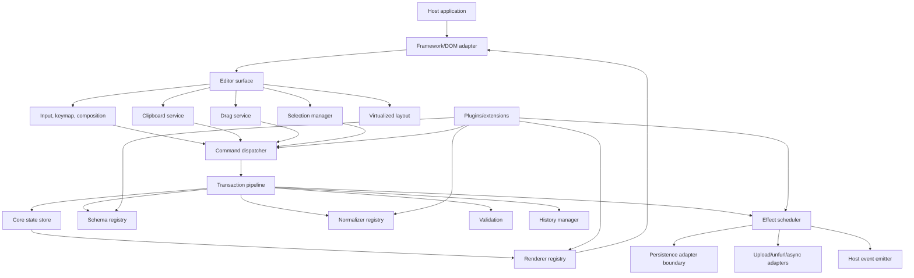
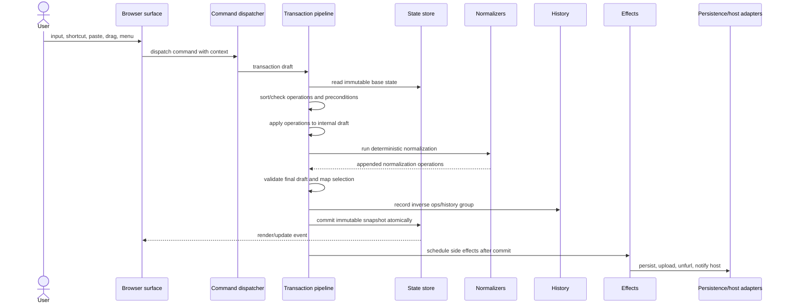

# Notion-compatible editor runtime specification

## 1. Scope and normative language

This document is a normative TypeScript/browser-only specification for the editor runtime of a Notion-compatible web editor. It defines the client-side architecture required to implement Notion-like block editing, rich text, slash commands, block selection, drag/drop, clipboard behavior, transaction processing, undo/redo, rendering, framework adapters, and persistence boundaries.

The words **MUST**, **MUST NOT**, **REQUIRED**, **SHOULD**, **SHOULD NOT**, **RECOMMENDED**, **MAY**, and **OPTIONAL** are to be interpreted as normative requirements.

This specification is intentionally limited to the browser runtime. Backend storage, server APIs, database sharding, search infrastructure, realtime protocols, and permission-service architecture are out of scope except where the browser runtime requires adapter boundaries.

The design is based on the existing research in:

- `research/notion-editor-architecture/01-data-model.md`
- `research/notion-editor-architecture/02-editor-ux-dx.md`
- `research/notion-editor-architecture/03-api-representation.md`
- `research/notion-editor-architecture/04-clone-implications.md`

Those documents establish that a Notion-compatible editor MUST treat blocks as stable, typed records in an ordered render tree; MUST support structural editing through operations batched into transactions; MUST separate rendering from editing controls; and MUST model commands, input rules, selection, drag/drop, comments, synced blocks, databases, media, embeds, and mentions as first-class editor concepts rather than incidental DOM behavior.

## 2. Goals and non-goals

### 2.1 Goals

The runtime MUST provide:

1. A deterministic core state store for block, rich-text, selection, schema, renderer, plugin, history, and pending-effect state.
2. A transaction pipeline that applies atomic operation batches, validates invariants, normalizes state, maps selections, records inverse operations, and emits deterministic events.
3. A command dispatch system shared by slash commands, keyboard shortcuts, block handles, contextual menus, mobile/toolbars, paste choices, and AI or automation surfaces.
4. A plugin and extension lifecycle for block types, renderers, normalizers, input rules, keymaps, command contributions, effects, and framework integrations.
5. A schema registry and renderer registry that allow Notion-like block types to be added without forking the editor core.
6. A browser editor surface that bridges DOM input, composition, native selection, clipboard, drag/drop, pointer/touch input, accessibility, and virtualization to the transaction layer.
7. A framework-neutral runtime with adapters for vanilla DOM, React, Vue/Svelte-style renderers, and other host frameworks.
8. Performance characteristics suitable for large pages in modern browsers.

### 2.2 Non-goals

The runtime MUST NOT require:

1. A specific backend, database, sync protocol, CRDT library, server transaction endpoint, or authentication system.
2. A specific web framework such as React, Vue, or Svelte.
3. One monolithic `contenteditable` element for the whole page.
4. Server-side execution to validate local editor invariants before the UI can update.

The runtime MAY expose optional adapters for network persistence, collaborative sync, local durable queues, IndexedDB, OPFS, or browser Cache Storage, but those adapters MUST remain replaceable and MUST NOT be hard-coded into the core editor package.

## 3. Runtime invariants

The editor runtime MUST preserve the following invariants at every committed state snapshot:

1. **Everything editable is a block or an inline value inside a block.** Paragraphs, headings, list items, to-dos, toggles, callouts, images, embeds, simple tables, columns, database views, synced blocks, pages, and rows/pages in databases MUST have stable IDs.
2. **Block identity is independent from rendering.** Turning a paragraph into a heading or to-do MUST preserve the block ID and SHOULD preserve type-specific payload fields not currently rendered.
3. **Order is data.** Sibling order, indentation, column placement, table row order, database manual order, and drop positions MUST be represented in state and changed through operations, not derived from DOM order alone.
4. **No renderer mutates canonical state directly.** Renderers, framework components, and DOM handlers MUST dispatch commands or transactions.
5. **Every state change is transactional.** User-visible mutations MUST enter through the transaction pipeline, including input rules, typing, undo/redo, paste, drag/drop, slash commands, keyboard shortcuts, and plugin actions.
6. **Selection is state.** The runtime MUST store logical selection separately from browser-native selection and MUST map it across operations.
7. **Normalization is deterministic.** Given the same base state, operation list, schema registry, plugin order, and adapter inputs, the committed state MUST be identical across runs.
8. **Side effects are not part of state mutation.** Network calls, analytics, upload starts, link unfurls, AI requests, timers, DOM focus changes, and persistence writes MUST be scheduled after state commit and MUST be idempotent or cancelable.
9. **Framework adapters are replaceable.** Core state, operation application, history, validation, and command dispatch MUST NOT depend on framework lifecycle semantics.
10. **Browser limitations are explicit.** IME composition, native selection differences, drag/drop limitations, clipboard formats, layout measurement, and mobile/touch affordances MUST be handled by browser adapters with feature detection.

## 4. Runtime module relationships



The runtime MUST be layered as follows:

1. **Core package:** State store, transactions, operations, schemas, validation, normalization, history, command dispatch, plugin lifecycle, event emitter, and effect scheduling.
2. **Browser package:** DOM surface, native input bridge, clipboard, drag/drop, selection mapping, measuring/layout, virtualization, accessibility, and browser scheduling.
3. **Framework adapter packages:** Vanilla DOM, React, Vue/Svelte-style wrappers, and any additional adapters.
4. **Block/plugin packages:** Block schemas, commands, renderers, input rules, normalizers, serializers, and optional side-effect adapters for media, embeds, link previews, buttons, databases, or AI.

## 5. Core state store

### 5.1 State shape

The store MUST maintain a canonical `EditorState` snapshot containing at least:

1. Document identity and version.
2. A block record map keyed by stable block ID.
3. Ordered child edges or child arrays for render containment.
4. Optional permission-parent or logical-parent metadata if different from render containment.
5. Rich-text payloads and inline entity references.
6. Database/data-source/view metadata if database blocks are enabled.
7. Comment anchors, mention anchors, and other durable references if those features are enabled.
8. Current logical selection.
9. Schema registry version and feature flags.
10. Plugin runtime state that is deterministic and serializable, if stored in canonical state.
11. Pending local transaction metadata when the host enables persistence or collaboration.

The store SHOULD represent blocks and edges with structural sharing so common transactions do not clone the entire page.

### 5.2 Immutable and mutable update policy

The runtime MUST expose committed `EditorState` snapshots as immutable read models. In TypeScript, public state APIs SHOULD use `Readonly`, `ReadonlyMap`, readonly arrays, and immutable value objects.

The transaction pipeline MAY use an internal mutable draft for performance, but that draft MUST NOT escape the pipeline. A renderer, command handler, plugin, normalizer, or adapter MUST NOT hold or mutate a mutable draft after the pipeline phase that created it.

Committed snapshots MUST be referentially stable for unchanged records. Consumers SHOULD be able to use `block.version`, `state.version`, or object identity to decide whether to rerender.

The runtime MUST NOT treat the DOM as source of truth. DOM state MAY be sampled for native selection, composition text, scroll positions, and measurements, but canonical document content MUST live in `EditorState`.

### 5.3 Store events

The store MUST emit events after commits, not during partial mutation. At minimum, it MUST support:

- `transaction:beforeApply`
- `transaction:committed`
- `transaction:rejected`
- `selection:changed`
- `history:changed`
- `plugin:error`
- `renderer:error`
- `effect:scheduled`
- `effect:failed`

Events MUST be delivered in deterministic order by transaction sequence. Event handlers MUST NOT mutate state directly; they MAY dispatch new transactions. Reentrant dispatch MUST be controlled by the command/transaction queue described below.

## 6. Operation model

### 6.1 Operation requirements

An `Operation` MUST be a small, typed, serializable description of a state mutation. Operations MUST NOT contain functions, DOM nodes, framework components, promises, or mutable class instances.

Every operation type MUST define:

1. Required operands.
2. Preconditions.
3. Apply semantics.
4. Inverse operation generation or explicit non-undoable status.
5. Selection mapping behavior.
6. Validation rules.
7. Normalization interactions.
8. Conflict key or affected record set for single-client conflict prevention.

Operations SHOULD be granular enough to support undo/redo, selection mapping, collaborative adaptation, and persistence queues. A single user action MAY produce many operations.

### 6.2 Required operation families

A Notion-compatible runtime MUST support these operation families, even if individual products initially implement only a subset of block types:

1. **Block lifecycle:** create, insert, remove, trash, restore, duplicate subtree.
2. **Block structure:** move before/after/inside, indent, outdent, wrap, unwrap, split, merge, create columns, rebalance columns, table row/column insert/delete.
3. **Block typing:** set block type, set block payload field, patch block payload, reset block defaults.
4. **Rich text:** insert text, delete text, replace range, split text block, merge text blocks, apply marks, remove marks, set link, insert mention, insert equation, update inline entity.
5. **Selection:** set selection, clear selection, map selection after structural changes.
6. **Databases and views:** create row page, set property value, create/update/delete property, update view configuration, reorder rows/cards where manually ordered, apply group move semantics.
7. **Comments and anchors:** create discussion, add comment, resolve/reopen discussion, remap anchor.
8. **Synced/template/button blocks:** create source, create synced copy, unsync/materialize copy, update template content, run button action as a transaction draft.
9. **Media and embeds:** create placeholder, update upload status, set file metadata, set embed URL, update unfurl payload, set auth/error state.
10. **Metadata:** set icon, cover, title, collapsed state, color, checked state, table header options, width ratios.

### 6.3 Operation ordering

Operations in a transaction MUST apply in array order. Later operations MAY reference records created by earlier operations in the same transaction.

The runtime MUST reject a transaction if operation ordering would require reading a record that is absent before its creation operation, unless the operation declares a forward reference that the pipeline can resolve deterministically.

### 6.4 Conflict prevention within one client

The editor MUST serialize transaction application within a single editor instance. Two transactions MUST NOT mutate the same base state concurrently.

The runtime MUST maintain a dispatch queue. If a command dispatches while another transaction is applying, the runtime MUST either:

1. Queue the new transaction against the post-commit state, or
2. Reject it with a deterministic `TransactionBusyError`.

The RECOMMENDED behavior is queuing for user input and rejection for plugin reentrancy bugs.

Transactions SHOULD carry `baseVersion` or affected-record versions. Before applying a queued transaction, the runtime MUST re-check command guards or operation preconditions against the current state if the base state changed.

## 7. Transaction pipeline

### 7.1 Transaction flow



### 7.2 Required pipeline order

The runtime MUST process each transaction in this order:

1. Allocate a transaction ID if absent.
2. Capture base `EditorState`, base version, and selection-before.
3. Freeze or otherwise protect the base state from mutation.
4. Resolve command output into a serializable transaction draft.
5. Sort or expand macro operations only where the operation definition explicitly allows it.
6. Check transaction-level guards: editor read-only state, plugin availability, schema availability, feature flags, command permissions known locally, and dispatch queue state.
7. Check operation preconditions against the base state and earlier draft changes.
8. Apply operations to an internal draft and compute inverse operations.
9. Run normalizers in deterministic order until no normalizer emits operations or a configured iteration limit is reached.
10. Append normalizer operations to the transaction metadata, preserving whether they are user-visible for undo.
11. Validate the final draft against schema and runtime invariants.
12. Map selection through user operations and normalization operations.
13. Determine selection-after if the transaction did not explicitly set it.
14. Decide history grouping and push inverse operations if undoable.
15. Commit the entire snapshot atomically.
16. Emit store events in deterministic order.
17. Schedule side effects.
18. Notify framework adapters to render.

A transaction MUST NOT partially commit. If any REQUIRED phase fails before commit, the base state MUST remain current and no history entry MUST be recorded.

### 7.3 Atomicity and batching

A transaction MUST be the smallest atomic unit visible to subscribers. User actions such as pressing Enter in a paragraph, converting a selection to a synced block, dragging multiple blocks into columns, accepting an AI rewrite, or pasting multi-block content MUST commit all resulting operations together or not at all.

The runtime MAY batch adjacent user inputs into one transaction for performance only if doing so preserves observable editor semantics. Typing events SHOULD usually dispatch small transactions but be grouped in history. Paste, drag/drop, slash command execution, undo, redo, and normalization MUST commit as explicit transaction boundaries.

### 7.4 Inverse operations and undo metadata

For each undoable transaction, the pipeline MUST generate inverse operations from the actual pre-commit state. Inverses MUST restore document content, structural order, block payloads, and selection where practical.

Inverse operations MUST NOT rely on querying DOM state. They MAY refer to serialized snapshots of deleted records or subtrees when required.

A transaction MAY be marked non-undoable only for state that is external or intentionally ephemeral, such as upload progress events or host-provided feature-flag changes. User document edits MUST be undoable.

### 7.5 History grouping

The runtime MUST separate transaction atomicity from history grouping.

History grouping MUST support:

1. Consecutive text insertion in the same text block and mark context.
2. IME composition as one undo group after composition commits.
3. Markdown input rules as one undoable user intent.
4. Paste as one undo group.
5. Drag/drop as one undo group.
6. Multi-block transform as one undo group.
7. Explicit group boundaries requested by commands.
8. Time-based grouping for typing, with a configurable timeout.

Undo MUST restore selection-before for the undone group unless a command declares a better deterministic selection result. Redo MUST restore selection-after.

### 7.6 Selection mapping

Every operation MUST provide selection mapping for all supported selection kinds:

- Text selection.
- Block selection.
- Gap/drop-target selection.
- Table cell selection.
- Database row/card/cell selection.
- Comment or suggestion anchors where enabled.

If an operation deletes the selected range, the selection manager MUST collapse to a deterministic nearby position. If a selected block moves, the selection SHOULD continue to reference the moved block. If a selected block is duplicated, selection SHOULD remain on the original unless the command explicitly selects the duplicate.

Normalization operations MUST also map selection. Selection mapping MUST run after operations and normalizers in the same order they were applied.

### 7.7 Normalization ordering

Normalizers MUST run after user operations and before final validation/commit. The runtime MUST define a total order:

1. Core structural normalizers.
2. Schema-required block normalizers.
3. Plugin normalizers in plugin registration order and per-plugin priority.
4. Feature-specific normalizers such as tables, columns, databases, synced blocks, comments, or media placeholders.
5. Final safety normalizers that remove impossible transient state.

Normalizers MUST be deterministic and MUST emit operations rather than mutating the draft directly unless they are implemented inside the trusted core pipeline. A normalizer MUST NOT perform network I/O, read layout, inspect the DOM, call timers, or dispatch commands.

The pipeline MUST detect infinite normalization loops. It SHOULD enforce a maximum iteration count and throw `NormalizationLoopError` with the emitted operation trace if exceeded.

### 7.8 Side effects

Side effects MUST run only after the transaction commits. Side effects include persistence writes, durable queue updates, upload starts, link unfurls, embed fetches, analytics, search indexing requests, host callbacks, focus restoration, scroll-into-view, and collaboration sync.

Side effects MUST be idempotent, cancelable, or associated with a transaction ID. If a side effect fails, the runtime MUST NOT corrupt committed editor state. It MUST emit an error event and MAY dispatch a compensating transaction if the failing effect corresponds to editor-visible status, such as upload failure.

A transaction MUST declare side-effect intents separately from operations. Operation application MUST remain pure.

### 7.9 Failure handling

The runtime MUST distinguish:

1. **Command failure:** command guard fails or command cannot produce a transaction.
2. **Precondition failure:** operation operands do not match current state.
3. **Validation failure:** final draft violates schema or invariants.
4. **Normalization failure:** normalizer throws or loops.
5. **Commit failure:** store cannot publish a snapshot.
6. **Effect failure:** post-commit side effect fails.
7. **Renderer failure:** rendering a committed state fails.
8. **Adapter failure:** framework, persistence, or host adapter fails.

Failures before commit MUST leave state unchanged. Failures after commit MUST be observable through events and error objects. Renderer failures MUST be isolated per block or surface when possible so the whole page does not become unusable.

## 8. Command dispatch

### 8.1 Command registry

The command registry MUST be the sole registry for user-invoked editor actions. Slash menus, keyboard shortcuts, block handle menus, selection action menus, toolbar buttons, mobile add menus, paste choice menus, drag/drop commands, automation buttons, and AI accept/discard flows MUST dispatch commands or transaction drafts through the same mechanism.

Commands MUST declare:

1. Stable ID.
2. Human-readable label and optional description.
3. Aliases and slash tokens.
4. Category and ranking metadata.
5. Keybindings and input triggers where applicable.
6. Context predicates.
7. Required capabilities.
8. Argument schema.
9. Whether it is undoable.
10. Handler that returns a transaction draft or an explicit no-op.

Command handlers SHOULD be synchronous. If a command requires async work, it SHOULD first dispatch a deterministic placeholder or pending state transaction, then complete through an effect-driven follow-up transaction.

### 8.2 Notion-compatible command surfaces

A Notion-compatible runtime MUST support command invocation from at least these contexts:

1. Empty text block slash insertion.
2. Non-empty block slash actions such as turn-into, color, duplicate, move, delete, comment, or AI action.
3. `+` add block surface.
4. Block handle context menu.
5. Multi-block selection action menu.
6. Keyboard shortcuts for text marks and block transforms.
7. Markdown input rules.
8. Mention and page-link triggers using `@`, `[[`, and `+` where those features are enabled.
9. Clipboard paste choices for URL, bookmark, embed, link preview, file, and raw text.
10. Mobile/touch toolbar equivalents without relying on hover or desktop slash behavior.

Command search SHOULD rank exact slash aliases first, then prefix matches, then fuzzy title/keyword matches, then recency/frequency.

### 8.3 Deterministic dispatch

For a given state and input event, command resolution MUST be deterministic. If multiple commands match a keybinding or input trigger, the registry MUST use explicit priority and registration order. Plugin order MUST be stable.

Commands MUST NOT mutate DOM or state directly. Commands MAY request focus/scroll effects by returning side-effect intents.

## 9. Plugin and extension lifecycle

### 9.1 Lifecycle phases

A plugin MUST follow this lifecycle:

1. **Constructed:** plugin object is created without editor access.
2. **Registered:** plugin metadata is validated and assigned a stable registration order.
3. **Installed:** plugin contributes schemas, commands, renderers, normalizers, serializers, input rules, keymaps, and effect handlers.
4. **Started:** plugin receives runtime context and may subscribe to events.
5. **Updated:** plugin receives configuration changes if supported.
6. **Stopped:** subscriptions, DOM listeners, timers, observers, and async tasks are cleaned up.
7. **Uninstalled:** contributions are removed only if doing so does not invalidate existing document state, or a migration is provided.

Plugin installation MUST be deterministic. A plugin MUST NOT inspect host framework internals except through adapter APIs.

### 9.2 Plugin isolation

A plugin MUST NOT mutate the core store, transaction drafts, or DOM outside the surfaces it owns. Plugin code SHOULD be wrapped in error boundaries. A throwing plugin MUST produce `PluginError`; the editor MAY disable the plugin if it repeatedly fails.

Plugin normalizers and validators MUST be pure and deterministic. Plugin renderers MAY maintain ephemeral framework state, but canonical document data MUST remain in `EditorState`.

### 9.3 Required plugin contribution types

The plugin API MUST support contributions for:

- Block schema definitions.
- Renderer definitions.
- Commands.
- Input rules.
- Keymaps.
- Normalizers.
- Validators.
- Clipboard serializers/deserializers.
- Drag/drop target providers.
- Effects.
- Migrations for schema version changes.
- Accessibility labels and descriptions.

## 10. Schema registry

The schema registry MUST define all block and inline types that may appear in committed state.

Each block type schema MUST define:

1. Block type ID.
2. Payload shape and defaults.
3. Whether it supports rich text.
4. Whether it supports children.
5. Allowed parent and child block types.
6. Type-preserving conversion behavior.
7. Required normalizers.
8. Validation rules.
9. Clipboard import/export behavior.
10. Renderer IDs for read and edit modes.
11. Capability requirements for editing.
12. Optional migration functions.

The registry MUST include unknown/unsupported handling. If state contains a block type without an installed renderer, the runtime MUST preserve its data and render a safe unsupported placeholder instead of deleting it.

The schema registry SHOULD support Notion-like block categories:

- Text and headings.
- Lists, to-dos, toggles, quotes, callouts, dividers.
- Pages and child pages.
- Databases, data sources, linked views, and row pages.
- Simple tables, table rows, columns, and column lists.
- Media, files, bookmarks, embeds, link previews.
- Synced blocks.
- Templates and buttons.
- Mentions, dates, reminders, equations, and inline links.
- Comments and suggestions if included in the product.

## 11. Renderer registry

The renderer registry MUST map schema types to renderer implementations. A renderer MUST receive immutable state inputs and callback APIs for dispatching commands. It MUST NOT receive mutable store internals.

A renderer definition MUST declare:

1. Supported block type.
2. Read-only render capability.
3. Edit render capability.
4. Whether it owns a text editor surface.
5. Whether it participates in virtualization and measurement.
6. How it exposes DOM anchors for selection and drag/drop.
7. Accessibility role, label, and keyboard behavior.
8. Error fallback behavior.
9. Serialization and hydration needs if any.

Renderer output MUST be independent from transaction application. A renderer MAY be framework-specific behind an adapter, but its runtime contract MUST remain framework-neutral.

Generated blocks such as table of contents MUST render from derived state and MUST NOT duplicate heading text as canonical content.

Embeds, link previews, media, and AI outputs MUST render loading, error, auth-required, unsupported, and offline states without blocking text input elsewhere.

## 12. Editor surface

The editor surface is the browser-facing layer that connects DOM events to logical editor actions. It MUST handle:

1. Pointer, mouse, touch, keyboard, beforeinput, input, composition, focus, blur, paste, copy, cut, drag, drop, and scroll events.
2. Native selection observation and logical selection reconciliation.
3. Block chrome: add buttons, block handles, comment icons, drag handles, selection outlines, hover/touch affordances.
4. Inline menus: slash, mention, link, color, comment, AI, and formatting menus.
5. Accessibility: roles, roving focus, screen-reader announcements, visible focus, keyboard alternatives, and touch target size.
6. Virtualized mounting and unmounting of offscreen blocks.
7. Framework adapter lifecycle.

The surface MUST NOT apply document mutations directly. It MUST translate browser events into commands, transactions, selection updates, or side-effect intents.

### 12.1 Contenteditable policy

The runtime MAY use one contenteditable per text-bearing block, a hidden input/composition buffer, or an embedded rich-text engine per block. It MUST NOT require one contenteditable for the entire page.

If contenteditable is used, the runtime MUST reconcile browser mutations immediately into transactions or prevent native mutation where appropriate. It MUST handle `beforeinput` where supported and have fallbacks for browsers with incomplete behavior.

IME composition MUST be treated as a protected input mode. Markdown triggers, slash triggers, mention triggers, and undo grouping MUST NOT fire on incomplete composition text.

### 12.2 DOM mapping

The surface MUST maintain a mapping between DOM nodes and logical positions. Mapping MUST support:

- Block ID to root element.
- Rich-text text node or inline element to text position.
- Selection handles to logical selection.
- Drop guide to `DropTarget`.
- Virtualized placeholder to estimated block range.

DOM mapping MUST be invalidated when blocks unmount, rerender, or change versions.

## 13. Selection manager

The selection manager MUST own logical selection and native-browser selection bridging.

It MUST support at least:

1. `TextSelection` for caret/range positions inside rich-text-capable blocks.
2. `BlockSelection` for one or more whole blocks in document order.
3. `GapSelection` or `DropSelection` for positions before/after/inside blocks.
4. `CellSelection` for simple tables and database cells where enabled.
5. `RowSelection` or `CardSelection` for database views where enabled.
6. `NullSelection` for blur/read-only states.

The manager MUST define deterministic transitions for Notion-like behavior:

- `Esc` from text selects the current block; `Esc` from block selection clears or blurs according to host policy.
- `Enter` from block selection edits or opens according to block type.
- Arrow keys move block selection when in block-selection mode.
- Shift plus arrows/click extends range selection.
- Delete/backspace over a block selection deletes selected blocks through a transaction.
- Desktop multi-block selection and mobile limitations MUST be configurable by adapter capabilities.

The selection manager MUST preserve selection visibility independent of native selection when whole blocks are selected.

## 14. Clipboard service

The clipboard service MUST mediate copy, cut, and paste. It MUST support at least:

1. Plain text.
2. Sanitized HTML.
3. Internal structured editor fragment format.
4. Files and images from clipboard where browsers expose them.
5. URLs with paste-choice classification.
6. Rich text marks, links, mentions, equations, and comments/anchors where supported.
7. Multi-block fragments preserving block IDs only when semantically safe; pasted copies normally MUST receive new block IDs.

The internal fragment format MUST be versioned and SHOULD include schemas needed to reconstruct unknown blocks safely.

Paste MUST be transactional. A paste that inserts multiple blocks, uploads placeholders, creates a bookmark, or converts a URL to an embed MUST commit the placeholder state atomically and schedule async side effects afterward.

Clipboard HTML MUST be sanitized before parsing. The runtime MUST NOT execute scripts, event handlers, remote resources, or unsafe styles from pasted content.

Cut MUST be implemented as copy plus a document transaction. If copy fails, cut MUST NOT delete content.

## 15. Drag service

The drag service MUST compute semantic drop targets, not merely DOM insertion points.

A `DropTarget` MUST identify:

- Destination parent or view.
- Position before, after, inside, side-by-side, table cell, database group, page/sidebar target, or external file target.
- Whether the action is move, copy, upload, link, or unsupported.
- Schema validity.
- Required capabilities.
- Visual guide geometry.

Drag/drop MUST dispatch transactions using the same operation model as keyboard move, indent/outdent, duplicate, and menu move commands.

The drag service MUST reject dragging a block into its descendant. It MUST preserve subtree identity for moves and generate new IDs for copies unless the command explicitly creates synced copies.

Holding Option/Alt during drag SHOULD duplicate selected blocks where the platform exposes the modifier. Touch adapters SHOULD expose an equivalent duplicate affordance.

Database row/card drops MUST distinguish manual ordering from sorted/filtered/grouped projections. Dropping into a grouped board MAY update the grouping property and manual order in one transaction if schema permits; otherwise it MUST reject with a user-visible reason.

## 16. History, undo, and redo

The history manager MUST store undo and redo stacks as transaction groups with inverse operations and selection snapshots. It SHOULD store inverse operations, deleted-record snapshots, and metadata rather than full document snapshots for every edit.

Undo/redo MUST dispatch through the transaction pipeline. Undo MUST be atomic: the entire group reverts or nothing changes.

The history manager MUST clear redo entries when a new user-editing transaction commits after undo, unless the new transaction is explicitly marked as history-neutral.

History MUST be scoped by editor instance/document. A host MAY persist history across reloads, but the core runtime MUST NOT require persisted history.

The runtime SHOULD cap history by operation count, memory size, or time. It MUST dispose snapshots and plugin metadata when evicted.

Remote/persistence acknowledgments MUST NOT create undo items. Async status updates MAY be history-neutral unless they alter user-authored content.

## 17. Normalization and validation

### 17.1 Normalization requirements

The runtime MUST normalize after every committed user edit. Required normalization rules include:

1. No cycles in the render tree.
2. No duplicate child edges for the same child.
3. Every child edge references existing blocks.
4. Every block except the document root has a valid parent or explicit detached/trash state.
5. Blocks appear only under allowed parents.
6. Child-support constraints are enforced.
7. Column blocks appear only under column lists.
8. Column lists have valid columns according to schema; creation SHOULD require at least two non-empty columns for Notion compatibility.
9. Simple table rows match table width.
10. Rich-text spans are merged or split so marks/entities are valid and deterministic.
11. Inline mentions, dates, equations, and links have valid payloads.
12. Synced block references do not create cycles.
13. Database property values conform to data-source schema where database support is enabled.
14. Selection is remapped to an existing valid position.

Normalizers SHOULD preserve user content whenever possible. If content must be moved to preserve validity, the move MUST be deterministic and SHOULD be observable in debug metadata.

### 17.2 Validation requirements

Validation MUST run after normalization. Validation MUST reject committed states that violate hard invariants. Validation errors MUST identify affected operation index, block ID, path, schema ID, and human-readable message where possible.

Validation MUST NOT perform async I/O. Permission checks that require backend authority are out of scope for core validation, but local capability checks MAY be performed if capability data is present in state.

## 18. Effects and persistence adapter boundaries

### 18.1 Effect scheduler

The effect scheduler MUST run after commit and MUST receive transaction ID, committed state version, side-effect intents, and cancellation context.

Effects SHOULD be prioritized:

1. Critical UI effects: focus restoration, native selection sync, scroll into view.
2. Durable local persistence or transaction queue writes.
3. Upload/unfurl/embed starts.
4. Host notifications and analytics.
5. Idle indexing, metrics, and cleanup.

Effects that read layout MUST be scheduled in browser read phases. Effects that write DOM MUST be scheduled in write phases to avoid layout thrashing.

### 18.2 Persistence adapter boundary

The core runtime MAY expose a `PersistenceAdapter`, but it MUST treat it as an adapter boundary. The adapter MAY write to IndexedDB, OPFS, localStorage for tiny metadata, browser Cache Storage, a service worker, or a host network client.

The core runtime MUST NOT assume server acceptance. A persistence adapter MAY later report accepted, rejected, rebased, or failed transactions. Those reports MUST enter the editor as explicit transactions or status events.

Persistence adapter methods MUST accept serialized transactions and snapshots, not DOM nodes or framework components.

If persistence write fails after local commit, the editor MUST retain the local committed state and surface persistence status. Products that require strict durable-before-visible semantics MAY configure transactions to wait for local durable queue write before publishing to the UI, but that behavior MUST be explicit because it can increase input latency.

### 18.3 Browser-only boundaries

The runtime MUST run in modern browsers without Node.js APIs. Browser packages MUST avoid server-only globals such as `fs`, `process`, or native modules.

Workers MAY be used for heavy parsing, import/export, indexing, formula evaluation, or large normalization checks. Worker messages MUST use structured-clone-safe values.

## 19. Framework integration patterns

### 19.1 Vanilla DOM adapter

A vanilla DOM adapter MUST be able to mount the editor into an `HTMLElement`, create and update block DOM nodes, attach browser event listeners, and unmount cleanly.

It SHOULD be the reference adapter because it demonstrates that the core runtime is framework-neutral.

A vanilla adapter MAY use imperative renderer objects with `mount`, `update`, and `unmount` methods.

### 19.2 React adapter

A React adapter SHOULD expose hooks and components such as:

- `EditorProvider`.
- `useEditor`.
- `useEditorState(selector)`.
- `BlockRenderer`.
- `EditableSurface`.

React adapters MUST avoid rerendering the entire page for each transaction. They SHOULD subscribe by block ID, state selector, or virtualized viewport. They MUST clean up subscriptions under Strict Mode double-invocation.

React renderers MUST dispatch commands instead of mutating state. Error boundaries SHOULD isolate block renderer failures.

### 19.3 Vue/Svelte-style adapters

Vue and Svelte adapters SHOULD map immutable editor snapshots into fine-grained reactive stores. They MUST avoid making canonical state mutable through framework proxies. They SHOULD expose derived stores for selection, visible blocks, block records, commands, and history state.

Adapters MUST treat lifecycle cleanup as REQUIRED: subscriptions, observers, timers, and DOM mappings MUST be removed when components unmount.

### 19.4 Adapter independence

No block schema, operation, transaction, history item, or normalizer MAY depend on React component identity, Vue proxy identity, Svelte store identity, or DOM node identity.

Framework adapters MAY provide renderer bindings, but the renderer registry MUST retain a framework-neutral descriptor.

## 20. Performance requirements

### 20.1 Large-page requirements

The runtime MUST be designed for pages with at least 10,000 blocks, deeply nested toggles/lists, media placeholders, comments, and embedded database views.

The editor MUST NOT mount all blocks in the DOM for large pages. It MUST support virtualization or lazy rendering with overscan. Offscreen blocks SHOULD be represented by lightweight placeholders with estimated heights.

Collapsed toggles, closed pages, hidden database rows, filtered view items, and offscreen blocks MUST NOT instantiate heavy editors or media renderers until needed.

### 20.2 Rendering and scheduling

The browser surface MUST separate read and write phases for layout. It SHOULD use:

- `requestAnimationFrame` for visual DOM writes and selection overlay updates.
- `ResizeObserver` for block size changes.
- `IntersectionObserver` where useful for lazy media/renderers.
- `requestIdleCallback` or scheduler fallbacks for non-critical work.
- Web Workers for expensive parsing/import/export/indexing where practical.

The runtime MUST avoid forced synchronous layout in input handlers. Measurements SHOULD be cached by block ID and version. A transaction that only changes one block SHOULD NOT require measuring unrelated blocks synchronously.

### 20.3 Avoiding input jank

Typing, selection movement, checkbox toggles, and simple block commands MUST remain responsive while persistence, uploads, link unfurls, embeds, or indexing are pending.

Input handlers SHOULD finish within 8 ms on a modern laptop for common text edits and MUST avoid long tasks over 50 ms in routine editing paths. If work cannot fit, it SHOULD be split across frames or workers.

Rendering after a common text transaction SHOULD paint within the next animation frame. Slow block renderers MUST be isolated and MAY render placeholders.

### 20.4 Memory requirements

The runtime SHOULD bound memory through:

1. Structural sharing for immutable state snapshots.
2. History compaction and eviction.
3. Lazy renderer/editor instantiation.
4. Disposal of offscreen DOM, observers, and subscriptions.
5. Deduplication of schema, command, and renderer metadata.
6. Optional chunked loading of blocks from persistence adapters.

A test implementation SHOULD target under 150 MB additional heap for a cached 10,000 simple-block page with a virtualized viewport on a modern desktop browser. Products with heavier plugins MUST document their own budgets.

### 20.5 Testing thresholds

The runtime SHOULD include automated benchmarks for at least:

1. Typing 1,000 characters in one paragraph.
2. Splitting and merging paragraphs.
3. Moving 1, 10, and 100 selected blocks.
4. Pasting 100 blocks.
5. Rendering a 10,000-block page with only the viewport mounted.
6. Scrolling a mixed 10,000-block page.
7. Opening/closing a toggle containing 1,000 descendants.
8. Undoing and redoing a multi-block paste.
9. Running normalizers on tables, columns, and synced blocks.
10. Mounting/unmounting framework adapters repeatedly without leaks.

Recommended thresholds for a reference implementation on a mid-tier modern laptop:

- Common text transaction apply time: p95 under 8 ms.
- Selection move/update: p95 under 8 ms.
- Move 100 simple blocks: p95 under 50 ms.
- Paste 100 simple blocks: p95 under 100 ms before async effects.
- Initial viewport render from cached state: p95 under 500 ms.
- Sustained scroll: p95 frames under 16.7 ms with no repeated long tasks.
- Undo/redo of 100-block paste: p95 under 100 ms.

These thresholds are SHOULD-level because plugins and host devices vary, but every product MUST define and continuously test equivalent budgets.

## 21. Error handling and deterministic behavior

### 21.1 Error requirements

All public runtime errors MUST be structured `EditorError` values with stable codes. Error objects MUST include transaction ID, operation index, plugin ID, block ID, schema ID, renderer ID, or adapter ID where applicable.

The runtime MUST NOT throw untyped strings. Internal thrown exceptions MUST be wrapped before crossing public API boundaries.

Renderer and plugin errors MUST be isolated where possible. A failing block renderer SHOULD render an error fallback for that block while preserving editing for other blocks.

### 21.2 Determinism requirements

For deterministic behavior, the runtime MUST ensure:

1. Stable plugin registration order.
2. Stable command priority resolution.
3. Stable normalizer ordering.
4. Stable operation application order.
5. Stable ID generation through injected deterministic ID providers in tests.
6. Stable clock access through an injected clock in tests.
7. Stable sorting with explicit tie-breakers.
8. No dependency on object key iteration where key order is not defined by the data model.
9. No async I/O inside validation or normalization.
10. No reading current DOM layout inside operation application.

Random IDs and timestamps MAY be used in production, but test harnesses MUST be able to inject deterministic providers.

## 22. TypeScript interfaces

The following interfaces define the minimum public contract. Implementations MAY add fields, generic parameters, and narrower operation unions, but MUST preserve these concepts.

```ts
export type BlockId = string;
export type TransactionId = string;
export type PluginId = string;
export type RendererId = string;
export type SchemaId = string;
export type CommandId = string;
export type Version = number;

export interface Disposable {
  dispose(): void;
}

export interface Subscription {
  readonly closed: boolean;
  unsubscribe(): void;
}

export interface EventEmitter<Events extends Record<string, unknown>> {
  on<K extends keyof Events>(type: K, handler: (event: Events[K]) => void): Subscription;
  once<K extends keyof Events>(type: K, handler: (event: Events[K]) => void): Subscription;
  off<K extends keyof Events>(type: K, handler: (event: Events[K]) => void): void;
  emit<K extends keyof Events>(type: K, event: Events[K]): void;
}

export interface EditorEvents {
  'transaction:beforeApply': { transaction: Transaction; state: EditorState };
  'transaction:committed': { transaction: Transaction; before: EditorState; after: EditorState };
  'transaction:rejected': { transaction: Transaction; error: EditorError; state: EditorState };
  'selection:changed': { selection: EditorSelection; transactionId?: TransactionId };
  'history:changed': { canUndo: boolean; canRedo: boolean };
  'plugin:error': { pluginId: PluginId; error: EditorError };
  'renderer:error': { rendererId: RendererId; blockId?: BlockId; error: EditorError };
  'effect:scheduled': { transactionId: TransactionId; effect: EffectIntent };
  'effect:failed': { transactionId: TransactionId; effect: EffectIntent; error: EditorError };
}

export interface Editor {
  readonly id: string;
  readonly events: EventEmitter<EditorEvents>;
  getState(): EditorState;
  dispatch(transaction: TransactionInput): TransactionResult;
  dispatchCommand<TArgs = unknown>(commandId: CommandId, args?: TArgs): TransactionResult;
  canExecute<TArgs = unknown>(commandId: CommandId, args?: TArgs): boolean;
  focus(selection?: EditorSelection): void;
  blur(): void;
  setSelection(selection: EditorSelection, options?: SelectionOptions): TransactionResult;
  undo(): TransactionResult;
  redo(): TransactionResult;
  registerPlugin(plugin: Plugin): Disposable;
  registerRenderer(renderer: Renderer): Disposable;
  registerCommand(command: Command): Disposable;
  registerNormalizer(normalizer: Normalizer): Disposable;
  destroy(): void;
}

export interface EditorState {
  readonly documentId: string;
  readonly version: Version;
  readonly schemaVersion: Version;
  readonly rootBlockId: BlockId;
  readonly blocks: ReadonlyMap<BlockId, BlockRecord>;
  readonly childIndex: ReadonlyMap<BlockId, readonly ChildEdge[]>;
  readonly selection: EditorSelection;
  readonly capabilities: ReadonlySet<string>;
  readonly featureFlags: ReadonlyMap<string, boolean>;
  readonly pluginState: ReadonlyMap<PluginId, unknown>;
  readonly pendingTransactions: readonly Transaction[];
}

export interface BlockRecord<TPayload = unknown> {
  readonly id: BlockId;
  readonly type: string;
  readonly payload: Readonly<TPayload>;
  readonly parentId: BlockId | null;
  readonly parentKind: 'document' | 'block' | 'page' | 'data_source' | 'detached' | 'trash';
  readonly version: Version;
  readonly inTrash: boolean;
  readonly createdAt?: number;
  readonly updatedAt?: number;
}

export interface ChildEdge {
  readonly parentId: BlockId;
  readonly childId: BlockId;
  readonly orderKey: string;
}

export type EditorSelection =
  | NullSelection
  | TextSelection
  | BlockSelection
  | GapSelection
  | CellSelection
  | RowSelection;

export interface NullSelection {
  readonly kind: 'null';
}

export interface TextSelection {
  readonly kind: 'text';
  readonly anchor: TextPoint;
  readonly focus: TextPoint;
}

export interface TextPoint {
  readonly blockId: BlockId;
  readonly path: readonly (string | number)[];
  readonly offset: number;
}

export interface BlockSelection {
  readonly kind: 'block';
  readonly anchorBlockId: BlockId;
  readonly focusBlockId: BlockId;
  readonly blockIds: readonly BlockId[];
}

export interface GapSelection {
  readonly kind: 'gap';
  readonly parentId: BlockId;
  readonly beforeBlockId?: BlockId;
  readonly afterBlockId?: BlockId;
}

export interface CellSelection {
  readonly kind: 'cell';
  readonly tableBlockId: BlockId;
  readonly anchor: CellCoord;
  readonly focus: CellCoord;
}

export interface RowSelection {
  readonly kind: 'row';
  readonly viewId: string;
  readonly rowIds: readonly BlockId[];
}

export interface CellCoord {
  readonly row: number;
  readonly column: number;
}

export interface SelectionOptions {
  readonly scrollIntoView?: boolean;
  readonly focusSurface?: boolean;
  readonly origin?: string;
}

export interface TransactionInput {
  readonly id?: TransactionId;
  readonly operations: readonly Operation[];
  readonly selectionBefore?: EditorSelection;
  readonly selectionAfter?: EditorSelection;
  readonly meta?: TransactionMeta;
  readonly effects?: readonly EffectIntent[];
}

export interface Transaction {
  readonly id: TransactionId;
  readonly baseVersion: Version;
  readonly createdAt: number;
  readonly operations: readonly Operation[];
  readonly normalizationOperations: readonly Operation[];
  readonly inverseOperations: readonly Operation[];
  readonly selectionBefore: EditorSelection;
  readonly selectionAfter: EditorSelection;
  readonly meta: TransactionMeta;
  readonly effects: readonly EffectIntent[];
  readonly status: 'draft' | 'committed' | 'rejected' | 'undone' | 'redone';
}

export interface TransactionMeta {
  readonly origin?: 'keyboard' | 'pointer' | 'paste' | 'drop' | 'command' | 'input-rule' | 'history' | 'plugin' | 'adapter';
  readonly commandId?: CommandId;
  readonly pluginId?: PluginId;
  readonly historyGroup?: string;
  readonly undoable?: boolean;
  readonly addToHistory?: boolean;
  readonly timestamp?: number;
  readonly labels?: readonly string[];
}

export type TransactionResult =
  | { readonly ok: true; readonly transaction: Transaction; readonly state: EditorState }
  | { readonly ok: false; readonly error: EditorError; readonly state: EditorState };

export type Operation =
  | CreateBlockOperation
  | InsertBlockOperation
  | MoveBlockOperation
  | RemoveBlockOperation
  | SetBlockTypeOperation
  | PatchBlockOperation
  | ReplaceTextOperation
  | MarkTextOperation
  | SplitBlockOperation
  | MergeBlockOperation
  | SetSelectionOperation
  | SetPropertyOperation
  | CustomOperation;

export interface OperationBase {
  readonly op: string;
  readonly id?: string;
  readonly meta?: Record<string, unknown>;
}

export interface CreateBlockOperation extends OperationBase {
  readonly op: 'create_block';
  readonly block: BlockRecord;
}

export interface InsertBlockOperation extends OperationBase {
  readonly op: 'insert_block';
  readonly parentId: BlockId;
  readonly childId: BlockId;
  readonly orderKey?: string;
  readonly beforeBlockId?: BlockId;
  readonly afterBlockId?: BlockId;
}

export interface MoveBlockOperation extends OperationBase {
  readonly op: 'move_block';
  readonly blockId: BlockId;
  readonly toParentId: BlockId;
  readonly beforeBlockId?: BlockId;
  readonly afterBlockId?: BlockId;
  readonly orderKey?: string;
}

export interface RemoveBlockOperation extends OperationBase {
  readonly op: 'remove_block';
  readonly blockId: BlockId;
  readonly mode: 'detach' | 'trash' | 'delete';
}

export interface SetBlockTypeOperation extends OperationBase {
  readonly op: 'set_block_type';
  readonly blockId: BlockId;
  readonly blockType: string;
  readonly defaults?: Record<string, unknown>;
}

export interface PatchBlockOperation extends OperationBase {
  readonly op: 'patch_block';
  readonly blockId: BlockId;
  readonly patch: Record<string, unknown>;
}

export interface ReplaceTextOperation extends OperationBase {
  readonly op: 'replace_text';
  readonly blockId: BlockId;
  readonly path: readonly (string | number)[];
  readonly from: number;
  readonly to: number;
  readonly insert: readonly RichTextSpan[];
}

export interface MarkTextOperation extends OperationBase {
  readonly op: 'mark_text';
  readonly blockId: BlockId;
  readonly range: TextRange;
  readonly marks: RichTextMarks;
  readonly mode: 'add' | 'remove' | 'toggle' | 'replace';
}

export interface SplitBlockOperation extends OperationBase {
  readonly op: 'split_block';
  readonly blockId: BlockId;
  readonly at: TextPoint;
  readonly newBlockId: BlockId;
}

export interface MergeBlockOperation extends OperationBase {
  readonly op: 'merge_block';
  readonly fromBlockId: BlockId;
  readonly intoBlockId: BlockId;
}

export interface SetSelectionOperation extends OperationBase {
  readonly op: 'set_selection';
  readonly selection: EditorSelection;
}

export interface SetPropertyOperation extends OperationBase {
  readonly op: 'set_property';
  readonly pageId: BlockId;
  readonly dataSourceId: string;
  readonly propertyId: string;
  readonly value: unknown;
}

export interface CustomOperation extends OperationBase {
  readonly op: `custom:${string}`;
  readonly payload: unknown;
}

export interface TextRange {
  readonly anchor: TextPoint;
  readonly focus: TextPoint;
}

export interface RichTextSpan {
  readonly type: 'text' | 'mention' | 'equation' | 'inline_custom';
  readonly text?: string;
  readonly marks?: RichTextMarks;
  readonly href?: string | null;
  readonly payload?: unknown;
}

export interface RichTextMarks {
  readonly bold?: boolean;
  readonly italic?: boolean;
  readonly underline?: boolean;
  readonly strikethrough?: boolean;
  readonly code?: boolean;
  readonly color?: string;
}

export interface Command<TArgs = unknown> {
  readonly id: CommandId;
  readonly label: string;
  readonly description?: string;
  readonly aliases?: readonly string[];
  readonly category?: string;
  readonly keybindings?: readonly Keybinding[];
  readonly priority?: number;
  readonly capabilities?: readonly string[];
  isEnabled(context: CommandContext, args?: TArgs): boolean;
  run(context: CommandContext, args?: TArgs): TransactionInput | null;
}

export interface CommandContext {
  readonly editor: Editor;
  readonly state: EditorState;
  readonly selection: EditorSelection;
  readonly surface?: EditorSurface;
  readonly source: 'keyboard' | 'pointer' | 'paste' | 'drop' | 'menu' | 'input-rule' | 'api';
}

export interface Keybinding {
  readonly key: string;
  readonly platform?: 'mac' | 'windows' | 'linux' | 'ios' | 'android' | 'all';
  readonly when?: string;
}

export interface Plugin<TOptions = unknown> {
  readonly id: PluginId;
  readonly version: string;
  readonly options?: TOptions;
  setup(context: PluginContext): PluginCleanup | void;
  commands?(): readonly Command[];
  renderers?(): readonly Renderer[];
  normalizers?(): readonly Normalizer[];
  schemas?(): readonly BlockSchema[];
  inputRules?(): readonly InputRule[];
  keymaps?(): readonly Keybinding[];
}

export type PluginCleanup = Disposable | (() => void);

export interface PluginContext {
  readonly editor: Editor;
  readonly events: EventEmitter<EditorEvents>;
  readonly registerCommand: (command: Command) => Disposable;
  readonly registerRenderer: (renderer: Renderer) => Disposable;
  readonly registerNormalizer: (normalizer: Normalizer) => Disposable;
  readonly scheduleEffect: (effect: EffectIntent) => void;
}

export interface Renderer<TBlock extends BlockRecord = BlockRecord> {
  readonly id: RendererId;
  readonly blockType: string;
  readonly mode: 'read' | 'edit' | 'both';
  readonly supportsVirtualization?: boolean;
  mount(context: RendererContext<TBlock>): RendererInstance;
}

export interface RendererContext<TBlock extends BlockRecord = BlockRecord> {
  readonly editor: Editor;
  readonly state: EditorState;
  readonly block: TBlock;
  readonly host: HTMLElement;
  readonly dispatch: (transaction: TransactionInput) => TransactionResult;
  readonly dispatchCommand: <TArgs = unknown>(commandId: CommandId, args?: TArgs) => TransactionResult;
}

export interface RendererInstance extends Disposable {
  update(context: RendererContext): void;
  measure?(): BlockMeasurement;
  focus?(selection?: EditorSelection): void;
}

export interface BlockMeasurement {
  readonly blockId: BlockId;
  readonly width: number;
  readonly height: number;
  readonly baseline?: number;
}

export interface Adapter {
  readonly id: string;
  readonly kind: 'vanilla-dom' | 'react' | 'vue' | 'svelte' | 'custom';
  mount(editor: Editor, host: HTMLElement, options?: AdapterOptions): Disposable;
  scheduleRender?(reason: RenderReason): void;
  createRendererHost?(blockId: BlockId): HTMLElement;
}

export interface AdapterOptions {
  readonly readOnly?: boolean;
  readonly virtualized?: boolean;
  readonly overscan?: number;
}

export interface RenderReason {
  readonly transactionId?: TransactionId;
  readonly changedBlockIds?: readonly BlockId[];
  readonly selectionChanged?: boolean;
}

export interface Normalizer {
  readonly id: string;
  readonly priority?: number;
  normalize(context: NormalizerContext): readonly Operation[];
}

export interface NormalizerContext {
  readonly state: EditorState;
  readonly transaction: Transaction;
  readonly changedBlockIds: readonly BlockId[];
  readonly schema: SchemaRegistry;
}

export interface BlockSchema<TPayload = unknown> {
  readonly type: string;
  readonly version: Version;
  readonly defaultPayload: TPayload;
  readonly supportsChildren: boolean;
  readonly supportsRichText?: boolean;
  readonly allowedParents?: readonly string[];
  readonly allowedChildren?: readonly string[];
  validate(block: BlockRecord<TPayload>, state: EditorState): readonly ValidationIssue[];
}

export interface SchemaRegistry {
  get(type: string): BlockSchema | undefined;
  has(type: string): boolean;
  list(): readonly BlockSchema[];
}

export interface InputRule {
  readonly id: string;
  readonly priority?: number;
  match(context: InputRuleContext): InputRuleMatch | null;
  run(context: InputRuleContext, match: InputRuleMatch): TransactionInput | null;
}

export interface InputRuleContext {
  readonly editor: Editor;
  readonly state: EditorState;
  readonly selection: EditorSelection;
  readonly textBefore: string;
  readonly inputType: string;
  readonly composing: boolean;
}

export interface InputRuleMatch {
  readonly from: TextPoint;
  readonly to: TextPoint;
  readonly data?: unknown;
}

export interface EditorSurface extends Disposable {
  readonly root: HTMLElement;
  readNativeSelection(): EditorSelection | null;
  writeNativeSelection(selection: EditorSelection): void;
  scrollSelectionIntoView(selection: EditorSelection): void;
}

export interface EffectIntent {
  readonly type: string;
  readonly id?: string;
  readonly payload?: unknown;
  readonly priority?: 'critical' | 'normal' | 'idle';
}

export interface ValidationIssue {
  readonly code: string;
  readonly message: string;
  readonly blockId?: BlockId;
  readonly path?: readonly (string | number)[];
}
```

### 22.1 Error types

```ts
export type EditorErrorCode =
  | 'COMMAND_DISABLED'
  | 'TRANSACTION_BUSY'
  | 'PRECONDITION_FAILED'
  | 'VALIDATION_FAILED'
  | 'NORMALIZATION_FAILED'
  | 'NORMALIZATION_LOOP'
  | 'COMMIT_FAILED'
  | 'PLUGIN_FAILED'
  | 'RENDERER_FAILED'
  | 'ADAPTER_FAILED'
  | 'PERSISTENCE_FAILED'
  | 'INVARIANT_VIOLATION'
  | 'UNSUPPORTED_SCHEMA'
  | 'SELECTION_MAPPING_FAILED';

export interface EditorError extends Error {
  readonly name: string;
  readonly code: EditorErrorCode;
  readonly severity: 'info' | 'warning' | 'recoverable' | 'fatal';
  readonly transactionId?: TransactionId;
  readonly operationIndex?: number;
  readonly blockId?: BlockId;
  readonly pluginId?: PluginId;
  readonly rendererId?: RendererId;
  readonly adapterId?: string;
  readonly schemaId?: SchemaId;
  readonly cause?: unknown;
  readonly details?: Record<string, unknown>;
}

export class TransactionError extends Error implements EditorError {
  readonly name = 'TransactionError';
  constructor(
    readonly code: EditorErrorCode,
    message: string,
    readonly severity: EditorError['severity'] = 'recoverable',
    readonly details?: Record<string, unknown>,
    readonly cause?: unknown,
  ) {
    super(message);
  }
}

export class ValidationError extends TransactionError {
  readonly name = 'ValidationError';
  constructor(message: string, details?: Record<string, unknown>, cause?: unknown) {
    super('VALIDATION_FAILED', message, 'recoverable', details, cause);
  }
}

export class NormalizationLoopError extends TransactionError {
  readonly name = 'NormalizationLoopError';
  constructor(message: string, details?: Record<string, unknown>, cause?: unknown) {
    super('NORMALIZATION_LOOP', message, 'fatal', details, cause);
  }
}

export class PluginError extends TransactionError {
  readonly name = 'PluginError';
  constructor(readonly pluginId: PluginId, message: string, details?: Record<string, unknown>, cause?: unknown) {
    super('PLUGIN_FAILED', message, 'recoverable', details, cause);
  }
}

export class RendererError extends TransactionError {
  readonly name = 'RendererError';
  constructor(readonly rendererId: RendererId, message: string, details?: Record<string, unknown>, cause?: unknown) {
    super('RENDERER_FAILED', message, 'recoverable', details, cause);
  }
}

export class PersistenceError extends TransactionError {
  readonly name = 'PersistenceError';
  constructor(message: string, details?: Record<string, unknown>, cause?: unknown) {
    super('PERSISTENCE_FAILED', message, 'warning', details, cause);
  }
}
```

## 23. Minimum conformance checklist

A browser implementation conforms to this specification only if it satisfies all MUST-level requirements above and provides:

1. Immutable public `EditorState` snapshots.
2. Atomic transaction dispatch with inverse operations and history grouping.
3. Deterministic operation application, normalization, validation, and selection mapping.
4. Command registry shared across slash menu, keymaps, menus, input rules, clipboard, drag/drop, and toolbars.
5. Plugin lifecycle with cleanup and deterministic contribution ordering.
6. Schema and renderer registries with unsupported-block preservation.
7. Browser selection, clipboard, drag/drop, IME, and accessibility handling.
8. Virtualized or lazy rendering for large pages.
9. Framework-neutral adapter boundary with at least one concrete browser adapter.
10. Structured errors and event subscriptions.
11. Persistence adapter boundary that does not hard-code backend/database architecture.
12. Benchmarks or tests covering large pages, transactions, selection, history, adapters, and normalization.
