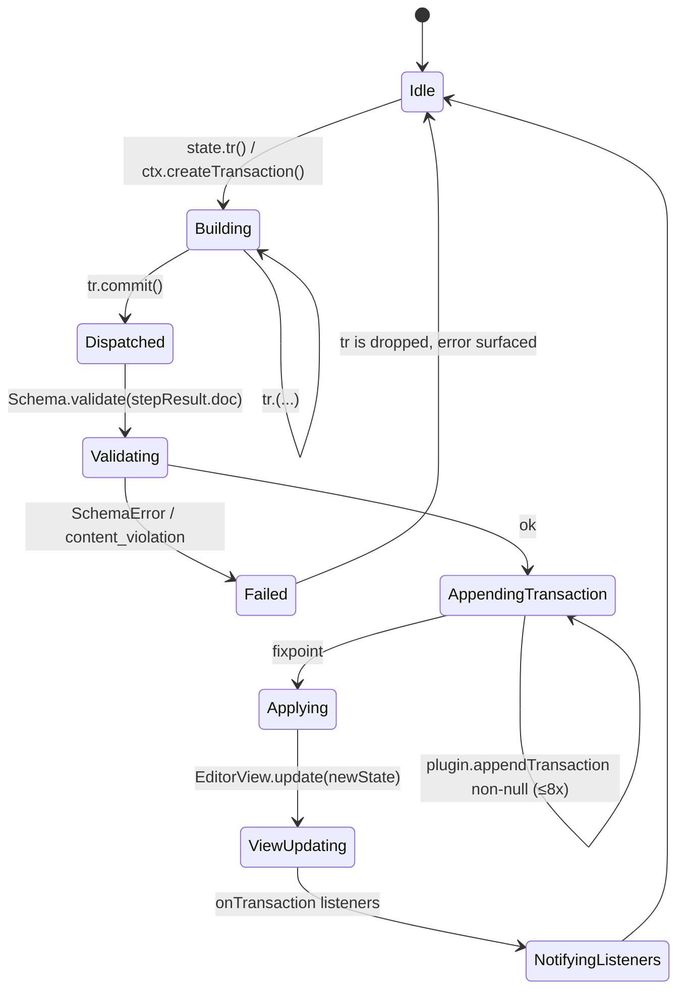

# Plim Architecture — Schema & State

> Status: **Authoritative spec, design phase**. Companion to:
> - [`00-overview.md`](./00-overview.md) — primitives & data flow
> - [`02-view-and-dom.md`](./02-view-and-dom.md) — DOM observer, parser, ViewDesc
> - [`03-actions-and-triggers.md`](./03-actions-and-triggers.md) — actions, triggers, validation rule wiring
> - [`04-input-and-paste.md`](./04-input-and-paste.md) — InputRule / PasteRule plugins
> - [`05-extensions.md`](./05-extensions.md) — `ExtensionManager`, registration order
> - [`06-history-and-snapshots.md`](./06-history-and-snapshots.md) — `Step.invert`, `Snapshot`
> - [`08-packages-and-migration.md`](./08-packages-and-migration.md) — `@plim/model` migration tables
>
> **Inspiration only** from ProseMirror's state/view/transform separation. We do **not** import ProseMirror at runtime. Names below are normative — see [`00-overview.md` §4](./00-overview.md#4-core-primitives-canonical-names).

---

## 0. Reading map

This doc covers the **lower half** of the architecture diagram in `00-overview.md` — everything from `Schema` down to the bridge to `@plim/model`. It is divided into:

| § | Topic |
|---|-------|
| 1 | `BlockSpec` / `MarkSpec` (the result of `defineBlock` / `defineMark`) |
| 2 | Content expressions — Plim's mini-grammar |
| 3 | `Schema` — the assembled, immutable contract |
| 4 | `EditorState` — exact shape, `apply`, `reconfigure`, JSON |
| 5 | `Document` & Selection model — bridge to `@plim/model`, positions, `ResolvedPosition`, `Selection` variants |
| 6 | `Transaction` — chained builder, all wishlist methods |
| 7 | `Step` — every concrete subclass, `apply`/`invert`/`map`/`merge`/JSON |
| 8 | `Mapping` — `MapResult`, `appendMap`, `invert` |
| 9 | `Plugin` contract |
| 10 | Validation rules registry |
| 11 | Bridge to `@plim/model` — Operation → Step migration table |

---

## 1. `BlockSpec` & `MarkSpec`

### 1.1 Public factory functions

`defineBlock` and `defineMark` are pure functions that return frozen `BlockSpec` / `MarkSpec` records. They do **not** register anything globally — registration happens when an `Extension` (or the top-level `PlimDriver` config) hands the spec to the `ExtensionManager`. This makes specs trivially testable and serializable.

```ts
// @plim/core
export function defineBlock<A extends BlockAttrs = {}>(spec: BlockSpecInput<A>): BlockSpec<A>;
export function defineMark<A extends MarkAttrs = {}>(spec: MarkSpecInput<A>): MarkSpec<A>;
```

### 1.2 `BlockSpec`

```ts
export interface BlockSpec<A extends BlockAttrs = BlockAttrs> {
  /** Unique block name. Must be a valid identifier `[a-z][a-z0-9_]*`. */
  readonly name: string;

  /**
   * 'standalone' = block-level (paragraph, heading, image, table)
   * 'inline'     = inline atomic node (mention, emoji, equation_inline)
   *
   * Inline blocks live INSIDE a standalone block's rich text and are
   * addressed as a single unit by the cursor.
   */
  readonly type: 'standalone' | 'inline';

  /**
   * `nestable: true`  → block accepts `children: BlockId[]` (lists, toggles,
   *                     callouts, columns).
   * `nestable: false` → block has no children; only `content`/leaf data.
   *
   * Nestable blocks MUST declare a `content` expression (§2).
   */
  readonly nestable: boolean;

  /**
   * `atomic: true` → cursor cannot enter the block's interior; it is selected
   * as a unit (image, divider, equation block). Atomic blocks may still have
   * editable side-channels (caption) declared via `attributes`.
   */
  readonly atomic: boolean;

  /** Group memberships. Used in content expressions, e.g. `block` or `text`. */
  readonly groups: readonly string[];

  /**
   * Attribute schema. Each entry has a default and an optional validator.
   * Defaults populate `BlockPayload.attributes` on creation and on parseDOM
   * if `getAttrs` returns `undefined`.
   */
  readonly attributes: AttrSchema<A>;

  /**
   * Content expression for nestable blocks. `null` for leaf blocks
   * (atomic + non-nestable).
   * E.g. `'paragraph+'`, `'(bulleted_list_item | numbered_list_item)+'`,
   *      `'(text | mention | emoji)*'`.
   */
  readonly content: ContentExpression | null;

  /**
   * Marks allowed on this block's text content. The literal `'_'` means "any
   * mark"; `'-link'` removes one from the inherited set.
   * Drives the `blockSupportsDecoration` validation rule (§10).
   */
  readonly decorationSupport: readonly string[] | '_';

  /** DOM parse rules in priority-descending order (default 50). */
  readonly parseDOM: readonly ParseRule[];

  /** Required for non-React renderers. Returns DOM node OR DOM tree desc. */
  readonly toDOM: (payload: BlockPayload<A>) => DOMOutputSpec;

  /** Optional React renderer, used by `@plim/react`. */
  readonly toComponent?: (payload: BlockPayload<A>) => ReactNode;

  /** Inline-block specifics. Required iff `type === 'inline'`. */
  readonly inline?: InlineBlockBehavior;

  /** Keyboard shortcuts scoped to "when cursor is inside this block". */
  readonly keyboardShortcuts?: KeyboardShortcutMap;

  /** Toolbar buttons contributed by this block (block menu, slash menu). */
  readonly toolbarButtons?: readonly ToolbarButtonDecl[];

  /** Optional input rules registered when this spec joins a Schema. */
  readonly inputRules?: readonly InputRuleSeed[];

  /** Optional structural transforms during paste (e.g. `<li>` → list_item). */
  readonly pasteRules?: readonly PasteRuleSeed[];
}
```

#### 1.2.1 Supporting types

```ts
export type BlockAttrs = Record<string, JsonValue | undefined>;

export interface AttrSpec<V> {
  readonly default: V;
  /** Pure validator. Returns the normalized value or throws `SchemaError`. */
  readonly validate?: (raw: unknown) => V;
  /** Whether attribute participates in serialization. Default: true. */
  readonly persist?: boolean;
}

export type AttrSchema<A extends BlockAttrs> = { readonly [K in keyof A]: AttrSpec<A[K]> };

export interface ParseRule {
  /** CSS selector. Mutually exclusive with `tag` (alias). */
  readonly selector?: string;
  readonly tag?: string;
  /** Parse only when ancestor matches. */
  readonly context?: string;
  /** Higher first; default 50. */
  readonly priority?: number;
  /** Reject the rule entirely. */
  readonly skip?: boolean;
  /** Pure attribute extraction. Returning `false` rejects the rule. */
  readonly getAttrs?: (el: Element) => BlockAttrs | false | null | undefined;
  /**
   * If set, parse children using the given content expression instead of the
   * block's default. Used to specialize parsing behaviour per source.
   */
  readonly contentElement?: string | ((el: Element) => Element);
  /** Mark the parsed block as preserving raw HTML when content is unknown. */
  readonly preserveWhitespace?: 'full' | boolean;
}

export type DOMOutputSpec =
  | HTMLElement
  | DocumentFragment
  | readonly [tag: string, attrs?: Record<string, string>, ...children: DOMOutputSpec[]]
  | { dom: HTMLElement; contentDOM?: HTMLElement };

export interface BlockPayload<A extends BlockAttrs = BlockAttrs> {
  readonly id: BlockId;
  readonly type: string;            // BlockSpec.name
  readonly attributes: A;
  readonly content: RichText;       // empty array for non-text blocks
  readonly children: readonly BlockPayload[];
}

export interface InlineBlockBehavior {
  /** Single character used by an action's trigger (e.g. '@' for mentions). */
  readonly triggerChar?: string;
  /** Plain-text fallback when serialized to plaintext / pasted as text. */
  readonly toPlainText: (payload: BlockPayload) => string;
  /** True if the inline block participates in word-boundary navigation. */
  readonly selectableUnit?: boolean;
}

export interface KeyboardShortcutMap {
  readonly [shortcut: string]: (state: EditorState, dispatch: Dispatch) => boolean;
}

export interface ToolbarButtonDecl {
  readonly id: string;
  readonly label: string;
  readonly icon?: string;
  readonly group?: 'block' | 'transform' | 'insert';
  readonly action: string;          // ActionName from registeredActions
}

export interface InputRuleSeed { /* opaque, see 04-input-and-paste.md */ }
export interface PasteRuleSeed { /* opaque, see 04-input-and-paste.md */ }
```

### 1.3 `MarkSpec`

```ts
export interface MarkSpec<A extends MarkAttrs = MarkAttrs> {
  readonly name: string;
  readonly groups: readonly string[];

  readonly attributes: AttrSchema<A>;

  /** Mark exclusion: applying X removes any mark whose name is in `excludes`. */
  readonly excludes: readonly string[];

  /** Marks of the same `inclusiveSet` collapse to one DOM wrapper when adjacent. */
  readonly inclusiveSet?: string;

  /**
   * `inclusive: true` (default) → typing at the right edge of the mark
   * extends the mark. `inclusive: false` → typing at the edge breaks out.
   */
  readonly inclusive: boolean;

  /** Spans the mark may span across atomic block boundaries (rare, e.g. `code`). */
  readonly spanning: boolean;

  readonly parseDOM: readonly ParseRule[];
  readonly toDOM: (payload: MarkPayload<A>) => DOMOutputSpec;
  readonly toComponent?: (payload: MarkPayload<A>) => ReactNode;

  readonly keyboardShortcuts?: KeyboardShortcutMap;
  readonly toolbarButtons?: readonly ToolbarButtonDecl[];
  readonly inputRules?: readonly InputRuleSeed[];
  readonly pasteRules?: readonly PasteRuleSeed[];
}

export type MarkAttrs = Record<string, JsonValue | undefined>;

export interface MarkPayload<A extends MarkAttrs = MarkAttrs> {
  readonly type: string;            // MarkSpec.name
  readonly attributes: A;
  readonly text: string;            // textual run the mark applies to
  readonly children?: ReactNode;    // for toComponent only
}
```

### 1.4 Worked examples

#### Paragraph (standalone, non-nestable, decoratable)

```ts
import { defineBlock } from '@plim/core';

export const paragraphBlock = () => defineBlock({
  name: 'paragraph',
  type: 'standalone',
  nestable: false,
  atomic: false,
  groups: ['block', 'text-container'],
  attributes: {
    color: { default: 'default' as NotionColor },
    direction: { default: 'auto' as 'auto' | 'ltr' | 'rtl' },
  },
  content: ContentExpression.parse('(text | mention | emoji | equation_inline)*'),
  decorationSupport: '_',           // any mark allowed
  parseDOM: [
    { tag: 'p', priority: 50 },
    {
      tag: 'div',
      priority: 10,
      getAttrs: (el) => el.getAttribute('data-block-type') === 'paragraph' ? {} : false,
    },
  ],
  toDOM: (payload) => ['p', { 'data-plim-id': payload.id, 'data-block-type': 'paragraph' }],
});
```

#### Heading (standalone, level attribute)

```ts
export const headingBlock = () => defineBlock({
  name: 'heading',
  type: 'standalone',
  nestable: false,
  atomic: false,
  groups: ['block', 'text-container'],
  attributes: {
    level: { default: 1 as 1 | 2 | 3, validate: (v) => {
      if (v !== 1 && v !== 2 && v !== 3) throw new SchemaError('heading.level must be 1, 2, or 3');
      return v;
    }},
    isToggleable: { default: false },
    color: { default: 'default' as NotionColor },
  },
  content: ContentExpression.parse('(text | mention | emoji)*'),
  decorationSupport: ['bold', 'italic', 'underline', 'strikethrough', 'code', 'link'],
  parseDOM: [
    { tag: 'h1', priority: 60, getAttrs: () => ({ level: 1 }) },
    { tag: 'h2', priority: 60, getAttrs: () => ({ level: 2 }) },
    { tag: 'h3', priority: 60, getAttrs: () => ({ level: 3 }) },
  ],
  toDOM: ({ id, attributes }) =>
    [`h${attributes.level}`, { 'data-plim-id': id, 'data-block-type': 'heading' }],
  keyboardShortcuts: {
    'Mod-Alt-1': (state, dispatch) => setBlockType('heading', { level: 1 })(state, dispatch),
    'Mod-Alt-2': (state, dispatch) => setBlockType('heading', { level: 2 })(state, dispatch),
    'Mod-Alt-3': (state, dispatch) => setBlockType('heading', { level: 3 })(state, dispatch),
  },
});
```

#### Bulleted list (nestable parent + leaf item)

`bulleted_list` is the container; `bulleted_list_item` is the leaf. Nesting is achieved by a list item containing another list as a child.

```ts
export const bulletedListBlock = () => defineBlock({
  name: 'bulleted_list',
  type: 'standalone',
  nestable: true,
  atomic: false,
  groups: ['block', 'list'],
  attributes: {},
  content: ContentExpression.parse('bulleted_list_item+'),
  decorationSupport: [],
  parseDOM: [{ tag: 'ul', priority: 60 }],
  toDOM: ({ id }) => ['ul', { 'data-plim-id': id, 'data-block-type': 'bulleted_list' }, 0],
});

export const bulletedListItemBlock = () => defineBlock({
  name: 'bulleted_list_item',
  type: 'standalone',
  nestable: true,
  atomic: false,
  groups: ['list-item', 'text-container'],
  attributes: { color: { default: 'default' as NotionColor } },
  // The content expression: rich text run, then optional nested list children.
  content: ContentExpression.parse('(text | mention | emoji)* (bulleted_list | numbered_list)?'),
  decorationSupport: '_',
  parseDOM: [{ tag: 'li', priority: 60 }],
  toDOM: ({ id }) => ['li', { 'data-plim-id': id, 'data-block-type': 'bulleted_list_item' }, 0],
});
```

The `0` sentinel inside a `DOMOutputSpec` tuple marks the **content hole** — `@plim/view` substitutes `contentDOM` there.

#### Image (atomic, leaf, with captioned side-channel)

```ts
export const imageBlock = () => defineBlock({
  name: 'image',
  type: 'standalone',
  nestable: false,
  atomic: true,
  groups: ['block', 'media'],
  attributes: {
    src:     { default: '', validate: (v) => { if (typeof v !== 'string') throw new SchemaError('image.src must be string'); return v; } },
    alt:     { default: '' },
    width:   { default: null as number | null },
    caption: { default: [] as RichText, persist: true },
  },
  content: null,                    // atomic — no inner content
  decorationSupport: [],
  parseDOM: [
    { tag: 'img[src]', priority: 60,
      getAttrs: (el) => ({
        src:   el.getAttribute('src') ?? '',
        alt:   el.getAttribute('alt') ?? '',
        width: el.getAttribute('width') ? Number(el.getAttribute('width')) : null,
      }) },
    { tag: 'figure', priority: 70, getAttrs: (el) => {
        const img = el.querySelector('img'); if (!img) return false;
        return { src: img.getAttribute('src') ?? '', alt: img.getAttribute('alt') ?? '' };
      } },
  ],
  toDOM: ({ id, attributes }) => ['figure', { 'data-plim-id': id, 'data-block-type': 'image' },
    ['img', { src: attributes.src, alt: attributes.alt, width: attributes.width != null ? String(attributes.width) : undefined }],
  ],
});
```

#### Code block (atomic-ish — cursor enters, but only `text` content; no marks)

```ts
export const codeBlock = () => defineBlock({
  name: 'code',
  type: 'standalone',
  nestable: false,
  atomic: false,                    // cursor enters
  groups: ['block', 'code'],
  attributes: {
    language: { default: 'plain' },
    caption:  { default: [] as RichText },
  },
  content: ContentExpression.parse('text*'),  // ONLY plain text, no inline blocks
  decorationSupport: [],            // disables Mod+B etc. inside the block
  parseDOM: [{ tag: 'pre', priority: 60, contentElement: 'code' }],
  toDOM: ({ id, attributes }) =>
    ['pre', { 'data-plim-id': id, 'data-block-type': 'code', 'data-lang': attributes.language },
      ['code', {}, 0],
    ],
});
```

#### Inline blocks (mention, emoji)

```ts
export const mentionBlock = () => defineBlock({
  name: 'mention',
  type: 'inline',
  nestable: false,
  atomic: true,
  groups: ['inline'],
  attributes: {
    kind:   { default: 'user' as MentionRef['kind'] },
    target: { default: '' },
    label:  { default: '' },
  },
  content: null,
  decorationSupport: [],
  parseDOM: [
    { tag: 'span[data-mention]', priority: 70, getAttrs: (el) => ({
      kind:   el.getAttribute('data-mention-kind') ?? 'user',
      target: el.getAttribute('data-mention-target') ?? '',
      label:  el.textContent ?? '',
    }) },
  ],
  toDOM: ({ id, attributes }) =>
    ['span', { 'data-plim-id': id, 'data-mention': '', 'data-mention-kind': attributes.kind, 'data-mention-target': attributes.target },
      attributes.label,
    ],
  inline: {
    triggerChar: '@',
    toPlainText: (p) => `@${p.attributes.label}`,
    selectableUnit: true,
  },
});
```

### 1.5 Mark example: bold

```ts
export const boldMark = () => defineMark({
  name: 'bold',
  groups: ['decoration', 'basic'],
  attributes: {},
  excludes: [],
  inclusive: true,
  spanning: true,
  parseDOM: [
    { tag: 'strong', priority: 60 },
    { tag: 'b', priority: 50, getAttrs: (el) =>
        (el as HTMLElement).style.fontWeight === 'normal' ? false : {} },
    { tag: 'span', priority: 30, getAttrs: (el) =>
        /^(bold|[5-9]00)$/.test((el as HTMLElement).style.fontWeight) ? {} : false },
  ],
  toDOM: () => ['strong', { 'data-mark-type': 'bold' }, 0],
  keyboardShortcuts: {
    'Mod-b': (state, dispatch) => toggleMark('bold')(state, dispatch),
  },
  toolbarButtons: [{ id: 'bold', label: 'Bold', icon: 'bold', group: 'transform', action: 'bold' }],
});
```

---

## 2. Content expressions

### 2.1 Why we need them

A `BlockSpec` declares **what may live inside it**. We need a tiny grammar that's:
- expressive enough for Notion's nesting (lists, toggles, columns) and inline runs;
- restrictive enough that `Schema.validate(doc)` and `findWrapping` can be decided without backtracking;
- machine-checkable at schema-assembly time so authors get errors up front.

We borrow ProseMirror's content-expression grammar with two simplifications: (a) sequence concatenation is whitespace-separated (no implicit), and (b) we forbid free disjunction at the top level outside groups — disjunction must appear inside `(...)`.

### 2.2 BNF

```
expr        := sequence
sequence    := atom (' ' atom)*
atom        := primary modifier?
modifier    := '*' | '+' | '?' | '{' INT (',' INT?)? '}'
primary     := group | choice | name
choice      := '(' name ('|' name)+ ')'
group       := '(' expr ')'
name        := IDENT                  // a BlockSpec.name OR a group identifier
IDENT       := /[a-z][a-z0-9_]*/
INT         := /[0-9]+/
```

Examples that must parse:

| Expression | Meaning |
|---|---|
| `paragraph+` | one or more paragraphs |
| `(text \| mention \| emoji)*` | inline run of text spans, mentions, emojis |
| `bulleted_list_item+` | nonempty list of items |
| `text* (bulleted_list \| numbered_list)?` | text run, optional nested list |
| `table_row{1,}` | one or more table rows |
| `paragraph{0,3}` | up to three paragraphs |

### 2.3 Tokenizer / parser API

```ts
export class ContentExpression {
  static parse(source: string): ContentExpression;
  /** Returns the AST for tooling/diagnostics. */
  readonly ast: ContentExprNode;
  /**
   * Compile against a Schema. Resolves group names to their member
   * BlockSpecs. Throws SchemaError if a name is unknown.
   */
  compile(schema: Schema): CompiledContent;
  toString(): string;
}

export type ContentExprNode =
  | { kind: 'name'; name: string }
  | { kind: 'choice'; options: string[] }
  | { kind: 'seq'; items: ContentExprNode[] }
  | { kind: 'rep'; child: ContentExprNode; min: number; max: number /* Infinity */ };

export interface CompiledContent {
  /** NFA used for the ContentMatch API. */
  readonly start: ContentMatch;
  /** Set of BlockSpec names that may be the FIRST child. */
  readonly firstSet: ReadonlySet<string>;
  /** Set of BlockSpec names that this expression admits anywhere. */
  readonly admissibleSet: ReadonlySet<string>;
  /** Whether the expression matches the empty sequence. */
  readonly nullable: boolean;
}
```

### 2.4 `ContentMatch` — the NFA cursor

`ContentMatch` is the runtime API used by the validator, the DOM parser, and `Transaction.replaceWith` to decide whether a candidate child is legal at the current position, and what minimal filling is required to make a partial match valid.

```ts
export interface ContentMatch {
  /** True if no further children are required for the parent to be valid. */
  readonly validEnd: boolean;

  /** Advance after consuming a child of the given block name; null if illegal. */
  matchType(name: string): ContentMatch | null;

  /** Advance through a fragment of children. Returns the trailing match, or null. */
  matchFragment(fragment: readonly BlockPayload[], from?: number, to?: number): ContentMatch | null;

  /** True iff a block with this name is admissible at the current position. */
  canMatchType(name: string): boolean;

  /**
   * Compute the minimal sequence of block names that, if inserted, would
   * make a `validEnd` reachable. Used to auto-fill required content
   * (e.g. an empty `bulleted_list` must contain at least one item).
   */
  fillBefore(after: ContentMatch, toEnd?: boolean): readonly string[] | null;

  /** All block names admissible right now, ordered by spec declaration. */
  edges(): readonly string[];
}
```

### 2.5 Groups

Groups are declared on each `BlockSpec` via `groups: readonly string[]`. The Schema implicitly defines the dynamic groups `block`, `inline`, `list-item`, plus any user-defined string. A name in a content expression resolves to a `BlockSpec.name` first, falling back to a group.

The group `text` is special: it always resolves to the schema-internal `__text__` leaf, which represents a contiguous run of text spans (possibly carrying marks). This keeps content expressions like `(text | mention | emoji)*` readable.

---

## 3. `Schema`

### 3.1 Class

```ts
export class Schema {
  /** Constructed by ExtensionManager — see 05-extensions.md. */
  static assemble(input: SchemaAssemblyInput): Schema;

  readonly blocks: ReadonlyMap<string, BlockSpec>;
  readonly marks: ReadonlyMap<string, MarkSpec>;
  readonly groups: ReadonlyMap<string, ReadonlySet<string>>;

  /** The top-level block — always 'doc' unless overridden. */
  readonly topNodeType: BlockSpec;

  getBlockSpec(name: string): BlockSpec | undefined;
  getMarkSpec(name: string): MarkSpec | undefined;

  /** Returns true if the block name belongs to the named group. */
  hasGroup(blockName: string, group: string): boolean;

  /** Build a BlockPayload from JSON. Validates attrs & content. */
  nodeFromJSON(json: unknown): BlockPayload;
  markFromJSON(json: unknown): MarkPayload;

  /**
   * Static structural validation of an entire Document.
   * Walks the tree, runs each block's content expression, validates attrs.
   * Returns an aggregated report; never throws.
   */
  validate(doc: Document): SchemaValidationReport;

  /** Fully serialized snapshot of the schema (names, groups, attribute defaults). */
  toJSON(): SchemaJSON;
}

export interface SchemaAssemblyInput {
  registeredBlocks: readonly BlockSpec[];
  registeredMarks: readonly MarkSpec[];
  topNodeName?: string;             // default 'doc'
}

export interface SchemaValidationReport {
  ok: boolean;
  issues: readonly SchemaValidationIssue[];
}
export interface SchemaValidationIssue {
  severity: 'error' | 'warning';
  code: 'unknown_block' | 'unknown_mark' | 'content_violation' | 'attr_invalid' | 'mark_not_supported' | 'cycle';
  blockId?: BlockId;
  message: string;
  path: string;                     // dotted path through the doc tree
}
```

### 3.2 Immutability & errors

`Schema` is **frozen** at the end of `assemble()`. There is no mutation API. Re-assembly produces a new instance and a new `EditorState` via `state.reconfigure({ schema })` — see §4.4.

```ts
export class SchemaError extends Error {
  readonly code:
    | 'duplicate_block_name'
    | 'duplicate_mark_name'
    | 'unknown_top_node'
    | 'invalid_content_expression'
    | 'unknown_group_or_block'
    | 'invalid_attr_default'
    | 'unknown_mark_in_decoration_support';
  readonly offending?: string;
}
```

`SchemaError` is thrown synchronously from `Schema.assemble` whenever:
- two specs share a `name`;
- a content expression references a name that is neither a block nor a group;
- a `decorationSupport` entry refers to an unknown mark;
- the `topNodeName` is missing from `registeredBlocks`;
- an `AttrSpec.default` fails its own `validate`.

### 3.3 Built-in `doc` top node

The Schema always synthesizes a hidden top node spec equivalent to:

```ts
defineBlock({
  name: 'doc',
  type: 'standalone',
  nestable: true,
  atomic: false,
  groups: [],
  attributes: {},
  content: ContentExpression.parse('block+'),
  decorationSupport: [],
  parseDOM: [],
  toDOM: () => ['div', { 'data-plim-doc': '' }, 0],
});
```

Authors may register their own `doc` to override.

---

## 4. `EditorState`

### 4.1 Exact shape

```ts
export interface EditorStateConfig {
  schema: Schema;
  doc?: Document;                   // defaults to Document.empty(schema)
  selection?: Selection;            // defaults to TextSelection.atStart(doc)
  plugins?: readonly Plugin[];
  storedMarks?: readonly Mark[] | null;
}

export interface EditorState {
  readonly schema: Schema;
  readonly doc: Document;
  readonly selection: Selection;
  readonly plugins: readonly Plugin[];

  /**
   * Per-plugin private state, keyed by PluginKey. Opaque to the editor.
   * Maintained by Plugin.state.{init,apply}.
   */
  readonly pluginStates: ReadonlyMap<PluginKey<unknown>, unknown>;

  /**
   * Marks queued for insertion at the next text input. `null` means "use the
   * marks at the current selection". Set/cleared by toggleMark when the
   * selection is empty, just like ProseMirror.
   */
  readonly storedMarks: readonly Mark[] | null;

  /** Compact history snapshot. Full structure in 06-history-and-snapshots.md. */
  readonly history: HistoryState;

  // --- methods ---

  /** Apply a transaction, producing a new state. Pure. */
  apply(tr: Transaction): EditorState;

  /** Read a plugin's private state. Returns undefined if plugin not installed. */
  getPluginState<S>(key: PluginKey<S>): S | undefined;

  /** Replace plugins or schema, preserving doc/selection where possible. */
  reconfigure(config: EditorReconfigureConfig): EditorState;

  /** Build a Transaction starting from this state. */
  tr(): Transaction;

  /** Produce a JSON snapshot. */
  toJSON(): EditorStateJSON;

  static fromJSON(json: EditorStateJSON, schema: Schema, plugins?: readonly Plugin[]): EditorState;
  static create(config: EditorStateConfig): EditorState;
}

export interface EditorReconfigureConfig {
  schema?: Schema;
  plugins?: readonly Plugin[];
}
```

### 4.2 `apply(tr)` semantics

```mermaid
flowchart LR
  S0([state₀]) -->|tr.steps| D1[doc₁]
  S0 -->|tr.selectionSet ? tr.selection : map(s₀)| Sel1[sel₁]
  S0 -->|plugin.state.apply for each| P1[pluginStates₁]
  D1 --> S1([state₁])
  Sel1 --> S1
  P1 --> S1
  S1 -->|appendTransaction loop until empty| S1f([state₁ final])
```

`apply` is required to be deterministic and side-effect free. Concretely:

1. Run each `Step` in `tr.steps` against `state.doc`, producing the new `Document`.
2. If `tr.selectionSet` is true, use `tr.selection` directly. Otherwise map the previous selection through `tr.mapping`.
3. For each plugin, call `plugin.state.apply(tr, oldPrivate, oldState, newStateDraft)` and collect the new private state.
4. Update `storedMarks`: if `tr.storedMarksSet`, use `tr.storedMarks`; else clear if any step changed the doc, otherwise carry over.
5. Run the `appendTransaction` fixpoint: each plugin sees the cumulative array of transactions; any plugin returning a non-null `Transaction` is applied (recursively). Bounded to 8 iterations; further iterations log a warning and break.

### 4.3 `EditorState.tr()`

Always returns a fresh `Transaction` bound to this state. The transaction holds a snapshot of `doc` and `selection`; subsequent mutations of the state do not affect already-built transactions. See §6.

### 4.4 `reconfigure`

```ts
state.reconfigure({ plugins: [...newPlugins] });
state.reconfigure({ schema: newSchema });
```

Plugin reconfiguration runs each new plugin's `state.init` for plugins that did not exist before, and carries existing `pluginStates` for plugins still present (matched by `PluginKey`).

Schema reconfiguration revalidates the doc and may **fail** (returning a `SchemaError`) if the doc contains blocks no longer present in the new schema. The caller is responsible for migrating the doc before reconfiguring.

### 4.5 Serialization

```ts
export interface EditorStateJSON {
  doc: DocumentJSON;
  selection: SelectionJSON;
  storedMarks: readonly MarkJSON[] | null;
  history: HistoryStateJSON;
  pluginStates: { [pluginKey: string]: unknown };  // only plugins that opt in via toJSON
}
```

`Schema` is **not** serialized into `EditorStateJSON` — the consumer must supply it on `fromJSON`. This keeps snapshots small and forces callers to be explicit about schema compatibility.

---

## 5. Document & Selection model

### 5.1 `Document`

`Document` is the runtime, in-memory tree the editor reads/writes during a session. It is a **thin facade** over `@plim/model`'s `DocumentState`: see §11 for the mapping table and migration plan.

```ts
export class Document {
  /** The root payload, always of type 'doc'. */
  readonly root: BlockPayload;

  /** Schema reference for resolution. */
  readonly schema: Schema;

  /** Total document size in absolute positions (see §5.3). */
  readonly size: number;

  /** Resolve a (blockId, offset) tuple to an absolute position. */
  posFromPath(path: BlockPath): number;
  pathFromPos(pos: number): BlockPath;

  /** Resolve an absolute position to a rich object. */
  resolve(pos: number): ResolvedPosition;

  /** Locate a block by id; O(1) via internal index. */
  blockById(id: BlockId): { payload: BlockPayload; path: BlockPath } | undefined;

  /** Walk all blocks in document order. */
  descendants(visit: (b: BlockPayload, path: BlockPath, parent: BlockPayload | null) => boolean | void): void;

  /** Slice — used by clipboard and `replace`. */
  slice(from: number, to: number): Slice;

  /** Replace a range with a slice; pure. */
  replace(from: number, to: number, slice: Slice): Document;

  /** Apply attribute patch to a single block; pure. */
  setAttrs(blockId: BlockId, patch: BlockAttrs): Document;

  toJSON(): DocumentJSON;
  static fromJSON(json: DocumentJSON, schema: Schema): Document;

  static empty(schema: Schema): Document;
}

export interface BlockPath {
  /** Path of block ids from root (excluding 'doc') down to the deepest block. */
  readonly ids: readonly BlockId[];
  /** Offset within the deepest block's content (utf-16 code units of rich text, OR child index for atomic containers). */
  readonly offset: number;
}
```

### 5.2 Slice

A `Slice` represents a removable/insertable run, with `openStart`/`openEnd` depths matching ProseMirror's convention so partial-tree operations work.

```ts
export interface Slice {
  readonly content: readonly BlockPayload[];
  readonly openStart: number;       // # of open block boundaries on the left
  readonly openEnd: number;         // # of open block boundaries on the right
  readonly size: number;
}
```

### 5.3 Positions

Two complementary addressing schemes coexist:

- **Path-based**: `BlockPath = { ids, offset }`. Stable across non-structural edits, ergonomic for actions and tests, used in `Transaction` builder argument types.
- **Absolute integer**: a single `number` covering the whole tree. Required for `Step.map` and `Mapping`, since paths cannot be cheaply remapped under structural changes.

Both schemes refer to the same canonical positions illustrated below.

```mermaid
flowchart LR
  subgraph P[paragraph #1, "Hi"]
    p_open(("|0|")) --> p_h(("|1| H"))
    p_h --> p_i(("|2| i"))
    p_i --> p_close(("|3|"))
  end
  subgraph H[heading #2, "Yo"]
    h_open(("|4|")) --> h_y(("|5| Y"))
    h_y --> h_o(("|6| o"))
    h_o --> h_close(("|7|"))
  end
```

Boundary positions sit **between** characters and **between** blocks; entering a block costs 1 (the opening token), exiting costs 1 (the closing token), each unicode-scalar inside contributes 1.

#### Conversion

```ts
doc.posFromPath({ ids: [paraId], offset: 1 });   // → 1   (between H and i)
doc.posFromPath({ ids: [headId], offset: 0 });   // → 4   (start of heading)
doc.pathFromPos(5);                              // → { ids: [headId], offset: 0 } (text-offset 0)  ⚠ see resolve()
```

For unambiguous semantics use `resolve()`:

### 5.4 `ResolvedPosition`

```ts
export interface ResolvedPosition {
  readonly pos: number;             // absolute integer
  readonly doc: Document;

  /** The most-deeply-nested block that contains this position. */
  readonly parent: BlockPayload;

  /** Depth in the tree; doc=0, top-level block=1. */
  readonly depth: number;

  /** The position immediately before `parent` (containing block opening). */
  readonly before: number;

  /** The position immediately after `parent` (containing block closing). */
  readonly after: number;

  /** Offset inside parent's content, in code units (text) or child index (atomic container). */
  readonly textOffset: number;

  /** The inline node sitting just after `pos`, or null at end of parent. */
  readonly nodeAfter: BlockPayload | RichTextSpan | null;
  readonly nodeBefore: BlockPayload | RichTextSpan | null;

  /** True iff cursor sits at parent's opening boundary (textOffset === 0). */
  readonly atStart: boolean;
  readonly atEnd: boolean;

  /** Walk ancestors. depth=0 → 'doc'. */
  ancestor(d: number): BlockPayload;

  /** Active mark set inferred from surrounding spans. */
  readonly marks: readonly Mark[];
}
```

### 5.5 `Selection`

```ts
export type SelectionJSON =
  | { kind: 'text'; anchor: number; head: number }
  | { kind: 'block'; blockIds: BlockId[]; anchorBlockId: BlockId }
  | { kind: 'all' };

export abstract class Selection {
  abstract readonly kind: 'text' | 'block' | 'all';
  abstract readonly from: number;
  abstract readonly to: number;
  readonly empty: boolean;          // from === to
  abstract map(doc: Document, mapping: Mapping): Selection;
  abstract eq(other: Selection): boolean;
  abstract toJSON(): SelectionJSON;

  static fromJSON(json: SelectionJSON, doc: Document): Selection;
  static atStart(doc: Document): TextSelection;
  static atEnd(doc: Document): TextSelection;
  static near(doc: Document, pos: number, bias?: -1 | 1): Selection;
}

export class TextSelection extends Selection {
  readonly kind: 'text';
  readonly anchor: number;          // where the selection started
  readonly head: number;            // where it currently is (caret end)
  get from(): number;               // min(anchor, head)
  get to(): number;                 // max(anchor, head)
  $anchor(): ResolvedPosition;
  $head(): ResolvedPosition;
  $from(): ResolvedPosition;
  $to(): ResolvedPosition;
}

/** Notion-style block-handle drag/select. */
export class BlockSelection extends Selection {
  readonly kind: 'block';
  readonly blockIds: readonly BlockId[];   // contiguous, document order
  readonly anchorBlockId: BlockId;
  /** Range covers all selected blocks fully; from/to are block boundaries. */
}

export class AllSelection extends Selection {
  readonly kind: 'all';
  /** Always from=0 to=doc.size. */
}
```

### 5.6 Selection-state predicates ↔ validation rules

The validation-rule registry (§10) refers to selection conditions by string keyword. The mapping is:

| Rule keyword | Implementation |
|---|---|
| `selectionNotEmpty` | `!state.selection.empty` |
| `selectionEmpty` | `state.selection.empty` |
| `startOfBlock` | `state.selection.kind === 'text' && state.selection.$head().atStart` |
| `endOfBlock` | `state.selection.kind === 'text' && state.selection.$head().atEnd` |
| `precededByWhitespace` | head text-offset > 0 **and** char immediately before head is `/\s/` (or block-start treated as whitespace) |
| `cursorInBlock(name)` | `state.selection.$head().parent.type === name` |
| `parentBlockIs(name)` | any ancestor at depth ≥1 matches |
| `blockSupportsDecoration` | spec.decorationSupport === '\_' OR includes the action's target mark |
| `markActive(name)` | `state.selection.kind === 'text' && hasMarkInRange(state.doc, range, name)` |
| `inDocument` | always true unless `state.doc.size === 0` |

### 5.7 `Mark`

```ts
export interface Mark {
  readonly type: string;            // MarkSpec.name
  readonly attrs: MarkAttrs;
}
export interface MarkJSON { type: string; attrs: MarkAttrs; }
```

---

## 6. `Transaction`

### 6.1 Shape & invariants

```ts
export class Transaction {
  /** Snapshot the transaction was built against; never mutates. */
  readonly before: { readonly doc: Document; readonly selection: Selection };

  /** The doc after applying all currently accumulated steps. Computed lazily. */
  get doc(): Document;

  /** The selection that will be installed by state.apply(this). */
  get selection(): Selection;

  /** Accumulated steps in order. */
  readonly steps: readonly Step[];

  /** Composed Mapping over all steps. */
  readonly mapping: Mapping;

  /** Per-step maps (for plugins that need finer-grained mapping). */
  readonly stepMaps: readonly StepMap[];

  /** Becomes true after any builder call sets a new selection explicitly. */
  readonly selectionSet: boolean;

  /** docChanged = steps.some(s => s.docChanged) — typically !steps.empty */
  readonly docChanged: boolean;

  /** Whether the selection at end of tr differs from `before.selection`. */
  readonly selectionChanged: boolean;

  /** Mutable metadata bag, untyped on purpose. */
  setMeta<T>(key: string | PluginKey<T>, value: T): this;
  getMeta<T>(key: string | PluginKey<T>): T | undefined;
  readonly meta: ReadonlyMap<string, unknown>;

  /** Stored marks override. */
  readonly storedMarksSet: boolean;
  readonly storedMarks: readonly Mark[] | null;

  // --- builders --- (all chainable; all return `this`)

  insertText(text: string, from?: number, to?: number): this;
  replace(from: number, to: number, slice: Slice): this;
  replaceWith(from: number, to: number, content: readonly BlockPayload[] | BlockPayload | Slice): this;
  delete(from: number, to: number): this;

  toggleMark(mark: string | Mark, range?: Range): this;
  addMark(mark: Mark, from: number, to: number): this;
  removeMark(mark: string | Mark, from: number, to: number): this;

  setBlockType(blockName: string, attrs?: BlockAttrs, range?: Range): this;
  setNodeAttribute(blockId: BlockId, name: string, value: JsonValue): this;

  splitBlock(pos?: number, depth?: number): this;
  joinBackward(pos?: number): this;
  joinForward(pos?: number): this;
  wrap(blockName: string, attrs?: BlockAttrs, range?: Range): this;
  lift(range?: Range, depth?: number): this;

  setSelection(selection: Selection): this;
  scrollIntoView(): this;

  /** Mark this transaction as do-not-record-in-history. */
  setHistoryGroup(group: string | null): this;
  excludeFromHistory(): this;

  /**
   * Push the transaction into the editor's dispatch queue. After commit(),
   * further builder calls throw — the transaction is sealed.
   */
  commit(): Promise<TransactionResult>;
}

export interface Range { readonly from: number; readonly to: number; }
```

### 6.2 Construction

Three ways to make one:

```ts
state.tr();                           // editor-supplied (used in plugins)
ctx.createTransaction();              // action-supplied (wraps state.tr())
new Transaction(state);               // direct (tests; plugins may call)
```

Inside an action, the convention is:

```ts
await ctx.createTransaction()
  .toggleMark('bold', { from: state.selection.from, to: state.selection.to })
  .scrollIntoView()
  .commit();
```

### 6.3 Mark-toggle semantics

`toggleMark` follows the wishlist's chained shape and mirrors ProseMirror's behavior:
- if `range` is given, it operates on that range;
- else if `state.selection.empty`, it toggles `storedMarks`;
- else it operates on `state.selection.from..to`;
- if **any** position in the range has the mark, the entire range gets it removed; otherwise the entire range gets it added (idempotent semantics).

### 6.4 Composability

Builder methods accumulate `Step`s; a method may push **more than one** step (e.g. `setBlockType` over a range pushes one `SetBlockTypeStep` per affected top-level block). Each call updates `mapping`, so subsequent calls' positions remain valid:

```ts
state.tr()
  .insertText('Hello, ', 5)         // mapping shifts everything after 5 by +7
  .toggleMark('bold', { from: 5, to: 12 })   // 5 and 12 are post-insertion absolute positions
  .commit();
```

### 6.5 Meta map

`meta` is the standard side-channel for cross-cutting concerns. Reserved keys (all `string`):

| Key | Value type | Semantics |
|---|---|---|
| `addToHistory` | `boolean` | Defaults to true. If false, history plugin ignores. |
| `historyGroup` | `string` | Adjacent transactions with same group merge into one undo. |
| `source` | `'keyboard' \| 'paste' \| 'drop' \| 'ime' \| 'api' \| 'history' \| 'collab' \| 'plugin'` | Origin tag. |
| `paste` | `true` | Paste rules consult this to avoid re-running. |
| `ime` | `{ phase: 'start' \| 'continue' \| 'end' }` | Set by DOM observer. |
| `selectionTouched` | `boolean` | Set by `setSelection`. Plugins can short-circuit on this. |

Plugins typically use a `PluginKey` instead of a string to namespace their meta.

---

## 7. `Step`s

A `Step` is the minimal, invertible, mappable unit of mutation. Steps are the only thing that ever reach the document tree directly. Everything else (selections, plugin state, history, decorations) is derived.

### 7.1 Base class

```ts
export abstract class Step {
  abstract readonly kind: string;

  /** Apply this step to a doc. Returns the new doc, or { failed } with reason. */
  abstract apply(doc: Document, schema: Schema): StepResult;

  /** Invert against the doc the step was originally applied to. */
  abstract invert(beforeDoc: Document): Step;

  /**
   * Map through a remapping. Returns a new Step in mapped coordinates,
   * or null if the step's range was fully deleted (step is moot).
   */
  abstract map(mapping: Mappable): Step | null;

  /** Try to merge with an adjacent step into one (for keystroke coalescing). */
  abstract merge(other: Step): Step | null;

  /** Single-step position map for collab/decorations. */
  abstract getMap(): StepMap;

  abstract toJSON(): StepJSON;
  static fromJSON(schema: Schema, json: StepJSON): Step;
}

export type StepResult =
  | { ok: true; doc: Document }
  | { ok: false; failed: string };

export type StepJSON = { stepType: string } & Record<string, JsonValue>;
```

### 7.2 Concrete subclasses

#### 7.2.1 `ReplaceStep`

```ts
export class ReplaceStep extends Step {
  readonly kind: 'replace';
  readonly from: number;
  readonly to: number;
  readonly slice: Slice;
  /** When true, replacing across structural boundaries is allowed. */
  readonly structure: boolean;
}
```

- **apply**: cuts `[from, to)`, splices `slice` honoring `openStart`/`openEnd`. Fails with `'content_violation'` if the result is not schema-valid (use `Schema.validate` on the affected range).
- **invert**: `new ReplaceStep(from, from + slice.size, beforeDoc.slice(from, to))`.
- **map**: maps `from` with bias `-1`, `to` with bias `+1`; returns null if both collapsed and `slice.size === 0`.
- **merge**: merges with another `ReplaceStep` iff they are textual, adjacent, share `structure`, and have no marks transitions in between. Used to coalesce keystrokes.

#### 7.2.2 `ReplaceAroundStep`

Covers wrap/lift/rename-with-children patterns.

```ts
export class ReplaceAroundStep extends Step {
  readonly kind: 'replace_around';
  readonly from: number;
  readonly to: number;
  readonly gapFrom: number;         // where the preserved content starts
  readonly gapTo: number;
  readonly slice: Slice;            // wrapping slice (with a content hole)
  readonly insert: number;          // position in slice where preserved content drops in
  readonly structure: boolean;
}
```

- **apply**: removes `[from, to)`, then re-inserts `slice` with the original `[gapFrom, gapTo)` content spliced into `slice` at offset `insert`.
- **invert**: yields the inverse `ReplaceAroundStep` with swapped slices, computed from `beforeDoc.slice(from, to)` minus the gap.
- **map**: maps each of `from, to, gapFrom, gapTo`; returns null if the gap is fully removed.
- **merge**: not mergeable.

#### 7.2.3 `AddMarkStep` / `RemoveMarkStep`

```ts
export class AddMarkStep extends Step {
  readonly kind: 'add_mark';
  readonly from: number;
  readonly to: number;
  readonly mark: Mark;
}
export class RemoveMarkStep extends Step {
  readonly kind: 'remove_mark';
  readonly from: number;
  readonly to: number;
  readonly mark: Mark;
}
```

- **apply**: edits the rich-text annotation set on every text span in `[from, to)`. Fails if any block in the range has `decorationSupport: []`.
- **invert**: `Add ↔ Remove` with the same range and mark.
- **map**: standard range mapping; returns null if collapsed.
- **merge**: merges with adjacent same-mark same-kind steps when ranges abut.

#### 7.2.4 `SetBlockTypeStep`

```ts
export class SetBlockTypeStep extends Step {
  readonly kind: 'set_block_type';
  readonly pos: number;             // points at the block's opening
  readonly newType: string;
  readonly newAttrs: BlockAttrs;
}
```

- **apply**: replaces the block's spec at `pos` with `newType`. Must succeed only if the existing children are admissible by the new spec's content expression — otherwise fails with `'content_violation'`. Existing children survive; rich text content survives unless source is text-bearing and target is atomic, in which case it fails (caller must explicitly drop content via a preceding `ReplaceStep`).
- **invert**: `SetBlockTypeStep(pos, beforeDoc.blockAt(pos).type, beforeDoc.blockAt(pos).attributes)`.
- **map**: maps `pos`; returns null if the block was deleted.
- **merge**: not mergeable.

#### 7.2.5 `SetBlockAttrsStep`

```ts
export class SetBlockAttrsStep extends Step {
  readonly kind: 'set_block_attrs';
  readonly pos: number;
  readonly patch: BlockAttrs;       // partial; merged with existing
}
```

- **apply**: validates `patch` keys against the spec's `attributes`; throws `SchemaError` if a key is unknown or fails its validator. Returns updated doc.
- **invert**: `SetBlockAttrsStep(pos, oldValuesFor(patch.keys))`.
- **map**: maps `pos`.
- **merge**: merges with another `SetBlockAttrsStep` at the same `pos` (combining patches; later keys win).

#### 7.2.6 `MoveBlockStep`

```ts
export class MoveBlockStep extends Step {
  readonly kind: 'move_block';
  readonly fromPos: number;         // points at moved block's opening
  readonly toPos: number;           // insertion point under new parent
  /** The block's id must be preserved across the move (no remount). */
  readonly blockId: BlockId;
}
```

- **apply**: detaches the block at `fromPos`, attaches at `toPos` (which must be a valid insertion site under its target parent's content expression). Fails on content violation or cycle.
- **invert**: a `MoveBlockStep` with `fromPos`/`toPos` swapped.
- **map**: maps both positions; returns null if either is in a deleted region.
- **merge**: not mergeable.

`MoveBlockStep` is what lets drag-and-drop avoid a destructive replace+create round-trip — collab and history both benefit from a single "move" step rather than a delete+insert pair.

### 7.3 `StepMap`

```ts
export interface StepMap {
  readonly ranges: ReadonlyArray<readonly [start: number, oldSize: number, newSize: number]>;
  map(pos: number, assoc?: -1 | 1): number;
  mapResult(pos: number, assoc?: -1 | 1): MapResult;
  invert(): StepMap;
}
```

Every concrete step exposes `getMap(): StepMap` so collab and decoration plugins can map positions through individual steps.

---

## 8. `Mapping`

```ts
export interface MapResult {
  readonly pos: number;
  /** True if the original position fell inside a deleted range. */
  readonly deleted: boolean;
  /** Ranges deleted strictly before the input pos. */
  readonly deletedBefore: boolean;
  readonly deletedAfter: boolean;
}

export interface Mappable {
  map(pos: number, assoc?: -1 | 1): number;
  mapResult(pos: number, assoc?: -1 | 1): MapResult;
}

export class Mapping implements Mappable {
  constructor(maps?: readonly StepMap[]);

  readonly maps: readonly StepMap[];

  /** Number of step maps. */
  get size(): number;

  /** Forward-map a position. */
  map(pos: number, assoc?: -1 | 1): number;
  mapResult(pos: number, assoc?: -1 | 1): MapResult;

  /** Append a step map and return THIS. (Builder style.) */
  appendMap(map: StepMap): this;

  /** Append all maps from another mapping. */
  appendMapping(other: Mapping): this;

  /** Produce a new mapping that undoes this one. */
  invert(): Mapping;

  /** Slice into a sub-mapping. */
  slice(from?: number, to?: number): Mapping;
}
```

Used in three places:

1. **History.** Each undoable transaction's `Mapping` is stored so re-applied edits can rebase pending edits on top.
2. **Decorations.** Decoration sets are remapped through `tr.mapping` on every state transition.
3. **Async actions.** When an action awaits, it captures a `Mapping` cursor; positions read after the await are remapped:

```ts
const cursor = ctx.captureMapping();
await ctx.triggerAsyncEvent('showSlashCommandMenu');
const stillValidPos = cursor.map(originalPos);
```

---

## 9. `Plugin` contract

```ts
export class PluginKey<S = unknown> {
  constructor(name?: string);
  readonly id: string;              // unique per process
  readonly brand: 'PluginKey';
  readonly tag: S;                  // phantom; never read
}

export interface Plugin<S = unknown> {
  readonly key: PluginKey<S>;

  readonly state?: PluginStateSpec<S>;

  /**
   * Read-side hooks consulted by the view layer. See 02-view-and-dom.md.
   */
  readonly props?: PluginProps;

  /**
   * Called after the main state.apply, before the view updates. May return a
   * supplementary Transaction; the engine re-runs apply with it. Bounded
   * iteration depth: 8.
   */
  appendTransaction?(
    transactions: readonly Transaction[],
    oldState: EditorState,
    newState: EditorState
  ): Transaction | null;

  /** View-side lifecycle. Receives the live EditorView (see 02-view-and-dom.md). */
  view?(view: EditorView): { update?: (view: EditorView, prev: EditorState) => void; destroy?: () => void };
}

export interface PluginStateSpec<S> {
  init(config: EditorStateConfig, state: EditorState): S;
  apply(tr: Transaction, value: S, oldState: EditorState, newState: EditorState): S;

  /** Optional JSON support. If omitted, the plugin's state is not snapshotted. */
  toJSON?(value: S): JsonValue;
  fromJSON?(config: EditorStateConfig, value: JsonValue, state: EditorState): S;
}

export interface PluginProps {
  /** Return true to consume the event. */
  handleKeyDown?(view: EditorView, event: KeyboardEvent): boolean;
  handleTextInput?(view: EditorView, from: number, to: number, text: string): boolean;
  handlePaste?(view: EditorView, event: ClipboardEvent, slice: Slice): boolean;
  handleDOMEvents?: { [event: string]: (view: EditorView, event: Event) => boolean };
  decorations?(state: EditorState): DecorationSet | null;
}
```

`PluginKey` carries a `string + brand` so two unrelated plugins can declare the same display name without colliding. Equality is by identity (`===`).

---

## 10. Validation rules registry

### 10.1 Shape

```ts
export interface ValidationRule {
  readonly name: string;
  /**
   * Pure predicate. Has access to the entire state. Receives `target` for
   * parameterized rules (e.g. the mark name for `markActive`).
   */
  evaluate(state: EditorState, target?: string): boolean;
}

export interface ValidationRuleRegistry {
  register(rule: ValidationRule): void;
  get(name: string): ValidationRule | undefined;

  /** Compile a rule expression into a single predicate. */
  compile(expr: ValidationRuleExpr): (state: EditorState) => boolean;
}

export type ValidationRuleExpr =
  | string                               // `selectionNotEmpty`
  | { rule: string; arg: string }        // `cursorInBlock(name)` form
  | { and: readonly ValidationRuleExpr[] }
  | { or:  readonly ValidationRuleExpr[] }
  | { not: ValidationRuleExpr };
```

The wishlist's combinator API:

```ts
triggerValidationRules: ({ and, or, not }) => and([
  'selectionNotEmpty',
  or(['blockSupportsDecoration', { rule: 'parentBlockIs', arg: 'paragraph' }]),
])
```

is sugar for the AST above; `and`, `or`, `not` are tiny constructors imported from `@plim/core`.

### 10.2 Built-in rules

| Name | Param | `evaluate(state, target?)` |
|---|---|---|
| `selectionNotEmpty` | — | `!state.selection.empty` |
| `selectionEmpty` | — | `state.selection.empty` |
| `startOfBlock` | — | `head.atStart` (text selection) |
| `endOfBlock` | — | `head.atEnd` (text selection) |
| `precededByWhitespace` | — | head text-offset > 0 ∧ char before is `/\s/` (block-start counts as whitespace) |
| `cursorInBlock` | block name | `head.parent.type === target` |
| `parentBlockIs` | block name | any ancestor of head matches |
| `markActive` | mark name | range from..to has mark `target` everywhere |
| `blockSupportsDecoration` | mark name (optional, default 'any') | spec.decorationSupport === '\_' OR includes `target` (or, with no target, length > 0) |
| `inDocument` | — | `state.doc.size > 0` |
| `not(rule)` | — | inversion combinator |

Registration is global per `PlimDriver`; extensions may register additional rules during `defineExtension` setup. Naming is namespaced by convention (`myExt:hasFocus`) but not enforced — `register` throws on duplicate.

### 10.3 Where rules run

Validation rules are evaluated **before** an action's `perform`, by the action router (see [`03-actions-and-triggers.md`](./03-actions-and-triggers.md)). A failed rule means the action is skipped silently — the keyboard event is NOT consumed, and the next-priority action (or the browser default) gets to handle it.

---

## 11. Bridge to `@plim/model`

### 11.1 Migration stance

`@plim/model` already ships the canonical persistent shape (`DocumentState`, `RichText`, `BlockRecord`, `Operation`). We do **not** redesign it. The architecture introduces:

- a runtime view (`Document`, `BlockPayload`) that wraps `DocumentState` with positional indexes;
- a step-based mutation language (`Step`) that compiles down to one or more `@plim/model` `Operation`s when persisted.

Concretely:
- `Document` keeps a reference to a `DocumentState` and a `BlockPathIndex`.
- `BlockPayload<A>` is computed lazily from `BlockRecord<T>`; mark-set is derived from `RichText` annotations via a memoized projection.
- `RichText` from `@plim/model` is the SAME type used in this doc (no rename).

### 11.2 Operation → Step mapping

Every existing `@plim/model` `Operation` maps onto exactly one or two new `Step`s. This is the migration-mechanics table; consumed by `08-packages-and-migration.md`.

| `@plim/model` Operation | Plim Step(s) | Notes |
|---|---|---|
| `create_block` | `ReplaceStep(insert)` | Insert new block at parent index. Block id preserved. |
| `update_block` | `SetBlockAttrsStep` (+ `ReplaceStep` if `data.richText` changed) | Patch is split: attribute-only fields → `SetBlockAttrsStep`; rich-text changes → `ReplaceStep` over the block's text range. |
| `set_block_type` | `SetBlockTypeStep` (+ `ReplaceStep` if `dataPatch` rewrites content) | The `preservePreviousData` flag is honored via the step's pre-validation. |
| `insert_child` | `ReplaceStep(insert)` | At parent's `at` resolved to absolute pos. |
| `move_block` | `MoveBlockStep` | Direct mapping; preserves block id. |
| `remove_child` | `ReplaceStep(delete)` | `mode: 'detach'` keeps block alive in another transaction; `'trash'`/`'delete'` flips lifecycle (handled by an `appendTransaction` plugin). |
| `set_lifecycle` | `SetBlockAttrsStep` over `lifecycle` attribute (synthesized) | Lifecycle is exposed as a virtual attribute on the runtime payload. |
| `replace_rich_text` | `ReplaceStep` (text slice) | The rich-text range anchor is resolved to absolute pos via the block path. |
| `update_page` | `SetBlockAttrsStep` on the page block | Pages are `BlockSpec.name === 'page'`. |
| `upsert_data_source` | `SetBlockAttrsStep` on the database block + side-channel `Step` for property schema | Property schema lives outside the block tree; see §11.3. |
| `update_property_schema` | side-channel `UpsertPropertySchemaStep` (extension-defined; outside core) | Not part of the in-tree step set. |
| `set_page_property` | `SetPagePropertyStep` (extension-defined) | |
| `upsert_view` | `UpsertViewStep` (extension-defined) | |
| `add_relation`/`remove_relation` | side-channel relation steps | |
| `create_discussion`/`add_comment` | side-channel comment steps | Comments anchor by `RichTextFieldPath`; never mutate block content. |
| `upsert_file` | side-channel file step | |

### 11.3 Side-channel steps

The "side-channel" steps mutate parts of `DocumentState` that are not directly addressable as block content (databases, comments, files). They are real `Step`s with `apply`/`invert`/`map`/`toJSON` and participate in history just like in-tree steps. The naming convention is `*ExtensionStep`. The full catalogue lives in [`08-packages-and-migration.md`](./08-packages-and-migration.md); the architecture-level point is only that the `Step` boundary is preserved — there is **no** "raw operation" escape hatch from the editor pipeline.

### 11.4 Field renames (none)

We deliberately rename **nothing** from `@plim/model`. The new types add an alias layer:

```ts
import type { DocumentState, BlockRecord, RichText } from '@plim/model';

// Architecture-level alias. Same data, runtime view.
export type Document = DocumentRuntimeView;     // class wrapping DocumentState
export type BlockPayload<A extends BlockAttrs = BlockAttrs> = {
  readonly id: BlockId;
  readonly type: string;
  readonly attributes: A;
  readonly content: RichText;
  readonly children: readonly BlockPayload[];
};
```

`BlockPayload` is a denormalized projection of `BlockRecord` (children resolved by id; attributes flattened from `data + lifecycle + color`). The reverse projection (`payload → record`) is straightforward and is performed at persistence time.

---

## 12. State-transition diagram (full pipeline)



---

## 13. JSON shapes (canonical)

```ts
export interface DocumentJSON {
  type: 'doc';
  attrs: BlockAttrs;
  content: BlockPayloadJSON[];
}
export interface BlockPayloadJSON {
  id: BlockId;
  type: string;
  attrs: BlockAttrs;
  content?: RichTextJSON;
  children?: BlockPayloadJSON[];
}
export type RichTextJSON = readonly RichTextSpan[];   // identical to @plim/model

export interface HistoryStateJSON {
  done: readonly StoredEntryJSON[];
  undone: readonly StoredEntryJSON[];
  /** version increments on every recorded entry; used by collab rebase. */
  version: number;
}
export interface StoredEntryJSON {
  steps: readonly StepJSON[];
  invertedSteps: readonly StepJSON[];
  selectionBefore: SelectionJSON;
  meta: { [k: string]: JsonValue };
}
```

---

## 14. Cross-references

- The DOM observer's `parseBetween` consumes the `parseDOM` rules declared in §1.2 / §1.3 — see [`02-view-and-dom.md` §3](./02-view-and-dom.md).
- Action validation-rule wiring is detailed in [`03-actions-and-triggers.md` §4](./03-actions-and-triggers.md), which references §10 of this doc by rule name.
- `InputRule` and `PasteRule` plugins consume the `inputRules`/`pasteRules` seeds declared in §1 — see [`04-input-and-paste.md` §2](./04-input-and-paste.md).
- `ExtensionManager` is the only producer of `Schema` and is detailed in [`05-extensions.md` §2](./05-extensions.md).
- The step-level interface to history (`Step.invert`, `Mapping`) is consumed by [`06-history-and-snapshots.md` §3](./06-history-and-snapshots.md).
- The wishlist's `defineAction({ trigger, triggerValidationRules, perform, ... })` resolves through the runtime described in §6 (`Transaction`) and §10 (rules) — see [`09-wishlist-api-mapping.md`](./09-wishlist-api-mapping.md) for the per-snippet mapping.
