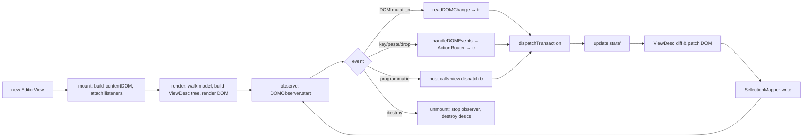
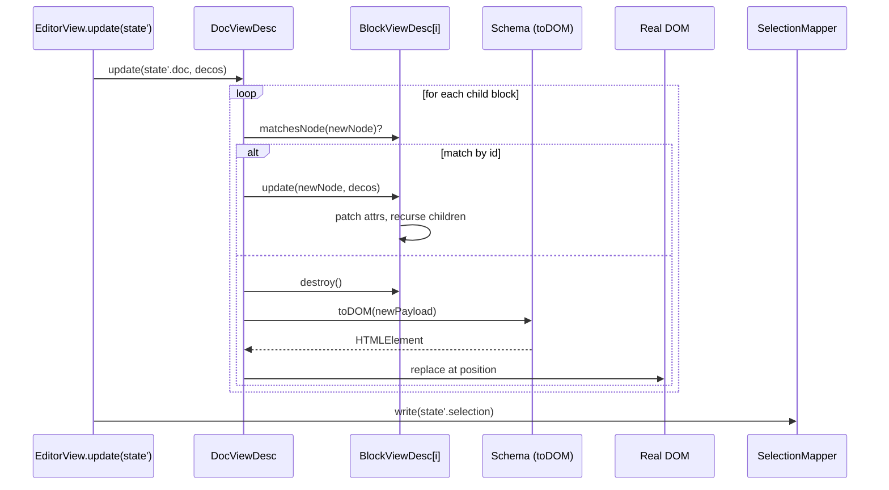
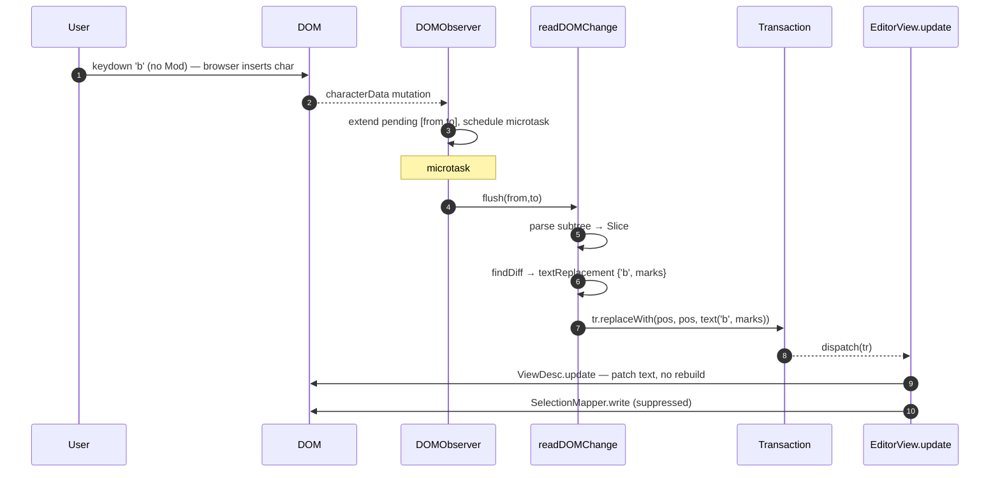
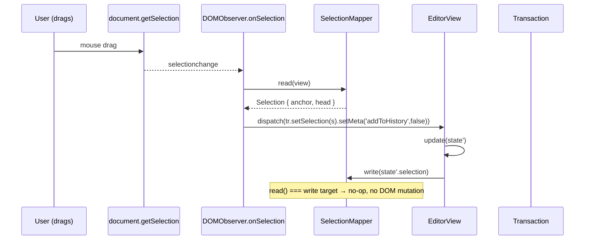
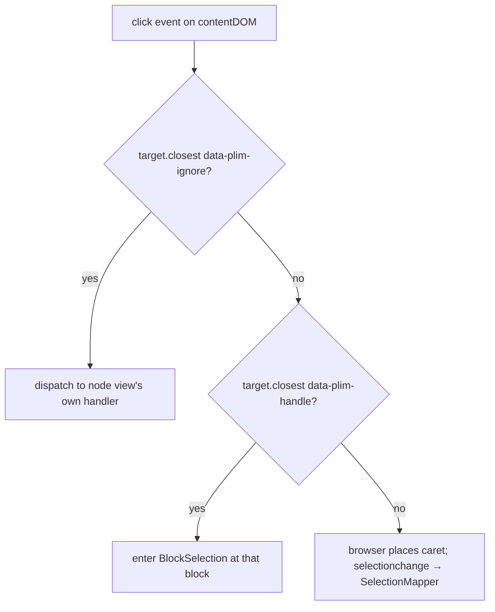
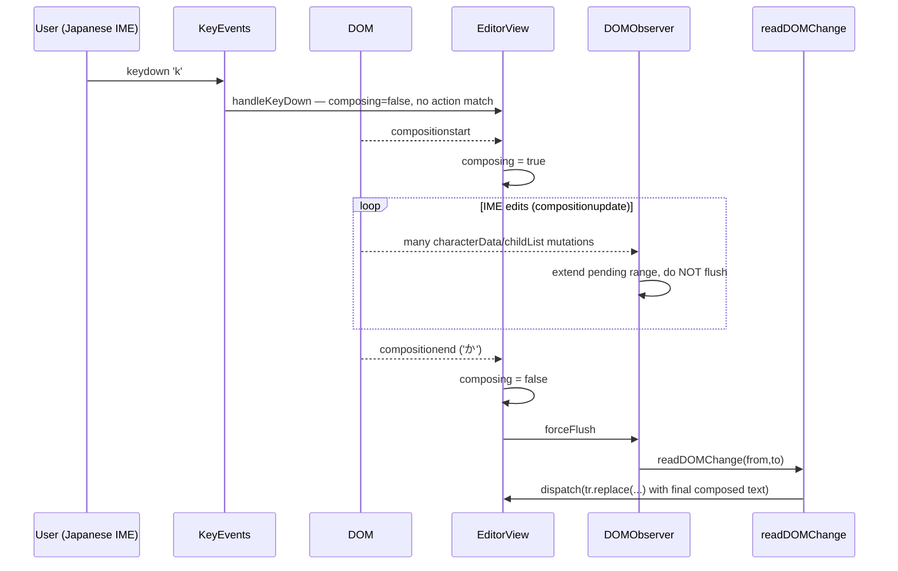

# 02 — View & DOM

> Status: **Authoritative spec, design phase**. Companion to `00-overview.md` and `01-schema-and-state.md`. Inspired by `prosemirror-view` (`domobserver.ts`, `domchange.ts`, `viewdesc.ts`) and `prosemirror-model/from_dom.ts`. We do **not** depend on ProseMirror.
>
> This doc specifies `@plim/view`: the layer that mounts an `AgnosticEditor` into a DOM container, observes user edits, parses them back into model transactions, and renders model state changes back into the DOM. It also fixes the recurring bug class in `examples/basic-editor/src/main.ts` and `examples/react-tailwind-editor/src/App.tsx` where space/backspace at boundaries, Enter, markdown trigger removal, and click handling are all reimplemented (incorrectly) per example.
>
> Cross references:
> - `00-overview.md` — canonical names, layered architecture, end-to-end flow
> - `01-schema-and-state.md` — `Schema`, `EditorState`, `Transaction`, `Step`, `Selection`, `Slice`
> - `03-actions-and-triggers.md` — `ActionRouter`, character/shortcut triggers
> - `04-input-and-paste.md` — input rules, paste rules, clipboard pipeline
> - `05-extensions.md` — plugin contract, decorations
> - `07-react-bindings.md` — `PlimEditor`, React node-view bridge

---

## A. `EditorView`

`EditorView` is the public class exported from `@plim/view`. One `EditorView` binds one `AgnosticEditor`'s state to one DOM element.

### A.1 Construction

```ts
import type { EditorState, Transaction, Schema, Decoration, DecorationSet } from '@plim/core';
import type { AgnosticEditor } from '@plim/editor';

export interface NodeViewConstructor {
  (
    payload: BlockPayload,
    view: EditorView,
    getPos: () => number,
    decorations: readonly Decoration[],
  ): NodeViewSpec;
}

export interface NodeViewSpec {
  /** Outer DOM element rendered into the parent contentDOM. */
  dom: HTMLElement;
  /** Where Plim should mount child content. Omit for atomic blocks. */
  contentDOM?: HTMLElement | null;
  /** Re-render with a new payload/decorations. Return `false` to force a full rebuild. */
  update?(payload: BlockPayload, decorations: readonly Decoration[]): boolean;
  /** Called for synthetic events Plim will route here (e.g. checkbox toggle). */
  ignoreMutation?(mutation: MutationRecord): boolean;
  /** Allow the node view to opt out of selection events (e.g. for non-editable widgets). */
  selectNode?(): void;
  deselectNode?(): void;
  /** Cleanup (event listeners, ResizeObservers, React roots, etc.). */
  destroy?(): void;
}

export interface DOMEventHandlers {
  keydown?(view: EditorView, event: KeyboardEvent): boolean;
  keypress?(view: EditorView, event: KeyboardEvent): boolean;
  beforeinput?(view: EditorView, event: InputEvent): boolean;
  input?(view: EditorView, event: InputEvent): boolean;
  paste?(view: EditorView, event: ClipboardEvent): boolean;
  copy?(view: EditorView, event: ClipboardEvent): boolean;
  cut?(view: EditorView, event: ClipboardEvent): boolean;
  drop?(view: EditorView, event: DragEvent): boolean;
  dragstart?(view: EditorView, event: DragEvent): boolean;
  click?(view: EditorView, event: MouseEvent): boolean;
  mousedown?(view: EditorView, event: MouseEvent): boolean;
  focus?(view: EditorView, event: FocusEvent): boolean;
  blur?(view: EditorView, event: FocusEvent): boolean;
  compositionstart?(view: EditorView, event: CompositionEvent): boolean;
  compositionend?(view: EditorView, event: CompositionEvent): boolean;
}

export interface EditorViewProps {
  state: EditorState;
  /** Called for every transaction emitted by the view. The host decides whether to apply it. */
  dispatchTransaction?(this: EditorView, tr: Transaction): void;
  /** Lower-level DOM hooks. Called BEFORE plugins' handleKeyDown. Return true to consume. */
  handleDOMEvents?: DOMEventHandlers;
  /** Per-block-name custom node views. */
  nodeViews?: Record<string, NodeViewConstructor>;
  /** Function that returns a DecorationSet for the current state. */
  decorations?(state: EditorState): DecorationSet;
  /** Static attributes applied to the contenteditable root. */
  attributes?: Record<string, string>;
  /** Whether the editor accepts edits. */
  editable?(state: EditorState): boolean;
}

export class EditorView {
  readonly dom: HTMLElement;            // mount target
  readonly contentDOM: HTMLElement;     // contenteditable root
  state: EditorState;                   // current state
  composing: boolean;                   // true between compositionstart/end
  isDestroyed: boolean;

  constructor(mountTarget: HTMLElement, props: EditorViewProps);

  /** Reconcile DOM with a new state. Default `dispatchTransaction` calls this; custom hosts may delay. */
  update(state: EditorState): void;

  /** Force-set state without going through dispatchTransaction (used by host after external change). */
  updateState(state: EditorState): void;

  /** Patch a subset of props at runtime (e.g. flip readonly, swap nodeViews). */
  setProps(partial: Partial<EditorViewProps>): void;

  /** Public dispatch entry: equivalent to props.dispatchTransaction(tr) ?? this.update(state.apply(tr)). */
  dispatch(tr: Transaction): void;

  focus(): void;
  blur(): void;
  hasFocus(): boolean;

  /** DOM coords ↔ model positions. Both throw if view is destroyed. */
  posAtCoords(coords: { x: number; y: number }): { pos: number; inside: number } | null;
  coordsAtPos(pos: number, side?: -1 | 1): { left: number; top: number; right: number; bottom: number };
  domAtPos(pos: number, side?: -1 | 1): { node: Node; offset: number };
  posAtDOM(node: Node, offset: number, bias?: -1 | 1): number;

  /** Tear down: stops observers, removes listeners, calls destroy() on every ViewDesc. */
  destroy(): void;
}
```

### A.2 Lifecycle



The default `dispatchTransaction` is:

```ts
function defaultDispatch(this: EditorView, tr: Transaction): void {
  this.updateState(this.state.apply(tr));
}
```

Hosts (`AgnosticEditor`, React) override it to route through the editor's transaction queue and fire `onTransaction` listeners — see `08-packages-and-migration.md` §3.

---

## B. `ViewDesc` tree

A `ViewDesc` is the bookkeeping object that pairs one model node (or mark, or widget) to its DOM. It is the **only** place that owns DOM elements; nothing else touches the DOM after mount.

### B.1 Hierarchy

```ts
export type ViewDesc =
  | DocViewDesc
  | BlockViewDesc
  | NodeViewDesc        // host-supplied custom node view
  | TextViewDesc
  | MarkViewDesc
  | WidgetViewDesc;     // decoration-only, not in model

export abstract class ViewDescBase {
  parent: ViewDesc | null;
  children: ViewDesc[];
  /** Outer element, attached to parent.contentDOM. */
  dom: Node;
  /** Where this desc's children mount. For atomic blocks this is null. */
  contentDOM: HTMLElement | null;
  /** Cached size (number of model positions this desc spans). */
  size: number;
  /** True between mutation flushes if this subtree may have drifted from the model. */
  dirty: 0 | 1 | 2 | 3;  // CLEAN | CONTENT_DIRTY | CHILD_DIRTY | NODE_DIRTY

  posAtStart(): number;
  posAtEnd(): number;
  /** Map a DOM (node, offset) inside `dom` to a model position. */
  localPosFromDOM(node: Node, offset: number, bias: -1 | 1): number;
  /** Map a model position to a DOM (node, offset) within `dom`. */
  domFromPos(pos: number, side: -1 | 1): { node: Node; offset: number };
  /** True if this desc can be reused for `node`. False forces rebuild. */
  matchesNode(node: PlimNode): boolean;
  /** Reconcile this desc with a new node + decorations. Returns true if it could update in place. */
  update(node: PlimNode, decorations: readonly Decoration[]): boolean;
  destroy(): void;
}
```

```ts
export class DocViewDesc extends ViewDescBase {
  readonly node: DocNode;
  readonly view: EditorView;
}

export class BlockViewDesc extends ViewDescBase {
  readonly node: BlockNode;          // BlockPayload
  readonly schemaSpec: BlockSpec;
  readonly id: string;               // BlockId, mirrored to data-plim-id
}

export class NodeViewDesc extends BlockViewDesc {
  readonly spec: NodeViewSpec;       // host-supplied
}

export class MarkViewDesc extends ViewDescBase {
  readonly mark: Mark;               // { name, attrs }
  readonly schemaSpec: MarkSpec;
  /** Mark wrappers carry `data-plim-mark="<markName>"`. */
}

export class TextViewDesc extends ViewDescBase {
  readonly node: TextNode;
  readonly dom: Text;                // a Text node, not Element
  // contentDOM is always null for text
}

export class WidgetViewDesc extends ViewDescBase {
  readonly widget: WidgetDecoration;
  readonly side: -1 | 1;
  // size is 0; widgets do not contribute to model positions.
}
```

### B.2 Identity & `data-plim-*`

Every `BlockViewDesc.dom` carries:

```html
<div data-plim-id="b_abc123" data-plim-type="paragraph" ...>…</div>
```

Every `MarkViewDesc.dom` carries:

```html
<strong data-plim-mark="bold" data-plim-mark-id="mk_…">…</strong>
```

These attributes are how the parser (§F) and the diff algorithm align DOM with model. `data-plim-id` is **stable** — when reordering, deleting, or splitting, descs are matched by id first; `splitBlock` produces a fresh id for the new half so splits never alias.

A `data-plim-ignore="true"` attribute marks subtree DOM that the parser must skip (e.g. floating UI rendered into the contentDOM).

### B.3 `update()` diff algorithm

Given an existing `BlockViewDesc.children` and a new `node.children` plus decorations:

```ts
function diffChildren(
  existing: ViewDesc[],
  desired: PlimNode[],
  decos: DecorationSet,
): { reused: Map<ViewDesc, PlimNode>; toCreate: PlimNode[]; toDestroy: ViewDesc[] } {
  // 1. Index existing descs by id (if BlockViewDesc) or stable mark identity.
  // 2. Walk desired in order; for each:
  //      a) lookup by id → reuse if matchesNode is true.
  //      b) else lookup positional fallback (same index, same type, no id mismatch on either side).
  //      c) else mark for creation.
  // 3. Any unreused existing desc is destroyed.
  // 4. Reused descs are recursively .update()-ed; if update returns false, rebuild that subtree.
}
```

Rules:

1. **Align by id** when both sides have one. This handles reorders correctly without re-rendering.
2. **Fall back to position** for nodes without ids (text, marks, widgets). Mark/text descs are cheap to rebuild, so the fallback is liberal.
3. **Reuse where possible.** A `BlockViewDesc.update()` returns `true` only if the schema spec, type, and id match; otherwise the parent destroys and recreates it.
4. **Decorations are passed through.** If only the decoration set changed, `update()` patches `class`/`style`/widget children without touching content.
5. **`NodeViewDesc.update`** delegates to the host's `spec.update`; if that returns `false`, the desc is destroyed and rebuilt via `nodeViews[type]`.

The DOM is only patched as a side effect of `update()`. Reading the DOM during reconciliation is forbidden — by the time we reconcile, the model is the truth.

---

## C. DOM rendering pipeline



Inside `BlockViewDesc.update`:

```ts
update(node: BlockNode, decos: readonly Decoration[]): boolean {
  if (!this.matchesNode(node)) return false;
  this.observer.suppressFor(() => {
    // Patch attributes — never recreate the element.
    const nextAttrs = this.schemaSpec.toDOMAttrs?.(node.payload) ?? {};
    patchAttrs(this.dom as HTMLElement, this.currentAttrs, nextAttrs);
    this.currentAttrs = nextAttrs;
    // Reconcile children using diffChildren above.
    this.reconcileChildren(node.children, decos);
  });
  this.node = node;
  this.dirty = CLEAN;
  return true;
}
```

`Schema.toDOM(payload)` produces a fresh `HTMLElement` only on first mount or full rebuild. Subsequent updates patch attributes and text — this is what keeps the DOM stable for `MutationObserver` (we never blow away nodes the user is selecting into) and what makes IME survive re-renders (§K).

`patchAttrs` is a small diff: set added, remove removed, leave equal alone. This is essential for correct event listener and ARIA preservation.

---

## D. `DOMObserver`

Wraps `MutationObserver` and `selectionchange` into a single buffer that produces dirty ranges.

```ts
export interface DOMObserverOptions {
  view: EditorView;
  /** Callback to read a dirty range into a transaction. */
  readDOMChange(view: EditorView, from: number, to: number): void;
  /** Callback when the selection moved outside of suppressed regions. */
  onSelectionChange(view: EditorView): void;
}

export class DOMObserver {
  constructor(opts: DOMObserverOptions);

  /** Begin observing. Must be called after EditorView mount. */
  start(): void;
  /** Stop observing and disconnect. */
  stop(): void;
  /** Drain the pending mutation buffer NOW (synchronous). */
  forceFlush(): void;
  /** Run `fn` with the observer suspended; mutations made inside are not reported. */
  suppressFor<T>(fn: () => T): T;

  /** True between compositionstart and compositionend. */
  composing: boolean;

  /** Number of nested suppressFor invocations currently active. */
  suppressionDepth: number;
}
```

### D.1 Configuration

```ts
new MutationObserver(this.onMutation).observe(view.contentDOM, {
  subtree: true,
  childList: true,
  characterData: true,
  characterDataOldValue: true,
  attributes: true,
  attributeOldValue: true,
});
document.addEventListener('selectionchange', this.onSelection);
```

### D.2 Buffering

The observer accumulates dirty ranges in absolute model coordinates as mutations arrive:

```ts
interface PendingFlush {
  from: number;        // smallest affected pos so far
  to: number;          // largest affected pos so far
  hasStructural: boolean;  // true if any childList mutation arrived
  hasCharacter: boolean;   // true if any characterData mutation arrived
  scheduledFlush: boolean;
}
```

For each `MutationRecord`:

1. If suppressed (`suppressionDepth > 0`) or the target is inside a `data-plim-ignore` subtree, drop it.
2. If composing, drop it; we will flush on `compositionend`.
3. Translate mutation target → ViewDesc → `(descPosStart, descPosEnd)`. Expand the pending range to cover this.
4. If no flush is scheduled, `queueMicrotask(this.flush)`.

Flush:

```ts
flush() {
  if (!this.pending) return;
  const { from, to } = this.pending;
  this.pending = null;
  if (this.composing) return;            // safety
  this.opts.readDOMChange(this.view, from, to);
}
```

### D.3 Composition handling (summary)

`compositionstart`: `composing = true`. We continue to collect mutations into `pending` but do **not** flush. `compositionupdate`: ignored — the IME mutates the DOM repeatedly and we have no useful intermediate state. `compositionend`: `composing = false`, then `forceFlush()` so the entire IME edit becomes one transaction. See §K for the full lifecycle.

### D.4 `selectionchange`

Fired on every caret movement. We:

1. Drop the event if we are in a `suppressFor` block (we just wrote the selection ourselves).
2. Drop if `composing`.
3. Otherwise call `onSelectionChange`, which reads via `SelectionMapper.read` and dispatches a `selection-only` transaction (`tr.setSelection(sel)` with `meta.addToHistory = false`).

---

## E. DOM change reading — `readDOMChange`

This is the core "DOM → transaction" function. It is called by `DOMObserver` with the dirty range `(from, to)`. Inspired by `prosemirror-view/domchange.ts`, with explicit fixes for the bugs in our examples.

```ts
export function readDOMChange(view: EditorView, from: number, to: number): void {
  if (view.composing) return;

  // 1. Find common-ancestor parent block desc covering [from, to].
  const $from = view.state.doc.resolve(from);
  const $to   = view.state.doc.resolve(to);
  const sharedDepth = $from.sameDepthAs($to);
  const parent = view.docView.descAtPos($from.before(sharedDepth + 1));
  if (!(parent instanceof BlockViewDesc)) return; // mutation in a foreign region — ignore

  // 2. Ask the schema to parse just that subtree's DOM back into a Slice.
  const localFrom = from - parent.posAtStart();
  const localTo   = to   - parent.posAtStart();

  const parsedSlice = view.state.schema.parseDOM(parent.dom as HTMLElement, {
    from:    localFrom,
    to:      localTo,
    topNode: parent.node,
    context: parent.parseContext(),
    ruleFromNode: (dom) => view.docView.ruleFromDOM(dom),
  });

  // 3. Compare parsed slice to the model's current slice for the same range.
  const oldSlice = parent.node.slice(localFrom, localTo);

  // 4. Diff.
  const diff = findDiff(oldSlice.content, parsedSlice.content, localFrom, localTo);
  if (!diff) return; // false alarm — DOM and model already agree

  // 5. Heuristics for browser quirks (see §E.1).
  const tr = buildTransactionFromDiff(view, parent, diff, parsedSlice);
  if (!tr) return;

  // 6. Carry selection.
  const newSel = SelectionMapper.read(view);
  if (newSel) tr.setSelection(newSel.map(tr.mapping));

  view.dispatch(tr);
}
```

`findDiff` returns:

```ts
interface Diff {
  start: number;        // first divergent local position
  endA: number;         // end in old (model) slice
  endB: number;         // end in new (parsed) slice
  /** Optional fast path: pure text replacement at a single position with single mark set. */
  textReplacement?: { text: string; marks: readonly Mark[] };
}
```

When `textReplacement` is set, we emit a single `ReplaceStep` of just the text — this is the typing fast path and matches `prosemirror-view`'s behaviour.

### E.1 Browser-quirk heuristics

The naïve "trust the parsed DOM" path misbehaves at boundaries — that is the bug class in `examples/basic-editor/src/main.ts`. We override before falling through:

```ts
function buildTransactionFromDiff(
  view: EditorView, parent: BlockViewDesc,
  diff: Diff, parsedSlice: Slice,
): Transaction | null {
  const { state } = view;
  const tr = state.tr;

  // (a) Backspace at the start of a non-first block, where the diff is empty
  //     after the join (the browser "swallowed" the boundary). Detect by the
  //     observer reporting a structural mutation that removed our block's
  //     opening tag, OR by selection collapsing to start with no content delta.
  if (looksLikeJoinBackward(view, parent, diff, parsedSlice)) {
    return tr.joinBackward(parent.posAtStart()).setMeta('synthetic', 'joinBackward');
  }

  // (b) Backspace at the very start of the document → no-op. Suppress the
  //     diff entirely; the parser may have produced spurious whitespace.
  if (parent.isFirstBlock && diff.start === 0 && diff.endA === 0 && diff.endB === 0) {
    return null;
  }

  // (c) Enter producing a sibling <p>/<div>/<li>: the browser cloned the block.
  //     Detect: parsedSlice has 2 top-level blocks where oldSlice had 1, and
  //     the join point matches the caret.
  if (looksLikeSplitBlock(parent, diff, parsedSlice)) {
    const splitPos = parent.posAtStart() + diff.start;
    return tr.splitBlock(splitPos).setMeta('synthetic', 'splitBlock');
  }

  // (d) Spacebar at boundaries. The browser sometimes inserts a non-breaking
  //     space, sometimes nothing (when the caret is at a block boundary that
  //     beforeinput suppressed). We always insert exactly one literal U+0020:
  if (looksLikeBoundarySpace(view, parent, diff)) {
    const pos = parent.posAtStart() + diff.start;
    return tr.insertText(' ', pos, pos).setMeta('synthetic', 'boundarySpace');
  }

  // (e) Default path: trust the parsed slice as a replace.
  const absStart = parent.posAtStart() + diff.start;
  const absEndA  = parent.posAtStart() + diff.endA;
  const replaceSlice = parsedSlice.cut(diff.start, diff.endB);

  if (diff.textReplacement) {
    return tr.replaceWith(absStart, absEndA, state.schema.text(
      diff.textReplacement.text, diff.textReplacement.marks,
    ));
  }
  return tr.replace(absStart, absEndA, replaceSlice);
}
```

The `synthetic` meta is observable by plugins (e.g. input rules use it to know whether to apply markdown shortcuts).

> **Why these fixes are necessary, concretely.** Today's `examples/basic-editor/src/main.ts` re-implements space/backspace at boundaries by sampling `textContent` on `keydown`. That loses inline marks (because `textContent` strips structure), races with IME, and silently drops keystrokes when the caret is at offset 0. The `readDOMChange` pipeline above produces a deterministic transaction for every mutation — including the empty diff produced by a boundary-space the browser suppressed — and never reads `textContent` outside the schema parser.

### E.2 Typing flow



---

## F. `Schema.parseDOM`

The DOM parser owned by the schema. Used by `readDOMChange`, by paste handling, and by initial content from HTML.

```ts
export interface ParseDOMOptions {
  from?: number;             // local start in dom
  to?: number;               // local end in dom
  topNode?: PlimNode;        // anchor: parsed slice must fit inside this
  context?: ParseContext;    // ancestor stack for rule disambiguation
  ruleFromNode?(dom: Node): ParseRule | null;
  /** If true, preserve whitespace per CSS `white-space`. Default true. */
  preserveWhitespace?: boolean;
}

export interface ParseRule {
  /** CSS-ish selector, or a custom matcher. */
  tag?: string;
  attr?: { name: string; value: string };
  match?(dom: Element, ctx: ParseContext): boolean;
  /** Higher priority wins. Default 50. */
  priority?: number;
  /** Block this rule applies to. */
  block?: string;
  mark?: string;
  /** Returns the BlockPayload/MarkAttrs. Return false to skip. */
  getAttrs?(dom: Element, ctx: ParseContext): false | Record<string, unknown>;
  /** If true, this element marks an atomic node (no children parsed). */
  atom?: boolean;
  /** If true, this element is skipped but its children are walked. */
  skip?: boolean;
  /** If true, ignore this element AND its subtree. */
  ignore?: boolean;
  /** Wrap the parsed children in this block before inserting. */
  wrapInBlock?: string;
  /** Re-route content inside this element to a different schema slot. */
  contentSlot?: 'children' | 'caption';
}

export class ParseContext {
  readonly stack: PlimNode[];                 // open nodes
  readonly preserveWhitespace: boolean;
  enter(node: PlimNode): void;
  leave(): void;
  matchesAncestor(name: string): boolean;     // for rule context like `paragraph` inside `list_item`
}

declare module '@plim/core' {
  interface Schema {
    parseDOM(root: HTMLElement, options?: ParseDOMOptions): Slice;
  }
}
```

### F.1 Walk algorithm

```ts
function parseNode(dom: Node, ctx: ParseContext, schema: Schema): PlimNode | PlimNode[] | null {
  if (dom instanceof Element && dom.hasAttribute('data-plim-ignore')) return null;

  // 1. Fast path: data-plim-id present → look up the existing model node by id.
  //    This preserves identity through paste-back and round-trips.
  const id = dom instanceof Element ? dom.getAttribute('data-plim-id') : null;
  if (id) {
    const known = ctx.knownById(id);
    if (known) return known;
  }

  // 2. Find the highest-priority rule that matches.
  const rule = schema.matchRule(dom, ctx);
  if (rule?.ignore) return null;
  if (rule?.skip)   return parseChildren(dom, ctx, schema);

  // 3. Apply the rule.
  if (rule?.block) {
    const attrs = rule.getAttrs?.(dom as Element, ctx) ?? {};
    if (attrs === false) return null;
    const payload = { id: id ?? newId(), type: rule.block, attributes: attrs, children: [] as PlimNode[] };
    if (!rule.atom) {
      ctx.enter(payload as unknown as PlimNode);
      payload.children = parseChildren(dom, ctx, schema) as PlimNode[];
      ctx.leave();
    }
    return wrapIfNeeded(payload, rule, schema);
  }
  if (rule?.mark) {
    const mark = schema.mark(rule.mark, rule.getAttrs?.(dom as Element, ctx) || {});
    return parseChildren(dom, ctx, schema).map((n) => addMark(n, mark));
  }

  // 4. No rule: text node?
  if (dom.nodeType === Node.TEXT_NODE) {
    const text = normalizeWhitespace(dom.nodeValue ?? '', ctx);
    if (!text) return null;
    return schema.text(text);
  }

  // 5. Unknown element with children: walk through (drop the element).
  return parseChildren(dom, ctx, schema);
}
```

### F.2 Whitespace normalization

We honour CSS `white-space`:

| `white-space` | Treatment |
|---|---|
| `normal`, `nowrap` | Collapse runs of spaces/tabs/newlines to single space; trim against block boundaries. |
| `pre`, `pre-wrap`, `break-spaces` | Preserve verbatim, including newlines as `\n`. |
| `pre-line` | Preserve newlines, collapse other whitespace. |

The non-breaking space (`\u00A0`) is **always preserved** as itself — never collapsed — so users typing space at boundaries (which the browser may have inserted as `&nbsp;`) round-trip cleanly.

### F.3 Context

`ParseContext.stack` lets rules disambiguate: a rule matching `<p>` inside `<li>` returns `block: 'paragraph'` only if the parent isn't already a paragraph; otherwise the inner `<p>` is treated as a wrap-skipping container so we don't get nested paragraphs. This is what the `00-overview.md` example "`<p>` inside `<li>` parses as bare paragraph" refers to.

### F.4 Slicing to a range

When `from`/`to` are passed, the parser walks the entire DOM but emits only the nodes between `from` and `to` (counted in model positions). Open boundaries become `Slice.openStart`/`Slice.openEnd` so the resulting `Slice` can be `.replace()`d into the document without ambiguity.

---

## G. DOM serializer

The inverse of the parser. Used for clipboard copy, drag images, and a paste-preview tooltip. **Not** used for primary rendering — that goes through `BlockViewDesc.update` which calls each spec's `toDOM` directly.

```ts
declare module '@plim/core' {
  interface Schema {
    serializeDOM(slice: Slice, doc?: Document): DocumentFragment;
    serializeNode(node: PlimNode, doc?: Document): HTMLElement | DocumentFragment;
    /** Plain-text fallback — used when the target rejects HTML (e.g. <input>). */
    serializeText(slice: Slice): string;
  }
}
```

`serializeDOM` walks the slice depth-first, calling each block's `toDOM(payload)` for the outer element and each mark's `toDOM(payload)` for inline wrappers. Marks are nested in declaration order (the order from `registeredMarks`) so copies round-trip stably.

---

## H. `SelectionMapper`

```ts
export interface SelectionMapper {
  /** Read the browser selection into a model Selection. Null if no selection in our root. */
  read(view: EditorView): Selection | null;
  /** Write a model Selection to the browser, suppressing the resulting selectionchange. */
  write(view: EditorView, sel: Selection): void;
}
```

### H.1 `read`

```ts
read(view) {
  const sel = view.dom.ownerDocument.getSelection();
  if (!sel || sel.rangeCount === 0) return null;
  const r = sel.getRangeAt(0);
  if (!view.contentDOM.contains(r.startContainer)) return null;

  const anchor = view.posAtDOM(r.startContainer, r.startOffset, sel.isCollapsed ? 1 : -1);
  const head   = sel.isCollapsed
    ? anchor
    : view.posAtDOM(r.endContainer, r.endOffset, 1);
  return TextSelection.between(view.state.doc.resolve(anchor), view.state.doc.resolve(head));
}
```

### H.2 `write`

```ts
write(view, sel) {
  const cur = this.read(view);
  if (cur && cur.eq(sel)) return; // no-op — avoids feedback
  view.observer.suppressFor(() => {
    const { node: anchorNode, offset: anchorOff } = view.domAtPos(sel.anchor);
    const { node: headNode,   offset: headOff   } = view.domAtPos(sel.head);
    const range = document.createRange();
    range.setStart(anchorNode, anchorOff);
    range.setEnd(headNode, headOff);
    const browserSel = view.dom.ownerDocument.getSelection()!;
    browserSel.removeAllRanges();
    browserSel.addRange(range);
  });
}
```

`suppressFor` wraps the write so the resulting `selectionchange` is dropped by `DOMObserver.onSelection`, breaking the feedback loop.

### H.3 Selection sync diagram



### H.4 Block selection

Notion-style block selection (the gutter handle drag selects whole blocks) is **not** a DOM `Selection`. It is a `BlockSelection` model selection rendered by a `Decoration.node` that adds a `data-plim-block-selected="true"` attribute. The browser's `Selection` is collapsed at the start of the focus block while a block selection is active; this lets keyboard shortcuts (Backspace, Cmd+C) target the selected blocks while clicks elsewhere clear the block selection back to a `TextSelection`.

---

## I. Click handling

Two bugs in `examples/react-tailwind-editor/src/App.tsx` motivate this section:

1. **Clicking inside a checkbox block toggles the checkbox AND blocks text editing.**
2. **Clicking anywhere in the editor selects all blocks** (because of a global `click → selectAll` handler).

Both go away with the discipline below.

### I.1 Checkbox: interactive control vs label

The checkbox block (`to_do`) renders as:

```html
<div data-plim-id="b_…" data-plim-type="to_do" class="plim-todo">
  <button class="plim-todo__check"
          contenteditable="false"
          data-plim-ignore="true"
          aria-checked="false"
          tabindex="-1">
    <!-- icon -->
  </button>
  <div class="plim-todo__content" data-plim-content="">…</div>
</div>
```

Rules:

- The `<button>` is `contenteditable="false"` and `data-plim-ignore="true"`. The DOM observer ignores its mutations; `Schema.parseDOM` skips its subtree.
- The `<button>` has its own `click` handler (registered by the node view's `dom.addEventListener` at construction) that calls `view.dispatch(tr.setBlockAttrs(blockId, { checked: !checked }))`. **It does not** call `event.stopPropagation()` on the click — but it does call `event.preventDefault()` so the browser doesn't try to move focus into the button.
- The surrounding `.plim-todo__content` is the `contentDOM`. Clicks there fall through to the editor's standard click handler, which lets the browser place the caret naturally. Text edits in the to-do label thus work like any other paragraph.
- `EditorView`'s built-in `mousedown` handler **does not** call `preventDefault` for clicks inside the contentDOM, so caret placement is preserved.

### I.2 No global "click → selectAll"

The editor's own `click` listener does exactly this:

```ts
function onClick(view: EditorView, event: MouseEvent) {
  // 1. Allow nodeView's own click handlers (they run on capture from their own dom)
  // 2. Run plugins' handleClick / handleClickOn
  // 3. If still unhandled and target is in a gutter handle, handle block selection.
  // 4. Otherwise: do nothing. The browser places the caret.
}
```

Block selection is entered only via **the gutter handle** (the `⋮⋮` drag affordance), not from any in-content click. Clicking blank space below the last block places the caret at the end of the last block (a small enhancement: `posAtCoords` snaps to the nearest block content position) — never selects all.

### I.3 Click flow



---

## J. Keymap dispatch

```ts
class EditorView {
  // …
  private handleKeyDown(event: KeyboardEvent): void {
    if (this.isDestroyed) return;
    if (this.composing) return;             // §K
    // 1. Host-level hook
    if (this.props.handleDOMEvents?.keydown?.(this, event)) return event.preventDefault();
    // 2. Plugins' props.handleKeyDown — first to return true wins
    for (const plugin of this.state.plugins) {
      if (plugin.props?.handleKeyDown?.(this, event)) return event.preventDefault();
    }
    // 3. Action router (Mod+B, character triggers, etc.)
    if (this.actionRouter.handleKey(this, event)) return event.preventDefault();
    // 4. Fall through — let the browser type. Mutations become a transaction via DOMObserver.
  }
}
```

The four-layer priority is what `00-overview.md` §5 describes as the "one pipeline for all input". The action router (specified fully in `03-actions-and-triggers.md`) handles both shortcut triggers (`Mod+b`) and character triggers (`/`, `@`, `:`).

---

## K. IME / composition

```ts
class EditorView {
  // private
  private onCompositionStart(event: CompositionEvent) {
    this.composing = true;
    this.observer.composing = true;
    // We do NOT stop the observer; we keep collecting mutations into the pending range.
    this.props.handleDOMEvents?.compositionstart?.(this, event);
  }

  private onCompositionUpdate(_event: CompositionEvent) {
    // Intentionally ignore. The IME emits dozens of these for one character.
  }

  private onCompositionEnd(event: CompositionEvent) {
    this.composing = false;
    this.observer.composing = false;
    this.props.handleDOMEvents?.compositionend?.(this, event);
    // Flush ALL accumulated mutations as one transaction.
    queueMicrotask(() => this.observer.forceFlush());
  }
}
```



`handleKeyDown` returns early while `composing` is true so we never preempt the IME. Plugins that observe `selectionchange` also bail while composing.

---

## L. Paste / drop entry points

Paste and drop events are received here but routed to the input pipeline:

```ts
class EditorView {
  private onPaste(event: ClipboardEvent) {
    if (this.props.handleDOMEvents?.paste?.(this, event)) return event.preventDefault();
    const slice = parseClipboard(this, event.clipboardData!);
    if (this.props.handlePaste?.(this, event, slice)) return event.preventDefault();
    if (defaultHandlePaste(this, slice)) return event.preventDefault();
    // else: fall through — DOMObserver will pick up whatever the browser does
  }

  private onDrop(event: DragEvent) { /* analogous */ }
}
```

The full clipboard/drop pipeline (HTML normalization, paste rules, image upload delegation, file drop) lives in `04-input-and-paste.md` §3–§5. From the view's perspective, paste/drop are just two more transaction sources.

---

## M. Decorations

Decorations are non-destructive view annotations: classnames, attributes, widget elements. They do **not** participate in the model.

```ts
export type Decoration =
  | InlineDecoration
  | NodeDecoration
  | WidgetDecoration;

export interface InlineDecoration {
  type: 'inline';
  from: number;
  to: number;
  attrs: { class?: string; style?: string; nodeName?: string; [key: string]: string | undefined };
  spec?: { inclusiveStart?: boolean; inclusiveEnd?: boolean };
}

export interface NodeDecoration {
  type: 'node';
  from: number;
  attrs: Record<string, string>;
}

export interface WidgetDecoration {
  type: 'widget';
  pos: number;
  /** Built lazily so plugins can return immutable specs. */
  toDOM(view: EditorView, getPos: () => number): HTMLElement;
  side: -1 | 1;
  spec?: { key?: string; ignoreSelection?: boolean; destroy?(dom: HTMLElement): void };
}

export const Decoration = {
  inline(from: number, to: number, attrs: InlineDecoration['attrs'], spec?: InlineDecoration['spec']): InlineDecoration,
  node(pos: number, attrs: Record<string, string>): NodeDecoration,
  widget(pos: number, dom: WidgetDecoration['toDOM'], opts?: WidgetDecoration['spec'] & { side?: -1 | 1 }): WidgetDecoration,
};

export class DecorationSet {
  static empty: DecorationSet;
  static create(doc: PlimNode, decorations: readonly Decoration[]): DecorationSet;
  add(doc: PlimNode, decorations: readonly Decoration[]): DecorationSet;
  remove(decorations: readonly Decoration[]): DecorationSet;
  map(mapping: Mapping, doc: PlimNode): DecorationSet;
  find(from?: number, to?: number, predicate?: (d: Decoration) => boolean): readonly Decoration[];
}
```

Plugins return decorations through `props.decorations(state)`. `EditorView` aggregates all plugin DecorationSets into one and passes it to the desc tree on every `update()`. Widget decorations become `WidgetViewDesc`s; inline decorations become attributes on existing mark wrappers (or insert thin `<span>`s where no mark wrapper exists); node decorations patch attributes on the block's outer element.

---

## N. Performance

1. **Flush coalescing.** Multiple mutations within one microtask collapse into one `readDOMChange` call against one dirty range.
2. **Minimal patch.** `BlockViewDesc.update` patches attributes and walks children; only descs whose `dirty != CLEAN` recurse. A typing keystroke patches one Text node and updates one block's `data-plim-id`-keyed desc — nothing else.
3. **Decoration diffing.** `DecorationSet.map` returns the same instance when nothing changed (referential equality), short-circuiting every desc's `update`.
4. **ResizeObserver.** Only used for **block-handle positioning** (the gutter `⋮⋮` follows block height). The editor itself does not resize-observe its content; layout is delegated to CSS. This avoids the layout-thrash regressions we hit before.
5. **Selection writes are skipped if equal.** `SelectionMapper.write` short-circuits when `read(view).eq(sel)`, so `dispatchTransaction` from a `selection-only` transaction caused by `selectionchange` is a no-op for the DOM.
6. **Idle widget mounting.** Widget decorations whose `spec.lazy` is true mount only when scrolled into view (via `IntersectionObserver`) — used for slash menu hints, mention previews.

---

## O. Test / regression checklist

The view layer must pass each of the following. These map 1:1 to the bugs in `examples/basic-editor/src/main.ts` and `examples/react-tailwind-editor/src/App.tsx`. Each is implemented as a Vitest scenario in `@plim/view/test/regression.spec.ts`.

### Spacebar

1. **Spacebar at start of empty paragraph** → produces a paragraph containing exactly `' '` (one literal U+0020). No `&nbsp;`, no dropped keystroke.
2. **Spacebar between two letters** → `ab|c` becomes `ab |c`. Diff hits the text fast path; one `ReplaceStep` with text `' '`.
3. **Spacebar at end of block** → text grows by one space; the block is not split.
4. **Spacebar after a markdown trigger (`##` + space)** → triggers the heading input rule (see `04-input-and-paste.md`), which removes the leading `## ` and `setBlockType('heading', { level: 2 })`. Trigger characters do not linger.
5. **Spacebar with selection** → replaces selection with `' '`.

### Backspace

6. **Backspace at start of first block (caret at pos 0)** → no-op. No transaction dispatched.
7. **Backspace at start of second block** → emits synthetic `joinBackward` transaction; previous block grows by current block's content; current block is removed; selection moves to the join point.
8. **Backspace mid-text** → ordinary `ReplaceStep` for one character.
9. **Backspace with selection** → replaces selection with empty string.
10. **Backspace at start of empty paragraph after a heading** → joins paragraph into heading (heading absorbs no text, so it's effectively "delete the empty paragraph").
11. **Backspace at start of list item** → outdents by one level if nested; otherwise converts list item to paragraph.

### Enter

12. **Enter at end of paragraph with text** → `splitBlock`; new empty paragraph after; selection at start of new paragraph.
13. **Enter mid-text** → `splitBlock`; the right half becomes a new paragraph with the same block type and a new id; marks at the split point are preserved on both halves.
14. **Enter at start of paragraph** → `splitBlock`; new empty paragraph **before**; selection stays in the original (now-second) paragraph.
15. **Enter on empty list item** → exits the list, becomes a paragraph (Notion behaviour).
16. **Shift+Enter in paragraph** → inserts a hard-break inline node (no split).

### Arrows

17. **ArrowUp at top line of multi-line paragraph** → caret moves to end of previous block at the nearest x coordinate (uses `posAtCoords`).
18. **ArrowDown at bottom line of last block** → caret moves to end of last block; no scroll-jump.
19. **ArrowLeft at start of block** → caret moves to end of previous block.
20. **ArrowRight at end of block** → caret moves to start of next block.

### Click

21. **Click at end of last block (in empty space below)** → caret placed at end of last block.
22. **Click on checkbox icon** → toggles `checked`; selection unchanged; node view re-renders. Caret can still be placed in the label by a subsequent click.
23. **Click in checkbox label** → caret placed at click position; checkbox state unchanged.
24. **Click anywhere in editor** → never triggers "select all blocks". Block selection enters only via gutter handle.
25. **Triple-click** → selects current block's text, not all blocks.

### Marks

26. **Mod+B with non-empty selection** → action toggles bold; ViewDesc patches the affected text into `<strong data-plim-mark="bold">…</strong>`; selection preserved.
27. **Mod+B with empty selection** → toggles `state.storedMarks` — next typed text is bold (no DOM change yet).

### IME

28. **Japanese IME composition (`k`+`a` → `か`)** → exactly one transaction at `compositionend`, replacing `''` with `'か'`. No transactions during composition.
29. **IME cancel (Esc mid-composition)** → no transaction, DOM rolled back to model state via reconcile.

### Paste / drop

30. **Paste plain text into empty paragraph** → `ReplaceStep` with text run carrying current `storedMarks`.
31. **Paste rich HTML** → parsed via `Schema.parseDOM`, dropped through paste rules, replaced as a `Slice`.
32. **Paste image (PNG in clipboard)** → delegated to host-supplied paste handler from `04-input-and-paste.md`; default behaviour inserts a placeholder `image` block.
33. **Drop a `.png` file** → same path as paste image.

### Drag

34. **Drag block by gutter handle to before another block** → `MoveStep` reorders; selection follows the moved block.
35. **Drag block from outside the editor** → falls through to host's `handleDOMEvents.drop`; not interpreted by the view.

### Lifecycle

36. **`destroy()` removes all listeners and disconnects MutationObserver and ResizeObservers** — verified via leak test that creates and destroys 100 editors and asserts heap returns to baseline.
37. **`setProps({ editable: () => false })` flips `contenteditable` to `false`** and stops dispatching transactions from DOM mutations.

---

## P. Summary

`@plim/view` is a thin, single-source-of-truth DOM bridge:

- **One** observer reads DOM mutations.
- **One** parser turns DOM into model slices.
- **One** desc tree owns DOM elements and patches them in place.
- **One** selection mapper bidirectionally syncs caret without feedback.
- **One** key dispatch chain: host → plugin → action → browser.
- **One** composition gate that pauses flushing for the entire IME lifetime.

This eliminates the per-example handcoding that has been responsible for every input regression to date. The vanilla and React examples become wrappers around `EditorView`; all of §O is enforced by `@plim/view`'s own test suite, not by example code.
