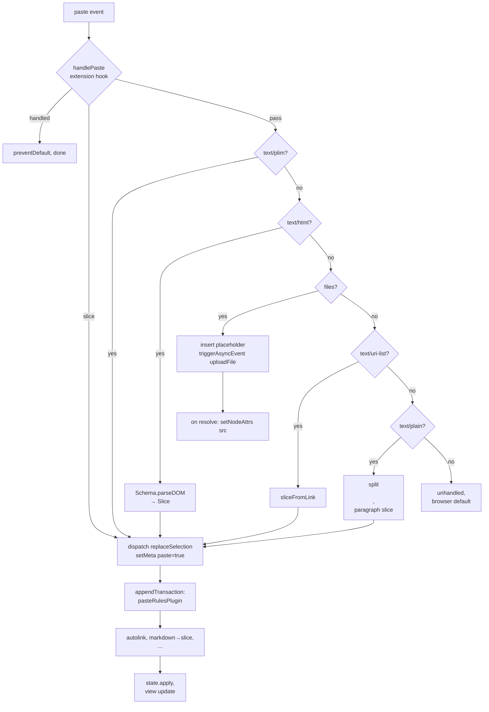
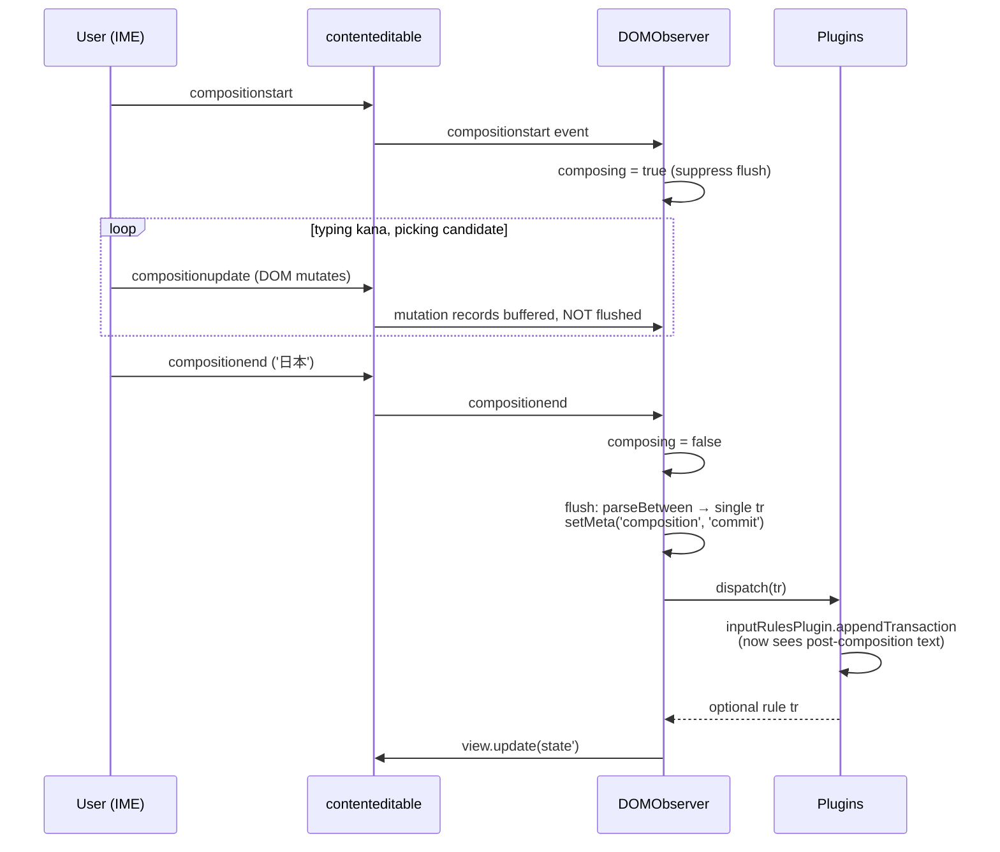
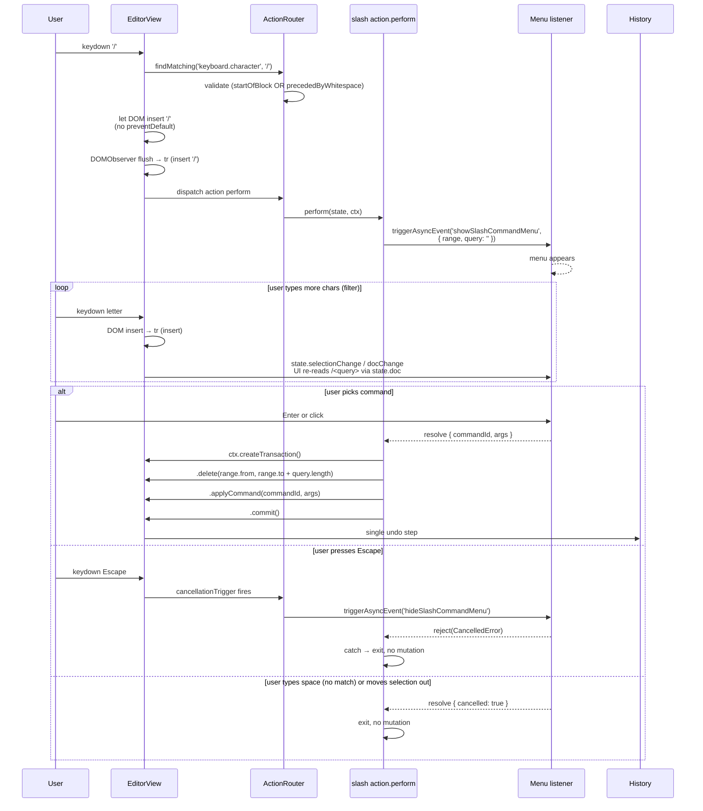

# 04 — Input, Paste, Clipboard, Drag/Drop, IME

> Status: **Authoritative spec, design phase**. Companion to `00-overview.md`, `02-view-and-dom.md` (DOM observer pipeline) and `03-actions-and-triggers.md` (action system).
>
> This document specifies how every external "edit signal" — keystrokes, paste, drop, IME commit, browser autocorrect — is converted into `Transaction`s. ProseMirror's `prosemirror-inputrules` and `prosemirror-view/src/input.ts` are inspirations only; we do not depend on them.

The bug class this document explicitly fixes: trigger characters lingering after a markdown shortcut (`## ` left behind after a heading conversion), spacebar dropped at block boundaries, autocorrect/IME mis-interleaving with input rules, and paste corrupting structure.

---

## 1. Layering

```
keydown / beforeinput / paste / drop / composition*
        │
        ▼
  EditorView.input (per-event handlers in @plim/view)
        │
        ├── ActionRouter.findMatching(...)   ← runs first; see 03
        │     └── matched? perform & preventDefault
        │
        ├── Clipboard pipeline (paste/copy/cut/drop) — §5,§6,§7
        ├── beforeinput dispatcher — §10
        └── DOMObserver flush (text-input fallthrough) — see 02
              │
              ▼
        dispatch(tr)                    ← single sink
              │
              ▼
        plugins.appendTransaction(tr)
              │
              ├── inputRulesPlugin → returns trigger-removal+structure tr
              ├── pasteRulesPlugin → if tr.getMeta('paste'), runs paste rules
              └── ... (history, decorations, etc.)
              │
              ▼
        state' = state.apply(composite)
              │
              ▼
        EditorView.update(state') — see 02
```

Two invariants:

1. **`appendTransaction` is the only place input/paste rules run.** A rule never reads or mutates the DOM. It reads `state.doc`, returns a `Transaction`. The composite (input tr + rule tr) becomes a single undo step.
2. **Trigger removal and structural change are one transaction.** Rules return a single `Transaction` containing a `ReplaceStep` for the trigger range *and* the structural step (`SetBlockTypeStep`, `AddMarkStep`, etc.). The DOM is reconciled once.

---

## 2. `defineInputRule`

```ts
// @plim/core/input-rules.ts

export interface InputRuleMatch {
  /** Result of RegExp.exec on the lookback window + just-inserted chars. */
  readonly match: RegExpExecArray;
  /** Absolute doc range covered by match[0], inclusive of trigger chars. */
  readonly range: { from: number; to: number };
  /** The transaction that produced the text being matched against. */
  readonly source: Transaction;
}

export interface InputRuleHandlerArgs {
  readonly state: EditorState;
  readonly match: RegExpExecArray;
  readonly range: { from: number; to: number };
  /** Public action ctx: createTransaction, getSchema, getRegistry, triggerAsyncEvent. */
  readonly ctx: ActionCtx;
}

export interface InputRuleSpec {
  readonly name: string;
  readonly find: RegExp | readonly RegExp[];
  /**
   * Lookback chars read from state.doc up to range.to, joined with the
   * just-inserted text. Defaults to 50.
   */
  readonly lookback?: number;
  /** Higher runs first. Equal priority falls back to registration order. */
  readonly priority?: number;
  /** If true, only fires when range.to is at the end of an inline text node. */
  readonly onlyAtEndOfTextRun?: boolean;
  /** Block types where this rule is suppressed (e.g. 'code', 'equation'). */
  readonly excludeBlockTypes?: readonly string[];
  readonly handler: (args: InputRuleHandlerArgs) => Transaction | null;
}

export function defineInputRule(spec: InputRuleSpec): InputRule;

export interface InputRule {
  readonly name: string;
  readonly priority: number;
  /** Returns the rule's transaction or null. Pure. */
  evaluate(args: {
    state: EditorState;
    sourceTr: Transaction;
    ctx: ActionCtx;
  }): Transaction | null;
}
```

### 2.1 Evaluation algorithm

`evaluate` runs in `appendTransaction` once per source transaction:

```ts
function evaluate({ state, sourceTr, ctx }: EvaluateArgs): Transaction | null {
  // Gate 1: this transaction must be a text-inserting one.
  if (!sourceTr.getMeta('textInserted')) return null;
  if (sourceTr.getMeta('paste')) return null;       // paste rules handle paste
  if (sourceTr.getMeta('composition')) return null; // §9 IME guard
  if (sourceTr.getMeta('addToHistory') === false) return null;

  // Gate 2: selection must be empty (rules only fire on caret typing).
  const sel = state.selection;
  if (!sel.empty) return null;

  // Gate 3: parent block must allow input rules. §13.
  const $from = state.doc.resolve(sel.from);
  if ($from.parent.type.spec.disableInputRules) return null;
  if (this.spec.excludeBlockTypes?.includes($from.parent.type.name)) return null;

  // Gate 4: read lookback window. range.to == caret.
  const to = sel.from;
  const lookbackChars = this.spec.lookback ?? 50;
  const blockStart = $from.start();
  const from = Math.max(blockStart, to - lookbackChars);
  const text = state.doc.textBetween(from, to, '\uFFFC', '\uFFFC');

  // Gate 5: try each pattern.
  const patterns = Array.isArray(this.spec.find) ? this.spec.find : [this.spec.find];
  for (const pattern of patterns) {
    pattern.lastIndex = 0;
    const m = pattern.exec(text);
    if (!m) continue;

    // Map match[0] back to absolute doc positions.
    const matchFrom = from + m.index;
    const matchTo = matchFrom + m[0].length;
    if (matchTo !== to) continue; // must end at caret

    if (this.spec.onlyAtEndOfTextRun && !atEndOfTextRun($from)) return null;

    const tr = this.spec.handler({
      state,
      match: m,
      range: { from: matchFrom, to: matchTo },
      ctx,
    });
    if (tr) {
      tr.setMeta('inputRule', this.name);
      tr.setMeta('addToHistory', sourceTr.getMeta('addToHistory') !== false);
      return tr;
    }
  }
  return null;
}
```

The handler is responsible for **deleting the trigger range** in the transaction it returns. If it omits the delete, the trigger characters survive — and that is precisely the bug we are fixing. Built-in rules below all start with `tr.delete(range.from, range.to)`.

### 2.2 Worked rules

```ts
import { defineInputRule } from '@plim/core';

// ## ' '  → heading level n
export const headingRule = defineInputRule({
  name: 'markdown.heading',
  find: /^(#{1,3}) $/,
  excludeBlockTypes: ['code', 'equation'],
  handler: ({ state, match, range, ctx }) => {
    const level = match[1].length as 1 | 2 | 3;
    const $from = state.doc.resolve(range.from);
    return ctx.createTransaction(state)
      .delete(range.from, range.to)                        // strip "## "
      .setBlockType($from.blockId, 'heading', { level })   // structural change
      .build();
  },
});

// '- ' or '* '  → bullet list item
export const bulletRule = defineInputRule({
  name: 'markdown.bullet',
  find: /^[-*] $/,
  excludeBlockTypes: ['code'],
  handler: ({ state, match, range, ctx }) => {
    const $from = state.doc.resolve(range.from);
    return ctx.createTransaction(state)
      .delete(range.from, range.to)
      .setBlockType($from.blockId, 'bulleted_list_item', {})
      .build();
  },
});

// '1. ' or '1) '  → numbered list
export const numberedRule = defineInputRule({
  name: 'markdown.numbered',
  find: /^1[.)] $/,
  handler: ({ state, range, ctx }) => {
    const $from = state.doc.resolve(range.from);
    return ctx.createTransaction(state)
      .delete(range.from, range.to)
      .setBlockType($from.blockId, 'numbered_list_item', { numbering: 'decimal' })
      .build();
  },
});

// '[ ] '  or '[] '  → todo
export const todoRule = defineInputRule({
  name: 'markdown.todo',
  find: /^\[ ?\] $/,
  handler: ({ state, range, ctx }) => {
    const $from = state.doc.resolve(range.from);
    return ctx.createTransaction(state)
      .delete(range.from, range.to)
      .setBlockType($from.blockId, 'to_do', { checked: false })
      .build();
  },
});

// '---' on Enter (note: trigger is enter, not space)
export const dividerRule = defineInputRule({
  name: 'markdown.divider',
  find: /^---$/,
  handler: ({ state, range, ctx }) => {
    const $from = state.doc.resolve(range.from);
    return ctx.createTransaction(state)
      .delete($from.start(), range.to)                     // wipe "---"
      .replaceWithBlock($from.blockId, { type: 'divider' })
      .build();
  },
});

// '**bold** ' → bold mark on "bold", asterisks gone
export const boldFromAsterisksRule = defineInputRule({
  name: 'markdown.bold',
  find: /(?:^|\W)\*\*([^*\n]+)\*\* $/,
  handler: ({ state, match, range, ctx }) => {
    const lead = match[0].startsWith('*') ? 0 : 1;          // skip the \W
    const innerStart = range.from + lead + 2;
    const innerEnd = range.to - 3;                          // before "** "
    return ctx.createTransaction(state)
      .delete(range.to - 3, range.to - 1)                   // trailing "**"
      .delete(range.from + lead, range.from + lead + 2)     // leading "**"
      .addMark(
        innerStart - 2,                                     // remapped after deletes
        innerEnd - 2,
        ctx.getSchema().mark('bold'),
      )
      .insertText(' ')                                      // re-insert trailing space
      .build();
  },
});

// '*italic* ' → italic mark
export const italicRule = defineInputRule({
  name: 'markdown.italic',
  find: /(?:^|[^*])\*([^*\n]+)\* $/,
  handler: makeWrapMarkHandler('italic', '*'),
});

// '~strike~ ' → strike mark
export const strikeRule = defineInputRule({
  name: 'markdown.strike',
  find: /(?:^|\W)~([^~\n]+)~ $/,
  handler: makeWrapMarkHandler('strikethrough', '~'),
});

// '`code` ' → inline-code mark
export const inlineCodeRule = defineInputRule({
  name: 'markdown.inline_code',
  find: /(?:^|\W)`([^`\n]+)` $/,
  handler: makeWrapMarkHandler('code', '`'),
});

// '[label](https://…) ' → link
export const linkRule = defineInputRule({
  name: 'markdown.link',
  find: /(?:^|\W)\[([^\]]+)\]\((https?:\/\/[^\s)]+)\) $/,
  handler: ({ state, match, range, ctx }) => {
    const [, label, href] = match;
    return ctx.createTransaction(state)
      .replaceWith(range.from, range.to,
        ctx.getSchema().text(label, [ctx.getSchema().mark('link', { href })]))
      .insertText(' ')
      .build();
  },
});
```

`makeWrapMarkHandler` is a small factory that performs the same delete-delete-mark-respace dance as `boldFromAsterisksRule`; production code should expose it as a util.

### 2.3 Why returning a single composite transaction matters

`appendTransaction` returns a transaction that is **appended** to the source transaction; both are committed atomically. The view sees one DOM update, history sees one undo step, and the user can `Cmd+Z` once to revert from `<h2>title</h2>` back to `## title`. This matches Notion's behaviour (per `notion-next/04-input-commands-shortcuts.md` §5).

---

## 3. `inputRulesPlugin(rules)`

```ts
// @plim/core/plugins/input-rules.ts

export function inputRulesPlugin(rules: readonly InputRule[]): Plugin {
  // Stable sort: priority desc, then registration order.
  const ordered = [...rules]
    .map((r, i) => ({ r, i }))
    .sort((a, b) => (b.r.priority - a.r.priority) || (a.i - b.i))
    .map(x => x.r);

  return {
    key: 'inputRules',
    appendTransaction(trs, oldState, newState, ctx) {
      const last = trs[trs.length - 1];
      if (!last) return null;

      // Suppress in code blocks (also enforced per-rule via excludeBlockTypes).
      const $from = newState.selection.$from;
      if ($from.parent.type.spec.disableInputRules) return null;

      // Suppress during composition (compositionend will retrigger).
      if (last.getMeta('composition') === 'in-progress') return null;

      // Only run on text-insertion-shaped transactions.
      if (!last.getMeta('textInserted')) return null;

      for (const rule of ordered) {
        const tr = rule.evaluate({ state: newState, sourceTr: last, ctx });
        if (tr) return tr;            // first match wins
      }
      return null;
    },
  };
}
```

`ExtensionManager` collects every extension's `inputRules` array, concatenates them (preserving extension load order), and produces exactly one `inputRulesPlugin`. Two extensions that both want the heading rule end up with two rules of the same `name`; the later one wins via priority or registration order — see §3 of `05-extensions.md`.

---

## 4. `definePasteRule` and `pasteRulesPlugin`

```ts
export interface PasteRuleHandlerArgs {
  readonly state: EditorState;
  readonly match: RegExpExecArray;
  /** Range in the *pasted slice's* flattened text. */
  readonly range: { from: number; to: number };
  readonly ctx: ActionCtx;
  /** The source format chosen by the clipboard pipeline. */
  readonly source: 'text/plim' | 'text/html' | 'text/plain' | 'text/uri-list';
}

export interface PasteRuleSpec {
  readonly name: string;
  readonly find: RegExp;
  readonly priority?: number;
  /** If false, do not run when source === 'text/plim'. Default false. */
  readonly runOnNativeSource?: boolean;
  readonly handler: (args: PasteRuleHandlerArgs) => Transaction | null;
}

export function definePasteRule(spec: PasteRuleSpec): PasteRule;

export function pasteRulesPlugin(rules: readonly PasteRule[]): Plugin;
```

Paste rules run in `appendTransaction` keyed off `tr.getMeta('paste')`. They iterate flattened inline text spans of the pasted slice and replace matched ranges with a transformed slice (e.g. raw URL → link mark, `**bold**` → bold span, raw markdown → parsed blocks).

```ts
export const autoLinkPasteRule = definePasteRule({
  name: 'paste.autolink',
  find: /(^|\s)(https?:\/\/[^\s]+)(?=\s|$)/g,
  handler: ({ state, match, range, ctx }) => {
    const [, lead, href] = match;
    const linkStart = range.from + lead.length;
    const linkEnd = range.from + match[0].length;
    return ctx.createTransaction(state)
      .addMark(linkStart, linkEnd, ctx.getSchema().mark('link', { href }))
      .build();
  },
});

export const markdownPasteRule = definePasteRule({
  name: 'paste.markdown',
  find: /^[\s\S]*$/,                       // whole text
  handler: ({ state, match, range, ctx, source }) => {
    if (source !== 'text/plain') return null;
    const slice = ctx.getRegistry().getMarkdownParser().parse(match[0]);
    return ctx.createTransaction(state).replace(range.from, range.to, slice).build();
  },
});
```

---

## 5. Clipboard — paste pipeline

```ts
// @plim/view/clipboard/paste.ts

export interface ClipboardReader {
  has(format: string): boolean;
  text(format: string): string;
  files(): readonly File[];
}

export interface PasteHandled {
  handled: boolean;          // true if we called preventDefault and dispatched
  slice?: Slice;             // the slice we ultimately inserted
}

EditorView.handlePaste(event: ClipboardEvent): PasteHandled;
```

### 5.1 Format priority

```
text/plim   →  JSON of a Slice. Round-trips perfectly.
text/html   →  Schema.parseDOM(html, { context: $from }) → Slice
files       →  images/videos/files → triggerAsyncEvent('uploadFile', …) → embed slice
text/plain  →  split by \n\n into paragraphs; paste rules apply
text/uri-list → single link slice
```

### 5.2 Algorithm

```ts
function handlePaste(event: ClipboardEvent): PasteHandled {
  const reader = wrapClipboardData(event.clipboardData);
  const $from = view.state.selection.$from;

  // 1. Extension hook — runs before any built-in handling.
  const extResult = view.props.handlePaste?.(event, /* slice */ null, view);
  if (extResult === true) { event.preventDefault(); return { handled: true }; }
  if (extResult instanceof Slice) {
    return commitPasteSlice(extResult, event);
  }

  // 2. Native plim format — preferred, round-trip safe.
  if (reader.has('text/plim')) {
    const slice = Slice.fromJSON(view.state.schema, JSON.parse(reader.text('text/plim')));
    return commitPasteSlice(slice, event, { source: 'text/plim' });
  }

  // 3. HTML — parse via schema.
  if (reader.has('text/html')) {
    const html = reader.text('text/html');
    const slice = view.state.schema.parseDOM(html, { context: $from, openLeft: 0, openRight: 0 });
    return commitPasteSlice(slice, event, { source: 'text/html' });
  }

  // 4. Files (images, videos, generic files).
  const files = reader.files();
  if (files.length > 0) {
    event.preventDefault();
    schedulePasteFiles(files, view.state.selection.from);
    return { handled: true };
  }

  // 5. URI-list.
  if (reader.has('text/uri-list')) {
    const url = reader.text('text/uri-list').split('\n').find(l => l && !l.startsWith('#'));
    if (url) {
      const slice = sliceFromLink(view.state.schema, url, view.state.selection);
      return commitPasteSlice(slice, event, { source: 'text/uri-list' });
    }
  }

  // 6. Plain text fallback.
  if (reader.has('text/plain')) {
    const text = reader.text('text/plain');
    const slice = sliceFromPlainText(view.state.schema, text);
    return commitPasteSlice(slice, event, { source: 'text/plain' });
  }

  return { handled: false };
}

function commitPasteSlice(
  slice: Slice,
  event: ClipboardEvent,
  meta: { source?: PasteSource } = {},
): PasteHandled {
  event.preventDefault();
  const tr = view.state.tr.replaceSelection(slice).setMeta('paste', true);
  if (meta.source) tr.setMeta('pasteSource', meta.source);
  view.dispatch(tr);
  return { handled: true, slice };
}
```

### 5.3 File paste / async upload

```ts
async function schedulePasteFiles(files: readonly File[], pos: number) {
  for (const file of files) {
    const placeholder = view.state.schema.node(
      pickEmbedType(file),                       // 'image' | 'video' | 'file_attachment'
      { src: null, uploadId: cryptoRandomId(), name: file.name },
    );
    view.dispatch(
      view.state.tr.insert(pos, placeholder).setMeta('paste', true).setMeta('uploadPending', true)
    );

    const result = await view.ctx.triggerAsyncEvent('uploadFile', { file, pos });
    // result: { url, attrs? } | { cancelled: true }
    if ('cancelled' in result) {
      const found = findUploadPlaceholder(view.state, placeholder.attrs.uploadId);
      if (found) view.dispatch(view.state.tr.delete(found.from, found.to));
      continue;
    }
    const found = findUploadPlaceholder(view.state, placeholder.attrs.uploadId);
    if (!found) continue;                        // user removed it
    view.dispatch(view.state.tr.setNodeAttrs(found.from, { src: result.url, ...result.attrs }));
  }
}
```

### 5.4 Flow diagram



---

## 6. Clipboard — copy / cut pipeline

```ts
EditorView.handleCopy(event: ClipboardEvent, options?: { cut?: boolean }): boolean;
```

### 6.1 Producing all three formats

```ts
function buildClipboardPayload(slice: Slice, schema: Schema): {
  plim: string;
  html: string;
  text: string;
} {
  const plim = JSON.stringify(slice.toJSON());                 // round-trips perfectly
  const fragmentDOM = schema.toDOM(slice);                     // DOMFragment
  const wrapper = document.createElement('div');
  wrapper.appendChild(fragmentDOM);
  const html = wrapper.innerHTML;
  const text = sliceToPlainText(slice, schema);                // §6.2
  return { plim, html, text };
}

function handleCopy(event: ClipboardEvent, { cut = false } = {}): boolean {
  const { state } = view;
  if (state.selection.empty) return false;
  const slice = state.doc.slice(state.selection.from, state.selection.to);
  const { plim, html, text } = buildClipboardPayload(slice, state.schema);

  event.clipboardData!.setData('text/plim', plim);
  event.clipboardData!.setData('text/html', html);
  event.clipboardData!.setData('text/plain', text);
  event.preventDefault();

  if (cut) {
    view.dispatch(state.tr.deleteSelection().setMeta('cut', true));
  }
  return true;
}
```

### 6.2 Schema-driven plain text

Each block/mark spec contributes a `toPlainText(payload, children)` method:

```ts
defineBlock({
  name: 'heading',
  toPlainText: (p, children) => `${'#'.repeat(p.attrs.level)} ${children}\n`,
});
defineBlock({
  name: 'bulleted_list_item',
  toPlainText: (_, children) => `- ${children}\n`,
});
defineBlock({
  name: 'to_do',
  toPlainText: (p, children) => `- [${p.attrs.checked ? 'x' : ' '}] ${children}\n`,
});
defineBlock({ name: 'divider', toPlainText: () => '---\n' });
defineMark({ name: 'bold', toPlainText: (txt) => `**${txt}**` });
defineMark({ name: 'code', toPlainText: (txt) => `\`${txt}\`` });
defineMark({ name: 'link', toPlainText: (txt, p) => `[${txt}](${p.attrs.href})` });
```

`sliceToPlainText` walks the slice, calls each block/mark's `toPlainText`, and concatenates. Result is a markdown-shaped string that round-trips through `markdownPasteRule`.

### 6.3 Cut semantics

Cut = copy + `tr.deleteSelection()`. The delete and copy must be the same user-visible step in history; we tag the transaction with `meta.cut = true` so history's `joinable` heuristic does not coalesce a follow-up typing transaction into it.

---

## 7. Drag and drop

### 7.1 Block-handle drag

The block gutter (rendered by `02-view-and-dom.md` ViewDescs) exposes a draggable handle per block. On `dragstart`:

```ts
gutterHandle.addEventListener('dragstart', (ev) => {
  const blockId = handle.dataset.plimBlockId!;
  const slice = view.state.doc.sliceForBlock(blockId);

  const { plim, html } = buildClipboardPayload(slice, view.state.schema);
  ev.dataTransfer!.setData('text/plim', plim);
  ev.dataTransfer!.setData('text/html', html);
  ev.dataTransfer!.effectAllowed = 'move';

  // Custom drag image: snapshot of the rendered block.
  const ghost = view.viewDescForBlock(blockId)!.dom.cloneNode(true) as HTMLElement;
  ghost.classList.add('plim-drag-ghost');
  document.body.appendChild(ghost);
  ev.dataTransfer!.setDragImage(ghost, 0, 0);
  setTimeout(() => ghost.remove(), 0);

  view.dragSource = { kind: 'internal', blockId };
});
```

On `drop`:

```ts
view.dom.addEventListener('drop', (ev) => {
  ev.preventDefault();
  const dropPos = view.posAtCoords({ left: ev.clientX, top: ev.clientY });
  if (dropPos == null) return;

  if (view.dragSource?.kind === 'internal') {
    const fromBlock = view.dragSource.blockId;
    const range = view.state.doc.rangeForBlock(fromBlock)!;
    view.dispatch(view.state.tr.move(range.from, range.to, dropPos.pos));
    view.dragSource = null;
    return;
  }

  // External: same code path as paste, just sourced from dataTransfer.
  const event = new ClipboardEvent('paste', { clipboardData: ev.dataTransfer });
  view.handlePaste(event);
});
```

`tr.move(from, to, dest)` is a single composite step that inverts cleanly for undo (see `06-history-and-snapshots.md`).

### 7.2 File drop

Same pipeline as file paste (§5.3). The `pos` passed to `triggerAsyncEvent('uploadFile', { file, pos })` is `posAtCoords` of the drop point. The placeholder block is inserted synchronously; the eventual upload result swaps `attrs.src`. If the user undoes before the upload resolves, the placeholder is removed and the resolved URL is dropped on the floor (we don't dispatch into a state that no longer contains the placeholder).

### 7.3 External text drop

Pure text drops (no files, no `text/plim`) go through the paste pipeline so paste rules still apply (markdown, autolink). The only difference is the destination position is `posAtCoords`, not `selection`.

---

## 8. IME / composition



Rules:

1. **`composing === true` ⇒ no input rules, no slash/mention, no shortcut actions derived from printable keys.** This is enforced both at the view (`shouldRunInputRules` from `events.ts`) and in `inputRulesPlugin` (`tr.getMeta('composition') === 'in-progress'`).
2. **The composition flush emits exactly one transaction** tagged `composition: 'commit'`. Input rules see the committed text and run normally.
3. **`Esc` during composition** is left to the IME. Editor menus do not consume it.
4. **`isComposing` on subsequent `keydown`** events (Chrome's "229" keys) is treated as composing — actions and `beforeinput` shortcuts are suppressed.

---

## 9. `beforeinput` dispatcher

Where supported (Chrome, Safari; Firefox via `dom.input_events.beforeinput.enabled`), `beforeinput` is the primary keystroke source. The dispatcher maps `inputType` to a transaction or to a known action.

```ts
function handleBeforeInput(ev: InputEvent) {
  if (ev.isComposing) return;                        // §8
  const cls = classifyBeforeInput(ev);

  switch (cls.kind) {
    case 'insert_text': {
      // Let the DOM mutate, then DOMObserver builds the transaction.
      // Input rules run in appendTransaction — §3.
      return;
    }
    case 'insert_paragraph': {
      ev.preventDefault();
      view.dispatch(splitBlock(view.state));
      return;
    }
    case 'insert_line_break': {
      ev.preventDefault();
      view.dispatch(insertSoftBreak(view.state));
      return;
    }
    case 'delete_backward': {
      ev.preventDefault();
      view.dispatch(view.state.selection.empty
        ? joinBackward(view.state)
        : deleteSelection(view.state));
      return;
    }
    case 'delete_forward': {
      ev.preventDefault();
      view.dispatch(view.state.selection.empty
        ? joinForward(view.state)
        : deleteSelection(view.state));
      return;
    }
    case 'history_undo': {
      ev.preventDefault();
      view.ctx.dispatchAction('history.undo');
      return;
    }
    case 'history_redo': {
      ev.preventDefault();
      view.ctx.dispatchAction('history.redo');
      return;
    }
    case 'paste':
    case 'drop': {
      // Browsers may fire beforeinput("insertFromPaste") before/after our
      // `paste` listener. We always preventDefault here; the actual paste
      // listener owns the dispatch. See §5.
      ev.preventDefault();
      return;
    }
    case 'format': {
      // formatBold, formatItalic, formatUnderline, formatStrikethrough...
      ev.preventDefault();
      const action = formatInputTypeToActionId(ev.inputType);
      if (action) view.ctx.dispatchAction(action);
      return;
    }
    case 'unknown': {
      // insertReplacementText (autocorrect): treat as a replace transaction
      // over the targetRange.
      if (ev.inputType === 'insertReplacementText') {
        ev.preventDefault();
        const range = ev.getTargetRanges?.()[0] as StaticRange | undefined;
        if (range) {
          const from = view.posFromDOM(range.startContainer, range.startOffset);
          const to = view.posFromDOM(range.endContainer, range.endOffset);
          view.dispatch(
            view.state.tr.insertText(ev.data ?? '', from, to)
              .setMeta('autocorrect', true)
              .setMeta('textInserted', true),
          );
        }
      }
      return;
    }
  }
}
```

`insertReplacementText` is the only remotely tricky case: macOS autocorrect fires it after a delay, the targetRange points at the *original* text (not the caret). We resolve the range via `posFromDOM` and synthesize an `insertText` step. The transaction is tagged `autocorrect: true` so input rules can ignore it (autocorrect should not retrigger heading conversion).

---

## 10. Markdown built-ins catalog

This is the canonical list every Plim build ships in `@plim/marks`/`@plim/blocks`. Triggers are listed with the `find` regex and the action.

| Rule | Trigger (regex) | After insert | Action |
|---|---|---|---|
| `markdown.heading_1` | `/^# $/` | `' '` | setBlockType heading lvl 1 |
| `markdown.heading_2` | `/^## $/` | `' '` | setBlockType heading lvl 2 |
| `markdown.heading_3` | `/^### $/` | `' '` | setBlockType heading lvl 3 |
| `markdown.bullet` | `/^[-*+] $/` | `' '` | setBlockType bulleted_list_item |
| `markdown.numbered` | `/^(?:\d+|[a-z]|[ivxlcdm]+)[.)] $/` | `' '` | setBlockType numbered_list_item w/ numbering |
| `markdown.todo` | `/^\[( |x|X)?\] $/` | `' '` | setBlockType to_do, checked from match |
| `markdown.toggle` | `/^> $/` | `' '` | setBlockType toggle |
| `markdown.quote` | `/^" $/` | `' '` | setBlockType quote (Notion's `"` → quote) |
| `markdown.divider` | `/^---$/` | Enter | replaceWithBlock divider |
| `markdown.code_fence` | `/^```([\p{L}\p{N}_+-]*)$/u` | Enter | replaceWithBlock code, lang from match |
| `markdown.equation_block` | `/^(?:\$\$|\\\[)$/` | Enter | replaceWithBlock equation |
| `markdown.callout` | `/^callout $/` | `' '` | setBlockType callout |
| `markdown.bold` | `/(?:^|\W)\*\*([^*\n]+)\*\* $/` | `' '` | addMark bold; trim asterisks |
| `markdown.italic_star` | `/(?:^|[^*])\*([^*\n]+)\* $/` | `' '` | addMark italic; trim asterisks |
| `markdown.italic_under` | `/(?:^|\W)_([^_\n]+)_ $/` | `' '` | addMark italic; trim underscores |
| `markdown.strike` | `/(?:^|\W)~([^~\n]+)~ $/` | `' '` | addMark strikethrough |
| `markdown.highlight` | `/(?:^|\W)==([^=\n]+)== $/` | `' '` | addMark highlight=yellow_background |
| `markdown.inline_code` | `/(?:^|\W)\`([^\`\n]+)\` $/` | `' '` | addMark code; trim backticks |
| `markdown.link_md` | `/(?:^|\W)\[([^\]]+)\]\((https?:\/\/[^\s)]+)\) $/` | `' '` | replaceWith linked text |
| `markdown.autolink` | `/(?:^|\s)(https?:\/\/[^\s]+) $/` | `' '` | addMark link href=match[1] |
| `markdown.smart_dash_em` | `/--$/` | `' '` | replace with `—` (smart-typography pack) |
| `markdown.smart_dash_en` | `/(?:^|\s)-(?=\d)$/` | `' '` | replace with `–` (smart-typography pack) |
| `markdown.smart_ellipsis` | `/\.\.\.$/` | `' '` | replace with `…` (smart-typography pack) |
| `markdown.smart_quote_open` | `/(?:^|\s)"$/` | char | replace with `“` |
| `markdown.smart_quote_close` | `/[^\s]"$/` | char | replace with `”` |
| `markdown.color_span` | `/::(\w+)(?: background)? ([^:]+)::$/` | `' '` | addMark color/background |

Plim-specific rules beyond Notion:

| Rule | Trigger | Action |
|---|---|---|
| `plim.callout_emoji` | `/^callout :([\w_]+): $/` | callout with emoji icon |
| `plim.kbd` | `/(?:^|\W)\|([^|\n]+)\| $/` | addMark kbd |
| `plim.math_inline` | `/(?:^|\W)\$([^$\n]+)\$ $/` | inline equation |

Smart-typography rules are off by default — opt in via `defineExtension({ name: 'smart-typography', plugins: [smartTypographyPlugin()] })` (see §13).

---

## 11. Slash command pipeline

Slash uses the action defined in `api-wishlist.md` and routed via `03-actions-and-triggers.md`. Below is the full lifecycle including the input-side bookkeeping.



### 11.1 Query state

The menu listener is responsible for reading the live query from `state.doc.textBetween(range.from + 1, view.state.selection.from)` on every transaction. The action does not maintain its own copy. Positions captured at trigger time (`range.from`) are remapped through the action's `Mapping` (see `03-actions-and-triggers.md` §5) so concurrent edits don't break them.

### 11.2 Mention and emoji

Identical pipeline; only the trigger character and the listener differ:

```ts
defineAction('mention', {
  trigger: triggers.keyboard.character('@'),
  triggerValidationRules: ({ or }) => or(['startOfBlock', 'precededByWhitespace']),
  cancellationTriggers: [triggers.keyboard.key('Escape'), triggers.keyboard.key('Space')],
  perform: (state, ctx) => ctx.triggerAsyncEvent('showMentionSuggestions', {
    range: { from: state.selection.from - 1, to: state.selection.from },
  }),
});
```

Emoji adds `triggers.keyboard.character(':')` to its cancellation set so a second `:` aborts the menu (matches Notion).

---

## 12. Auto-link

Already listed in §10 as `markdown.autolink` (typed) and §4 as `autoLinkPasteRule` (pasted). The key invariants:

1. Both share the same href validator (`isLikelyUrl`), so behaviour is identical between typing and pasting.
2. Auto-link **does not** convert if the matched URL is already covered by a `link` mark — prevents double-marking on partial edits.
3. Backspacing into a freshly-auto-linked URL within the same undo step removes the mark (history coalesces with the autolink rule because we don't tag it `addToHistory: false`).

---

## 13. Smart-typography (optional)

```ts
import { defineExtension } from '@plim/core';
import { smartTypography } from '@plim/marks';

const ext = defineExtension(() => ({
  name: 'smart-typography',
  plugins: [
    smartTypography({
      quotes: true,
      emDash: true,    // -- → —
      enDash: true,    // 5-10 → 5–10
      ellipsis: true,  // ... → …
      apostrophe: true,
    }),
  ],
}));
```

`smartTypography(opts)` returns an `inputRulesPlugin` containing the smart-* rules from §10. It is a separate extension because smart quotes corrupt code/identifier typing in non-code contexts where developers expect literal `"` (e.g. quoting a regex in prose). The extension is therefore **off by default**; users opt in via `extensions: [smartTypography()]`.

---

## 14. Disabling rules contextually

```ts
defineBlock({
  name: 'code',
  spec: {
    disableInputRules: true,    // suppresses ALL input rules
    code: true,                 // suppresses paste rules that produce structured slices
    parseDOM: [/* ... */],
    toDOM: () => ['pre', ['code', 0]],
  },
});

defineBlock({
  name: 'equation',
  spec: { disableInputRules: true },
});
```

The check `state.selection.$from.parent.type.spec.disableInputRules === true` runs in `inputRulesPlugin` before any rule executes (§3). Rules can additionally opt-out per-block-type via `excludeBlockTypes`.

For paste: `code: true` causes the paste pipeline to short-circuit — pastes into a code block always go through plain-text mode regardless of `text/html`/`text/plim` availability, so a copied bullet list pasted into a code block becomes its plain-text serialization, not nested structure.

---

## 15. Fuzz / regression cases

Every release MUST pass these. Each is one row in the test matrix.

| # | Setup | Action | Expected |
|---|---|---|---|
| 1 | empty paragraph, caret at 0 | type `# ` | becomes H1 with empty content; trigger chars gone |
| 2 | empty paragraph | type `## ` | becomes H2; **`## ` is not visible** (this is the bug we are killing) |
| 3 | empty paragraph | type `### ` | becomes H3 |
| 4 | empty paragraph | type `#### ` | stays paragraph, text is `#### ` (no level-4 rule) |
| 5 | paragraph with `hello`, caret at 5 | type space at end | space is inserted; rules don't fire (no leading-anchor match) |
| 6 | empty paragraph | type `- ` | becomes bullet |
| 7 | empty paragraph | type `1. ` | becomes numbered list, numbering=decimal |
| 8 | empty paragraph | type `[ ] ` | becomes to_do checked=false |
| 9 | empty paragraph | type `[x] ` | becomes to_do checked=true |
| 10 | empty paragraph | type `---` then Enter | becomes divider; new empty paragraph below |
| 11 | paragraph `**bold** ` | space at end | "bold" wrapped in bold mark; asterisks gone; trailing space remains |
| 12 | paragraph `*it* ` | space at end | "it" italic; stars gone |
| 13 | paragraph `\`code\` ` | space at end | "code" code mark; backticks gone |
| 14 | paragraph with selection across `bold` | type single char | char replaces selection; rules don't fire (selection not empty) |
| 15 | paragraph at start of block | press Backspace | joinBackward into previous block |
| 16 | paragraph mid-text | press Enter | splitBlock; trailing text becomes new paragraph |
| 17 | paragraph `## ` then user presses Cmd+Z | undo | composite tr reverts in one step → back to `## ` (literal) |
| 18 | code block | type `## ` | rule does NOT fire; literal text inserted |
| 19 | IME composing `日本` then space | composition end | one transaction with `日本`; rules evaluate post-commit |
| 20 | macOS autocorrect changes `teh` → `the` | observed via `insertReplacementText` | replace step at targetRange; tagged `autocorrect`; heading rule does not retrigger |
| 21 | paste large HTML (1MB doc) | Ctrl+V | parsed by Schema.parseDOM in <50ms; one undo step |
| 22 | paste markdown plain text `# Hello\n\n- a\n- b` | Ctrl+V | becomes H1 + bullet list via paste rule; not literal text |
| 23 | paste `text/plim` from same doc | Ctrl+V | round-trips byte-for-byte, including custom block attrs |
| 24 | paste image file from screenshot | Ctrl+V | placeholder image inserted; uploadFile event fires; src filled on resolve |
| 25 | paste image file, user hits Cmd+Z before upload resolves | undo | placeholder removed; resolved url discarded silently |
| 26 | paste plain `https://example.com` | Ctrl+V | autolink paste rule wraps it as link mark |
| 27 | drag block A above block B | drop | tr.move; selection lands in moved block; one undo step |
| 28 | drop external file at coords | drop | placeholder + uploadFile flow as paste |
| 29 | type `/` at start of empty block | / | slash menu opens; query="" |
| 30 | inside slash query, press Escape | esc | cancellationTrigger; menu closes; `/` remains in doc until user types or backspaces |
| 31 | slash menu open, user types `head`, picks Heading 1 | Enter on item | `/head` deleted; block becomes H1 |
| 32 | slash menu open, user clicks outside | blur | menu listener resolves `{ cancelled: true }`; perform exits |
| 33 | type `@john` and pick mention | Enter | `@john` replaced by mention pill node |
| 34 | rapid typing during composition (Japanese IME) | continuous | no slash/mention/input rules fire mid-composition |
| 35 | Cmd+B with empty selection | Cmd+B | action fails validation (selectionNotEmpty); no-op |
| 36 | Cmd+B with selection inside code block | Cmd+B | action fails (blockSupportsDecoration false) |
| 37 | type `**` then immediately Cmd+Z | undo | strips the `**` (no rule has fired yet, just two text inserts) |
| 38 | spacebar at empty block start | space | space inserted; cursor advances; rules do not match |
| 39 | spacebar after `#` at start | space | matches `# `; H1 conversion fires; content empty |
| 40 | Cut with selection across two blocks | Cmd+X | clipboard gets all 3 formats; doc deletes the range; one undo |

These cases are mirrored in `packages/input/test/` (already partially present in the existing `evaluateMarkdownInput` tests) and extended in `@plim/view`'s integration suite.

---

## 16. Cross-references

- **02-view-and-dom.md** — `DOMObserver`, `parseBetween`, `findDiff`, `posAtCoords`, `posFromDOM`. Every "DOM mutates → tr" arrow above terminates there.
- **03-actions-and-triggers.md** — Action triggers (keyboard.character, keyboard.shortcut, clipboard.action), `cancellationTriggers`, `triggerAsyncEvent`, `Mapping` capture across `await`. The slash/mention/emoji actions live there; this doc only shows their input-pipeline interaction.
- **05-extensions.md** — How `inputRules`, `pasteRules`, and clipboard hooks are aggregated by `ExtensionManager`.
- **06-history-and-snapshots.md** — Why composite (input + rule) transactions form one undo step, and how `meta.cut`/`meta.paste`/`meta.autocorrect` affect coalescing.
- **api-wishlist.md** — `defineAction('cut'|'copy'|'paste'|'slashCommand'|'mention'|'emoji')` references; the actions defined in the wishlist plug into the pipelines specified here.
