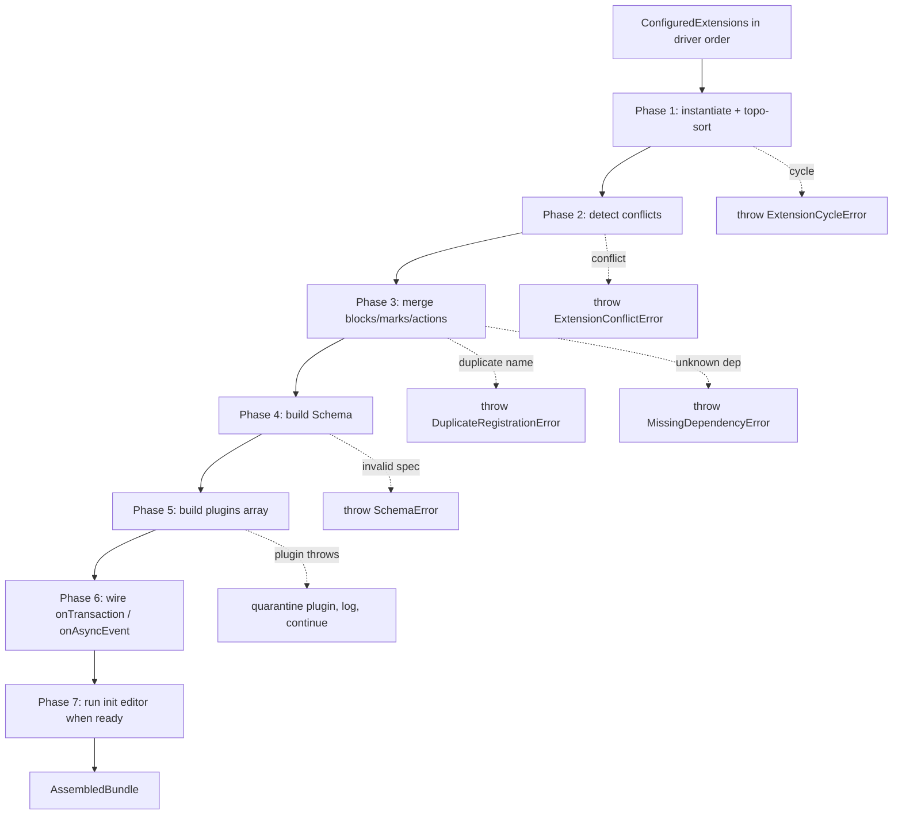

# Plim Architecture — Extensions

> Status: **Authoritative spec, design phase**. Defines the extension API
> (`defineExtension`), the `ExtensionManager` assembly pipeline, lifecycle
> hooks, caching, the built-in extension ship list, and worked recipes.
>
> Companion docs:
> - [`00-overview.md`](./00-overview.md) — primitives & layered architecture.
> - [`01-schema-and-state.md`](./01-schema-and-state.md) — `Schema`, `EditorState`, `Plugin`, `Step`.
> - [`03-actions-and-triggers.md`](./03-actions-and-triggers.md) — `Action`, triggers, validation.
> - [`06-history-and-snapshots.md`](./06-history-and-snapshots.md) — history plugin contract.
> - [`07-react-bindings.md`](./07-react-bindings.md) — React node-view bridge, `react-bridge` extension.
>
> Inspiration: Tiptap's [`ExtensionManager`](https://github.com/ueberdosis/tiptap/blob/main/packages/core/src/ExtensionManager.ts).
> We borrow the *shape* (factories, dependency resolution, schema merging) but
> not the runtime — Plim has no ProseMirror import.

---

## 1. `defineExtension`

`defineExtension` is the only public entry point for authoring extensions.
It returns a **factory**, not an extension instance — instantiation is the
driver's job (see §2).

```ts
// @plim/core

import type { AgnosticEditor } from '@plim/editor';
import type {
  BlockSpec,
  MarkSpec,
  ActionSpec,
  Plugin,
  Transaction,
  TransactionContext,
  AsyncEvent,
  AsyncEventContext,
  ReadOnlyState,
} from '@plim/core';

export interface ExtensionDef {
  /** Unique identifier. Two extensions with the same name throw at assembly. */
  name: string;
  /** Optional semver. Used by `dependsOn` range checks (§10). */
  version?: string;
  /** Block specs contributed by this extension. */
  registeredBlocks?: BlockSpec[];
  /** Mark specs contributed by this extension. */
  registeredMarks?: MarkSpec[];
  /** Action specs contributed by this extension. */
  registeredActions?: ActionSpec[];
  /** Low-level plugins (input rules, paste rules, decorations, etc.). */
  plugins?: Plugin[];
  /** Fires after every committed transaction. May dispatch follow-up transactions. */
  onTransaction?: (tr: Transaction, ctx: TransactionContext) => void;
  /** Default async-event listener — used as a fallback when the editor has no listener. */
  onAsyncEvent?: (
    event: AsyncEvent,
    state: ReadOnlyState,
    ctx: AsyncEventContext,
  ) => Promise<unknown> | unknown;
  /** Other extension names that must be present and instantiated first. */
  dependsOn?: Array<string | { name: string; range: string }>;
  /** Other extension names that must NOT be present. */
  conflictsWith?: string[];
  /** Higher numbers sort earlier in plugin/action ordering. Default: 0. */
  priority?: number;
  /** Called once after the editor is ready (post initial content load). */
  init?: (editor: AgnosticEditor) => void | (() => void);
  /** Called when the editor unmounts or the driver is reconfigured. */
  destroy?: () => void;
}

export interface ExtensionFactory<TConfig = void> {
  /** Brand-checked identifier for caching. */
  readonly __id: string;
  /** Invoke to bind a config; returns a configured factory ready to pass to PlimDriver. */
  (config: TConfig): ConfiguredExtension<TConfig>;
}

export interface ConfiguredExtension<TConfig = void> {
  readonly __id: string;
  readonly config: TConfig;
  readonly factoryName: string;
  /** Called by the driver — never call this directly. */
  instantiate(editor: AgnosticEditor): ExtensionDef;
}

export function defineExtension<TConfig = void>(
  factory: (editor: AgnosticEditor, config: TConfig) => ExtensionDef,
): ExtensionFactory<TConfig>;
```

The factory closure receives both the live `AgnosticEditor` and the
caller-supplied config so authors can stash refs, register editor-side
state, and read config in one place. **The editor passed to the factory
is not yet `isReady`** — it has its container adapter and async event
bus, but no document or selection. Heavy work belongs in `init(editor)`,
which runs post-ready.

`defineExtension` performs no work at module load: it simply records the
factory and stamps an internal `__id` (a frozen symbol-string pair) used
for caching (§4).

---

## 2. Extension instantiation

Extensions are passed to the driver as **invoked factory results**:

```ts
import { PlimDriver } from '@plim/core';
import { coreExtension } from '@plim/extensions-core';
import { markdownExtension } from '@plim/extensions-markdown';
import { mentionExtension } from '@plim/extensions-mention';

const plim = new PlimDriver({
  extensions: [
    coreExtension(),
    markdownExtension(),
    mentionExtension({ trigger: '@', fetchSuggestions }),
  ],
});
```

Each call (`coreExtension()`, `mentionExtension({ … })`) returns a
`ConfiguredExtension` carrying the config. The driver does **not** call
`instantiate` at construction time — instantiation is deferred until
`deriveEditor(plim, …)` runs and an `AgnosticEditor` exists.

Once instantiated, the resulting `ExtensionDef` is cached (§4) keyed on
`(driverId, factory.__id, hash(config))`. Subsequent editors derived
from the same driver with the same configured extension reuse the same
schema slice and plugin instances — `init`/`destroy` still run
per-editor, but block specs, mark specs, and plugin objects are shared.

> **Why factories, not classes?** Configuration must be inspectable
> (for caching) and the editor instance must be available at config
> time. Classes invert this: you'd need a separate `setEditor` step.
> Factories collapse both into one closure.

---

## 3. `ExtensionManager`

`ExtensionManager` is internal to `@plim/core` and is constructed once
per `AgnosticEditor`. It owns the assembly pipeline:

```ts
// @plim/core/src/extension-manager.ts

export class ExtensionManager {
  constructor(
    private readonly driver: PlimDriver,
    private readonly editor: AgnosticEditor,
    private readonly configured: ConfiguredExtension[],
  ) {}

  /** Runs phases 1-7. Returns the assembled bundle. */
  assemble(): AssembledBundle;
}

export interface AssembledBundle {
  schema: Schema;
  plugins: Plugin[];
  actions: ActionSpec[];
  defs: ReadonlyMap<string, ExtensionDef>;
  /** Plugin keys whose `init`/`apply` threw and were quarantined (§12). */
  quarantined: ReadonlySet<string>;
}
```

### 3.1 Assembly pipeline



#### Phase 1 — resolve dependency graph

1. For each `ConfiguredExtension`, call `instantiate(editor)` once and
   collect `ExtensionDef`s into a `Map<name, def>`. Duplicate names
   throw `DuplicateExtensionError` immediately.
2. Build a directed graph from `dependsOn`. Each entry is normalized:
   `'core'` becomes `{ name: 'core', range: '*' }`.
3. Verify each dependency is present. Missing → `MissingDependencyError`.
4. Topological sort. Cycle → `ExtensionCycleError` listing the cycle.
5. Within a topological level, ties break by `priority` desc, then by
   driver-config order. The result is a deterministic linear order
   used by every subsequent phase.

#### Phase 2 — detect conflicts

For each def, scan `conflictsWith`. Any pair flagged → `ExtensionConflictError`.
This is independent of dependency order.

#### Phase 3 — merge contributions

Walk extensions in topo order:

- **Blocks**: `registeredBlocks` are flattened into a single
  `Map<name, BlockSpec>`. A duplicate block name throws
  `DuplicateRegistrationError`. Use `extendBlock` (§9) instead.
- **Marks**: same treatment.
- **Actions**: actions with the same name are an error **unless** the
  later one is an `extendAction` patch. Action ordering (for trigger
  resolution) is `priority desc, then topo order asc`.

#### Phase 4 — build `Schema`

Pass the merged block & mark maps to `new Schema({ blocks, marks })`.
Schema construction validates content expressions, mark allow-lists,
and parseDOM/toDOM presence. See [`01-schema-and-state.md`](./01-schema-and-state.md) §2.

#### Phase 5 — build `plugins[]`

The plugin array is the concatenation, **in this exact order**, of:

1. **`historyPlugin`** — must be first so its `appendTransaction` sees
   raw user transactions before any mutator rewrites them. (See
   [`06-history-and-snapshots.md`](./06-history-and-snapshots.md).)
2. **`inputRulesPlugin`** — folds `defineInputRule` rules contributed
   by extensions (e.g. `markdown`'s `^# `). See
   [`04-input-and-paste.md`](./04-input-and-paste.md) §3.
3. **`pasteRulesPlugin`** — folds `definePasteRule` rules. See
   [`04-input-and-paste.md`](./04-input-and-paste.md) §5.
4. **`keymapPlugin`** — built from the union of action triggers of kind
   `keyboard.shortcut`. Higher-priority actions win ambiguity.
5. **`decorationsPlugin`** — aggregates decoration sources (selection
   indicator, drop cursor, search highlights, slash-menu cursor).
6. **Custom plugins** — extensions' `plugins?: Plugin[]`, in topo order
   (priority-broken ties).
7. **`extensionStatePlugin`** — synthetic plugin that exposes
   `getExtensionState(name)` (§8). Always last so it can observe
   everything.

The order matters because plugins compose via `appendTransaction` and
state derivation walks the array head-to-tail. History first means
undo captures the *user's* transaction, not the post-rewrite version.
`extensionStatePlugin` last means custom-plugin authors can build
state that downstream consumers read in the same tick.

#### Phase 6 — wire listeners

- `onTransaction` hooks are appended to `editor.onTransaction(...)` in
  topo order. They run **after** plugins have applied — they are
  observers and side-effect emitters, not appendTransaction. To
  rewrite a transaction, write a `Plugin` with `appendTransaction`.
- `onAsyncEvent` hooks are registered with the editor's async event
  bus as **default** listeners — they fire only if no explicit
  `editor.onAsyncEvent(name, fn)` listener is registered for that event.
  Multiple defaults for the same event are an error at assembly.

#### Phase 7 — `init(editor)`

Once `editor.isReady` resolves, walk extensions in topo order and call
`init(editor)`. The return value (if any) is treated as a teardown
function and stored alongside `destroy()` for unmount. `init` may
throw — the manager catches, logs with the extension name, and
continues. The throwing extension is added to `quarantined`.

---

## 4. Caching

Caching is what makes "same extensions across many editors" cheap.

```ts
type CacheKey = `${string}::${string}::${string}`;
//                driverId    factoryId   configHash

interface ExtensionCache {
  get(key: CacheKey): CachedEntry | undefined;
  set(key: CacheKey, entry: CachedEntry): void;
  invalidate(driverId: string): void;
}

interface CachedEntry {
  def: ExtensionDef;          // shared across editors
  schemaSlice: SchemaSlice;   // compiled block/mark specs from this ext
  pluginPrototypes: Plugin[]; // plugin objects (state is per-editor)
}
```

- **`driverId`** is generated at `new PlimDriver(...)` time.
- **`factoryId`** is `ExtensionFactory.__id` — a frozen string set by
  `defineExtension`.
- **`configHash`** is a stable structural hash of the config object
  (`hashStable(config)` — sorts keys, handles primitives, arrays,
  nested objects, and `Date`/`RegExp`; throws on functions or class
  instances unless they expose `__hash`).

What **is** cached:
- The `ExtensionDef` returned by `instantiate`.
- Compiled schema slices (block/mark specs converted to internal form).
- `Plugin` *objects* (their `state.init`/`state.apply` are pure).

What **is not** cached:
- `init()` / `destroy()` callbacks (per-editor lifecycle).
- Plugin **state instances** (per-editor by definition).
- `onTransaction` / `onAsyncEvent` registrations.

### Invalidation

- `driver.reconfigure(...)` invalidates the entire cache for that
  driver and reruns the assembly pipeline.
- A factory that intentionally produces non-deterministic output
  (e.g. captures `Date.now()` in its config) must opt out of caching:
  `defineExtension(...)` accepts a `cache: false` option in its
  builder closure. Authoring such an extension is discouraged.

---

## 5. Lifecycle hooks

| Hook | When | Receives | Notes |
|------|------|----------|-------|
| `factory(editor, config)` | Once per `(driver, configHash)` pair, lazily on first `deriveEditor`. | `editor` (not yet ready), `config` | No DOM, no document. |
| `init(editor)` | Once per editor, after `editor.isReady`. | `editor` | Safe to read state, dispatch transactions, attach observers. May return a teardown function (called before `destroy`). |
| `destroy()` | On `editor.unmount()` or `driver.reconfigure()`. | — | Must release any DOM listeners, observers, intervals. |
| `onTransaction(tr, ctx)` | After every committed transaction, including ones from `init` itself. | `tr`, `ctx = { state, prevState, dispatch, editor, mapping }` | Synchronous. May call `ctx.dispatch(tr')` to chain — chained tr's run on next microtask, not the current dispatch loop. |
| `onAsyncEvent(event, state, ctx)` | Default async-event listener; runs only if no explicit listener for that event name is registered on the editor. | `event` (`{ name, payload }`), `state` (read-only), `ctx` (`{ createTransaction, triggerAsyncEvent, dispatch }`) | Async; supports cancellation via the action's `cancellationTriggers`. |

`init` and `destroy` errors are isolated per-extension. `onTransaction`
errors are caught and disable that extension's `onTransaction` for the
rest of the session (see §12).

---

## 6. Built-in extensions ship list

Every built-in is a `defineExtension` factory living in its own
package. Each has a TS factory signature and exposes the same API
shape — there is no "core API" that built-ins use that third-party
extensions can't.

```ts
// @plim/extensions-core
export const coreExtension: ExtensionFactory<void>;
//   Bundles: paragraph, text; history plugin; keymap plugin scaffold;
//   undo/redo actions (Mod+Z / Mod+Shift+Z); cut/copy/paste actions;
//   default validation rules ('selectionNotEmpty', 'startOfBlock', etc.).
//   Always required. Most other built-ins `dependsOn: ['core']`.

// @plim/extensions-marks-basic
export const marksBasicExtension: ExtensionFactory<{
  enabled?: Array<'bold' | 'italic' | 'underline' | 'strikethrough'
                | 'code' | 'link' | 'highlight'>;
}>;
//   Marks: bold, italic, underline, strikethrough, code, link, highlight.
//   Actions: Mod+B, Mod+I, Mod+U, Mod+Shift+S, Mod+E, Mod+K, Mod+Shift+H.

// @plim/extensions-blocks-basic
export const blocksBasicExtension: ExtensionFactory<{
  enabled?: Array<'heading' | 'bulletedList' | 'numberedList' | 'todoList'
                | 'quote' | 'divider' | 'code' | 'image' | 'embed'
                | 'rawHtml' | 'table'>;
}>;
//   Blocks: heading (levels 1-3), bulletedList, numberedList, todoList,
//   quote, divider, code, image, embed, rawHtml, table.

// @plim/extensions-markdown
export const markdownExtension: ExtensionFactory<{
  rules?: 'all' | InputRuleId[];
}>;
//   Input rules: '# ' → heading, '* ' → bulleted, '1. ' → numbered,
//   '[] ' → todo, '> ' → quote, '--- ' → divider, '```' → code,
//   '**x**' / '*x*' / '`x`' / '~~x~~' / '[x](url)' inline rules.
//   Depends on blocks-basic + marks-basic.

// @plim/extensions-paste-rules
export const pasteRulesExtension: ExtensionFactory<{
  rules?: PasteRuleId[];
}>;
//   URL → link auto-conversion, raw HTML sanitization, markdown paste,
//   image-as-data-url paste. Depends on marks-basic.

// @plim/extensions-slash-command
export const slashCommandExtension: ExtensionFactory<{
  commands: SlashCommand[];
}>;
//   Wires the '/' action and the showSlashCommandMenu async event.

// @plim/extensions-mention
export const mentionExtension: ExtensionFactory<{
  trigger?: string;          // default '@'
  fetchSuggestions: (query: string) => Promise<MentionItem[]>;
}>;

// @plim/extensions-emoji
export const emojiExtension: ExtensionFactory<{
  trigger?: string;          // default ':'
  data?: EmojiDataset;
}>;

// @plim/extensions-databases
export const databasesExtension: ExtensionFactory<DatabasesConfig>;
//   Inline databases: tables, boards, calendars; binds to @plim/databases.

// @plim/extensions-react-bridge
export const reactBridgeExtension: ExtensionFactory<{
  reactDOM: typeof import('react-dom/client');
}>;
//   Required when using @plim/react. Routes block/mark `toComponent`
//   through React node views. See 07-react-bindings.md.
```

A typical app config:

```ts
new PlimDriver({
  extensions: [
    coreExtension(),
    marksBasicExtension(),
    blocksBasicExtension(),
    markdownExtension(),
    pasteRulesExtension(),
    slashCommandExtension({ commands }),
    mentionExtension({ fetchSuggestions }),
    emojiExtension(),
    reactBridgeExtension({ reactDOM }),
  ],
});
```

---

## 7. Extension recipes

### 7.1 `characterCount` — read-only state via `getExtensionState`

```ts
import { defineExtension, definePlugin, type Plugin } from '@plim/core';

interface CountState { chars: number; words: number }

export const characterCountExtension = defineExtension<void>((editor) => {
  const plugin: Plugin<CountState> = definePlugin({
    key: 'characterCount',
    state: {
      init: (_, state) => computeCount(state.doc),
      apply: (tr, prev, _oldState, newState) =>
        tr.docChanged ? computeCount(newState.doc) : prev,
    },
  });

  return {
    name: 'characterCount',
    version: '1.0.0',
    plugins: [plugin],
  };
});

// usage
const ext = characterCountExtension();
// ...
const { chars, words } = editor.getExtensionState<CountState>('characterCount');
```

`getExtensionState(name)` resolves to the plugin state of the plugin
whose `key` matches `name`, scoped to that extension (§8).

### 7.2 Custom block — `callout` with `toComponent`

```ts
import { defineExtension, defineBlock, type BlockPayload } from '@plim/core';

const calloutBlock = defineBlock<{ tone: 'info' | 'warn' | 'danger' }>({
  name: 'callout',
  type: 'standalone',
  nestable: true,
  defaultAttributes: { tone: 'info' },
  parseDOM: [{ tag: 'aside[data-block-type="callout"]', getAttrs: el => ({
    tone: (el.getAttribute('data-tone') ?? 'info') as 'info'|'warn'|'danger',
  }) }],
  toDOM: (p: BlockPayload) => {
    const el = document.createElement('aside');
    el.dataset.blockType = 'callout';
    el.dataset.tone = p.attributes.tone;
    return el;
  },
  toComponent: (p: BlockPayload) => (
    <aside data-block-type="callout" data-tone={p.attributes.tone}>
      {p.content}
    </aside>
  ),
});

export const calloutExtension = defineExtension<void>(() => ({
  name: 'callout',
  dependsOn: ['core'],
  registeredBlocks: [calloutBlock],
}));
```

### 7.3 Custom mark — `kbd`

```ts
import { defineExtension, defineMark, defineAction, triggers } from '@plim/core';

const kbdMark = defineMark({
  name: 'kbd',
  parseDOM: [{ tag: 'kbd' }],
  toDOM: (p) => {
    const el = document.createElement('kbd');
    el.textContent = p.text;
    return el;
  },
  toComponent: (p) => <kbd>{p.text}</kbd>,
});

export const kbdExtension = defineExtension<void>(() => ({
  name: 'kbd',
  dependsOn: ['core'],
  registeredMarks: [kbdMark],
  registeredActions: [
    defineAction('kbd', {
      trigger: triggers.keyboard.shortcut('Mod+Shift+K'),
      triggerValidationRules: ({ and }) => and([
        'selectionNotEmpty',
        'blockSupportsDecoration',
      ]),
      perform: async (state, ctx) => {
        await ctx.createTransaction()
          .toggleMark('kbd', { from: state.selection.from, to: state.selection.to })
          .commit();
      },
    }),
  ],
}));
```

### 7.4 Custom action — `insertToday` on `Mod+;`

```ts
import { defineExtension, defineAction, triggers } from '@plim/core';

export const insertTodayExtension = defineExtension<{ format?: 'iso' | 'long' }>(
  (_editor, config) => ({
    name: 'insertToday',
    dependsOn: ['core'],
    registeredActions: [
      defineAction('insertToday', {
        trigger: triggers.keyboard.shortcut('Mod+;'),
        perform: async (state, ctx) => {
          const fmt = config.format ?? 'iso';
          const today = fmt === 'iso'
            ? new Date().toISOString().slice(0, 10)
            : new Date().toLocaleDateString(undefined, {
                year: 'numeric', month: 'long', day: 'numeric',
              });
          await ctx.createTransaction()
            .insertText(today, state.selection.from)
            .commit();
        },
      }),
    ],
  }),
);
```

### 7.5 Async-event extension — `linkPicker`

```ts
import { defineExtension, defineAction, triggers } from '@plim/core';

interface LinkPickerResult { href: string; label?: string }

export const linkPickerExtension = defineExtension<{
  open: (query: string) => Promise<LinkPickerResult | null>;
}>((_editor, config) => ({
  name: 'linkPicker',
  dependsOn: [{ name: 'marks-basic', range: '^1.0.0' }],
  registeredActions: [
    defineAction('openLinkPicker', {
      trigger: triggers.keyboard.shortcut('Mod+K'),
      cancellationTriggers: [triggers.keyboard.key('Escape')],
      perform: (state, ctx) => ctx.triggerAsyncEvent('showLinkPicker', {
        initialQuery: state.selection.text,
      }),
    }),
  ],
  onAsyncEvent: async (event, state, ctx) => {
    if (event.name !== 'showLinkPicker') return;
    const result = await config.open(event.payload.initialQuery);
    if (!result) return; // cancelled
    await ctx.createTransaction()
      .toggleMark('link', {
        from: state.selection.from,
        to: state.selection.to,
        attributes: { href: result.href },
      })
      .commit();
  },
}));
```

This is the recommended pattern for any UI-driven async flow:
**action triggers the event, default `onAsyncEvent` listener handles
it.** Apps may override by registering their own listener with
`editor.onAsyncEvent('showLinkPicker', …)`, in which case the
extension's default is bypassed.

---

## 8. Extension state

Extension state piggybacks on the plugin state mechanism described in
[`01-schema-and-state.md`](./01-schema-and-state.md) §6.

```ts
// declared on the extension's plugin
const plugin = definePlugin<MyState>({
  key: 'myExt',
  state: {
    init: (config, state) => initial,
    apply: (tr, prev, oldState, newState) => next,
  },
});

// read from anywhere
const value = editor.getExtensionState<MyState>('myExt');
```

Rules:
- `getExtensionState(name)` resolves the plugin whose `key === name`.
  If the extension declares multiple plugins, namespace them
  (`'myExt:status'`, `'myExt:cache'`) and expose a small selector
  helper from your package.
- The returned value is **frozen**. To mutate, dispatch a transaction
  with metadata (`tr.setMeta('myExt', { … })`) that your `apply`
  function reads.
- Extension state is included in snapshots only if the plugin opts in
  (`state.toJSON` / `state.fromJSON` — see
  [`06-history-and-snapshots.md`](./06-history-and-snapshots.md) §7).

---

## 9. Override / extend

Re-registering a name throws (§3.3). Surgical modifications go through
**three extend helpers**, each producing a patch that the manager
applies after merge:

```ts
import { extendBlock, extendMark, extendAction } from '@plim/core';

extendBlock('paragraph', {
  attributes: { align: { default: 'left' } },
  toDOM: (p, base) => {
    const el = base(p);
    if (p.attributes.align) el.style.textAlign = p.attributes.align;
    return el;
  },
});

extendMark('link', {
  attributes: { rel: { default: 'noopener' } },
});

extendAction('bold', {
  triggerValidationRules: ({ and }) => and([
    'selectionNotEmpty',
    'blockSupportsDecoration',
    'notInsideCodeBlock', // tighten the existing rule
  ]),
});
```

Patches are returned from a `defineExtension` factory like any other
contribution:

```ts
defineExtension(() => ({
  name: 'paragraph-align',
  dependsOn: ['blocks-basic'],
  registeredBlocks: [extendBlock('paragraph', { … })],
}));
```

### Precedence

For any single named entity (block, mark, or action):

1. **Own registration** (the entity's first `defineBlock`/`defineMark`/`defineAction`). Highest precedence; shape comes from here.
2. **Extend patches**, applied in topological order. Later patches see earlier patches' result via the `base` callback.
3. **Built-in default** (the unmodified spec).

The `base` argument passed to `toDOM`/`toComponent`/`perform` always
points to the *previous* version in this chain — never to the
unrelated original — making patches composable.

---

## 10. Versioning & compatibility

Each extension may declare `version` (semver). Each `dependsOn` entry
may declare a `range` (semver range, npm syntax). At assembly:

```ts
dependsOn: [
  'core',                                  // any version
  { name: 'marks-basic', range: '^1.0.0' }, // ^1 required
]
```

Behavior:

- **Missing dep** → `MissingDependencyError` (hard fail).
- **Out-of-range dep** → console warning at assembly:
  > `Extension 'linkPicker' expects 'marks-basic' ^1.0.0 but found 2.3.0. Continuing — behavior may be undefined.`
  Assembly does **not** fail; the manager logs and proceeds. We treat
  this as a warning because monorepos and pinned third-party builds
  routinely drift in patch/minor without breaking integration.
- **Major mismatch** (`'^1.0.0'` requested, `2.x` found): same warning,
  upgraded to an `error`-level log. Future versions may make this
  fatal behind a `strictPeerDeps: true` driver flag.
- Extensions without a `version` are treated as `0.0.0` and pass any
  range that allows `0.0.0` (i.e. `'*'` only).

---

## 11. Testing extensions

`@plim/test` exports `createTestEditor`, a thin wrapper that mounts an
`AgnosticEditor` against an in-memory container adapter:

```ts
import { createTestEditor } from '@plim/test';
import { coreExtension } from '@plim/extensions-core';
import { kbdExtension } from './kbd';

test('kbd registers a mark and a Mod+Shift+K action', async () => {
  const { editor, plim } = await createTestEditor({
    extensions: [coreExtension(), kbdExtension()],
    initialContent: 'hello world',
  });

  // assert registration
  expect(plim.schema.marks.has('kbd')).toBe(true);
  expect(plim.actions.byName('kbd')).toBeDefined();

  // simulate a transaction
  await editor.dispatchAction('kbd', { from: 0, to: 5 });
  expect(editor.getDoc().textBetween(0, 5).marks).toContainEqual({
    name: 'kbd', attributes: {},
  });

  // simulate an async event
  const result = await editor.simulateAsyncEvent('showLinkPicker', {
    initialQuery: 'foo',
  });
  expect(result).toBeDefined();

  // simulate a keyboard trigger
  await editor.simulateKey('Mod+Shift+K');
});
```

`createTestEditor` accepts:

```ts
interface CreateTestEditorOptions {
  extensions: ConfiguredExtension[];
  initialContent?: string | BlockPayload[];
  readonly?: boolean;
  /** When true, plugin errors throw instead of being quarantined. Useful for tests. */
  strictPlugins?: boolean;
}
```

Recommended assertions per extension:

1. Each registered block/mark/action appears in `plim.schema` /
   `plim.actions`.
2. `init` ran (assert side effects or read `getExtensionState`).
3. Each declared `onAsyncEvent` resolves on `simulateAsyncEvent`.
4. `destroy()` runs on `editor.unmount()` — assert teardown.

---

## 12. Error handling

| Failure | When | Result |
|---------|------|--------|
| Duplicate extension name | Phase 1 | `DuplicateExtensionError` thrown |
| Cycle in `dependsOn` | Phase 1 | `ExtensionCycleError` thrown |
| Missing dep | Phase 1 | `MissingDependencyError` thrown |
| `conflictsWith` violated | Phase 2 | `ExtensionConflictError` thrown |
| Duplicate block / mark / action name | Phase 3 | `DuplicateRegistrationError` thrown |
| Invalid block/mark spec | Phase 4 | `SchemaError` thrown |
| Plugin `state.init` throws | Phase 5 | logged, plugin **quarantined**, assembly continues |
| Plugin `state.apply` throws | runtime | logged once with key + error, plugin disabled for the rest of the session, last-known-good state retained |
| `onTransaction` throws | runtime | logged, that extension's `onTransaction` disabled for the session |
| `onAsyncEvent` rejects | runtime | logged; the originating action sees the rejection through its `perform` await |
| `init(editor)` throws | Phase 7 | logged with extension name, extension marked quarantined; `destroy` still called on unmount |
| Out-of-range `dependsOn` | Phase 1 | warning logged; assembly continues (§10) |

**All hard errors throw at assembly time, never at runtime.** The two
exceptions are runtime plugin/listener throws, which are isolated to
preserve the editor — losing one extension is preferable to bricking
the editor.

The `AssembledBundle.quarantined` set is exposed on
`plim.diagnostics()` so apps can surface partial-failure UI:

```ts
const diag = plim.diagnostics();
if (diag.quarantinedExtensions.length) {
  console.warn('Plim: some extensions failed to load', diag.quarantinedExtensions);
}
```

---

## 13. Cross-references

- [`01-schema-and-state.md`](./01-schema-and-state.md) — block/mark spec shape, `Plugin` contract, plugin state.
- [`03-actions-and-triggers.md`](./03-actions-and-triggers.md) — `defineAction`, triggers, validation rules referenced by §7.3 / §7.4 / §7.5.
- [`04-input-and-paste.md`](./04-input-and-paste.md) — `defineInputRule`, `definePasteRule` used by `markdown` and `paste-rules` built-ins.
- [`06-history-and-snapshots.md`](./06-history-and-snapshots.md) — history plugin ordering and snapshot/plugin-state interplay.
- [`07-react-bindings.md`](./07-react-bindings.md) — `react-bridge` extension, React node-view rendering of `toComponent`.
