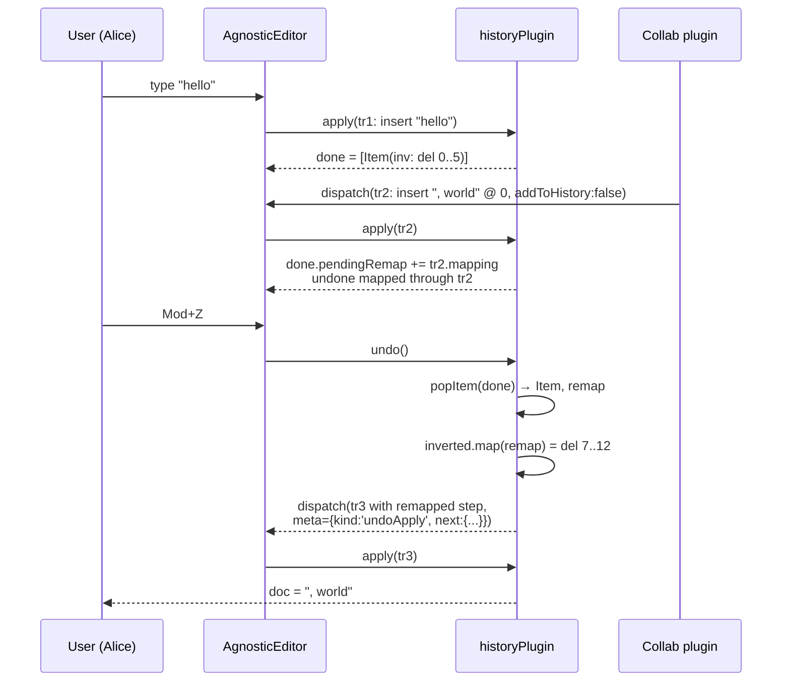

# Plim Architecture — History & Snapshots

> Status: **Authoritative spec, design phase**. Inspired by `prosemirror-history` (linked-list branches, time-grouping, mapping-aware undo) but **reimplemented** in `@plim/core`. We do not depend on ProseMirror.
>
> Companion docs: [`00-overview.md`](./00-overview.md), [`01-schema-and-state.md`](./01-schema-and-state.md) (Step / Mapping / Transaction), [`05-extensions.md`](./05-extensions.md) (plugin contract).
>
> Normative source: `api-wishlist.md` — sections **History API** and **Snapshot API**.

---

## 1. Goals

1. **Wishlist parity.** `plim.getHistory()`, `editor.history`, `new Snapshot(editor)`, `editor.restoreSnapshot(snapshot)` — every snippet in the wishlist must compile and behave as documented.
2. **Cheap undo in the common case.** Typing 100 characters and hitting <kbd>Mod+Z</kbd> 100 times is `O(1)` per undo on average. Branch maintenance is `O(n)` only when the depth cap forces compaction.
3. **Collab-safe.** When a remote (or external) transaction lands between a user edit and an undo, the undo's inverse step is remapped through the intervening `Mapping`. If the inverse becomes a no-op, the undo silently drops to the next entry.
4. **Schema-aware snapshots.** A snapshot is restorable only into a schema whose signature matches, or for which a registered migration produces a matching signature.
5. **Pure data, side-effect-free.** History is a plugin; snapshots are values. Restore happens via a normal `Transaction` so plugins/listeners observe it like any other edit.

---

## 2. Where history lives

History is a **plugin** registered automatically by `PlimDriver` (unless `disableHistory: true` is passed). It owns one piece of plugin state — a `HistoryState` — and adds two built-in actions: `undo` and `redo`.

```ts
// @plim/core
import { historyPlugin } from './plugins/history';

new PlimDriver({
  // ...
  // historyPlugin is registered by default; pass options to override:
  history: { depth: 100, newGroupDelay: 500 },
});
```

The public façade (`history.undo()`, `history.canUndo`, …) is a thin wrapper that reads/writes this plugin state. See §6.

---

## 3. `HistoryState`

```ts
export interface HistoryState {
  /** Past edits — head is the most recent. Pop to undo. */
  done: Branch;
  /** Future edits — head is the most recently undone. Pop to redo. */
  undone: Branch;
  /** Wall-clock ms of the last appended item, used for time-grouping. */
  prevTime: number;
  /** Composition id of the last appended tr (for IME / paste batches). */
  prevComposition: number;
  /** Selection ranges (as [from, to] pairs) of the last appended item — used to detect whether the next typed character is contiguous and groupable. */
  prevRanges?: number[][];
  /** Monotonic id of the saved checkpoint (for atSavedCheckpoint / markSaved). */
  savedCheckpoint: number | null;
  /** Monotonic id of the current head item (incremented every push). */
  currentCheckpoint: number;
}
```

`done` and `undone` are `Branch` values (next section). Everything else is bookkeeping for grouping and the dirty-flag API.

---

## 4. `Branch` — the undo/redo stack

A `Branch` is an immutable, persistent linked list of `Item`s with:

- `O(1)` head insert (`addItem`) and head pop (`popItem`).
- `O(1)` `eventCount` lookup.
- `O(n)` `merge` only when two branches are concatenated for compaction (rare — see §4.4).

```ts
export interface Item {
  /** The forward step that was applied. Stored so `merge` can rebuild a Mapping. */
  readonly step: Step;
  /** The inverse step, computed at push time. Re-mapped at undo time. */
  readonly inverted: Step;
  /** Optional: selection to restore when this item is undone. */
  readonly selection?: SelectionJSON;
  /** Optional: stable ids touched by this step (for collab dedup). */
  readonly ids?: readonly string[];
  /** True if this item starts a new "event" (group boundary). False if it
   *  continues the previous group (e.g. a contiguous typed character). */
  readonly startsEvent: boolean;
}

export interface Branch {
  /** Head node (most recent) — null when empty. */
  readonly head: BranchNode | null;
  /** Number of group boundaries reachable from head (= number of undo steps). */
  readonly eventCount: number;
  /** Pointer used to re-root the branch after a depth-trim; see §4.4. */
  readonly nextRoot: BranchNode | null;
}

interface BranchNode {
  readonly item: Item;
  readonly prev: BranchNode | null;
}
```

### 4.1 `addItem`

```ts
function addItem(branch: Branch, item: Item): Branch;
```

Cons the item to the head. If `item.startsEvent` is true, increments `eventCount`. `O(1)`.

### 4.2 `popItem`

```ts
function popItem(branch: Branch): { item: Item; rest: Branch } | null;
```

Returns the head item and a new branch with `head = head.prev`. If the popped item was a group boundary, decrements `eventCount`. `O(1)`.

### 4.3 `eventCount`

```ts
function eventCount(branch: Branch): number; // returns branch.eventCount in O(1)
```

Used by `canUndo` / `canRedo`: a branch can produce an undo iff `eventCount > 0`. Empty groups (a flushed `closeGroup` with no items) cannot exist by construction.

### 4.4 `merge` and the depth cap

When `done.eventCount` exceeds `depth`, the *oldest* event is dropped. Because branches are linked from head→tail, dropping the tail is `O(n)` in branch length. We amortise this:

- `nextRoot` points at the node that will become the new tail next time we trim.
- After every successful push, if `eventCount > depth`, we walk one node toward the tail and update `nextRoot`. After enough pushes, the trim itself is `O(1)`.

```ts
function merge(a: Branch, b: Branch): Branch; // used for compaction; O(|b|)
```

`merge` is called when two adjacent groups are coalesced (typing collapse) — `b` is short (usually 1–10 items), so this is effectively `O(1)` in practice.

> **Net result:** typical-case undo/redo and push are `O(1)`. Worst case (`depth` overflow with no prior amortised walks) is `O(n)` once, then `O(1)` again.

---

## 5. `historyPlugin({ depth, newGroupDelay })`

```ts
export interface HistoryOptions {
  /** Max number of *events* (group boundaries) kept in `done`. Default 100. */
  depth?: number;
  /** Window in ms within which contiguous typed characters coalesce
   *  into one undo entry. Default 500. */
  newGroupDelay?: number;
}

export function historyPlugin(opts?: HistoryOptions): Plugin<HistoryState>;
```

The plugin's `state` reducer:

```ts
state: {
  init(): HistoryState {
    return {
      done: emptyBranch(),
      undone: emptyBranch(),
      prevTime: 0,
      prevComposition: 0,
      prevRanges: undefined,
      savedCheckpoint: null,
      currentCheckpoint: 0,
    };
  },

  apply(tr: Transaction, prev: HistoryState, oldState, newState): HistoryState {
    const meta = tr.getMeta('history') as HistoryMeta | undefined;

    // 1. Explicit redo/undo transactions update prev directly.
    if (meta?.kind === 'undoApply') return meta.next;
    if (meta?.kind === 'redoApply') return meta.next;

    // 2. closeGroup: just bump prevTime so the next push starts a new group.
    if (meta?.kind === 'closeGroup') {
      return { ...prev, prevTime: 0, prevRanges: undefined };
    }

    // 3. clear: wipe both stacks.
    if (meta?.kind === 'clear') {
      return { ...prev, done: emptyBranch(), undone: emptyBranch(),
               prevTime: 0, prevRanges: undefined };
    }

    // 4. addToHistory: false / kind: 'skip' — do not record.
    if (meta?.kind === 'skip' || meta?.addToHistory === false) {
      // But we DO map `undone` through tr.mapping so future redos still apply.
      return { ...prev, undone: mapBranch(prev.undone, tr.mapping) };
    }

    // 5. Pure selection change with no doc change — update prevRanges only.
    if (!tr.docChanged) {
      if (tr.selectionSet) {
        return { ...prev, prevRanges: rangesOf(tr.selection) };
      }
      return prev;
    }

    // 6. Default: record an item.
    const now = tr.time ?? Date.now();
    const composition = tr.composition ?? 0;
    const isStructural = stepsAreStructural(tr.steps);
    const continuesGroup =
      !isStructural &&
      composition === prev.prevComposition &&
      now - prev.prevTime < (opts?.newGroupDelay ?? 500) &&
      rangesContiguous(prev.prevRanges, rangesOf(tr.selection));

    const items: Item[] = tr.steps.map((step, i) => ({
      step,
      inverted: step.invert(tr.docs[i]),
      selection: i === 0 ? oldState.selection.toJSON() : undefined,
      ids: tr.touchedIds?.[i],
      startsEvent: i === 0 && !continuesGroup,
    }));

    let done = prev.done;
    for (const it of items) done = addItem(done, it);
    done = trimToDepth(done, opts?.depth ?? 100);

    // Recording a new edit clears redo unless meta says preserve.
    const undone = meta?.preserveRedo
      ? mapBranch(prev.undone, tr.mapping)
      : emptyBranch();

    return {
      done,
      undone,
      prevTime: now,
      prevComposition: composition,
      prevRanges: rangesOf(tr.selection),
      savedCheckpoint: prev.savedCheckpoint,
      currentCheckpoint: prev.currentCheckpoint + 1,
    };
  };
}
```

### 5.1 Transaction meta keys

| Meta | Effect |
|------|--------|
| `tr.setMeta('history', { kind: 'add' })` | Default. Record into `done`, clear `undone`. |
| `tr.setMeta('history', { kind: 'skip' })` *or* `{ addToHistory: false }` | Do not record. Map `undone` through `tr.mapping` so a later redo still applies. Used by collab and decoration-only plugins. |
| `tr.setMeta('history', { kind: 'closeGroup' })` | Force the *next* edit to start a new group. The transaction itself may still record items. |
| `tr.setMeta('history', { kind: 'clear' })` | Wipe both stacks. |
| `tr.setMeta('history', { preserveRedo: true })` | Record an item but do **not** clear `undone`. Used internally by `redo`. |
| `tr.setMeta('history', { kind: 'undoApply', next })` *(internal)* | Carries the post-undo `HistoryState`. |
| `tr.setMeta('history', { kind: 'redoApply', next })` *(internal)* | Carries the post-redo `HistoryState`. |

### 5.2 Grouping rules

A new transaction continues the previous group iff **all** of:

1. It is **not structural** — no `SetBlockAttrsStep`, `SplitBlockStep`, `JoinBlockStep`, `MoveStep`, `AddMarkStep`, `RemoveMarkStep`. Plain `ReplaceStep`s that insert/delete text are non-structural.
2. `now - prevTime < newGroupDelay` (default 500 ms).
3. The selection at edit time is contiguous with `prevRanges` (cursor at the previous edit's end position, or contained within it).
4. Composition id is unchanged (an IME composition counts as one group regardless of timing).

Otherwise the new item has `startsEvent: true`.

> Structural changes — even a single one — *always* break the group, both for the structural step itself and for whatever typing follows it. This is what users expect: pressing <kbd>Enter</kbd> mid-paragraph and continuing to type produces two undo entries, not one.

---

## 6. `history` public API

The exact wishlist surface, exposed both on the `PlimDriver` and on each `AgnosticEditor`:

```ts
// @plim/core / @plim/editor
export interface HistoryHandle {
  undo(): boolean;                    // returns true if anything was undone
  redo(): boolean;                    // returns true if anything was redone
  readonly canUndo: boolean;
  readonly canRedo: boolean;
  onChange(cb: (s: HistoryState) => void): Unsubscribe;
  clear(): void;
  closeGroup(): void;
  /** True iff the current head equals the point markSaved last captured. */
  atSavedCheckpoint(): boolean;
  /** Pin the current head as the "saved" point; future atSavedCheckpoint
   *  calls compare against this. */
  markSaved(): void;
  depth(): { undo: number; redo: number };
  serialize(): SerializedHistory;
  restore(s: SerializedHistory): void;
}

declare const plim: PlimDriver;
const history: HistoryHandle = plim.getHistory();      // wishlist form
declare const editor: AgnosticEditor;
const h2: HistoryHandle = editor.history;               // wishlist form
```

### 6.1 Implementation sketch

```ts
function makeHistoryHandle(editor: AgnosticEditor): HistoryHandle {
  const key = historyPluginKey;
  const get = () => key.getState(editor.state)!;

  return {
    undo() {
      const state = editor.state;
      const hs = get();
      if (hs.done.eventCount === 0) return false;
      editor.dispatch(buildUndoTransaction(state, hs));
      return true;
    },
    redo() {
      const state = editor.state;
      const hs = get();
      if (hs.undone.eventCount === 0) return false;
      editor.dispatch(buildRedoTransaction(state, hs));
      return true;
    },
    get canUndo()  { return get().done.eventCount > 0; },
    get canRedo()  { return get().undone.eventCount > 0; },
    onChange(cb)   { return editor.onTransaction(() => cb(get())); },
    clear()        { editor.dispatch(editor.tr.setMeta('history', { kind: 'clear' })); },
    closeGroup()   { editor.dispatch(editor.tr.setMeta('history', { kind: 'closeGroup' })); },
    atSavedCheckpoint() {
      const hs = get();
      return hs.savedCheckpoint !== null
          && hs.savedCheckpoint === hs.currentCheckpoint;
    },
    markSaved() {
      // Mutating "saved" is a doc-noop transaction with a meta hint.
      editor.dispatch(editor.tr.setMeta('history', { kind: 'markSaved' }));
    },
    depth() {
      const hs = get();
      return { undo: hs.done.eventCount, redo: hs.undone.eventCount };
    },
    serialize() { return serializeHistory(get()); },
    restore(s)  { editor.dispatch(editor.tr.setMeta('history', {
                    kind: 'restoreState', next: deserializeHistory(s),
                  })); },
  };
}
```

`plim.getHistory()` resolves to the handle of the editor that the driver currently considers focused. With multiple editors per driver this can be ambiguous — see §8.

---

## 7. Built-in `undo` / `redo` actions

```ts
defineAction('undo', {
  trigger: triggers.keyboard.shortcut('Mod+z'),
  perform: async (_state, ctx) => { ctx.getEditor().history.undo(); },
});

defineAction('redo', {
  trigger: [
    triggers.keyboard.shortcut('Mod+Shift+z'),
    triggers.keyboard.shortcut('Mod+y'),
  ],
  perform: async (_state, ctx) => { ctx.getEditor().history.redo(); },
});
```

### 7.1 `buildUndoTransaction` — the algorithm

1. Pop `done.head` → `{ item, rest }`.
2. The branch may have been built before later transactions were applied. Walk forward through the *intervening* steps (none, in the simple case) to build a `Mapping`. In practice we track this as we go: every transaction whose `apply` did not record (i.e. `addToHistory:false` or selection-only) appended its mapping to a `pendingRemap` that travels with the branch. `popItem` returns this mapping.
3. `mapped = item.inverted.map(remap)`. If the result is `null` (step nullified — e.g. the range it edits no longer exists), drop this item and recurse to the next.
4. Apply `mapped` to the current state to produce `tr`.
5. If `item.selection` is set, apply it (mapped through `tr.mapping`).
6. Push `{ step: mapped, inverted: mapped.invert(tr.docs[0]), selection, startsEvent: true }` onto `undone`.
7. Set meta `{ kind: 'undoApply', next: { ...hs, done: rest, undone: newUndone } }` and dispatch.

Redo is symmetric (`undone` → `done`), and dispatched with `{ preserveRedo: true }` so the redo doesn't wipe its own future.

### 7.2 Worked example — collab transaction between edit and undo

User Alice types `hello`. Then a remote user Bob inserts `, world` *before* Alice's text via a collab transaction (`addToHistory: false`). Alice hits <kbd>Mod+Z</kbd>.

```
t0  doc = ""
t1  Alice: insert "hello" @ 0    → doc = "hello"
                                   done = [ Item{ inverse: delete(0,5) } ]
t2  Bob:   insert ", world" @ 0  → doc = ", worldhello"
                                   tr.setMeta('history', { addToHistory: false })
                                   undone unchanged; done.pendingRemap += tr.mapping
t3  Alice: undo
        pop done → Item{ inverse: delete(0,5) }
        remap delete(0,5) through Bob's mapping (insert 7 chars at 0)
          → delete(7, 12)
        apply → doc = ", world"
        push to undone
```

Without remap, the undo would have deleted `, worl` from Bob's text — corruption. With remap, it cleanly removes only what Alice wrote.

### 7.3 Mermaid — undo flow with concurrent transactions



If `inverted.map(remap)` returns `null` (e.g. Bob deleted Alice's range entirely), the popped item is silently discarded and the next item is tried. Worst case the undo becomes a no-op, never a corruption.

---

## 8. One driver, many editors — `sharedHistory`

The default is **history per editor**: each `AgnosticEditor` derived from the driver gets its own `HistoryState`. This is correct for the overwhelmingly common case (each editor edits an independent doc).

A driver can opt into a shared history via:

```ts
new PlimDriver({
  // ...
  sharedHistory: true,
});
```

When set:

- All editors derived from this driver share a single `HistoryState`, owned by the driver.
- Pushing from any editor updates the shared stack.
- Each item carries an `editorId` so undo can be targeted: `editor.history.undo()` undoes only items pushed from that editor; `plim.getHistory().undo()` undoes the most recent item across all editors.
- Use case: a multi-pane view of the same document (split editor). Without `sharedHistory`, undo in pane B would not see edits made in pane A even though they share the doc.

Per-editor `editor.history` is *always* available; `sharedHistory` only changes what backing store it reads from.

---

## 9. `Snapshot` class

Exact wishlist surface:

```ts
// @plim/core
export class Snapshot {
  constructor(editor: AgnosticEditor, meta?: Record<string, unknown>);

  static deserialize(json: string): Snapshot;
  serialize(): string;

  readonly takenAt: Date;
  readonly schemaVersion: string;   // == schemaSignature
  readonly id: string;              // ULID, generated in ctor
  readonly metadata: Record<string, unknown>;
}

// On AgnosticEditor:
interface AgnosticEditor {
  takeSnapshot(meta?: Record<string, unknown>): Snapshot;
  restoreSnapshot(
    snapshot: Snapshot,
    opts?: { preserveHistory?: boolean }
  ): void;
}
```

`new Snapshot(editor)` and `editor.takeSnapshot()` are equivalent; the latter is provided for symmetry with `restoreSnapshot`.

---

## 10. Snapshot internals

A snapshot is an immutable record of:

```ts
interface SnapshotPayload {
  /** Snapshot format version — bump when payload shape changes. */
  formatVersion: 1;
  /** ULID. */
  id: string;
  /** ISO-8601 timestamp. */
  takenAt: string;
  /** Hash of the schema at capture time. */
  schemaSignature: string;
  /** Document, serialised through Schema.toJSON. */
  docJSON: unknown;
  /** Selection, serialised through Selection.toJSON. */
  selectionJSON: unknown;
  /** storedMarks at capture time. */
  storedMarks: unknown[];
  /** Caller-supplied free-form metadata. */
  metadata: Record<string, unknown>;
}
```

`serialize()` returns `JSON.stringify(payload)`. `Snapshot.deserialize(json)` parses, asserts `formatVersion === 1`, and constructs a frozen `Snapshot`.

### 10.1 Restore as a transaction

`editor.restoreSnapshot(snapshot, { preserveHistory })` does **not** mutate state directly. It builds a single restore transaction:

```ts
function restoreSnapshot(editor, snap, opts = {}) {
  if (snap.schemaSignature !== editor.schema.signature) {
    const migrated = editor.schema.migrateDoc(
      snap.docJSON, snap.schemaSignature, editor.schema.signature
    );
    if (!migrated) throw new SnapshotIncompatibleError(snap, editor.schema);
    snap = withDoc(snap, migrated, editor.schema.signature);
  }

  const newDoc = editor.schema.nodeFromJSON(snap.docJSON);
  const newSel = editor.schema.selectionFromJSON(snap.selectionJSON, newDoc);

  const tr = editor.tr
    .replaceWithDoc(newDoc)        // single ReplaceDocStep
    .setSelection(newSel)
    .setStoredMarks(snap.storedMarks.map(m => editor.schema.markFromJSON(m)))
    .setMeta('snapshotRestore', snap.id);

  if (opts.preserveHistory) {
    // Keep the existing done stack; record the restore as a new event on top.
    tr.setMeta('history', { kind: 'add' });
  } else {
    // Default: clear redo, push restore as a single undoable event.
    tr.setMeta('history', { kind: 'add' });
    // The reducer reads docChanged, not preserveHistory, so we additionally
    // pre-clear the redo branch via a synthetic 'clear-redo' meta.
    tr.setMeta('history', { kind: 'add', preserveRedo: false });
  }

  editor.dispatch(tr);
}
```

Key properties:

- Plugins, listeners, and extensions observe a perfectly normal `Transaction` with `meta.snapshotRestore = snap.id`. They can opt into special handling without privileged hooks.
- The restore is itself **undoable** — pressing <kbd>Mod+Z</kbd> right after restoring returns to the pre-restore state. With `preserveHistory: true`, the original undo stack is also intact.
- `ReplaceDocStep` is a single atomic step (defined in `01-schema-and-state.md`); its inverse is `ReplaceDocStep(oldDoc)`.

### 10.2 `preserveHistory` semantics

| `preserveHistory` | Done stack after restore | Redo stack after restore |
|---|---|---|
| `false` *(default)* | unchanged + `restore` event on top | **cleared** |
| `true`  | unchanged + `restore` event on top | unchanged (mapped through restore) |

The default mirrors how Notion / Google Docs treat "restore version": the restore is itself an undoable action; you can re-do nothing past it because the previous future is no longer reachable.

---

## 11. Schema migration

`Schema.signature` is a stable hash over the **registered set** of blocks and marks: their names, attribute keys, content expressions, and version markers (each `defineBlock` / `defineMark` may pass `version: number`). Two schemas with the same signature are guaranteed to accept the same documents.

```ts
defineMigration({
  from: 'sha256:abc…',     // old schema signature (or '*' for any)
  to:   'sha256:def…',     // new schema signature
  migrate(doc: DocJSON): DocJSON { /* … */ },
});

Schema.migrateDoc(
  doc: DocJSON,
  fromSig: string,
  toSig: string,
): DocJSON | null;          // null when no migration path exists
```

`migrateDoc` searches registered migrations for a path `from → … → to` (BFS). If found, it applies them in order. If not, it returns `null` and `restoreSnapshot` throws:

```ts
class SnapshotIncompatibleError extends Error {
  readonly snapshotSignature: string;
  readonly editorSignature: string;
  readonly snapshotId: string;
}
```

Apps can catch this and present "this snapshot is from an older version" to the user.

---

## 12. Memory considerations

A snapshot's in-memory cost is roughly `O(docSize)` — the doc JSON is the bulk. For a 10k-block document at ~200 bytes/block this is ~2 MB. Recommendations:

1. **Cap retained snapshots.** A timeline UI typically needs the last N (e.g. 50) plus tagged ones; older snapshots should be `serialize()`d to disk/IndexedDB and dropped from RAM.
2. **Prefer history for short-range undo.** History is dramatically cheaper than snapshots — it stores `Step`s, not docs. Snapshots are for *checkpoints*: save points, version markers, "before bulk operation" guards.
3. **Don't snapshot per keystroke.** The time-travel debugging recipe (§13) is a debug-only pattern; production code should snapshot on milestone boundaries.
4. **Compaction.** If two consecutive snapshots `A` and `B` differ only in trivial selection changes, drop `B`. We do not provide an automatic snapshot-compactor (out of scope) but apps can implement one trivially given `docJSON` equality.

---

## 13. Time-travel debugging recipe

```ts
import { PlimDriver, deriveEditor, Snapshot } from '@plim/core';

const plim = new PlimDriver({ /* … */ });
const editor = deriveEditor(plim, { /* … */ });

// 1. Capture a snapshot on every transaction.
const timeline: Snapshot[] = [editor.takeSnapshot({ label: 'initial' })];

editor.onTransaction((tr) => {
  // Skip the recursive restores that we trigger ourselves below.
  if (tr.getMeta('snapshotRestore')) return;
  if (!tr.docChanged) return;
  timeline.push(editor.takeSnapshot({ label: `t${timeline.length}` }));
});

// 2. Build a scrubber UI.
const slider = document.querySelector<HTMLInputElement>('#scrubber')!;
slider.max = String(timeline.length - 1);
slider.addEventListener('input', () => {
  const idx = Number(slider.value);
  // preserveHistory keeps the live undo stack so the user can resume editing
  // at any point on the timeline.
  editor.restoreSnapshot(timeline[idx], { preserveHistory: true });
});

// 3. (Optional) cap memory: persist old snapshots and drop them from RAM.
function trim(maxLive = 200) {
  while (timeline.length > maxLive) {
    const s = timeline.shift()!;
    persistToIndexedDB(s.id, s.serialize());
  }
}
```

The scrubber works because every restore is a normal transaction: the view re-renders, plugins re-run, listeners observe each frame.

---

## 14. Interaction with collab

Collab transports (e.g. Yjs, Automerge) dispatch their own transactions with `addToHistory: false`. The history reducer (§5) handles this:

1. Doc-changing transactions with `addToHistory: false` **do not push** an item onto `done`.
2. They **do** map both `done.pendingRemap` and `undone` through `tr.mapping`.
3. When the user issues an undo, the popped `inverted` step is remapped via that accumulated mapping before being applied (§7.1).

If the remap fully nullifies the inverse (e.g. another user deleted the same range Alice was about to undo), `step.map(...)` returns `null`. The undo handler **silently drops** that item and tries the next one — never throws, never partially applies. This is "fail-safe no-op": the user's undo always either does something correct or does nothing.

For richer collab behaviour (per-user undo stacks where Bob undoing Alice's work is impossible), use `sharedHistory: false` (the default) and tag transactions with `tr.setMeta('collab', { author })`. The history plugin is author-agnostic; per-user filtering is the responsibility of the collab plugin, which can call `editor.history.clear()` or refuse to push items not authored by the local user.

---

## 15. Persistence

```ts
interface SerializedHistory {
  formatVersion: 1;
  done: SerializedBranch;
  undone: SerializedBranch;
  prevTime: number;
  prevComposition: number;
  prevRanges?: number[][];
  savedCheckpoint: number | null;
  currentCheckpoint: number;
  schemaSignature: string;
}

interface SerializedBranch {
  items: { step: unknown; inverted: unknown; selection?: unknown;
           ids?: string[]; startsEvent: boolean }[];
  eventCount: number;
}

history.serialize(): SerializedHistory;
history.restore(s: SerializedHistory): void;
```

Round-trip stability: `deserialize(serialize(h)) === h` (deep-equal). Steps are serialised through `Step.toJSON` / `Step.fromJSON` (defined in `01-schema-and-state.md`); the schema signature is included so a restore into a different schema fails fast with `SnapshotIncompatibleError` (after attempting migration).

Snapshots are **forward-compatible only via explicit migrations**. There is no automatic best-effort restore: silently dropping content the new schema does not understand is worse than asking the developer to write a migration.

---

## 16. Tests (recipe)

The history & snapshots packages must each pass at minimum the following unit tests. (See [`05-extensions.md`](./05-extensions.md) for the testing harness.)

### 16.1 History

```ts
test('type, undo, redo restores text', () => {
  const ed = makeEditor();
  ed.dispatch(ed.tr.insertText('hello'));
  expect(ed.doc.text).toBe('hello');
  ed.history.undo();
  expect(ed.doc.text).toBe('');
  ed.history.redo();
  expect(ed.doc.text).toBe('hello');
});

test('contiguous typing groups within newGroupDelay', () => {
  const ed = makeEditor({ history: { newGroupDelay: 500 } });
  for (const c of 'hello') {
    ed.dispatch(ed.tr.insertText(c));
  }
  expect(ed.history.depth().undo).toBe(1);
  ed.history.undo();
  expect(ed.doc.text).toBe('');
});

test('structural action ungroups typing', () => {
  const ed = makeEditor();
  ed.dispatch(ed.tr.insertText('hi'));
  ed.dispatch(ed.tr.splitBlock());            // structural
  ed.dispatch(ed.tr.insertText('there'));
  expect(ed.history.depth().undo).toBe(3);
});

test('undo remaps through intervening collab transaction', () => {
  const ed = makeEditor();
  ed.dispatch(ed.tr.insertText('hello'));
  ed.dispatch(ed.tr.insertText(', world', { at: 0 })
                .setMeta('history', { addToHistory: false }));
  expect(ed.doc.text).toBe(', worldhello');
  ed.history.undo();
  expect(ed.doc.text).toBe(', world');        // only Alice's edit reverted
});

test('canUndo / canRedo / atSavedCheckpoint', () => {
  const ed = makeEditor();
  expect(ed.history.canUndo).toBe(false);
  ed.dispatch(ed.tr.insertText('a'));
  ed.history.markSaved();
  expect(ed.history.atSavedCheckpoint()).toBe(true);
  ed.dispatch(ed.tr.insertText('b'));
  expect(ed.history.atSavedCheckpoint()).toBe(false);
  ed.history.undo();
  expect(ed.history.atSavedCheckpoint()).toBe(true);
});

test('depth cap drops oldest event', () => {
  const ed = makeEditor({ history: { depth: 3, newGroupDelay: 0 } });
  for (let i = 0; i < 5; i++) {
    ed.dispatch(ed.tr.insertText(String(i)));
    ed.history.closeGroup();
  }
  expect(ed.history.depth().undo).toBe(3);
});

test('serialize/deserialize round-trips', () => {
  const ed = makeEditor();
  ed.dispatch(ed.tr.insertText('hello'));
  const s = ed.history.serialize();
  const ed2 = makeEditor();
  ed2.dispatch(ed2.tr.insertText('hello'));
  ed2.history.restore(s);
  ed2.history.undo();
  expect(ed2.doc.text).toBe('');
});
```

### 16.2 Snapshots

```ts
test('snapshot + modify + restore equals original', () => {
  const ed = makeEditor();
  ed.dispatch(ed.tr.insertText('original'));
  const snap = ed.takeSnapshot();
  ed.dispatch(ed.tr.insertText(' + more'));
  expect(ed.doc.text).toBe('original + more');
  ed.restoreSnapshot(snap);
  expect(ed.doc.text).toBe('original');
});

test('snapshot serialize/deserialize equality', () => {
  const ed = makeEditor();
  ed.dispatch(ed.tr.insertText('x'));
  const a = ed.takeSnapshot({ tag: 'v1' });
  const b = Snapshot.deserialize(a.serialize());
  expect(b.id).toBe(a.id);
  expect(b.metadata).toEqual({ tag: 'v1' });
  expect(b.schemaVersion).toBe(a.schemaVersion);
  expect(b.takenAt.toISOString()).toBe(a.takenAt.toISOString());
});

test('restore is undoable (default preserveHistory:false)', () => {
  const ed = makeEditor();
  ed.dispatch(ed.tr.insertText('a'));
  const snap = ed.takeSnapshot();
  ed.dispatch(ed.tr.insertText('b'));
  ed.restoreSnapshot(snap);
  expect(ed.doc.text).toBe('a');
  ed.history.undo();
  expect(ed.doc.text).toBe('ab');             // pre-restore state recovered
});

test('preserveHistory:true keeps redo stack', () => {
  const ed = makeEditor();
  ed.dispatch(ed.tr.insertText('a'));
  ed.history.undo();
  expect(ed.history.canRedo).toBe(true);
  const snap = ed.takeSnapshot();
  ed.restoreSnapshot(snap, { preserveHistory: true });
  expect(ed.history.canRedo).toBe(true);
});

test('mismatched schemaSignature without migration throws', () => {
  const ed1 = makeEditor({ schemaVersion: 1 });
  ed1.dispatch(ed1.tr.insertText('x'));
  const snap = ed1.takeSnapshot();
  const ed2 = makeEditor({ schemaVersion: 2 });   // no migration registered
  expect(() => ed2.restoreSnapshot(snap)).toThrow(SnapshotIncompatibleError);
});

test('registered migration is applied on restore', () => {
  defineMigration({ from: 'v1', to: 'v2', migrate: (d) => upgrade(d) });
  const ed1 = makeEditor({ schemaVersion: 1 });
  const snap = ed1.takeSnapshot();
  const ed2 = makeEditor({ schemaVersion: 2 });
  expect(() => ed2.restoreSnapshot(snap)).not.toThrow();
});

test('plugins observe restoreSnapshot as a normal transaction', () => {
  const seen: string[] = [];
  const ed = makeEditor({
    plugins: [{ key: 'spy', appendTransaction: (trs) => {
      for (const tr of trs) {
        const id = tr.getMeta('snapshotRestore');
        if (id) seen.push(id);
      }
      return null;
    }}],
  });
  const snap = ed.takeSnapshot();
  ed.restoreSnapshot(snap);
  expect(seen).toEqual([snap.id]);
});
```

---

## 17. Cross-references

- `Step`, `Mapping`, `Transaction.tr.setMeta`, `ReplaceDocStep` — defined in [`01-schema-and-state.md`](./01-schema-and-state.md).
- Plugin contract (`Plugin.state.apply`, `appendTransaction`) — defined in [`05-extensions.md`](./05-extensions.md).
- `AgnosticEditor.dispatch`, `onTransaction` — defined in [`00-overview.md`](./00-overview.md) §4.
- Wishlist `history.*` and `Snapshot.*` surface — `api-wishlist.md` §History API, §Snapshot API.
