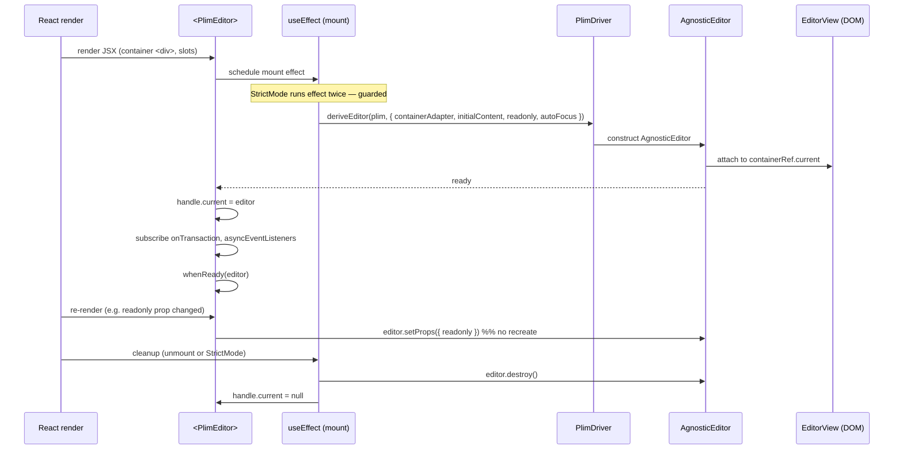

# 07 — React bindings (`@plim/react`)

> Status: **Authoritative spec**. Companion to [`00-overview.md`](./00-overview.md), [`02-view-and-dom.md`](./02-view-and-dom.md), [`03-actions-and-triggers.md`](./03-actions-and-triggers.md), [`05-extensions.md`](./05-extensions.md), [`06-history-and-snapshots.md`](./06-history-and-snapshots.md), [`08-packages-and-migration.md`](./08-packages-and-migration.md), [`09-wishlist-api-mapping.md`](./09-wishlist-api-mapping.md).
>
> `@plim/react` is a **thin** renderer over `@plim/view`. It MUST NOT own the contentDOM, MUST NOT recreate the editor on parent re-renders, and MUST honour the React hooks signatures from [`api-wishlist.md`](../../api-wishlist.md) verbatim.

## 1. Public surface

```ts
// packages/react/src/index.ts
export { PlimEditor } from './editor';
export { useEditorHandle, type EditorHandleRef } from './handle';
export { useAsyncEventListener, type AsyncEventListenerEntry } from './async-event';
export { useEditorState, useEditorSelector } from './selectors';
export { defineNodeView, type NodeViewProps } from './node-view';
export { PlimChildren } from './children';
export type {
  PlimEditorProps,
  BlockNodeProps,
  MarkNodeProps,
  ContentInput,
} from './types';
```

Anything not listed above is private to the package.

## 2. `<PlimEditor />` component

### 2.1 Props

```ts
import type {
  AgnosticEditor,
  ContentInput,
  Transaction,
} from '@plim/editor';
import type { PlimDriver, BlockPayload, MarkPayload } from '@plim/core';
import type { EditorHandleRef } from './handle';
import type { AsyncEventListenerEntry } from './async-event';

export interface BlockNodeProps {
  readonly block: BlockPayload;
  readonly children: readonly BlockPayload[];
  readonly contentRef: (el: HTMLElement | null) => void;
  readonly contentAttrs: Readonly<Record<string, string>>;
  readonly suppressContentEditableWarning?: true;
  readonly selected: boolean;
  readonly focused: boolean;
  readonly view: AgnosticEditor;
  readonly getPos: () => number;
}

export interface MarkNodeProps {
  readonly mark: MarkPayload;
  readonly children: React.ReactNode;
}

export interface PlimEditorProps {
  readonly plim: PlimDriver;
  readonly handle?: EditorHandleRef;
  readonly initialContent?: ContentInput;          // string | Markdown | DocumentJSON | (() => …)
  readonly readonly?: boolean;
  readonly autoFocus?: boolean;
  readonly onTransaction?: (tr: Transaction) => void;
  readonly whenReady?: (editor: AgnosticEditor) => void;
  readonly asyncEventListeners?: readonly AsyncEventListenerEntry[];
  readonly className?: string;
  readonly style?: React.CSSProperties;
  readonly spellCheck?: boolean;
  readonly attributes?: Readonly<Record<string, string>>;

  /** Slot props */
  readonly Wrapper?: React.ComponentType<{ children: React.ReactNode }>;
  readonly Toolbar?: React.ComponentType<{ editor: AgnosticEditor }>;

  /** Block-level overrides keyed by block name (escape hatch beyond toComponent). */
  readonly blockComponents?: Readonly<Record<string, React.ComponentType<BlockNodeProps>>>;
  readonly markComponents?: Readonly<Record<string, React.ComponentType<MarkNodeProps>>>;
}
```

`PlimEditor` also exposes a static subcomponent:

```ts
PlimEditor.SSRPlaceholder: React.FC<{
  initialContent: ContentInput;
  className?: string;
  plim: PlimDriver;        // schema is required to render markdown statically
}>;
```

### 2.2 Resolution rules

- `blockComponents[name]` overrides `BlockSpec.toComponent` for that block.
- `markComponents[name]` overrides `MarkSpec.toComponent`.
- `Wrapper` wraps the entire editor (including `Toolbar` slot).
- `Toolbar`, if provided, receives the live `AgnosticEditor` and re-renders via `useSyncExternalStore` (see §8).
- All other DOM attributes (`className`, `style`, `spellCheck`, `attributes`) are applied to the **container** `<div>` only — never to the contentDOM (the view layer owns that).

## 3. Mount / unmount lifecycle

The component creates **one** `AgnosticEditor` per mount, attaches it via `attachContainer`, and tears it down on unmount. **It never recreates on re-render.**

### 3.1 Mermaid



### 3.2 Reference implementation sketch

```tsx
export function PlimEditor(props: PlimEditorProps) {
  const containerRef = React.useRef<HTMLDivElement | null>(null);
  const editorRef = React.useRef<AgnosticEditor | null>(null);

  // Latest-prop refs (captured each render so the editor sees fresh closures
  // without remounting). See §4 for the same pattern in useAsyncEventListener.
  const onTransactionRef = useLatest(props.onTransaction);
  const whenReadyRef = useLatest(props.whenReady);
  const listenersRef = useLatest(props.asyncEventListeners);

  React.useEffect(() => {
    // StrictMode double-mount guard (§9): if we have already constructed an
    // editor for this ref, reuse it; cleanup of the first effect-pass below
    // destroys it before this branch runs in the second pass.
    if (editorRef.current) return;

    const editor = deriveEditor(props.plim, {
      containerAdapter: attachContainer(() => containerRef.current!),
      initialContent: props.initialContent,
      readonly: props.readonly,
      autoFocus: props.autoFocus,
    });
    editorRef.current = editor;

    const offTr = editor.onTransaction((tr) => onTransactionRef.current?.(tr));
    const offListeners = registerListeners(editor, () => listenersRef.current ?? []);
    editor.whenReady(() => whenReadyRef.current?.(editor));

    if (props.handle) props.handle.current = editor;

    return () => {
      offTr();
      offListeners();
      if (props.handle) props.handle.current = null;
      editor.destroy();
      editorRef.current = null;
    };
    // eslint-disable-next-line react-hooks/exhaustive-deps
  }, [props.plim]); // ONLY re-run when the driver itself swaps

  // Prop diffs forward via setProps — never remount.
  React.useEffect(() => {
    editorRef.current?.setProps({
      readonly: props.readonly,
      spellCheck: props.spellCheck,
      attributes: props.attributes,
    });
  }, [props.readonly, props.spellCheck, props.attributes]);

  // …render container + slots (§7).
}
```

### 3.3 Rules (normative)

- The mount effect's dependency array is `[props.plim]` only. Changing the driver instance is the **only** thing that recreates the editor.
- `initialContent` changes after mount are **ignored** — to swap content, callers dispatch a transaction or use `editor.replaceContent()`. (Document this; surface a dev-only `console.warn` when `initialContent` reference changes after mount.)
- All other props funnel through `editor.setProps(partial)` (see [`02-view-and-dom.md`](./02-view-and-dom.md) §6).
- `editor.destroy()` MUST detach DOM listeners, disconnect the `MutationObserver`, drop the `ViewDesc` tree, and reject any pending async events with an `EditorDestroyedError`.

## 4. `useAsyncEventListener(name, handler)`

Returns an `AsyncEventListenerEntry` to pass into `asyncEventListeners`.

```ts
export interface AsyncEventListenerEntry<TName extends string = string, TPayload = unknown, TResult = unknown> {
  readonly __plim: 'asyncEventListener';
  readonly name: TName;
  readonly subscribe: (editor: AgnosticEditor) => () => void;
}

export function useAsyncEventListener<
  TName extends AsyncEventName,
  TResult = AsyncEventResult<TName>,
>(
  name: TName,
  handler: (
    event: AsyncEvent<TName>,
    state: AgnosticEditor['state'],
    ctx: AsyncEventCtx<TName>,
  ) => Promise<TResult>,
): AsyncEventListenerEntry<TName, AsyncEvent<TName>, TResult>;
```

### 4.1 Internals

1. **Latest-handler ref.** The handler is stored in a `useRef` that is updated on every render. The subscription closure reads `ref.current` at call time, so the listener always uses the freshest closure (state, props). This is the canonical fix for the "stale callback" bug.
2. **Cleanup on unmount.** `subscribe` returns the unsubscribe function; the `<PlimEditor>` mount effect collects all returns and calls them on unmount.
3. **First-resolve-wins.** The `AsyncEventBus` ([`03-actions-and-triggers.md`](./03-actions-and-triggers.md) §7) races registered listeners with `Promise.race`-like semantics: the first non-cancelled resolution settles the trigger; later resolutions are discarded; throws bubble unless another listener resolves first.
4. **Identity stability.** The returned entry's identity is **stable across renders** (memoized) so passing it in `asyncEventListeners={[…]}` doesn't trigger re-subscribe storms.

### 4.2 Implementation

```tsx
export function useAsyncEventListener<TName extends AsyncEventName>(
  name: TName,
  handler: AsyncEventHandler<TName>,
): AsyncEventListenerEntry<TName> {
  const handlerRef = React.useRef(handler);
  // Update synchronously during render — safe because we never call it in render.
  handlerRef.current = handler;

  return React.useMemo<AsyncEventListenerEntry<TName>>(() => ({
    __plim: 'asyncEventListener',
    name,
    subscribe: (editor) =>
      editor.onAsyncEvent(name, (event, state, ctx) =>
        handlerRef.current(event, state, ctx),
      ),
  }), [name]);
}
```

### 4.3 Type-safe events

`AsyncEventName`, `AsyncEvent<T>`, and `AsyncEventResult<T>` come from a module-augmentable registry:

```ts
// @plim/core
export interface AsyncEventRegistry {
  showSlashCommandMenu: { event: { at: Position }; result: SlashCommandPick | null };
  showMentionSuggestions: { event: { query: string; at: Position }; result: Mention | null };
  showEmojiSuggestions:  { event: { query: string; at: Position }; result: Emoji | null };
}

export type AsyncEventName = keyof AsyncEventRegistry;
export type AsyncEvent<N extends AsyncEventName>  = AsyncEventRegistry[N]['event'];
export type AsyncEventResult<N extends AsyncEventName> = AsyncEventRegistry[N]['result'];
```

Extension authors augment the registry:

```ts
declare module '@plim/core' {
  interface AsyncEventRegistry {
    showColorPicker: { event: { at: Position }; result: string };
  }
}
```

`triggerAsyncEvent<T>` and `useAsyncEventListener` then enforce the payload<>result types.

## 5. `useEditorHandle()` and `EditorHandleRef`

```ts
export interface EditorHandleRef {
  current: AgnosticEditor | null;
  // Convenience proxies (no-op if .current is null, log a dev warning):
  focus(): void;
  blur(): void;
  dispatch(tr: Transaction): void;
  getState(): EditorState | null;
  getHistory(): History | null;
  takeSnapshot(): Snapshot | null;
  restoreSnapshot(s: Snapshot): void;
  readonly commands: CommandsProxy;
}

export function useEditorHandle(): EditorHandleRef;
```

### 5.1 Semantics

- `current` is set during the mount effect and cleared during cleanup. **Reading `.current` during render is allowed but may be `null`** before mount and inside SSR.
- The convenience methods are thin wrappers that call into `.current`. They exist so that callers can do `editor.focus()` without `editor.current?.focus()` ceremony in event handlers, where null is impossible.
- `commands` is a `Proxy` that forwards any registered action name: `editor.commands.bold()` is sugar for `editor.current!.dispatch(actions.bold)`. Type-safe via the `ActionRegistry` augmentable interface (see [`03-actions-and-triggers.md`](./03-actions-and-triggers.md) §9).
- `useEditorHandle` returns a stable object across renders (`useRef` under the hood) so child memoization is preserved.

### 5.2 Implementation sketch

```ts
export function useEditorHandle(): EditorHandleRef {
  const ref = React.useRef<AgnosticEditor | null>(null);
  return React.useMemo<EditorHandleRef>(() => {
    const handle: EditorHandleRef = {
      get current() { return ref.current; },
      set current(v) { ref.current = v; },
      focus()  { ref.current?.focus(); },
      blur()   { ref.current?.blur(); },
      dispatch(tr) { ref.current?.dispatch(tr); },
      getState() { return ref.current?.getState() ?? null; },
      getHistory() { return ref.current?.getHistory() ?? null; },
      takeSnapshot() { return ref.current ? new Snapshot(ref.current) : null; },
      restoreSnapshot(s) { ref.current?.restoreSnapshot(s); },
      commands: createCommandsProxy(() => ref.current),
    };
    return handle;
  }, []);
}
```

## 6. Block rendering

By default, `BlockSpec.toComponent(payload)` is rendered as a React element keyed by the block id.

### 6.1 contentRef contract

The view layer needs a real DOM element to manage caret/text mutation. The block renderer **must** call `payload.contentRef` on the contentDOM element:

```tsx
const ParagraphBlock: React.FC<BlockNodeProps> = ({ block, contentRef, contentAttrs }) => (
  <p
    ref={contentRef}
    data-plim-block
    data-plim-block-type="paragraph"
    suppressContentEditableWarning
    {...contentAttrs}
  />
);
```

Rules:

- `contentRef` is a callback ref (stable per block id). The view layer sets `contenteditable`, ARIA, observers on the element.
- `contentAttrs` is a frozen record of `{ contenteditable, data-plim-id, role, … }`. Spread it; do not override `data-plim-id`.
- React **must not render children inside the contentDOM**. The view layer owns its DOM children. Therefore the JSX is `<p ref={contentRef} {...contentAttrs} />` with no children.
- For React 19+, set `suppressContentEditableWarning` to silence the dev warning about contenteditable + children mismatch (children are managed externally; React sees an empty element).

### 6.2 Nestable blocks and `<PlimChildren />`

For nestable blocks (lists, columns, callouts), the **block payload's children flow through React** — only the *leaf* contentDOM is owned by the view layer. The block component renders a chrome wrapper plus a `<PlimChildren nodes={children} />`:

```tsx
const BulletListBlock: React.FC<BlockNodeProps> = ({ block, contentRef, contentAttrs, children }) => (
  <ul data-plim-block data-plim-block-type="bullet_list" {...block.attributes}>
    <PlimChildren nodes={children} />
  </ul>
);

const BulletListItemBlock: React.FC<BlockNodeProps> = ({ contentRef, contentAttrs, children }) => (
  <li data-plim-block data-plim-block-type="list_item">
    <span ref={contentRef} {...contentAttrs} suppressContentEditableWarning />
    <PlimChildren nodes={children} />
  </li>
);
```

`<PlimChildren>` looks up each child's resolved component (override → `BlockSpec.toComponent` → fallback) and renders it with `key={child.block.id}`. Stable keys are mandatory — the view layer's `ViewDesc` reconciler keys by `data-plim-id`, and React's reconciler keys by `block.id`; mismatched keys cause double-mounts.

### 6.3 Resolution order

```
blockComponents[block.type]   (PlimEditor prop)
  ├── if undefined → BlockSpec.toComponent
  └── if BlockSpec.toComponent undefined → fallback that calls BlockSpec.toDOM
      via dangerouslySetInnerHTML on a wrapper (escape hatch for DOM-only blocks).
```

## 7. Mark rendering

Marks render as React elements wrapping `payload.children` (which is the next-inner mark's render or the raw text):

```tsx
const BoldMark: React.FC<MarkNodeProps> = ({ mark, children }) => (
  <strong data-plim-mark="bold" {...mark.attributes}>
    {children}
  </strong>
);
```

- Marks **never** call `contentRef` — text DOM is managed by the parent block's contentDOM, not by mark wrappers. A mark wrapper is just an inline span/strong/em that the view layer's serializer also produces; React mounts an equivalent React tree against the same DOM via hydration so the two stay in sync.
- Mark components compose right-to-left: bold(italic(text)). Order is determined by `MarkSpec.priority` (see [`01-schema-and-state.md`](./01-schema-and-state.md) §4).

## 8. Custom node views

Escape hatch when `toComponent` isn't enough — e.g. a mention pill with a hover popover, an embed with its own iframe lifecycle, or anything where the React subtree is **not** a passive renderer of `BlockPayload`.

```ts
export interface NodeViewProps {
  readonly view: AgnosticEditor;
  readonly node: BlockPayload;
  readonly getPos: () => number;
  readonly selected: boolean;
}

export interface NodeViewSpec {
  readonly block: string;                                // block name to override
  readonly component: React.ComponentType<NodeViewProps>;
  readonly stopEvent?: (event: Event) => boolean;        // prevents view from handling
  readonly ignoreMutation?: (m: MutationRecord) => boolean;
  readonly update?: (prev: BlockPayload, next: BlockPayload) => boolean; // false → remount
}

export function defineNodeView(spec: NodeViewSpec): Extension;
```

Usage:

```tsx
const MentionView: React.FC<NodeViewProps> = ({ node, view, getPos }) => {
  const [open, setOpen] = React.useState(false);
  return (
    <span
      contentEditable={false}      // non-editable shell — view layer SKIPS this subtree
      data-plim-block-type="mention"
      onClick={() => setOpen(o => !o)}
    >
      @{node.attributes.handle}
      {open && <MentionPopover userId={node.attributes.userId} onClose={() => setOpen(false)} />}
    </span>
  );
};

defineNodeView({
  block: 'mention',
  component: MentionView,
  stopEvent: () => true,           // keep all clicks/keys inside the React UI
  ignoreMutation: () => true,      // we manage our own DOM
});
```

Rules:

- Node view roots **must** be `contentEditable={false}` (or be atomic blocks declared `nestable: false, atomic: true`). The DOMObserver checks for this attribute and skips the subtree, preventing accidental observer→parser→transaction cycles.
- Node views with editable inner content (rare — usually a wrapper around `contentRef`) must still spread `contentAttrs` on a child element.
- `update(prev, next)` lets the view skip a remount when only attribute deltas change; returning `false` forces a full unmount/mount cycle.

## 9. Concurrent React safety

The view layer mutates the contentDOM imperatively. React must therefore **not** "own" that DOM. The split is:

| Layer                  | Owner       |
|------------------------|-------------|
| Outer container `<div>`| React       |
| Toolbar / chrome / gutter | React    |
| Block component shells (the `<p>`, `<li>`, …) | React |
| **Inside the contentDOM (text, marks, inline nodes)** | **View layer (DOM)** |
| ViewDesc tree          | View layer  |
| Selection              | View layer  |

### 9.1 Subscribing to state for chrome

Toolbar buttons, status badges, and other React-side UI subscribe to editor state via `useSyncExternalStore` — concurrent-mode-safe:

```ts
export function useEditorState<T>(
  editor: AgnosticEditor | EditorHandleRef,
  selector: (s: EditorState) => T,
  isEqual: (a: T, b: T) => boolean = Object.is,
): T;
```

Implementation:

```ts
export function useEditorState<T>(source, selector, isEqual = Object.is): T {
  const editor = isHandle(source) ? source.current : source;
  const subscribe = React.useCallback(
    (cb: () => void) => editor?.onTransaction(cb) ?? (() => {}),
    [editor],
  );
  const getSnap = React.useCallback(
    () => editor ? selector(editor.getState()) : (undefined as unknown as T),
    [editor, selector],
  );
  return React.useSyncExternalStore(subscribe, getSnap, getSnap /* SSR */);
}
```

Toolbar example:

```tsx
function BoldButton({ editor }: { editor: AgnosticEditor }) {
  const isActive = useEditorState(editor, (s) => s.activeMarks.has('bold'));
  return (
    <button data-plim-active={isActive} onClick={() => editor.commands.bold()}>
      Bold
    </button>
  );
}
```

`useSyncExternalStore` is the only state-subscription primitive `@plim/react` exposes. We do **not** ship a context provider that re-renders descendants on every transaction (too coarse, and it tears in concurrent mode).

## 10. StrictMode / double-mount

React 18 StrictMode runs effects twice in dev. Plim handles this with two mechanisms:

1. **Effect-based mount.** All editor construction lives inside `useEffect`, never `useLayoutEffect` and never the render body. The first run mounts; the cleanup destroys; the second run mounts again — fully symmetric.
2. **Idempotent destroy.** `editor.destroy()` is safe to call twice; the second call is a no-op. The first cleanup also clears `editorRef.current` and `handle.current`, so the second mount starts from a clean slate.

There is no "ignore the second mount" guard in the canonical implementation — symmetric mount/destroy is preferred. (The `if (editorRef.current) return;` line in §3.2 is only to defend against component-internal races; if we ever want to skip the second StrictMode pass entirely we'd flip to a `useRef<boolean>` flag, but **don't** — symmetric is correct.)

## 11. SSR

`@plim/react` runs server-side as follows:

- The `PlimEditor` render returns the same JSX shell as on the client (container `<div>`, toolbar, slots) — but with **no editor instance**, so `useEditorState` selectors return `undefined`/initial values.
- The contentDOM is rendered server-side as a static markdown preview via `<PlimEditor.SSRPlaceholder />`:

```tsx
<PlimEditor.SSRPlaceholder
  plim={plim}
  initialContent={contentFromMarkdown(...)}
  className="prose"
/>
```

Internally `SSRPlaceholder` walks the parsed `DocumentJSON` and renders each block via `BlockSpec.toComponent` with a stub `payload` (`contentRef` is a no-op, `contentAttrs` is `{}`). This yields HTML byte-identical (modulo whitespace) to what the editor will render once mounted, so hydration doesn't produce layout shift.

- On the client, `PlimEditor` mounts *after* hydration: the mount effect runs, `attachContainer` finds the SSR-rendered DOM, the parser reconciles it into a `ViewDesc` tree, and the editor takes over.
- If the SSR markup and client schema diverge, the parser reconciles by **discarding the SSR DOM and re-rendering from `initialContent`**; a dev warning is logged.

## 12. Tailwind styling story

Plim renders deterministic data attributes that Tailwind variants can target. **No CSS is shipped by `@plim/react`** beyond a single optional reset.

| Attribute                    | Where                          | Meaning                                  |
|------------------------------|--------------------------------|------------------------------------------|
| `data-plim-block`            | every block root               | "this is a block"                        |
| `data-plim-block-type=<name>`| block root                     | block type for type-specific styling     |
| `data-plim-mark=<name>`      | mark wrapper                   | mark type                                |
| `data-plim-selected`         | block root, when in selection  | block-level selection (drag handle, etc.)|
| `data-plim-focused`          | block root with caret inside   | focus styling                            |
| `data-plim-empty`            | block root with no content     | placeholder hook                         |
| `data-plim-readonly`         | container                      | readonly styling                         |
| `data-plim-composing`        | block root during IME          | suppress decorations during composition  |

Encourage Tailwind variants:

```js
// tailwind.config.ts
plugins: [require('@plim/react-tailwind-preset')]
```

The preset registers variants:

```js
addVariant('plim-selected',  '&[data-plim-selected]');
addVariant('plim-focused',   '&[data-plim-focused]');
addVariant('plim-empty',     '&[data-plim-empty]::before');
addVariant('plim-mark-bold', '&[data-plim-mark="bold"]');
// …one per built-in mark/block
```

Usage:

```tsx
<p
  ref={contentRef}
  className="plim-empty:before:content-[attr(data-placeholder)] plim-focused:bg-blue-50/40"
  {...contentAttrs}
/>
```

## 13. Accessibility

The view layer auto-applies (and `contentAttrs` carries) the following ARIA:

| Element              | Attribute                | Value                                    |
|----------------------|--------------------------|------------------------------------------|
| Container            | `role`                   | `textbox`                                |
| Container            | `aria-multiline`         | `true`                                   |
| Container            | `aria-readonly`          | `true` if `props.readonly`               |
| Container            | `aria-label`             | from `props.attributes['aria-label']`    |
| Heading block        | `role`                   | `heading`                                |
| Heading block        | `aria-level`             | `1`–`6`                                  |
| List block           | `role`                   | `list`                                   |
| List item block      | `role`                   | `listitem`                               |
| Quote block          | `role`                   | `blockquote` (implicit) — or `region`    |
| Atomic / node view   | `role`                   | per `BlockSpec.aria` declaration         |

Focus management:

- On block insertion: focus moves to the new block's contentDOM, caret at offset 0.
- On block deletion: focus moves to the previous block's contentDOM end, or next if there is no previous.
- On `autoFocus`: focus is set inside `editor.whenReady()`, after mount, in a `requestAnimationFrame` to avoid scroll-jacking during hydration.
- The container is `tabIndex=0` when not readonly, `tabIndex=-1` otherwise.

## 14. Type-safe events (recap)

```ts
declare module '@plim/core' {
  interface AsyncEventRegistry {
    showSlashCommandMenu: { event: { at: Position }; result: SlashCommandPick | null };
  }
}

const onSlash = useAsyncEventListener('showSlashCommandMenu', async (event, state, ctx) => {
  // event: { at: Position }   (typed)
  // returns: SlashCommandPick | null   (typed and enforced)
  return await pickSlashCommand(event.at);
});
```

If a handler's return type doesn't match `AsyncEventResult<TName>`, TS errors at the hook call site.

## 15. Migration from the current `@plim/react`

The current package (see `packages/react/src/index.ts`) ships `PlimEditor`, `PlimEditorProvider`, `usePlimEditor`, `usePlimEditorState`, plus a `PlimBlockRendererMap` system, persistence adapters, and a `controlled`/`uncontrolled` mode switch. None of these survive verbatim. Mapping:

| Old (current `@plim/react`)            | New (`@plim/react`)                                  | Notes |
|----------------------------------------|------------------------------------------------------|-------|
| `<PlimEditorProvider>` + `usePlimEditor()` | `<PlimEditor handle={useEditorHandle()} />`        | Drop the context; use the handle. |
| `usePlimEditorState(selector)`         | `useEditorState(handle, selector)`                   | Now `useSyncExternalStore`-based. |
| `PlimBlockRendererMap`                 | `BlockSpec.toComponent` + `blockComponents` prop     | Block defs own their renderer; editor prop is escape hatch. |
| `mode: 'controlled' \| 'uncontrolled'` | (gone)                                               | The driver is the source of truth; persistence is opt-in via [`06-history-and-snapshots.md`](./06-history-and-snapshots.md). |
| `onTransactionApplied`                 | `onTransaction`                                      | Renamed; signature `(tr: Transaction) => void`. |
| `createLocalStoragePersistenceAdapter` | `@plim/persistence-localstorage` (separate package)  | Out of `@plim/react`. |
| `PlimEditorError` / `PlimReactError`   | `EditorError` from `@plim/core`                      | One error type across packages. |
| `PlimSnapshot`                         | `Snapshot` from `@plim/core`                         | See [`06-history-and-snapshots.md`](./06-history-and-snapshots.md). |
| `PlimSelection` (kind union)           | `EditorState.selection`                              | Same shape, lives in `@plim/core`. |

### 15.1 Codemod sketch

A `jscodeshift` transform `@plim/codemod-react` ships with the migration:

```js
// codemods/plim-react-v2.js (sketch)
module.exports = function transform(file, api) {
  const j = api.jscodeshift;
  const root = j(file.source);

  // 1. <PlimEditorProvider><X/></PlimEditorProvider>  →  <X/> + insert useEditorHandle inside child.
  root.findJSXElements('PlimEditorProvider').forEach((p) => j(p).replaceWith(p.value.children));

  // 2. usePlimEditor()  →  useEditorHandle()
  root.find(j.CallExpression, { callee: { name: 'usePlimEditor' } })
      .forEach((c) => { c.value.callee.name = 'useEditorHandle'; });

  // 3. usePlimEditorState(sel)  →  useEditorState(handle, sel)
  //    requires inserting a `handle` arg — flagged for manual review.

  // 4. onTransactionApplied  →  onTransaction (JSX attribute rename).
  root.find(j.JSXAttribute, { name: { name: 'onTransactionApplied' } })
      .forEach((a) => { a.value.name.name = 'onTransaction'; });

  // 5. import { PlimBlockRendererMap } …  →  flagged as manual: move into BlockSpec.toComponent.

  return root.toSource();
};
```

The codemod handles the mechanical 80%; the remaining 20% (renderer map → `BlockSpec.toComponent`, persistence adapter relocation, error type unification) requires human review, with `// TODO(plim-migrate)` comments inserted by the codemod where appropriate.

## 16. Worked example

```tsx
// MyEditor.tsx
import * as React from 'react';
import {
  PlimEditor,
  useAsyncEventListener,
  useEditorHandle,
  useEditorState,
  defineNodeView,
  type BlockNodeProps,
  type MarkNodeProps,
} from '@plim/react';
import { PlimDriver, defineBlock, defineMark } from '@plim/core';
import { contentFromMarkdown } from '@plim/markdown';

const calloutBlock = defineBlock({
  name: 'callout',
  type: 'standalone',
  nestable: false,
  toComponent: ({ contentRef, contentAttrs, block }: BlockNodeProps) => (
    <aside
      data-plim-block
      data-plim-block-type="callout"
      className="rounded-lg border-l-4 border-amber-400 bg-amber-50 p-3 plim-focused:bg-amber-100"
    >
      <span className="mr-2">{block.attributes.icon ?? '💡'}</span>
      <span ref={contentRef} {...contentAttrs} suppressContentEditableWarning />
    </aside>
  ),
});

const highlightMark = defineMark({
  name: 'highlight',
  toComponent: ({ children }: MarkNodeProps) => (
    <mark data-plim-mark="highlight" className="bg-yellow-200 plim-mark-bold:font-bold">
      {children}
    </mark>
  ),
});

const MentionView = defineNodeView({
  block: 'mention',
  component: ({ node }) => (
    <span contentEditable={false} className="rounded bg-indigo-100 px-1 text-indigo-700">
      @{node.attributes.handle}
    </span>
  ),
  stopEvent: () => true,
});

const plim = new PlimDriver({
  registeredBlocks: [calloutBlock /* + builtins */],
  registeredMarks:  [highlightMark /* + builtins */],
  extensions: [MentionView],
});

function Toolbar({ editor }: { editor: import('@plim/editor').AgnosticEditor }) {
  const boldActive = useEditorState(editor, (s) => s.activeMarks.has('bold'));
  return (
    <div className="flex gap-1 border-b p-1">
      <button data-plim-active={boldActive} onClick={() => editor.commands.bold()} className="px-2 plim-active:bg-slate-200">B</button>
      <button onClick={() => editor.getHistory().undo()} className="px-2">↶</button>
    </div>
  );
}

export function MyEditor() {
  const handle = useEditorHandle();

  const onSlash = useAsyncEventListener('showSlashCommandMenu', async (event) =>
    await openSlashMenu(event.at),     // returns SlashCommandPick | null
  );
  const onMention = useAsyncEventListener('showMentionSuggestions', async (event) =>
    await openMentionSuggest(event.query),
  );

  const initialContent = React.useMemo(
    () => contentFromMarkdown('# Hello\n\nThis is a **markdown** doc.'),
    [],
  );

  return (
    <PlimEditor
      plim={plim}
      handle={handle}
      initialContent={initialContent}
      autoFocus
      asyncEventListeners={[onSlash, onMention]}
      Toolbar={Toolbar}
      className="prose max-w-none rounded border p-4 plim-focused:ring-2 plim-focused:ring-blue-400"
      whenReady={(ed) => console.log('ready', ed)}
      onTransaction={(tr) => console.debug('tr', tr.steps.length)}
    />
  );
}
```

## 17. Cross-links

- Editor construction & `setProps`: [`02-view-and-dom.md`](./02-view-and-dom.md) §6
- Action / command resolution behind `editor.commands.*`: [`03-actions-and-triggers.md`](./03-actions-and-triggers.md) §9
- Async event bus semantics (first-resolve-wins, cancellation): [`03-actions-and-triggers.md`](./03-actions-and-triggers.md) §7
- Block / mark `toComponent` contract: [`01-schema-and-state.md`](./01-schema-and-state.md) §5
- Extension lifecycle (where `defineNodeView` plugs in): [`05-extensions.md`](./05-extensions.md) §3
- `Snapshot` / history: [`06-history-and-snapshots.md`](./06-history-and-snapshots.md)
- Package boundaries: [`08-packages-and-migration.md`](./08-packages-and-migration.md)
- Wishlist line-by-line mapping: [`09-wishlist-api-mapping.md`](./09-wishlist-api-mapping.md)
