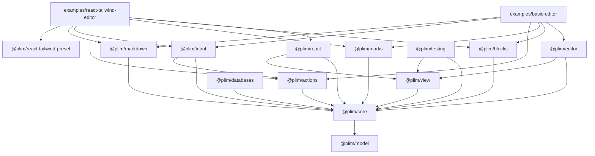

# 08 — Packages and Migration

> Status: **Authoritative spec, design phase.** Companion to `00-overview.md`. This doc defines the target package layout, the dependency graph, the build/tooling stance, and the phased migration from today's repo to the architecture in `00-overview.md`. Every phase preserves green tests.

Today's packages (snapshot at the time of writing): `@plim/model`, `@plim/blocks`, `@plim/editor`, `@plim/input`, `@plim/selection`, `@plim/databases`, `@plim/react`. Examples: `examples/basic-editor`, `examples/react-tailwind-editor`. Build is `tsc -b`; tests run via Vitest at the repo root; CDP regression scripts live under `examples/*/scripts/browser-regression.mjs`.

---

## A. Target package layout

| Package | Status | Public exports | Depends on |
|---------|--------|----------------|------------|
| `@plim/model` | keep, extend | `RichText`, `BlockData`, `BlockPayload`, `ResolvedPosition`, `DocumentState`, ID factories, normalization, validation, serialization | — |
| `@plim/core` | **NEW** | `PlimDriver`, `Schema`, `EditorState`, `Transaction`, `Step` (`ReplaceStep`, `AddMarkStep`, `RemoveMarkStep`, `SetBlockAttrsStep`, `MoveStep`), `Mapping`, `defineBlock`, `defineMark`, `defineAction`, `defineExtension`, `triggers`, validation rule registry (`selectionNotEmpty`, `blockSupportsDecoration`, `startOfBlock`, `precededByWhitespace`, …), `Plugin`, `PluginKey`, `Snapshot`, `History` | `@plim/model` |
| `@plim/editor` | refactor | `AgnosticEditor`, `deriveEditor`, `attachContainer`, container adapters (`attachContainer`, `attachShadow`, `attachIframe`) | `@plim/core`, `@plim/view` |
| `@plim/view` | **NEW** | `EditorView`, `DOMObserver`, `ViewDesc` (`BlockViewDesc`, `MarkViewDesc`, `TextViewDesc`), `DOMParser`, `DOMSerializer`, `SelectionMapper`, default node-view base, paste/drop pipeline, keymap dispatcher | `@plim/core` |
| `@plim/blocks` | refactor | `paragraphBlock`, `headingBlock`, `bulletedListBlock`, `numberedListBlock`, `quoteBlock`, `codeBlock`, `horizontalRuleBlock` (divider), `imageBlock`, `embeddedMediaBlock`, `rawHTMLBlock`, `tableBlock` | `@plim/core` |
| `@plim/marks` | **NEW** (split from blocks) | `boldMark`, `italicMark`, `underlineMark`, `strikethroughMark`, `codeMark`, `linkMark`, `highlightMark` | `@plim/core` |
| `@plim/actions` | **NEW** | built-in actions catalog (`boldAction`, `italicAction`, `underlineAction`, `strikethroughAction`, `codeAction`, `linkAction`, `cutAction`, `copyAction`, `pasteAction`, `undoAction`, `redoAction`, `slashCommandAction`, `mentionAction`, `emojiAction`) | `@plim/core` |
| `@plim/input` | refactor | `defineInputRule`, `definePasteRule`, smart typography rules, slash/mention/emoji input plugins | `@plim/core`, `@plim/actions` |
| `@plim/markdown` | **NEW** | `contentFromMarkdown`, `markdownFromContent`, `markdownInputRules()` | `@plim/core` |
| `@plim/selection` | absorb into `@plim/view` | _(deprecated as standalone — see Phase 3c)_ | — |
| `@plim/databases` | refactor (later) | database blocks, query, formula, relations, view-integration | `@plim/core` |
| `@plim/react` | refactor | `PlimEditor`, `useEditorHandle`, `useAsyncEventListener`, `useEditorState`, `useEditorSelection` | `@plim/core`, `@plim/view` |
| `@plim/react-tailwind-preset` | **NEW** (optional) | Tailwind plugin exposing Plim CSS variables / utility classes | — |
| `@plim/testing` | **NEW** | `createTestEditor`, `simulate` (key/paste/IME), DOM assertion helpers, `expectDoc`, `expectSelection` | `@plim/core`, `@plim/view` |

### Per-package sketches

#### `@plim/core` (NEW)

```jsonc
// packages/core/package.json
{
  "name": "@plim/core",
  "version": "0.0.0",
  "type": "module",
  "sideEffects": false,
  "main": "./dist/index.js",
  "module": "./dist/index.js",
  "types": "./dist/index.d.ts",
  "exports": {
    ".": {
      "types": "./dist/index.d.ts",
      "import": "./dist/index.js",
      "default": "./dist/index.js"
    }
  },
  "files": ["dist"],
  "dependencies": { "@plim/model": "workspace:*" },
  "scripts": {
    "build": "tsup",
    "typecheck": "tsc -b --pretty false",
    "test": "vitest run"
  }
}
```

```ts
// packages/core/src/index.ts
export * from './driver.js';            // PlimDriver
export * from './schema/index.js';      // Schema, defineBlock, defineMark
export * from './state/index.js';       // EditorState
export * from './transaction/index.js'; // Transaction, Step, Mapping
export * from './action/index.js';      // defineAction, triggers, validation rules
export * from './extension/index.js';   // defineExtension, ExtensionManager
export * from './plugin/index.js';      // Plugin, PluginKey
export * from './history/index.js';     // History
export * from './snapshot/index.js';    // Snapshot
```

#### `@plim/view` (NEW)

```jsonc
{
  "name": "@plim/view",
  "version": "0.0.0",
  "type": "module",
  "sideEffects": false,
  "main": "./dist/index.js",
  "module": "./dist/index.js",
  "types": "./dist/index.d.ts",
  "exports": { ".": { "types": "./dist/index.d.ts", "import": "./dist/index.js" } },
  "files": ["dist"],
  "dependencies": { "@plim/core": "workspace:*" }
}
```

```ts
// packages/view/src/index.ts
export * from './editor-view.js';
export * from './view-desc/index.js';
export * from './dom-observer.js';
export * from './dom-parser.js';
export * from './dom-serializer.js';
export * from './selection-mapper.js';
export * from './node-view.js';
export * from './keymap.js';
export * from './paste-pipeline.js';
```

#### `@plim/editor` (refactor)

```jsonc
{
  "name": "@plim/editor",
  "type": "module",
  "dependencies": {
    "@plim/core": "workspace:*",
    "@plim/view": "workspace:*"
  }
}
```

```ts
// packages/editor/src/index.ts
export { deriveEditor } from './derive-editor.js';
export type { AgnosticEditor, AgnosticEditorOptions } from './types.js';
export { attachContainer, attachShadow, attachIframe } from './container-adapters.js';
```

#### `@plim/blocks` (refactor) and `@plim/marks` (NEW)

```ts
// packages/blocks/src/index.ts
export { paragraphBlock } from './paragraph.js';
export { headingBlock } from './heading.js';
export { bulletedListBlock, numberedListBlock } from './list.js';
export { quoteBlock } from './quote.js';
export { codeBlock } from './code.js';
export { horizontalRuleBlock } from './divider.js';
export { imageBlock } from './image.js';
export { embeddedMediaBlock } from './embed.js';
export { rawHTMLBlock } from './raw-html.js';
export { tableBlock } from './table.js';
```

```ts
// packages/marks/src/index.ts
export { boldMark } from './bold.js';
export { italicMark } from './italic.js';
export { underlineMark } from './underline.js';
export { strikethroughMark } from './strikethrough.js';
export { codeMark } from './code.js';
export { linkMark } from './link.js';
export { highlightMark } from './highlight.js';
```

Both depend only on `@plim/core`.

#### `@plim/actions` (NEW)

```ts
// packages/actions/src/index.ts
export { boldAction, italicAction, underlineAction, strikethroughAction, codeAction, linkAction } from './marks.js';
export { cutAction, copyAction, pasteAction } from './clipboard.js';
export { undoAction, redoAction } from './history.js';
export { slashCommandAction, mentionAction, emojiAction } from './suggestions.js';
export { defaultActions } from './defaults.js';
```

Depends on `@plim/core` only. Action `perform` bodies use `ctx.createTransaction()` — no DOM access.

#### `@plim/input` (refactor)

```ts
// packages/input/src/index.ts
export { defineInputRule, type InputRule } from './input-rule.js';
export { definePasteRule, type PasteRule } from './paste-rule.js';
export { smartTypographyRules } from './smart-typography.js';
export { slashCommandPlugin } from './slash.js';
export { mentionPlugin } from './mention.js';
export { emojiPlugin } from './emoji.js';
```

Depends on `@plim/core`, `@plim/actions`.

#### `@plim/markdown` (NEW)

```ts
// packages/markdown/src/index.ts
export { contentFromMarkdown } from './from-markdown.js';
export { markdownFromContent } from './to-markdown.js';
export { markdownInputRules } from './input-rules.js';
```

Depends on `@plim/core`.

#### `@plim/react` (refactor)

```jsonc
{
  "name": "@plim/react",
  "type": "module",
  "dependencies": {
    "@plim/core": "workspace:*",
    "@plim/view": "workspace:*"
  },
  "peerDependencies": { "react": "^18.2.0 || ^19.0.0" }
}
```

```ts
// packages/react/src/index.ts
export { PlimEditor } from './plim-editor.js';
export { useEditorHandle } from './use-editor-handle.js';
export { useAsyncEventListener } from './use-async-event-listener.js';
export { useEditorState } from './use-editor-state.js';
export { useEditorSelection } from './use-editor-selection.js';
export type { PlimEditorProps, EditorHandle } from './types.js';
```

#### `@plim/testing` (NEW)

```ts
// packages/testing/src/index.ts
export { createTestEditor } from './test-editor.js';
export { simulate } from './simulate.js'; // key, paste, ime, mouse
export { expectDoc, expectSelection, expectMark } from './assertions.js';
export { fixtures } from './fixtures/index.js';
```

Uses `happy-dom` (already in Vitest's optional set) for default DOM, and exposes a Playwright-driver shim used by CDP regression scripts.

#### `@plim/react-tailwind-preset` (NEW, optional)

Pure plugin module — no Plim runtime deps.

```ts
// packages/react-tailwind-preset/src/index.ts
export { plimTailwindPlugin, plimTailwindTheme } from './plugin.js';
```

### Vitest config inheritance

Each package gets a tiny `vitest.config.ts` that extends the root:

```ts
// packages/<name>/vitest.config.ts
import { defineProject, mergeConfig } from 'vitest/config';
import root from '../../vitest.config.ts';

export default mergeConfig(root, defineProject({
  test: { include: ['src/**/*.test.ts'] }
}));
```

The root `vitest.config.ts` gains aliases for the new packages (see Phase 1 below).

---

## B. Dependency graph



**No cycles.** Enforced two ways:

1. TypeScript **project references** in each package's `tsconfig.json` only point downward in the graph. `tsc -b` rejects cycles.
2. A small `scripts/check-deps.mjs` walks every `package.json` `dependencies`/`peerDependencies` and asserts the edge set is a strict DAG matching the table above. Run as part of CI (`pnpm check:deps`).

---

## C. Build/tooling

| Concern | Choice | Rationale |
|---------|--------|-----------|
| Workspace | **pnpm workspaces** (kept) | Already configured in `pnpm-workspace.yaml`. |
| Test runner | **Vitest** (kept) | Existing root `vitest.config.ts`. |
| Type-check | **`tsc -b`** (kept) with project references | Incremental; matches existing `package.json` scripts. |
| Library build | **`tsup`** per package, ESM-only | Single bundler for all libs; emits ESM + .d.ts in one pass; no Vite app overhead in libs. |
| Example build | **Vite** (kept) | Examples are SPAs; Vite is already set up. |
| Module format | **ESM-only** (`"type": "module"` everywhere) | Already true today. No CJS exports added. |
| Browser regression | **CDP scripts** under `examples/*/scripts/browser-regression.mjs` (kept) | Already gating end-to-end behaviour. |
| Cross-browser fixtures | **`@plim/testing`** fixture pack run under Vitest with `happy-dom` + a Playwright lane for real-browser quirks | New, see §H. |

Each library package gains one `tsup.config.ts`:

```ts
import { defineConfig } from 'tsup';

export default defineConfig({
  entry: ['src/index.ts'],
  format: ['esm'],
  dts: true,
  sourcemap: true,
  clean: true,
  target: 'es2022',
  outDir: 'dist',
  treeshake: true
});
```

`pnpm build` becomes `pnpm -r --filter './packages/*' run build` (tsup) plus `tsc -b` for project-reference correctness checking.

---

## D. Migration plan

Each phase preserves green tests (unit + both example CDP regressions). Old exports remain available as `@deprecated` re-exports until Phase 9 removes them.

### Phase 1 — Stand up `@plim/core`

- Scaffold `packages/core/` with `package.json`, `tsconfig.json`, `src/index.ts`.
- Re-export current `@plim/model` types under canonical core names where appropriate (`BlockPayload`, `RichText`, etc.).
- Land empty stubs for `defineBlock`, `defineMark`, `defineAction`, `defineExtension`, `triggers`, `Plugin`, `Snapshot`, `History`, `Transaction`, `Step`, `Mapping`, `EditorState`, `Schema`, `PlimDriver`. Stubs throw `NotImplementedError` and carry full TS signatures.
- Add `@plim/core` to root `vitest.config.ts` aliases.
- Add `@plim/core` to root `tsconfig.json` references list.

### Phase 2 — Move `@plim/blocks` onto `defineBlock`

- For each block in `@plim/blocks`, write a `defineBlock({...})` factory that wraps the existing block-data normalizers. Old function exports become thin shims that call into the new factories.
- Split decoration marks out into a new `@plim/marks` package; `@plim/blocks` re-exports the new mark factories with a `@deprecated` JSDoc tag for one minor.
- Add `@plim/marks` to vitest aliases and tsconfig references.

### Phase 3 — Stand up `@plim/view`

Phase 3 lands in five passes. Each pass leaves `examples/basic-editor` working.

- **3a — ViewDesc + render.** Port `examples/basic-editor/src/main.ts` rendering into `@plim/view/src/view-desc/*` and `@plim/view/src/editor-view.ts`. The example calls `new EditorView(container, { state })` instead of constructing DOM by hand.
- **3b — DOMObserver + readDOMChange.** Move `MutationObserver` wiring + `parseBetween` + `findDiff` out of the example into `@plim/view`. The example no longer reads `textContent` in event handlers.
- **3c — SelectionMapper.** Absorb `@plim/selection` into `@plim/view`. The standalone package becomes a re-export shim (`export * from '@plim/view';`) marked `@deprecated`.
- **3d — Keymap dispatcher + ActionRouter.** Move keyboard handling into `@plim/view` and wire it to `@plim/actions`. Mod+B etc. are now actions, not switch statements.
- **3e — Paste/drop pipeline.** Move clipboard/drop handling into `@plim/view`, fed by paste rules from `@plim/input`.

### Phase 4 — Migrate `@plim/input` rules into the view's plugin system

- Refactor every `@plim/input` rule (markdown, smart typography, slash, mention, emoji) to be a `Plugin` exported via `defineInputRule` / `definePasteRule`.
- Wire `@plim/markdown` (split from `@plim/input/markdown.ts`) into a real `markdownInputRules()` helper.
- Old `@plim/input` exports remain as deprecated re-exports of the new plugin factories.

### Phase 5 — Refactor `@plim/editor` to a thin facade

- Replace `editor.ts`/`state.ts`/`render.ts`/`registries.ts` with a small `deriveEditor(driver, options)` that constructs `EditorState` (via `@plim/core`) and an `EditorView` (via `@plim/view`) and exposes `AgnosticEditor`.
- Keep `attachContainer` and add `attachShadow`/`attachIframe` adapters.

### Phase 6 — Refactor `@plim/react`

- Replace the current React DOM-construction code with a "view-layer mount + slot-only React shell": `<PlimEditor />` mounts a div, calls `deriveEditor`, hands the container to `attachContainer`. React node views (per `defineBlock({ toComponent })`) render via React portals into the view-desc slots.
- Land `useEditorHandle`, `useAsyncEventListener`, `useEditorState`, `useEditorSelection` per `api-wishlist.md` and `07-react-bindings.md`.

### Phase 7 — Migrate `examples/basic-editor`

- Rewrite `examples/basic-editor/src/main.ts` to use `new PlimDriver({...}) → deriveEditor(...) → attachContainer(...)`. No DOM construction in the example.
- Run `examples/basic-editor/scripts/browser-regression.mjs` and assert no diffs vs golden.

### Phase 8 — Migrate `examples/react-tailwind-editor`

- Rewrite the example to mount `<PlimEditor plim={plim} />` only.
- Apply `@plim/react-tailwind-preset` in the example's `tailwind.config.ts`.
- Run `examples/react-tailwind-editor/scripts/browser-regression.mjs`.

### Phase 9 — Remove deprecated re-exports

- Delete deprecated shims in `@plim/blocks`, `@plim/input`, `@plim/selection`, and `@plim/editor`.
- Delete `packages/selection/` entirely (already a shim by Phase 3c).
- Bump `@plim/*` to `0.x` final pre-release; cut `1.0.0-rc.0` once `api-wishlist.md` is green (see §F).

---

## E. Per-phase exit criteria

| Phase | Exit criteria (all must pass) |
|-------|-------------------------------|
| 1 | `pnpm typecheck` green; `pnpm test` green; `import { defineBlock } from '@plim/core'` resolves and the symbol is a function (even if it throws). |
| 2 | `pnpm test` green; every block in `@plim/blocks` is the result of `defineBlock(...)`; `@plim/marks/src/index.ts` exists and exports the seven mark factories; the basic-editor example still renders all blocks and marks (CDP regression). |
| 3a | `EditorView` mounts in basic-editor; `pnpm test:example:browser` green; example's `main.ts` no longer constructs block DOM directly. |
| 3b | Typing, IME, backspace, and space-at-boundary tests pass via `@plim/testing` fixtures; CDP regression green; example's `main.ts` does not call `.textContent` outside the view layer. |
| 3c | `@plim/selection` is a re-export shim; CDP green; cursor restoration tests in `@plim/testing` green. |
| 3d | Mod+B / Mod+I / Mod+U / Mod+Shift+S / `Mod+K` / Mod+Z / Mod+Shift+Z all dispatched through actions; action validation rules covered by unit tests. |
| 3e | Paste of HTML, plain text, and image clipboard data each routes through `@plim/view` paste pipeline; CDP regression green. |
| 4 | Markdown input rules remove their trigger characters via a `ReplaceStep` (no string slicing in handlers); slash/mention/emoji each go through `triggerAsyncEvent`; unit tests cover `defineInputRule` + `definePasteRule`. |
| 5 | `@plim/editor` builds with only `@plim/core` and `@plim/view` as deps; `AgnosticEditor` surface matches `api-wishlist.md`. |
| 6 | `<PlimEditor />` works in React 18 and React 19 StrictMode; `useAsyncEventListener` correctly cancels on unmount; CDP regression for the React example green. |
| 7 | `examples/basic-editor/src/main.ts` is < 100 lines and contains no `MutationObserver`, `Selection`, or `Range` usage; CDP regression green. |
| 8 | `examples/react-tailwind-editor/src/App.tsx` is < 80 lines; CDP regression green. |
| 9 | `pnpm check:deps` passes; no file in the repo imports from a deprecated shim; `pnpm test` green; `pnpm build` green. |

---

## F. Public API stability strategy

- All `@plim/*` packages stay on `0.x` while migration is in flight. Minor bumps (`0.y.0`) signal breaking changes; patches are additive only.
- `@plim/core` is the **stability anchor**: once Phase 9 exits, `@plim/core` cuts `1.0.0-rc.0`. All other packages follow within one minor.
- Cut `1.0.0` only when every snippet in `api-wishlist.md` compiles, type-checks, and behaves as documented (verified by `@plim/testing` fixtures referencing the wishlist). After 1.0, removed APIs require a `@deprecated` cycle of one minor + a major bump.
- `@plim/testing` and `@plim/react-tailwind-preset` track their own semver; they are not gated on the core anchor.

---

## G. `tsconfig.base.json` and project references

`tsconfig.base.json` keeps its current compiler options. Two additions:

1. **Path mappings** for IDE resolution before `dist/` exists:

   ```jsonc
   {
     "compilerOptions": {
       /* …existing options… */
       "baseUrl": ".",
       "paths": {
         "@plim/model":                ["packages/model/src/index.ts"],
         "@plim/core":                 ["packages/core/src/index.ts"],
         "@plim/view":                 ["packages/view/src/index.ts"],
         "@plim/editor":               ["packages/editor/src/index.ts"],
         "@plim/blocks":               ["packages/blocks/src/index.ts"],
         "@plim/marks":                ["packages/marks/src/index.ts"],
         "@plim/actions":              ["packages/actions/src/index.ts"],
         "@plim/input":                ["packages/input/src/index.ts"],
         "@plim/markdown":             ["packages/markdown/src/index.ts"],
         "@plim/selection":            ["packages/selection/src/index.ts"],
         "@plim/databases":            ["packages/databases/src/index.ts"],
         "@plim/react":                ["packages/react/src/index.ts"],
         "@plim/testing":              ["packages/testing/src/index.ts"],
         "@plim/react-tailwind-preset":["packages/react-tailwind-preset/src/index.ts"]
       }
     }
   }
   ```

2. **Project references** in the root `tsconfig.json`:

   ```jsonc
   {
     "files": [],
     "references": [
       { "path": "./packages/model" },
       { "path": "./packages/core" },
       { "path": "./packages/view" },
       { "path": "./packages/editor" },
       { "path": "./packages/blocks" },
       { "path": "./packages/marks" },
       { "path": "./packages/actions" },
       { "path": "./packages/input" },
       { "path": "./packages/markdown" },
       { "path": "./packages/selection" },
       { "path": "./packages/databases" },
       { "path": "./packages/react" },
       { "path": "./packages/testing" },
       { "path": "./packages/react-tailwind-preset" }
     ]
   }
   ```

   Each package's `tsconfig.json` declares `"composite": true` (already set in `tsconfig.base.json`) and lists `references` only to packages it depends on per the §B graph. `tsc -b` then rejects any accidental cycle.

The root `vitest.config.ts` aliases gain matching entries so source-level imports resolve in tests without going through `dist/`.

---

## H. Test strategy

| Layer | Tooling | Lives in | Runs as |
|-------|---------|----------|---------|
| Pure data (`@plim/model`, `@plim/core` non-DOM bits) | Vitest, Node env | `packages/<name>/src/**/*.test.ts` | `pnpm test` |
| View layer (`@plim/view`) | Vitest with `happy-dom`; fixture-driven | `packages/view/src/**/*.test.ts` + `packages/testing/src/fixtures/*` | `pnpm test` |
| Cross-browser quirks (DOM observer, IME, selection) | `@plim/testing` Playwright lane | `packages/testing/src/browser/*` | `pnpm test:browser` (new script wraps Playwright) |
| End-to-end | CDP regression scripts (kept) | `examples/<name>/scripts/browser-regression.mjs` | `pnpm test:example:browser`, `pnpm test:example:react-tailwind:browser` |
| API stability vs `api-wishlist.md` | Vitest | `packages/testing/src/wishlist/*.test.ts` | `pnpm test` |

`@plim/testing` ships:

- `createTestEditor({ blocks?, marks?, actions?, plugins?, doc? })` → a wired editor on `happy-dom`.
- `simulate.key(view, 'Mod+b')`, `simulate.text(view, 'hello')`, `simulate.paste(view, { html, text })`, `simulate.ime(view, sequence)`.
- `expectDoc(view).toMatch(json)`, `expectSelection(view).toEqual(range)`, `expectMark(view, 'bold').toCover(range)`.
- A fixture pack of 50+ canonical scenarios (typing at boundary, IME, paste, undo across IME, list outdent at start of empty item, etc.) that every browser lane re-runs.

---

## I. Linting & formatting

Current state: no ESLint or Prettier config in the repo; TypeScript `strict` mode with `exactOptionalPropertyTypes` and `noUncheckedIndexedAccess` enforces most invariants. **No changes proposed in this migration.** If a future need arises (e.g., lint rule against importing from `@plim/view` inside `@plim/core`), introduce ESLint with `eslint-plugin-import` plus a `no-restricted-imports` ruleset matching the §B graph; add it as its own phase, after Phase 9.

---

## J. Doc strategy

- `research/plim-architecture/*.md` is the authoritative design spec during 0.x.
- Once the API surface is stable (post Phase 9, around `1.0.0-rc.0`), generate API reference docs via TypeDoc into a `docs/` site. **Out of scope of this migration.** Mentioned here so future edits don't conflict with this plan: TypeDoc reads `packages/*/src/index.ts`, emits to `docs/api/`, and `research/plim-architecture/` remains the conceptual companion to the generated reference.

---

## K. Risks & mitigations

| Risk | Mitigation |
|------|-----------|
| Migration breaks one of the examples mid-phase | Run both `pnpm test:example:browser` and `pnpm test:example:react-tailwind:browser` after every phase; CI gates merge on green CDP regression. |
| Type drift between old (`@plim/editor`) and new (`@plim/core` + `@plim/view`) APIs | Keep deprecated re-exports until Phase 9; ship a codemod (`scripts/codemods/migrate-to-core.mjs`) that rewrites import specifiers; run it in-repo on examples and document it for downstream consumers. |
| `DOMObserver` cross-browser quirks (Safari composition, Firefox `beforeinput`, Chrome `input` ordering) | Build the `@plim/testing` fixture pack in Phase 3b before the rest of Phase 3 lands; run it under Playwright (Chromium + WebKit + Firefox) on CI. New quirks become new fixtures. |
| React 19 / StrictMode double-mount regressions | Covered in `07-react-bindings.md`: every effect that touches the view layer uses an `AbortController`-based cleanup; `<PlimEditor />` is exercised under `<StrictMode>` in `@plim/testing`'s wishlist tests. |
| Schema rules diverge between `defineBlock` factories and existing block-data normalizers in `@plim/model` | Phase 2 makes the new factories the single source of truth; `@plim/model` normalizers become callbacks invoked by the schema rather than parallel logic. |
| Vitest aliases drift from `tsconfig` paths | `scripts/check-aliases.mjs` parses both files and asserts they match; runs in CI. |

---

## L. Workspace commands

| Command | What it does | Phase(s) it gates |
|---------|--------------|-------------------|
| `pnpm install` | Install workspace deps | All |
| `pnpm typecheck` | `tsc -b --pretty false` across all project references | All |
| `pnpm test` | Vitest run across all packages (Node + happy-dom) | All |
| `pnpm build` | `tsup` per package; `tsc -b` for declarations | Phase 1+ (after `tsup` introduced) |
| `pnpm check:deps` | `scripts/check-deps.mjs` — assert §B graph | Phase 1+ |
| `pnpm check:aliases` | Assert `vitest.config.ts` aliases match `tsconfig.base.json` paths | Phase 1+ |
| `pnpm test:browser` | Playwright lane in `@plim/testing` (Chromium/WebKit/Firefox) | Phase 3b+ |
| `pnpm test:example:browser` | CDP regression for `examples/basic-editor` | Phases 3a–3e, 7, 9 |
| `pnpm test:example:react-tailwind:browser` | CDP regression for `examples/react-tailwind-editor` | Phases 6, 8, 9 |
| `pnpm dev:example` | Vite dev server for basic-editor | Phase 7 verification |
| `pnpm dev:example:react-tailwind` | Vite dev server for React example | Phase 8 verification |
| `pnpm build:example` / `pnpm build:example:react-tailwind` | Production build of each example | Pre-release verification |

CI pipeline per phase (in order): `pnpm install` → `pnpm check:deps` → `pnpm check:aliases` → `pnpm typecheck` → `pnpm test` → `pnpm test:browser` (3b+) → both `test:example:*:browser` lanes → `pnpm build`. A phase is not "done" until every applicable command passes on a clean clone.
